# Software Architecture Specification
## DIU CampusCare — Smart Medical & Counseling Management System

**Document ID:** DIU-CC-ARCH-001
**Version:** 1.0
**Date:** 3 August 2026
**Release:** Phase 1 (MVP)
**Basis:** `SRS.md` v1.0 (finalised), `PROJECT_PLANNING.md` v1.0

**Scope note:** This document specifies structure — boundaries, components, flows, and the rules that govern them. **It does not design the database.** No schema, no tables, no columns, no entity-relationship model. Where persistence is referenced, it is referenced as a *boundary* (which module owns which store, under which credentials), never as a *structure*. Data model design is the next document.

---

# 0. Architectural Drivers

Architecture is a response to constraints, not a display of technique. Nine drivers from the SRS determine every significant decision here. Everything else is negotiable.

| # | Driver | Source | Architectural consequence |
|---|---|---|---|
| **AD-1** | Counseling data must be protected by an access-control path **independent** of the general permission check | NFR-SEC-06, PRM-08, PRM-09, BR-50 | **A physical process and credential boundary**, not a code convention. This is the single most consequential decision in the document (§2.3) |
| **AD-2** | Staff console operations must complete in **< 1 s p95** | NFR-PERF-04, CON-01, risk R3 | Queue state must be served from a purpose-built read path; no cross-module joins on the hot path |
| **AD-3** | The counter must **survive network loss** and accept same-day retrospective entries | NFR-REL-04, BR-66, EC-18 | Client-side durable **command buffer** with idempotency keys; command-based, never state-sync (§5.6) |
| **AD-4** | Queue estimates recalculate on **five distinct events** and must be ≤ 30 s stale | FR-APT-21, NFR-PERF-05 | Internal **event bus** + a dedicated Estimation Engine, decoupled from the Queue Engine |
| **AD-5** | Public availability must reach FCP in **< 3 s on 3G** with no authentication | NFR-PERF-01, FR-DASH-06 | A denormalised, cacheable **Availability Projection** served from an anonymous edge path |
| **AD-6** | Every 【A】 value must be changeable **without redeployment** | FR-ADM-01, BR-70, NFR-MNT-01 | A first-class **Policy/Config service**; zero business constants in code |
| **AD-7** | Notifications must **never leak** counseling context, and their failure must never block care | FR-NTF-05/06/09, NFR-REL-05 | A **Content Policy Guard** as a mandatory gate, plus transactional outbox decoupling |
| **AD-8** | Audit must be **append-only and immutable to every role**, with counseling access logged separately | FR-AUD-02, FR-AUD-04, BR-61 | Two audit sinks under different ownership; write-only adapters |
| **AD-9** | **Small, part-time team; minimal budget; fixed academic timeline** | CON-08, CON-10, CON-11 | **Two deployable units, not eight.** Operational complexity is a cost the team cannot pay |

**AD-1 and AD-9 are in direct tension.** AD-1 pushes toward service separation; AD-9 pushes toward a single deployable. §2.3 resolves this deliberately rather than splitting the difference.

---

# 1. High-Level Architecture

## 1.1 System context

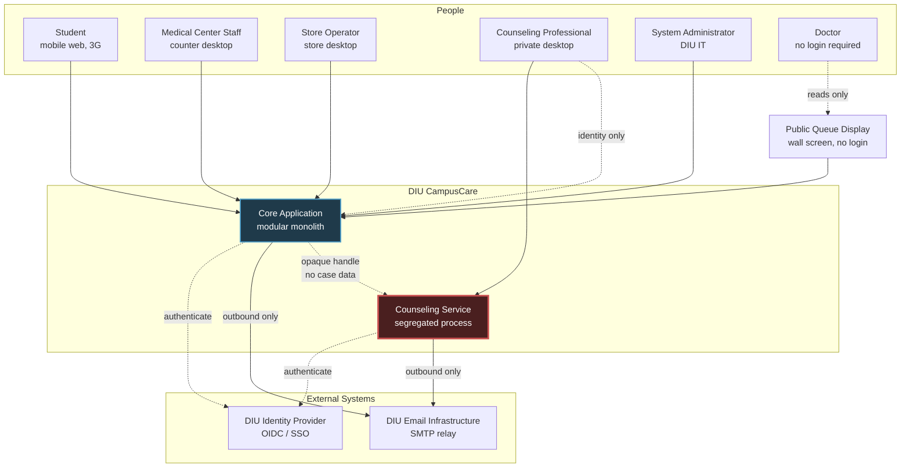
```mermaid
graph TB
    subgraph actors["People"]
        STU["Student<br/>mobile web, 3G"]
        MCS["Medical Center Staff<br/>counter desktop"]
        STO["Store Operator<br/>store desktop"]
        CNP["Counseling Professional<br/>private desktop"]
        ADM["System Administrator<br/>DIU IT"]
        DOC["Doctor<br/>no login required"]
    end

    subgraph cc["DIU CampusCare"]
        CORE["Core Application<br/>modular monolith"]
        VAULT["Counseling Service<br/>segregated process"]
    end

    subgraph ext["External Systems"]
        IDP["DIU Identity Provider<br/>OIDC / SSO"]
        MAIL["DIU Email Infrastructure<br/>SMTP relay"]
    end

    DISP["Public Queue Display<br/>wall screen, no login"]

    STU --> CORE
    MCS --> CORE
    STO --> CORE
    ADM --> CORE
    DOC -.reads only.-> DISP
    DISP --> CORE

    CNP --> VAULT
    CNP -.identity only.-> CORE

    CORE -.->|"authenticate"| IDP
    VAULT -.->|"authenticate"| IDP
    CORE -->|"outbound only"| MAIL
    VAULT -->|"outbound only"| MAIL

    CORE -.->|"opaque handle<br/>no case data"| VAULT

    style VAULT fill:#4a1f1f,stroke:#c94f4f,stroke-width:3px,color:#fff
    style CORE fill:#1f3a4a,stroke:#4f9fc9,stroke-width:2px,color:#fff
```

**Read the red boundary as the whole point of the architecture.** The Core Application cannot read counseling data. Not "is not permitted to" — *cannot*, because it does not hold the credentials.

## 1.2 Container view

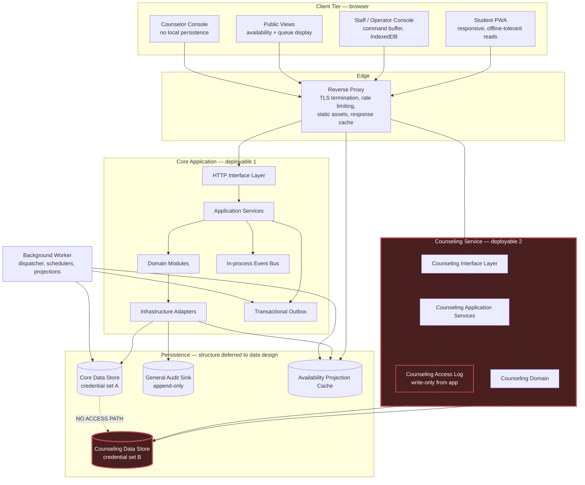
```mermaid
graph TB
    subgraph client["Client Tier — browser"]
        PWA["Student PWA<br/>responsive, offline-tolerant reads"]
        CONSOLE["Staff / Operator Console<br/>command buffer, IndexedDB"]
        CNPUI["Counselor Console<br/>no local persistence"]
        PUB["Public Views<br/>availability + queue display"]
    end

    subgraph edge["Edge"]
        RP["Reverse Proxy<br/>TLS termination, rate limiting,<br/>static assets, response cache"]
    end

    subgraph core["Core Application — deployable 1"]
        API["HTTP Interface Layer"]
        APP["Application Services"]
        DOM["Domain Modules"]
        INFRA["Infrastructure Adapters"]
        BUS["In-process Event Bus"]
        OUTBOX["Transactional Outbox"]
    end

    subgraph vault["Counseling Service — deployable 2"]
        CAPI["Counseling Interface Layer"]
        CAPP["Counseling Application Services"]
        CDOM["Counseling Domain"]
        CAUD["Counseling Access Log<br/>write-only from app"]
    end

    subgraph stores["Persistence — structure deferred to data design"]
        CORESTORE[("Core Data Store<br/>credential set A")]
        VAULTSTORE[("Counseling Data Store<br/>credential set B")]
        AUDITSTORE[("General Audit Sink<br/>append-only")]
        CACHE[("Availability Projection Cache")]
    end

    WORKER["Background Worker<br/>dispatcher, schedulers, projections"]

    PWA --> RP
    CONSOLE --> RP
    PUB --> RP
    CNPUI --> RP

    RP --> API
    RP --> CAPI
    RP --> CACHE

    API --> APP --> DOM --> INFRA
    APP --> BUS
    APP --> OUTBOX
    INFRA --> CORESTORE
    INFRA --> AUDITSTORE
    INFRA --> CACHE

    CAPI --> CAPP --> CDOM
    CAPP --> CAUD
    CDOM --> VAULTSTORE
    CAUD --> VAULTSTORE

    WORKER --> OUTBOX
    WORKER --> CACHE
    WORKER --> CORESTORE

    CORESTORE -.->|"NO ACCESS PATH"| VAULTSTORE

    style vault fill:#4a1f1f,stroke:#c94f4f,stroke-width:3px,color:#fff
    style VAULTSTORE fill:#4a1f1f,stroke:#c94f4f,stroke-width:3px,color:#fff
    style CAUD fill:#4a1f1f,stroke:#c94f4f,stroke-width:2px,color:#fff
```

**Two deployable units, one background worker, one reverse proxy.** That is the entire operational surface. A part-time team can run this (AD-9).

## 1.3 Tier responsibilities

| Tier | Owns | Explicitly does not own |
|---|---|---|
| **Client** | Rendering, input validation for *feedback only*, offline command buffering, SSE subscription | Any authorisation decision, any business rule, any time-sensitive evaluation (EC-54) |
| **Edge / Reverse Proxy** | TLS (NFR-SEC-01), rate limiting (NFR-SEC-04), static asset serving, caching the anonymous availability projection | Authentication decisions, any knowledge of domain |
| **Core Application** | All medical, medicine, fee, identity, notification, admin, and audit behaviour | Counseling case content — it has no credential path to it |
| **Counseling Service** | All counseling intake, triage, case, notes, and counseling access logging | Appointments, inventory, fees, general audit |
| **Background Worker** | Outbox dispatch, scheduled jobs, projection rebuilds | Serving any user request |
| **Persistence** | Durability | *(structure deferred — see §12.6)* |

---

# 2. Architecture Style

## 2.1 Chosen style

> **A layered Modular Monolith with one segregated confidentiality bulkhead, communicating internally by events, exposing a CQRS-lite read path for public availability.**

Four style elements, each earning its place:

| Element | Why | Driver |
|---|---|---|
| **Modular Monolith** | One deployable for nine of ten modules. A part-time team cannot operate a distributed system, and the domain does not need one | AD-9, CON-11 |
| **Layered within each module** | Interface → Application → Domain → Infrastructure. Business rules (BR-*) live in one place and are unit-testable without a database | Testability of 70 business rules |
| **Segregated Counseling Service** | The one place where a code-level boundary is insufficient. A separate process with separate credentials makes NFR-SEC-06 structurally true | **AD-1** |
| **Event-driven internally + CQRS-lite reads** | Estimation must react to five events without the Queue Engine knowing about estimation; public availability must be served without touching the transactional path | AD-4, AD-5 |

## 2.2 Styles considered and rejected

| Style | Why rejected |
|---|---|
| **Microservices** | Ten services would each need deployment, monitoring, inter-service auth, and distributed-transaction handling. The domain is a single university clinic with hundreds of daily transactions. The complexity cost is real and the scaling benefit is zero (AD-9, §12.1). Rejecting this is the most important thing this document does *not* do |
| **Pure single-process monolith** | Cheapest to run, but a defect in one permission check exposes counseling notes. NFR-SEC-06 rates this Critical and rules it out |
| **Serverless / FaaS** | Cold starts conflict with NFR-PERF-04 (< 1 s p95 at the counter); SSE fan-out is awkward; budget constraint CON-08 disfavours per-invocation billing on an unpredictable burst |
| **Event sourcing** | Attractive for audit (FR-AUD-01), but it is a large conceptual burden for a part-time team, and an append-only audit sink achieves the same requirement at a fraction of the cost |
| **Client-heavy SPA with thin API** | Conflicts with NFR-PERF-01 (3 s FCP on 3G) and with PRM-01, which demands server-side enforcement independent of interface state |

## 2.3 The decision that defines this architecture

**ADR-001 — Counseling is a separate process with separate persistence credentials.**

*Context.* NFR-SEC-06 requires that a defect in the general permission check cannot expose counseling data. PRM-09 requires that an administrator cannot determine *whether a student has a counseling record at all*. BR-50 makes the existence of the record confidential, not merely its content.

*The problem with in-process separation.* In a single process, "the admin module must not query counseling data" is a rule enforced by developer discipline and code review. One `SELECT` written by a tired developer at 2 a.m., one over-broad export query, one debug endpoint — and BR-50 is breached silently. There is no mechanism that makes the wrong thing impossible.

*Decision.* The Counseling module runs as a **separate process** holding a **separate credential set** to a **separate data store**. The Core Application is not issued those credentials. The Core Application's connection configuration contains no path to counseling storage.

*Consequences.*

| Positive | Negative |
|---|---|
| A permission bug in Core cannot expose counseling data — Core has no route to it | Two deployables to build, configure, and run |
| BR-50 becomes structurally true, not procedurally true | Cross-boundary features in Phase 2 (consent-gated referral, BR-54) need an explicit, audited contract |
| The counseling service can be independently reviewed, and independently disabled (BR-68, deployment gate for OI-01) | Slightly more local development setup |
| The counseling access log (FR-CSE-15/16) lives inside the boundary, so administrators cannot read it — satisfying FR-CSE-16, which is otherwise very hard | One more TLS certificate and one more health check |

*Degraded fallback, stated honestly.* If the team genuinely cannot operate two processes, the minimum acceptable substitute is a **single process holding two separate connection pools with distinct database credentials**, where counseling repositories are constructed only inside the counseling module and the credential is never placed in the shared configuration object. This is weaker — a sufficiently determined bug can still reach it — and it should be recorded as accepted technical debt against NFR-SEC-06, not presented as equivalent.

*Status:* **Accepted.**

## 2.4 What crosses the boundary

Exactly three things, and nothing else:

| Direction | Payload | Never includes |
|---|---|---|
| Core → Counseling | Authenticated subject identifier + session assertion | Any request for case content |
| Counseling → Core | A request to send a notification, carrying only a recipient and a **pre-approved discreet template key** | Category, urgency, counselor name, any clinical term |
| Core → Counseling | Student account lifecycle events, e.g. "account deactivated" | Anything about the student's medical activity |

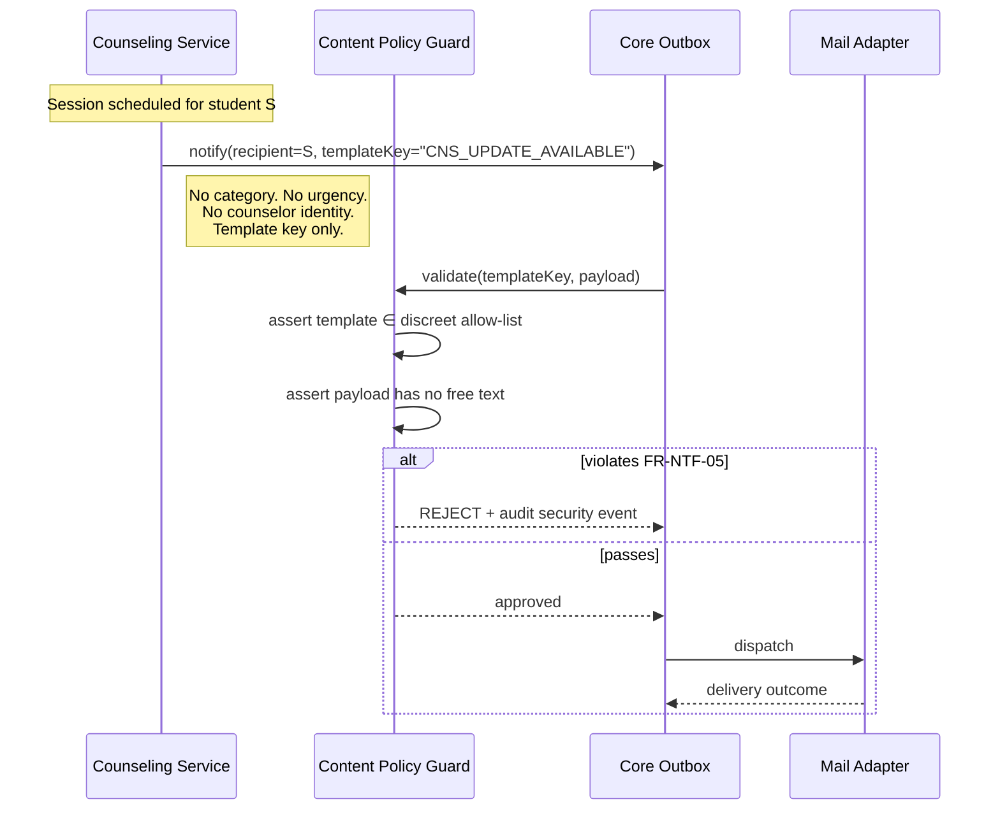
```mermaid
sequenceDiagram
    participant C as Counseling Service
    participant G as Content Policy Guard
    participant O as Core Outbox
    participant M as Mail Adapter

    Note over C: Session scheduled for student S
    C->>O: notify(recipient=S, templateKey="CNS_UPDATE_AVAILABLE")
    Note right of C: No category. No urgency.<br/>No counselor identity.<br/>Template key only.
    O->>G: validate(templateKey, payload)
    G->>G: assert template ∈ discreet allow-list
    G->>G: assert payload has no free text
    alt violates FR-NTF-05
        G-->>O: REJECT + audit security event
    else passes
        G-->>O: approved
        O->>M: dispatch
        M-->>O: delivery outcome
    end
```

**Core never learns why the notification was sent.** It learns only that a notification with an approved discreet template must go to a student. This is what makes FR-NTF-05 architecturally enforced rather than convention.

---

# 3. Module Architecture

## 3.1 Module map and dependency rules

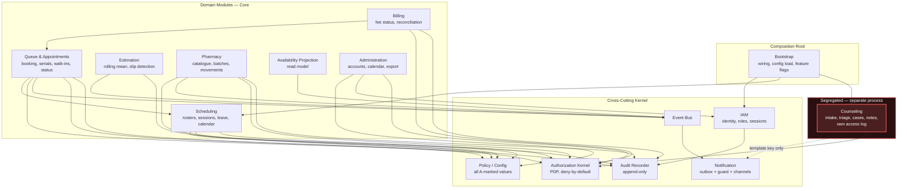
```mermaid
graph TB
    subgraph shell["Composition Root"]
        BOOT["Bootstrap<br/>wiring, config load, feature flags"]
    end

    subgraph crosscut["Cross-Cutting Kernel"]
        IAM["IAM<br/>identity, roles, sessions"]
        AUTHZ["Authorization Kernel<br/>PDP, deny-by-default"]
        POLICY["Policy / Config<br/>all A-marked values"]
        AUDIT["Audit Recorder<br/>append-only"]
        EVENTS["Event Bus"]
        NOTIFY["Notification<br/>outbox + guard + channels"]
    end

    subgraph domain["Domain Modules — Core"]
        SCHED["Scheduling<br/>rosters, sessions, leave, calendar"]
        QUEUE["Queue & Appointments<br/>booking, serials, walk-ins, status"]
        ESTIMATE["Estimation<br/>rolling mean, slip detection"]
        BILLING["Billing<br/>fee status, reconciliation"]
        PHARMACY["Pharmacy<br/>catalogue, batches, movements"]
        AVAIL["Availability Projection<br/>read model"]
        ADMIN["Administration<br/>accounts, calendar, export"]
    end

    subgraph vaultmod["Segregated — separate process"]
        CNS["Counseling<br/>intake, triage, cases, notes,<br/>own access log"]
    end

    BOOT --> IAM
    BOOT --> SCHED
    BOOT --> CNS

    SCHED --> POLICY
    QUEUE --> SCHED
    QUEUE --> POLICY
    QUEUE --> EVENTS
    ESTIMATE --> EVENTS
    ESTIMATE --> POLICY
    BILLING --> QUEUE
    PHARMACY --> POLICY
    PHARMACY --> EVENTS
    AVAIL --> EVENTS
    ADMIN --> POLICY
    ADMIN --> IAM

    QUEUE --> AUTHZ
    SCHED --> AUTHZ
    BILLING --> AUTHZ
    PHARMACY --> AUTHZ
    ADMIN --> AUTHZ

    QUEUE --> AUDIT
    SCHED --> AUDIT
    BILLING --> AUDIT
    PHARMACY --> AUDIT
    IAM --> AUDIT

    EVENTS --> NOTIFY
    CNS -.->|"template key only"| NOTIFY
    CNS --> AUTHZ

    style CNS fill:#4a1f1f,stroke:#c94f4f,stroke-width:3px,color:#fff
    style vaultmod fill:#2a1010,stroke:#c94f4f,stroke-width:2px,color:#fff
```

## 3.2 Dependency rules — enforced, not advisory

| # | Rule | Enforcement |
|---|---|---|
| **DR-1** | A domain module may depend on the cross-cutting kernel. The kernel may **never** depend on a domain module | Static dependency check in CI; build fails on violation |
| **DR-2** | Domain modules communicate **only** through the Event Bus or through an explicitly published module interface. Direct reach into another module's internals is prohibited | Module-internal types are not exported past the module boundary |
| **DR-3** | No domain module may import from the Counseling module, and Counseling may import from no domain module | Physically enforced — different process, different codebase root |
| **DR-4** | No module may read a business constant from code. Every 【A】 value is fetched from Policy | Lint rule banning numeric literals in domain logic; code review |
| **DR-5** | Infrastructure adapters are injected at the composition root. No module constructs its own database or mail client | Constructor injection only; no service locator |
| **DR-6** | The Domain layer has no dependency on any framework, HTTP type, or persistence type | Import restriction per layer, checked in CI |
| **DR-7** | Every state-changing application service **must** emit to Audit. A service that does not is a defect | Architecture test: enumerate command handlers, assert audit emission |

**DR-7 deserves emphasis.** FR-AUD-01 and BR-60 require *every* state change to be attributable. Relying on developers to remember is how audit gaps happen. This is enforced by a test that enumerates command handlers and fails the build if one lacks an audit path.

## 3.3 Module responsibilities

| Module | Owns | Key requirements |
|---|---|---|
| **IAM** | Authentication, session lifecycle, role assignment, account states, lockout | FR-AUTH-01…15 |
| **Authorization Kernel** | Policy decisions. Deny-by-default. Ownership evaluation. Break-glass grant | PRM-01…15, FR-AUD-05…07 |
| **Policy / Config** | Every configurable value; range validation at save (VR-94); change auditing | FR-ADM-01, BR-70, NFR-MNT-01 |
| **Scheduling** | Rosters, sessions, overrides, slot derivation, leave, non-service calendar | FR-SCH-01…16 |
| **Queue & Appointments** | Booking, serial allocation, unified queue ordering, walk-in and emergency insertion, status lifecycle, no-show, suspension | FR-APT-01…42 |
| **Estimation** | Rolling-mean computation, recalculation on events, slip detection, accuracy metric | FR-APT-21…25, NFR-ACC-01/02 |
| **Billing** | Fee status, counter payment, waivers, daily summary, reconciliation, adjusting entries | FR-PAY-01…11 |
| **Pharmacy** | Catalogue, batch stock, FEFO selection, expiry exclusion, movements, thresholds, store hours | FR-MED-01…28 |
| **Availability Projection** | Denormalised public read model; anonymous, cacheable | FR-DASH-06/07, NFR-PERF-01 |
| **Notification** | Outbox, Content Policy Guard, channel adapters, delivery records | FR-NTF-01…09 |
| **Audit** | Append-only general sink; write-only adapter; admin viewer with counseling redaction | FR-AUD-01…03, FR-ADM-05/06 |
| **Administration** | Account management, calendar, announcements, export with counseling exclusion | FR-ADM-01…09 |
| **Counseling** *(segregated)* | Intake, crisis layer, triage, priority, scheduling, case lifecycle, notes, escalation hook, **own access log** | FR-CNS-01…17, FR-CSE-01…23 |

## 3.4 Feature-flag boundaries

Two flags are architectural, not cosmetic:

| Flag | Behaviour when off | Requirement |
|---|---|---|
| `counseling.enabled` | The Counseling Service is not started; its routes 404; no counseling entry point renders. **This is the deployment gate for OI-01** | BR-68 |
| `notifications.email.enabled` | In-app notifications continue; email dispatch is skipped and recorded as skipped. Care is never blocked | NFR-REL-05, FR-NTF-08 |

---

# 4. Component Diagram

## 4.1 Core Application components

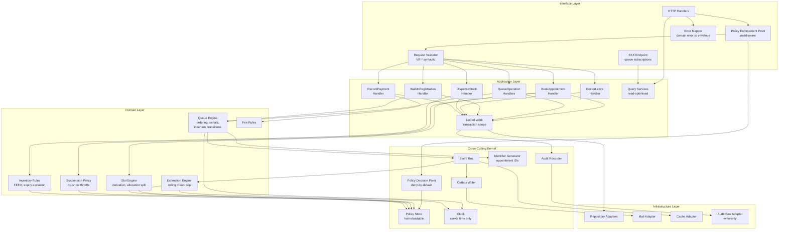
```mermaid
graph TB
    subgraph iface["Interface Layer"]
        HTTP["HTTP Handlers"]
        SSE["SSE Endpoint<br/>queue subscriptions"]
        PEP["Policy Enforcement Point<br/>middleware"]
        DTO["Request Validator<br/>VR-* syntactic"]
        ERRMAP["Error Mapper<br/>domain error to envelope"]
    end

    subgraph app["Application Layer"]
        BOOKCMD["BookAppointment<br/>Handler"]
        QUEUECMD["QueueOperation<br/>Handlers"]
        WALKIN["WalkInRegistration<br/>Handler"]
        LEAVECMD["DoctorLeave<br/>Handler"]
        DISPENSE["DispenseStock<br/>Handler"]
        PAYCMD["RecordPayment<br/>Handler"]
        QRY["Query Services<br/>read-optimised"]
        UOW["Unit of Work<br/>transaction scope"]
    end

    subgraph dom["Domain Layer"]
        QE["Queue Engine<br/>ordering, serials,<br/>insertion, transitions"]
        EE["Estimation Engine<br/>rolling mean, slip"]
        SE["Slot Engine<br/>derivation, allocation split"]
        FE["Fee Rules"]
        IE["Inventory Rules<br/>FEFO, expiry exclusion"]
        SUSP["Suspension Policy<br/>no-show throttle"]
    end

    subgraph kern["Cross-Cutting Kernel"]
        PDP["Policy Decision Point<br/>deny-by-default"]
        CFG["Policy Store<br/>hot-reloadable"]
        AUD["Audit Recorder"]
        BUS2["Event Bus"]
        OBX["Outbox Writer"]
        CLK["Clock<br/>server time only"]
        IDGEN["Identifier Generator<br/>appointment IDs"]
    end

    subgraph infra["Infrastructure Layer"]
        REPO["Repository Adapters"]
        MAILAD["Mail Adapter"]
        CACHEAD["Cache Adapter"]
        AUDSINK["Audit Sink Adapter<br/>write-only"]
    end

    HTTP --> PEP --> DTO --> BOOKCMD
    DTO --> QUEUECMD
    DTO --> WALKIN
    DTO --> LEAVECMD
    DTO --> DISPENSE
    DTO --> PAYCMD
    HTTP --> QRY
    SSE --> QRY
    HTTP --> ERRMAP

    PEP --> PDP
    PDP --> CFG

    BOOKCMD --> UOW
    QUEUECMD --> UOW
    WALKIN --> UOW
    LEAVECMD --> UOW
    DISPENSE --> UOW
    PAYCMD --> UOW

    BOOKCMD --> SE
    BOOKCMD --> SUSP
    QUEUECMD --> QE
    WALKIN --> QE
    DISPENSE --> IE
    PAYCMD --> FE

    QE --> BUS2
    BUS2 --> EE
    BUS2 --> OBX
    BUS2 --> CACHEAD

    UOW --> REPO
    UOW --> AUD
    AUD --> AUDSINK
    OBX --> MAILAD

    QE --> CLK
    EE --> CLK
    SE --> CFG
    EE --> CFG
    SUSP --> CFG
    IE --> CFG
    QE --> IDGEN
```

## 4.2 The three components that carry the most risk

### Queue Engine — the heart of the system

Owns the invariant that the digital queue equals the physical queue. Every failure mode in risk R3 passes through here.

| Responsibility | Requirements |
|---|---|
| Allocate serials from a single per-session sequence, regardless of origin | FR-APT-05, EC-09 |
| Maintain one ordered queue containing booked *and* walk-in patients | FR-APT-19, BR-18 |
| Insert walk-ins at tail; insert emergencies at head | FR-APT-37, FR-APT-39 |
| Enforce the status lifecycle and reject non-adjacent transitions | FR-APT-28, VR-28 |
| Permit allocation overrun rather than refuse a walk-in | FR-APT-42, EC-10, BR-66 |
| Serialise slot claims so that exactly one booking wins a contested slot | EC-01 |
| Emit every queue-affecting event to the bus | AD-4 |

**Slot contention (EC-01)** is resolved by a single conditional-claim path inside the Queue Engine: the claim succeeds only if the slot is still unheld at the moment of commit, and the loser receives a domain conflict, never a partial booking. *The persistence mechanism that provides this conditional write is a data-design concern and is deferred.*

### Estimation Engine — the credibility component

The planning document identified the fixed-time promise as the project's largest credibility risk. This component is the response.

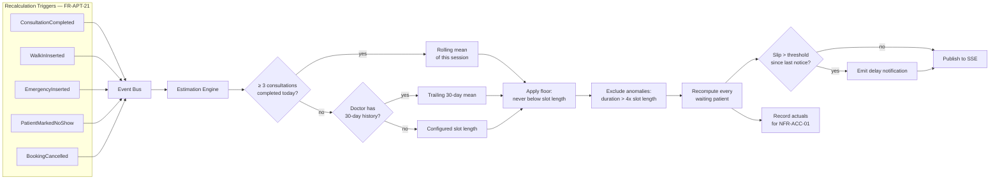
```mermaid
flowchart LR
    subgraph triggers["Recalculation Triggers — FR-APT-21"]
        T1["ConsultationCompleted"]
        T2["WalkInInserted"]
        T3["EmergencyInserted"]
        T4["PatientMarkedNoShow"]
        T5["BookingCancelled"]
    end

    T1 & T2 & T3 & T4 & T5 --> EB["Event Bus"]
    EB --> EE["Estimation Engine"]

    EE --> S1{"≥ 3 consultations<br/>completed today?"}
    S1 -->|yes| M1["Rolling mean<br/>of this session"]
    S1 -->|no| S2{"Doctor has<br/>30-day history?"}
    S2 -->|yes| M2["Trailing 30-day mean"]
    S2 -->|no| M3["Configured slot length"]

    M1 & M2 & M3 --> FLOOR["Apply floor:<br/>never below slot length"]
    FLOOR --> ANOM["Exclude anomalies:<br/>duration > 4x slot length"]
    ANOM --> RECALC["Recompute every<br/>waiting patient"]
    RECALC --> SLIP{"Slip > threshold<br/>since last notice?"}
    SLIP -->|yes| NOTIF["Emit delay notification"]
    SLIP -->|no| PUB["Publish to SSE"]
    NOTIF --> PUB
    RECALC --> KPI["Record actuals<br/>for NFR-ACC-01"]
```

Deliberately **separated from the Queue Engine**. The Queue Engine must not know how estimation works, and estimation must be independently testable and independently tunable — it carries its own accuracy KPI (NFR-ACC-01: ±15 min for ≥75% of appointments) and will be tuned repeatedly after launch.

### Content Policy Guard — the privacy component

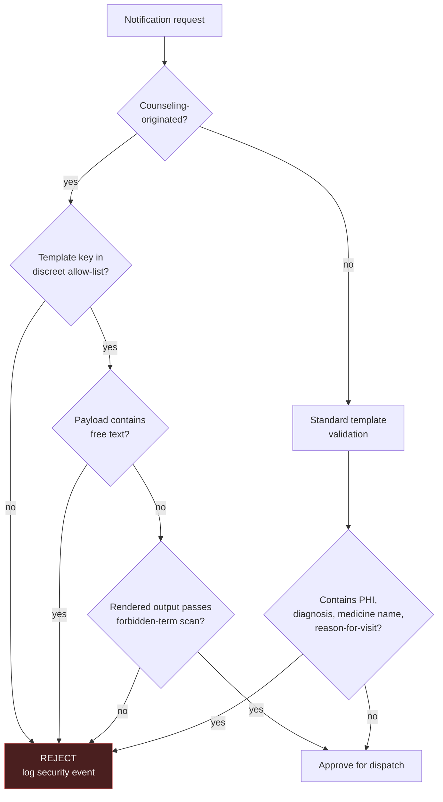
```mermaid
flowchart TB
    IN["Notification request"] --> C1{"Counseling-<br/>originated?"}
    C1 -->|no| STD["Standard template<br/>validation"]
    C1 -->|yes| C2{"Template key in<br/>discreet allow-list?"}
    C2 -->|no| REJ["REJECT<br/>log security event"]
    C2 -->|yes| C3{"Payload contains<br/>free text?"}
    C3 -->|yes| REJ
    C3 -->|no| C4{"Rendered output passes<br/>forbidden-term scan?"}
    C4 -->|no| REJ
    C4 -->|yes| OK["Approve for dispatch"]
    STD --> C5{"Contains PHI,<br/>diagnosis, medicine name,<br/>reason-for-visit?"}
    C5 -->|yes| REJ
    C5 -->|no| OK

    style REJ fill:#4a1f1f,stroke:#c94f4f,color:#fff
```

**The guard is a mandatory gate, not a helper.** No dispatch path exists that bypasses it. FR-NTF-05, FR-NTF-06 and FR-NTF-09 are enforced here once, rather than being a rule that every template author must remember.

## 4.3 Counseling Service components

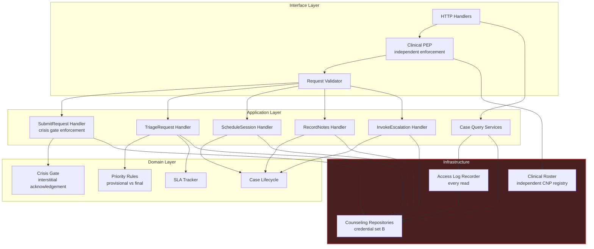
```mermaid
graph TB
    subgraph cif["Interface Layer"]
        CHTTP["HTTP Handlers"]
        CPEP["Clinical PEP<br/>independent enforcement"]
        CVAL["Request Validator"]
    end

    subgraph capp["Application Layer"]
        INTAKE["SubmitRequest Handler<br/>crisis gate enforcement"]
        TRIAGE["TriageRequest Handler"]
        SCHEDC["ScheduleSession Handler"]
        NOTES["RecordNotes Handler"]
        ESC["InvokeEscalation Handler"]
        CQRY["Case Query Services"]
    end

    subgraph cdom["Domain Layer"]
        PRIO["Priority Rules<br/>provisional vs final"]
        SLA["SLA Tracker"]
        LIFE["Case Lifecycle"]
        CRISIS["Crisis Gate<br/>interstitial acknowledgement"]
    end

    subgraph cinfra["Infrastructure"]
        CREPO["Counseling Repositories<br/>credential set B"]
        ACCESSLOG["Access Log Recorder<br/>every read"]
        CROSTER["Clinical Roster<br/>independent CNP registry"]
    end

    CHTTP --> CPEP --> CVAL
    CVAL --> INTAKE & TRIAGE & SCHEDC & NOTES & ESC
    CHTTP --> CQRY

    CPEP --> CROSTER
    INTAKE --> CRISIS
    TRIAGE --> PRIO
    TRIAGE --> SLA
    SCHEDC --> LIFE
    NOTES --> LIFE
    ESC --> LIFE

    INTAKE & TRIAGE & SCHEDC & NOTES & ESC --> CREPO
    CQRY --> ACCESSLOG
    CQRY --> CREPO
    ACCESSLOG --> CREPO

    style cinfra fill:#4a1f1f,stroke:#c94f4f,stroke-width:2px,color:#fff
```

**Two components deserve specific attention.**

**Clinical Roster (`CROSTER`)** is the mechanism behind AD-1. The Counseling Service receives a session assertion from IAM carrying `role: CNP`. **It does not trust that claim.** It independently verifies the subject against its own roster, maintained inside the boundary. If IAM were compromised and minted a forged `CNP` claim, the Counseling Service would still deny — because the subject is not on its roster. That is what "an access-control path independent of the general permission check" (NFR-SEC-06) actually means in practice.

**Access Log Recorder** wraps *every read path*, not the write paths. FR-CSE-15 requires logging reads, which is unusual and easy to omit. Placing it on the query services — where reads necessarily pass — makes it structural. It writes inside the boundary, so administrators cannot read it (FR-CSE-16).

---

# 5. Service Layer Design

## 5.1 Layer contract

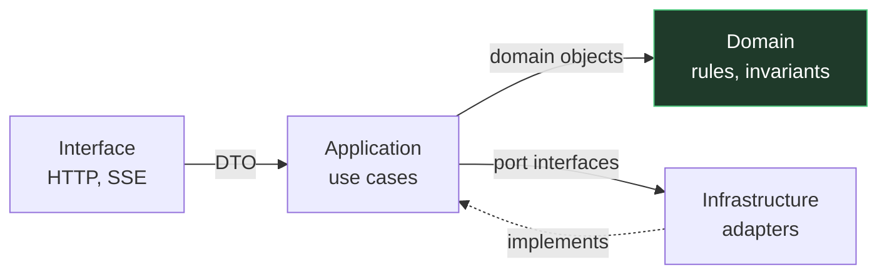
```mermaid
graph LR
    A["Interface<br/>HTTP, SSE"] -->|"DTO"| B["Application<br/>use cases"]
    B -->|"domain objects"| C["Domain<br/>rules, invariants"]
    B -->|"port interfaces"| D["Infrastructure<br/>adapters"]
    D -.implements.-> B

    style C fill:#1f3a2a,stroke:#4fc97f,color:#fff
```

| Layer | May contain | May **not** contain |
|---|---|---|
| **Interface** | Routing, DTO shape validation, serialisation, error mapping, PEP invocation | Business rules, persistence, orchestration |
| **Application** | Use-case orchestration, transaction boundary, event emission, audit emission | Business invariants, SQL, HTTP types |
| **Domain** | Entities, value objects, invariants, all 70 BR-* rules, policy evaluation | Framework types, persistence types, I/O of any kind |
| **Infrastructure** | Repository, mail, cache, clock, audit-sink implementations | Business decisions |

**The Domain layer performs no I/O.** This is what makes 70 business rules testable in milliseconds without a database — the single highest-leverage decision for a small team's test suite.

## 5.2 Command handler anatomy

Every state-changing operation follows one shape. Deviations are review findings.

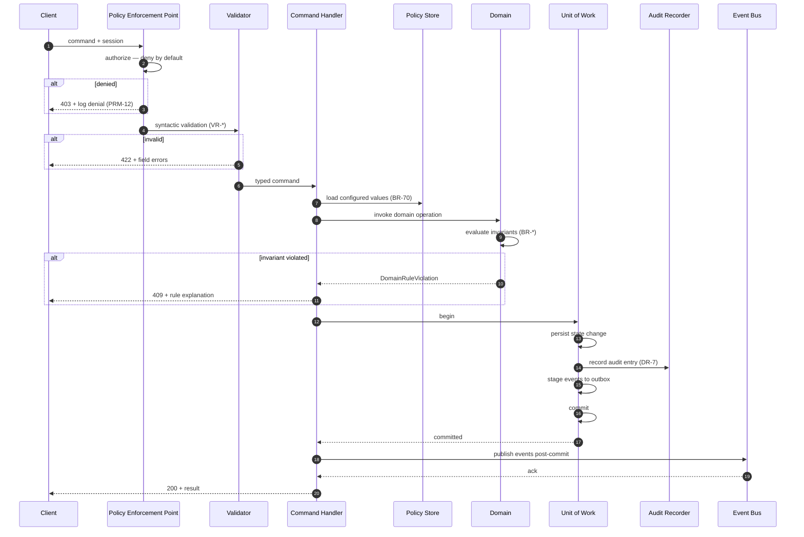
```mermaid
sequenceDiagram
    autonumber
    participant CL as Client
    participant PEP as Policy Enforcement Point
    participant V as Validator
    participant H as Command Handler
    participant P as Policy Store
    participant D as Domain
    participant U as Unit of Work
    participant A as Audit Recorder
    participant B as Event Bus

    CL->>PEP: command + session
    PEP->>PEP: authorize — deny by default
    alt denied
        PEP-->>CL: 403 + log denial (PRM-12)
    end
    PEP->>V: syntactic validation (VR-*)
    alt invalid
        V-->>CL: 422 + field errors
    end
    V->>H: typed command
    H->>P: load configured values (BR-70)
    H->>D: invoke domain operation
    D->>D: evaluate invariants (BR-*)
    alt invariant violated
        D-->>H: DomainRuleViolation
        H-->>CL: 409 + rule explanation
    end
    H->>U: begin
    U->>U: persist state change
    U->>A: record audit entry (DR-7)
    U->>U: stage events to outbox
    U->>U: commit
    U-->>H: committed
    H->>B: publish events post-commit
    B-->>H: ack
    H-->>CL: 200 + result
```

**Three deliberate properties:**

1. **Authorization precedes validation.** An unauthorised caller must not learn whether their input was well-formed — that is an information leak, and under BR-50 it is a serious one.
2. **Audit is inside the transaction.** State cannot commit without its audit entry (DR-7, BR-60). They succeed together or fail together.
3. **Events publish after commit.** A subscriber must never observe a state that was rolled back. The outbox makes this durable.

## 5.3 Application services inventory

| Service | Commands | Key rules enforced |
|---|---|---|
| `AppointmentService` | Book, Cancel | BR-10, BR-11, BR-12, BR-21, VR-20…VR-26, EC-01 |
| `QueueService` | CheckIn, AdvanceStatus, ReverseStatus, MarkNoShow | BR-14, BR-18, BR-22, VR-27…VR-32, EC-07, EC-16 |
| `WalkInService` | RegisterWalkIn, MarkEmergency | BR-16, BR-17, BR-66, BR-69, EC-09, EC-10 |
| `ScheduleService` | DefineRoster, CreateOverride, MarkUnavailable, ConfirmLeaveImpact | BR-25…BR-29, VR-10…VR-19 |
| `SuspensionService` | EvaluateNoShowThreshold, ApplySuspension | BR-15 — **and never blocks walk-in** |
| `BillingService` | RecordPayment, ApplyWaiver, Reconcile, CreateAdjustment | BR-30…BR-34, VR-40…VR-44 |
| `InventoryService` | ReceiveStock, Dispense, Adjust, SetThreshold | BR-39, BR-40, BR-41, VR-52…VR-59 |
| `StoreStatusService` | SetHours, ApplyOverride, ExpireOverride | BR-42, VR-61, VR-62 |
| `AccountService` | CreateAccount, AssignRole, Suspend, Deactivate | BR-01, BR-05, BR-06, VR-04, VR-05 |
| `PolicyService` | UpdateConfiguration | BR-70, VR-94, EC-50 |
| `ExportService` | ExportOperationalData | FR-ADM-09 — counseling exclusion is structural, not filtered |
| **`IntakeService`** *(vault)* | SubmitRequest, WithdrawRequest | BR-45, BR-46, BR-47, BR-48, BR-56, VR-70…VR-75 |
| **`TriageService`** *(vault)* | SetPriority, DeclineRequest | BR-45, BR-67, VR-76 |
| **`CaseService`** *(vault)* | ScheduleSession, RecordOutcome, RecordNotes, CloseCase, InvokeEscalation | BR-49, BR-57, BR-67, VR-77…VR-79 |

**On `ExportService`:** FR-ADM-09 requires exports to contain no counseling data. Because the Core process has no credentials to counseling storage, this is not implemented as a filter that could be misconfigured — it is impossible by construction. This is the everyday payoff of ADR-001.

## 5.4 Query services and the read path

Reads split into three paths with different characteristics:

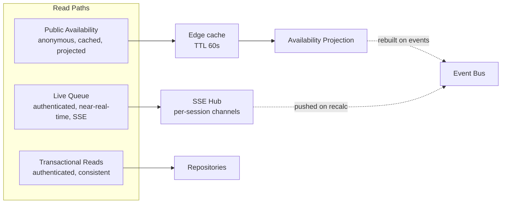
```mermaid
graph LR
    subgraph paths["Read Paths"]
        P1["Public Availability<br/>anonymous, cached, projected"]
        P2["Live Queue<br/>authenticated, near-real-time, SSE"]
        P3["Transactional Reads<br/>authenticated, consistent"]
    end

    P1 --> C1["Edge cache<br/>TTL 60s"]
    C1 --> PROJ["Availability Projection"]
    PROJ -.rebuilt on events.-> EVT["Event Bus"]

    P2 --> SSEH["SSE Hub<br/>per-session channels"]
    SSEH -.pushed on recalc.-> EVT

    P3 --> REPOR["Repositories"]
```

| Path | Consistency | Auth | Why separate |
|---|---|---|---|
| **Public Availability** | Eventually consistent, ≤ 60 s | None | AD-5. Must survive the slot-release burst without touching the transactional store. Cacheable at the edge because it is identical for every viewer |
| **Live Queue** | ≤ 30 s stale | Session | AD-4, NFR-PERF-05. Pushed via SSE; the client never polls in the normal case |
| **Transactional** | Strong | Session | Everything else |

**SSE over WebSocket.** Queue updates are strictly server-to-client. SSE is unidirectional, runs over plain HTTP, reconnects automatically, and traverses proxies without special handling. WebSocket would add bidirectional capability the domain does not need, plus connection-state complexity. A polling fallback at 20 s exists for clients where SSE fails — which matters on the weak mobile connections of CON-06.

## 5.5 Event catalogue

Internal events only. No external message broker in Phase 1 (AD-9).

| Event | Emitted by | Consumed by | Purpose |
|---|---|---|---|
| `AppointmentBooked` | Queue | Notification, Availability | Confirmation; slot count refresh |
| `AppointmentCancelled` | Queue | Estimation, Notification, Availability | Recalculate; release slot |
| `WalkInInserted` | Queue | Estimation, Availability | Recalculate |
| `EmergencyInserted` | Queue | Estimation, Notification | Recalculate; notify waiting patients (BR-69) |
| `ConsultationStarted` | Queue | Estimation, Availability | Start actual-duration measurement |
| `ConsultationCompleted` | Queue | Estimation, Availability | Feed rolling mean; advance queue |
| `PatientMarkedNoShow` | Queue | Estimation, Suspension | Recalculate; evaluate BR-15 |
| `QueuePositionChanged` | Estimation | Notification, SSE Hub | "You're next" at position 2 |
| `EstimateSlipped` | Estimation | Notification | Delay notice past threshold |
| `DoctorUnavailabilityConfirmed` | Scheduling | Queue, Notification | Bulk cancel; notify within 5 min |
| `StockLevelChanged` | Pharmacy | Availability, Notification | Status band; low-stock alert |
| `BatchExpired` | Pharmacy scheduler | Availability | Daily recalculation at 00:01 |
| `AccountDeactivated` | IAM | Queue, Counseling | Cancel bookings (EC-06); notify vault |
| `CounselingRequestSubmitted` | Counseling | Counseling only | **Never crosses to Core** |

**The last row is the important one.** Counseling events do not enter the Core event bus. If they did, any Core subscriber could infer the existence of a counseling record, breaching BR-50.

## 5.6 Offline-resilient counter operations

The response to AD-3 and NFR-REL-04. This is the mechanism that keeps the front desk working when the campus network drops, and therefore the mechanism that most directly addresses risk R3.

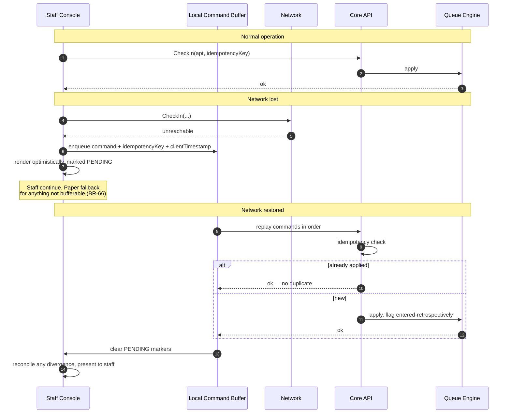
```mermaid
sequenceDiagram
    autonumber
    participant S as Staff Console
    participant B as Local Command Buffer
    participant N as Network
    participant API as Core API
    participant Q as Queue Engine

    Note over S,Q: Normal operation
    S->>API: CheckIn(apt, idempotencyKey)
    API->>Q: apply
    Q-->>S: ok

    Note over S,Q: Network lost
    S->>N: CheckIn(...)
    N--xS: unreachable
    S->>B: enqueue command + idempotencyKey + clientTimestamp
    S->>S: render optimistically, marked PENDING
    Note over S: Staff continue. Paper fallback<br/>for anything not bufferable (BR-66)

    Note over S,Q: Network restored
    B->>API: replay commands in order
    API->>API: idempotency check
    alt already applied
        API-->>B: ok — no duplicate
    else new
        API->>Q: apply, flag entered-retrospectively
        Q-->>B: ok
    end
    B->>S: clear PENDING markers
    S->>S: reconcile any divergence, present to staff
```

**Two rules make this safe:**

**Only commands are buffered, never state.** The client replays *intentions* ("check in appointment X"), not a snapshot of what it believes the queue looks like. This eliminates merge conflicts entirely and honours VR-92, which requires stale writes to be rejected rather than merged.

**Only a whitelist is bufferable:**

| Bufferable | Not bufferable | Why |
|---|---|---|
| Check-in | Booking | Slot contention (EC-01) cannot be resolved offline; two offline clients could both claim the last slot |
| Status advance | Doctor leave / bulk cancel | Requires server-side impact analysis over all bookings (FR-SCH-07) |
| Walk-in registration | Payment recording | Financial integrity; receipt uniqueness (VR-41) must be checked server-side |
| No-show marking | Configuration change | Must be evaluated against server state |

Anything not bufferable falls back to paper (BR-66, ASM-18) and is entered retrospectively within the same day. **Care is never blocked by software availability.**

---

# 6. Folder Architecture

Presented for a TypeScript/Node backend with a React PWA. **The stack is a downstream choice; the shape is not.** The module boundaries, layer separation, and the physical split at `services/` port unchanged to any language.

## 6.1 Repository root

```
diu-campuscare/
├── apps/
│   ├── core-api/              # Deployable 1 — modular monolith
│   ├── counseling-api/        # Deployable 2 — segregated (ADR-001)
│   ├── worker/                # Background worker
│   └── web/                   # PWA client
├── packages/
│   ├── contracts/             # Shared DTOs & event definitions ONLY
│   ├── kernel/                # Cross-cutting: authz, policy, audit, clock
│   └── ui/                    # Shared UI primitives
├── config/
│   ├── policy.defaults.yaml   # Every 【A】 value, with ranges (BR-70)
│   ├── notification-templates/
│   │   ├── standard/
│   │   └── discreet/          # Counseling allow-list ONLY (FR-NTF-05)
│   └── feature-flags.yaml
├── docs/
│   ├── PROJECT_PLANNING.md
│   ├── SRS.md
│   ├── ARCHITECTURE.md
│   └── adr/                   # Architecture Decision Records
├── tools/
│   └── arch-check/            # CI enforcement of DR-1…DR-7
└── tests/
    ├── architecture/          # Dependency-rule & audit-coverage tests
    ├── e2e/
    └── load/
```

**`packages/contracts` contains no counseling case types.** Only the three boundary payloads of §2.4. If a counseling domain type appeared here, ADR-001 would be leaking.

## 6.2 Core API — module-first, layer-second

```
apps/core-api/src/
├── main.ts                        # Composition root — the ONLY place adapters are constructed (DR-5)
├── bootstrap/
│   ├── container.ts               # Dependency wiring
│   ├── routes.ts
│   ├── event-subscriptions.ts     # Bus wiring, declared in one place
│   └── feature-flags.ts
│
├── modules/
│   ├── identity/
│   │   ├── interface/             # http/, dto/, mappers/
│   │   ├── application/           # authenticate.handler.ts, assign-role.handler.ts …
│   │   ├── domain/                # account.ts, session.ts, lockout-policy.ts
│   │   ├── infrastructure/        # repositories, oidc adapter
│   │   └── index.ts               # PUBLIC INTERFACE — the only export surface (DR-2)
│   │
│   ├── scheduling/
│   │   ├── interface/
│   │   ├── application/           # define-roster, mark-unavailable, confirm-leave-impact
│   │   ├── domain/                # session.ts, roster.ts, slot-engine.ts, calendar.ts
│   │   ├── infrastructure/
│   │   └── index.ts
│   │
│   ├── queue/                     # ← the core domain
│   │   ├── interface/
│   │   │   ├── http/
│   │   │   └── sse/               # live queue subscriptions
│   │   ├── application/
│   │   │   ├── book-appointment.handler.ts
│   │   │   ├── check-in.handler.ts
│   │   │   ├── advance-status.handler.ts
│   │   │   ├── register-walk-in.handler.ts
│   │   │   ├── mark-emergency.handler.ts
│   │   │   ├── mark-no-show.handler.ts
│   │   │   └── reverse-status.handler.ts
│   │   ├── domain/
│   │   │   ├── queue-engine.ts        # ordering, insertion, invariants
│   │   │   ├── serial-allocator.ts    # single per-session sequence (EC-09)
│   │   │   ├── status-machine.ts      # FR-APT-28 lifecycle, VR-28
│   │   │   ├── booking-limits.ts      # BR-11
│   │   │   ├── suspension-policy.ts   # BR-15 — never blocks walk-in
│   │   │   └── events.ts
│   │   ├── infrastructure/
│   │   └── index.ts
│   │
│   ├── estimation/
│   │   ├── application/           # recalculate-estimates.handler.ts
│   │   ├── domain/
│   │   │   ├── estimation-engine.ts
│   │   │   ├── rolling-mean.ts
│   │   │   ├── anomaly-filter.ts      # EC-15
│   │   │   └── slip-detector.ts       # BR-20
│   │   └── index.ts
│   │
│   ├── billing/
│   ├── pharmacy/
│   │   ├── domain/
│   │   │   ├── fefo-selector.ts       # BR-39
│   │   │   ├── expiry-rules.ts        # BR-40 — safety-critical
│   │   │   ├── status-band.ts         # BR-36
│   │   │   └── movement-log.ts        # BR-41, append-only
│   │   └── …
│   ├── availability/              # read model / projection
│   ├── notification/
│   │   ├── domain/
│   │   │   ├── content-policy-guard.ts   # FR-NTF-05/06/09 — mandatory gate
│   │   │   └── template-registry.ts
│   │   ├── infrastructure/
│   │   │   ├── outbox.ts
│   │   │   ├── in-app.channel.ts
│   │   │   └── email.channel.ts
│   │   └── …
│   └── administration/
│
├── kernel/                        # May NOT import from modules/ (DR-1)
│   ├── authz/
│   │   ├── policy-decision-point.ts
│   │   ├── policy-enforcement-point.ts
│   │   ├── permission-matrix.ts       # SRS §3.5.2, declarative
│   │   ├── ownership.ts
│   │   └── break-glass.ts
│   ├── policy/                        # config store, hot reload, range validation
│   ├── audit/                         # recorder + write-only sink adapter
│   ├── events/                        # bus + outbox writer
│   ├── errors/                        # taxonomy + envelope + mapper
│   ├── logging/                       # structured logger + redaction filter
│   └── clock/                         # server-time only (EC-54)
│
└── shared/
    ├── types/
    └── result.ts                      # explicit success/failure, no thrown control flow
```

**Why module-first rather than layer-first.** A layer-first tree (`controllers/`, `services/`, `repositories/`) scatters one feature across the codebase and makes DR-2 unenforceable — nothing stops a controller reaching into any repository. Module-first makes the boundary visible in the filesystem, and `index.ts` per module makes it mechanically checkable.

## 6.3 Counseling API — physically separate

```
apps/counseling-api/src/
├── main.ts                        # Own composition root. Own credentials.
├── bootstrap/
│   └── clinical-roster.ts         # Independent CNP registry — NOT from Core IAM
│
├── interface/
│   ├── http/
│   ├── clinical-pep.ts            # Independent enforcement (NFR-SEC-06)
│   └── dto/
│
├── application/
│   ├── submit-request.handler.ts      # crisis gate enforced server-side (VR-75)
│   ├── triage-request.handler.ts
│   ├── schedule-session.handler.ts
│   ├── record-notes.handler.ts
│   ├── invoke-escalation.handler.ts
│   ├── withdraw-request.handler.ts
│   └── queries/
│       └── with-access-logging.ts     # EVERY read wrapped (FR-CSE-15)
│
├── domain/
│   ├── case-lifecycle.ts              # FR-CSE-10
│   ├── priority-rules.ts              # BR-45 — provisional vs final
│   ├── sla-tracker.ts                 # FR-CSE-07
│   ├── crisis-gate.ts                 # FR-CNS-06 acknowledgement
│   └── no-automated-judgement.ts      # BR-67 guard
│
├── infrastructure/
│   ├── repositories/                  # credential set B — separate from Core
│   ├── access-log.recorder.ts         # inside the boundary (FR-CSE-16)
│   └── notification.client.ts         # template keys ONLY (§2.4)
│
└── content/
    └── crisis-protocol/               # [R3] DIU-CP-01 — ABSENT blocks startup (BR-68)
```

**`content/crisis-protocol/` is empty until DIU supplies [R3].** The service refuses to start without it. That is OI-01 enforced as a deployment gate rather than as a reminder in a document.

## 6.4 Web client

```
apps/web/src/
├── app/
│   ├── public/           # No auth. Availability, medicine search, queue display.
│   ├── student/
│   ├── staff/            # Queue console — offline-capable
│   ├── operator/
│   ├── counselor/        # Talks to counseling-api ONLY
│   └── admin/
├── features/
│   ├── booking/
│   ├── live-queue/       # SSE subscription + polling fallback
│   ├── walk-in/
│   ├── medicine-search/
│   ├── counseling-request/
│   │   └── CrisisBanner.tsx      # rendered by layout, not by the form (FR-CNS-04)
│   └── inventory/
├── infrastructure/
│   ├── command-buffer/           # IndexedDB durable queue (§5.6)
│   ├── sse-client.ts
│   └── api-client.ts
└── shared/
```

**`CrisisBanner` is mounted by the counseling route layout, not by any individual form.** FR-CNS-04 requires it on *every* counseling screen. Composing it into each screen means a future screen can omit it. Mounting it at the layout makes omission require a deliberate act.

---

# 7. Authentication Flow

## 7.1 Primary — institutional SSO

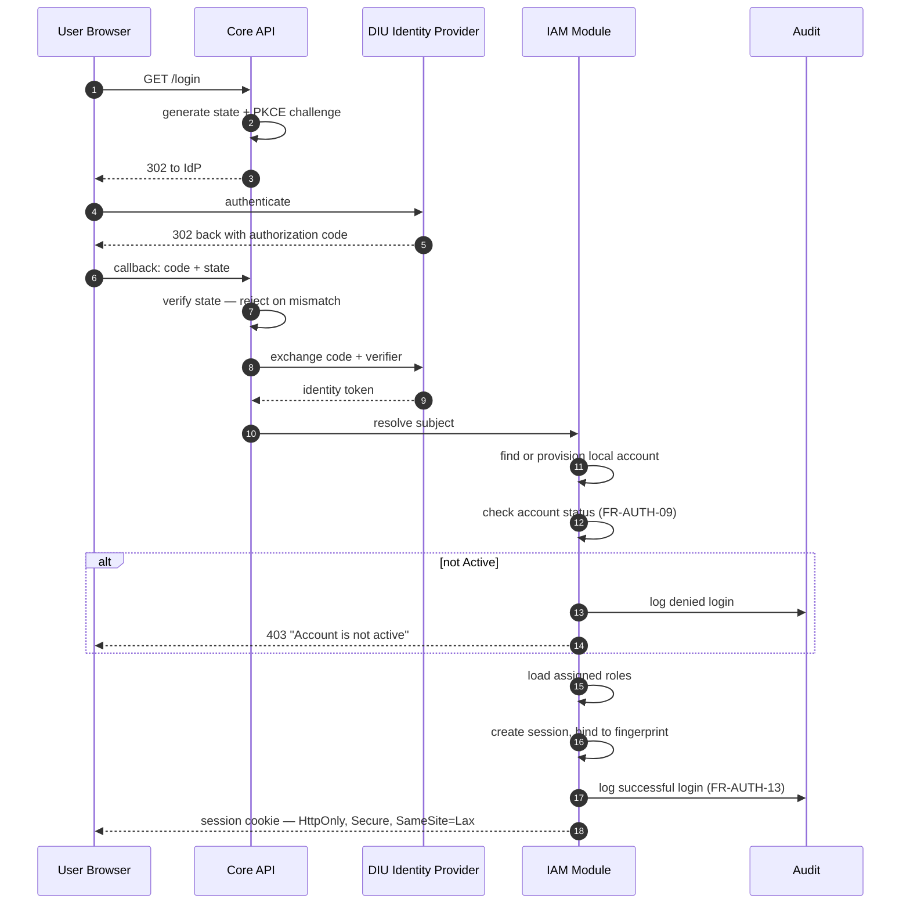
```mermaid
sequenceDiagram
    autonumber
    participant U as User Browser
    participant C as Core API
    participant I as DIU Identity Provider
    participant IAM as IAM Module
    participant A as Audit

    U->>C: GET /login
    C->>C: generate state + PKCE challenge
    C-->>U: 302 to IdP
    U->>I: authenticate
    I-->>U: 302 back with authorization code
    U->>C: callback: code + state
    C->>C: verify state — reject on mismatch
    C->>I: exchange code + verifier
    I-->>C: identity token
    C->>IAM: resolve subject
    IAM->>IAM: find or provision local account
    IAM->>IAM: check account status (FR-AUTH-09)
    alt not Active
        IAM->>A: log denied login
        IAM-->>U: 403 "Account is not active"
    end
    IAM->>IAM: load assigned roles
    IAM->>IAM: create session, bind to fingerprint
    IAM->>A: log successful login (FR-AUTH-13)
    IAM-->>U: session cookie — HttpOnly, Secure, SameSite=Lax
```

## 7.2 Fallback — local credentials (OI-03)

Used only where SSO is unavailable. Same session outcome, different credential verification.

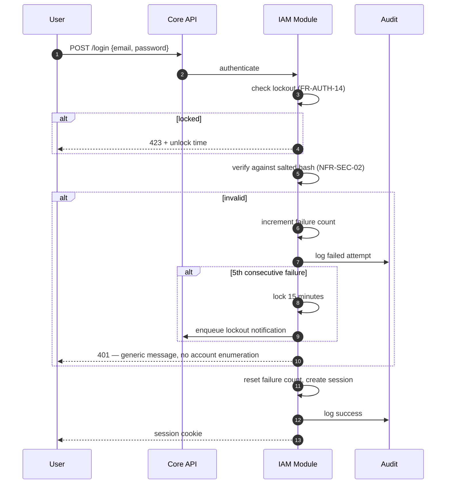
```mermaid
sequenceDiagram
    autonumber
    participant U as User
    participant C as Core API
    participant IAM as IAM Module
    participant A as Audit

    U->>C: POST /login {email, password}
    C->>IAM: authenticate
    IAM->>IAM: check lockout (FR-AUTH-14)
    alt locked
        IAM-->>U: 423 + unlock time
    end
    IAM->>IAM: verify against salted hash (NFR-SEC-02)
    alt invalid
        IAM->>IAM: increment failure count
        IAM->>A: log failed attempt
        alt 5th consecutive failure
            IAM->>IAM: lock 15 minutes
            IAM->>C: enqueue lockout notification
        end
        IAM-->>U: 401 — generic message, no account enumeration
    end
    IAM->>IAM: reset failure count, create session
    IAM->>A: log success
    IAM-->>U: session cookie
```

**The 401 message is deliberately generic.** A response distinguishing "no such account" from "wrong password" enumerates valid accounts.

## 7.3 Session properties

| Property | Value | Requirement |
|---|---|---|
| Transport | HttpOnly, Secure, SameSite=Lax cookie | NFR-SEC-01 |
| Student idle timeout | 30 minutes | FR-AUTH-06 |
| Counselor / Admin idle timeout | 15 minutes | FR-AUTH-06 |
| Regeneration | On login and on any privilege change | NFR-SEC-08 |
| Invalidation | Immediate on logout | FR-AUTH-07, NFR-SEC-08 |
| Permission reduction | Effective on next request, no re-authentication required | PRM-15 |
| Server-side state | Yes — revocable. Self-contained tokens cannot be revoked mid-session, which PRM-15 requires | PRM-15 |

## 7.4 Crossing into the Counseling Service

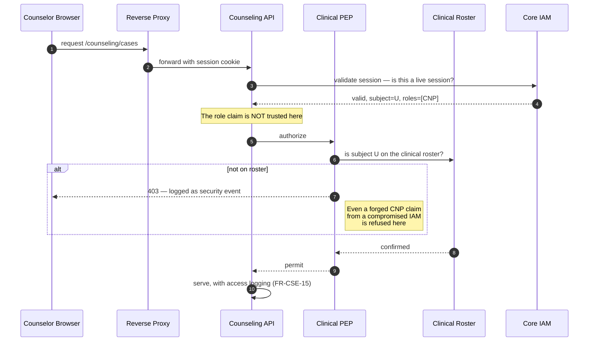
```mermaid
sequenceDiagram
    autonumber
    participant U as Counselor Browser
    participant RP as Reverse Proxy
    participant CS as Counseling API
    participant CPEP as Clinical PEP
    participant CR as Clinical Roster
    participant IAM as Core IAM

    U->>RP: request /counseling/cases
    RP->>CS: forward with session cookie
    CS->>IAM: validate session — is this a live session?
    IAM-->>CS: valid, subject=U, roles=[CNP]
    Note over CS: The role claim is NOT trusted here
    CS->>CPEP: authorize
    CPEP->>CR: is subject U on the clinical roster?
    alt not on roster
        CPEP-->>U: 403 — logged as security event
        Note right of CPEP: Even a forged CNP claim<br/>from a compromised IAM<br/>is refused here
    end
    CR-->>CPEP: confirmed
    CPEP-->>CS: permit
    CS->>CS: serve, with access logging (FR-CSE-15)
```

**IAM answers "who are you and is your session live?" The Counseling Service answers "are you clinically authorised?" independently.** Two questions, two authorities, two failure modes that do not share a cause. This is NFR-SEC-06 made real.

---

# 8. Authorization Flow

## 8.1 PEP / PDP model

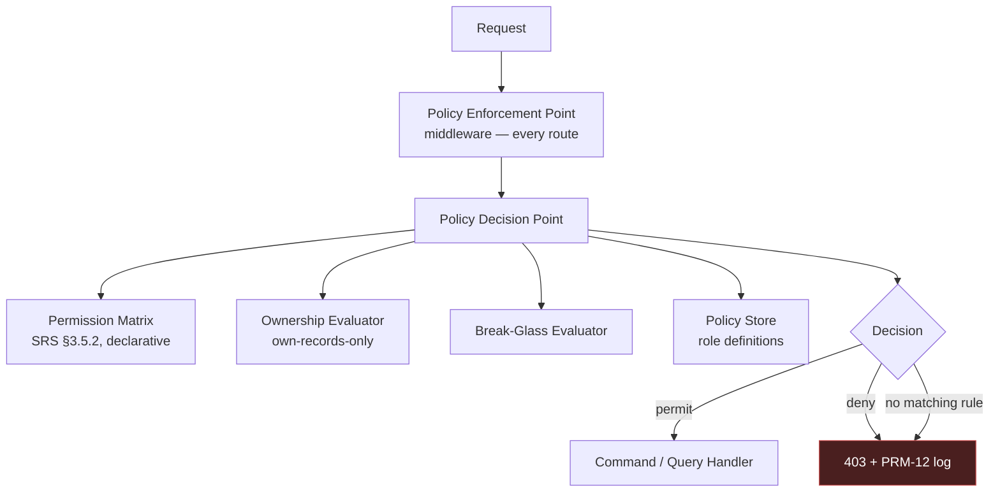
```mermaid
graph TB
    REQ["Request"] --> PEP["Policy Enforcement Point<br/>middleware — every route"]
    PEP --> PDP["Policy Decision Point"]

    PDP --> M["Permission Matrix<br/>SRS §3.5.2, declarative"]
    PDP --> OWN["Ownership Evaluator<br/>own-records-only"]
    PDP --> BG["Break-Glass Evaluator"]
    PDP --> POL["Policy Store<br/>role definitions"]

    PDP --> DEC{"Decision"}
    DEC -->|permit| HANDLER["Command / Query Handler"]
    DEC -->|deny| DENY["403 + PRM-12 log"]
    DEC -->|no matching rule| DENY

    style DENY fill:#4a1f1f,stroke:#c94f4f,color:#fff
```

**The "no matching rule" edge is the whole point of PRM-02.** Absence of a rule is a denial. A new endpoint added without a permission entry is inaccessible, not open. The failure mode of forgetfulness is lockout, not exposure.

## 8.2 Decision sequence

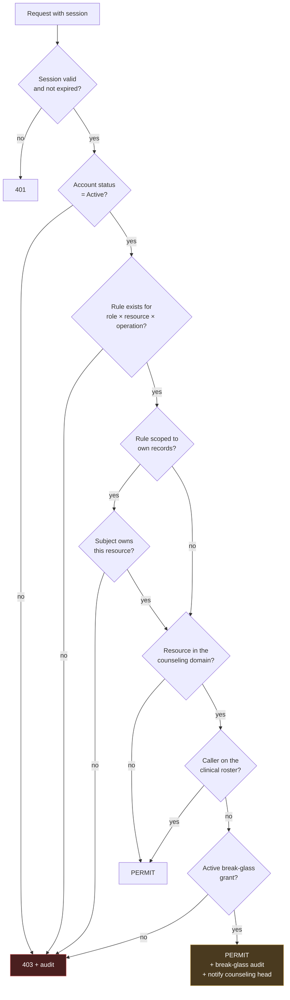
```mermaid
flowchart TB
    S["Request with session"] --> A{"Session valid<br/>and not expired?"}
    A -->|no| D401["401"]
    A -->|yes| B{"Account status<br/>= Active?"}
    B -->|no| D403["403 + audit"]
    B -->|yes| C{"Rule exists for<br/>role × resource × operation?"}
    C -->|no| D403
    C -->|yes| E{"Rule scoped to<br/>own records?"}
    E -->|yes| F{"Subject owns<br/>this resource?"}
    F -->|no| D403
    F -->|yes| G
    E -->|no| G{"Resource in the<br/>counseling domain?"}
    G -->|no| PERMIT["PERMIT"]
    G -->|yes| H{"Caller on the<br/>clinical roster?"}
    H -->|yes| PERMIT
    H -->|no| I{"Active break-glass<br/>grant?"}
    I -->|no| D403
    I -->|yes| J["PERMIT<br/>+ break-glass audit<br/>+ notify counseling head"]

    style D403 fill:#4a1f1f,stroke:#c94f4f,color:#fff
    style J fill:#4a3a1f,stroke:#c9a44f,color:#fff
```

## 8.3 Permission matrix as declarative data

SRS §3.5.2 is expressed as configuration, not as conditionals scattered through handlers.

| Benefit | Consequence |
|---|---|
| The matrix is readable by a non-developer, including the counseling professionals who must approve it | Reduces the risk of a misunderstood requirement (CON-04) |
| It is testable as data — the entire SRS §3.5.2 table becomes a table-driven test | PRM-01…PRM-15 verified mechanically |
| Adding a resource without a rule fails closed | PRM-02 |
| Changes are auditable as configuration changes | FR-ADM-02 |

## 8.4 Break-glass

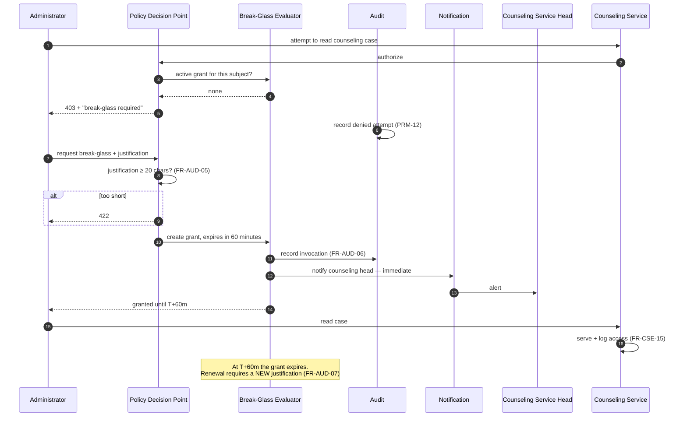
```mermaid
sequenceDiagram
    autonumber
    participant A as Administrator
    participant PDP as Policy Decision Point
    participant BG as Break-Glass Evaluator
    participant AUD as Audit
    participant N as Notification
    participant H as Counseling Service Head
    participant CS as Counseling Service

    A->>CS: attempt to read counseling case
    CS->>PDP: authorize
    PDP->>BG: active grant for this subject?
    BG-->>PDP: none
    PDP-->>A: 403 + "break-glass required"
    AUD->>AUD: record denied attempt (PRM-12)

    A->>PDP: request break-glass + justification
    PDP->>PDP: justification ≥ 20 chars? (FR-AUD-05)
    alt too short
        PDP-->>A: 422
    end
    PDP->>BG: create grant, expires in 60 minutes
    BG->>AUD: record invocation (FR-AUD-06)
    BG->>N: notify counseling head — immediate
    N->>H: alert
    BG-->>A: granted until T+60m

    A->>CS: read case
    CS->>CS: serve + log access (FR-CSE-15)

    Note over BG: At T+60m the grant expires.<br/>Renewal requires a NEW justification (FR-AUD-07)
```

**Design intent:** break-glass is deliberately uncomfortable. It requires typing a justification, it wakes someone up, it expires, and it cannot be silently renewed. It exists so that a genuine emergency is not blocked — not so that it becomes a routine path.

## 8.5 Where authorization is *not* enforced

Stated explicitly, because assuming otherwise causes vulnerabilities:

| Location | Status |
|---|---|
| Client-side route guards | **Cosmetic only.** They hide UI. They enforce nothing (PRM-01) |
| DTO validation | Enforces shape, not permission |
| Database constraints | Enforce integrity, not permission |
| **PEP middleware + PDP** | **The only authoritative enforcement point** |

---

# 9. Notification Flow

## 9.1 End-to-end

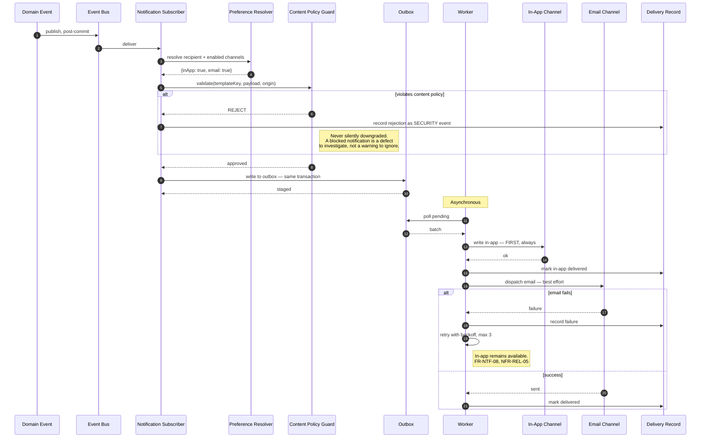
```mermaid
sequenceDiagram
    autonumber
    participant D as Domain Event
    participant B as Event Bus
    participant S as Notification Subscriber
    participant P as Preference Resolver
    participant G as Content Policy Guard
    participant O as Outbox
    participant W as Worker
    participant IA as In-App Channel
    participant EM as Email Channel
    participant R as Delivery Record

    D->>B: publish, post-commit
    B->>S: deliver
    S->>P: resolve recipient + enabled channels
    P-->>S: {inApp: true, email: true}
    S->>G: validate(templateKey, payload, origin)
    alt violates content policy
        G-->>S: REJECT
        S->>R: record rejection as SECURITY event
        Note right of G: Never silently downgraded.<br/>A blocked notification is a defect<br/>to investigate, not a warning to ignore.
    end
    G-->>S: approved
    S->>O: write to outbox — same transaction
    O-->>S: staged

    Note over W: Asynchronous
    W->>O: poll pending
    O-->>W: batch
    W->>IA: write in-app — FIRST, always
    IA-->>W: ok
    W->>R: mark in-app delivered
    W->>EM: dispatch email — best effort
    alt email fails
        EM-->>W: failure
        W->>R: record failure
        W->>W: retry with backoff, max 3
        Note right of W: In-app remains available.<br/>FR-NTF-08, NFR-REL-05
    else success
        EM-->>W: sent
        W->>R: mark delivered
    end
```

**Ordering matters.** In-app is written first, always, and unconditionally. Email is best-effort. FR-NTF-08 requires that email failure never removes the in-app notification, and NFR-REL-05 requires that notification failure never blocks care.

## 9.2 Why an outbox

| Alternative | Failure mode |
|---|---|
| Send inline during the command | A slow SMTP relay blows NFR-PERF-04's 1-second budget at the counter |
| Fire-and-forget after commit | Process restart between commit and send loses the notification. FR-SCH-09 requires leave cancellations within 5 minutes — silent loss is unacceptable |
| **Transactional outbox** | The notification is committed atomically with the state change; the worker guarantees at-least-once delivery. Duplicates are handled by idempotency keys |

## 9.3 Notification classes

| Class | Channels | Content policy | Latency budget |
|---|---|---|---|
| Booking confirmation | In-app + email | Standard | < 1 min |
| Queue position reached 2 | In-app + email | Standard | < 30 s |
| Estimate slipped | In-app + email | Standard | < 1 min |
| Emergency delay notice | In-app + email | **No emergency-patient detail** (BR-69) | < 1 min |
| Doctor unavailable | In-app + email | Standard | **< 5 min (BR-27) — hard requirement** |
| Booking suspension | In-app + email | Must state that walk-in remains available | < 5 min |
| Low stock | In-app + email to operator | Standard, deduplicated to once per item per day | < 1 hour |
| Urgent counseling request | In-app + email to counselors | **Discreet — no student identity in email** | **< 1 min (FR-CSE-08)** |
| Counseling acknowledgement | In-app + email to student | **Discreet template only** | **< 1 min (BR-46)** |
| Counseling session scheduled | In-app + email | **Discreet — "an update is available"** | < 5 min |
| Break-glass invoked | Email to counseling head | Standard | Immediate |

## 9.4 Notification flood control

EC-12 requires at most one delay notification per student per 15-minute window.

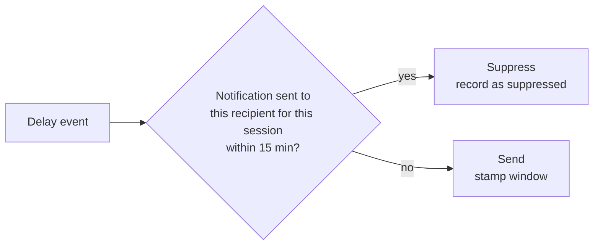
```mermaid
flowchart LR
    E["Delay event"] --> W{"Notification sent to<br/>this recipient for this session<br/>within 15 min?"}
    W -->|yes| SUP["Suppress<br/>record as suppressed"]
    W -->|no| SEND["Send<br/>stamp window"]
```

Applied to delay and emergency notices only. **Never applied to** counseling acknowledgements, doctor-unavailable notices, or break-glass alerts — those are individually significant and must never be suppressed.

---

# 10. Error Handling Strategy

## 10.1 Error taxonomy

Five classes. Every failure is exactly one of them.

| Class | HTTP | Meaning | Retryable | User sees |
|---|---|---|---|---|
| **ValidationError** | 422 | Input violates a VR-* rule | No — fix input | Field-level, plain language |
| **AuthorizationError** | 401 / 403 | Session invalid, or PDP denied | No | Generic. **Never reveals whether the resource exists** |
| **DomainRuleViolation** | 409 | A BR-* invariant would be broken | No — state must change first | The rule, in plain language, with the next step |
| **ConflictError** | 409 | Concurrent modification or lost race | Yes, after refresh | "That just changed — here is the current state" |
| **InfrastructureError** | 503 / 500 | Store, mail, or dependency failure | Yes, with backoff | "Something went wrong. Your data is safe." + correlation ID |

## 10.2 Flow

```mermaid
flowchart TB
    OP["Operation"] --> T{"Outcome"}
    T -->|success| OK["200 + result"]

    T -->|ValidationError| V["422<br/>field errors<br/>NFR-USE-06 wording"]
    T -->|AuthorizationError| AZ["403 generic<br/>+ PRM-12 audit"]
    T -->|DomainRuleViolation| DR["409<br/>rule + remedy"]
    T -->|ConflictError| CF["409<br/>+ current state"]
    T -->|InfrastructureError| IE["Retry?"]

    IE -->|transient, attempts left| RT["Backoff + retry"]
    RT --> OP
    IE -->|exhausted| CB{"Circuit<br/>breaker"}
    CB -->|open| DEG["Degraded mode<br/>NFR-REL-05"]
    CB -->|closed| E5["503 + correlation ID"]

    V & AZ & DR & CF & E5 --> LOG["Structured log<br/>+ correlation ID"]
    DEG --> LOG

    style AZ fill:#4a1f1f,stroke:#c94f4f,color:#fff
```

## 10.3 The uniform error envelope

Every error response carries the same shape: a stable machine-readable code, a plain-language human message, optional field-level detail, and a correlation ID.

**Three rules govern it:**

| Rule | Requirement |
|---|---|
| **Never leak internals.** No stack trace, no internal identifier, no store error text, no framework detail | NFR-SEC-07 |
| **Always actionable.** The message states what went wrong *and what to do next*, in plain language, with no technical terms | NFR-USE-06 |
| **Always correlated.** Every error carries an ID the user can quote and support can trace | NFR-MNT-03 |

**Worked example — the wording matters.** For VR-74 (a student submits a second counseling request while one is pending):

> ❌ *"Duplicate request rejected. Constraint violation: one active request per subject."*
> ✅ *"You already have a request with us — we've received it and it's being reviewed. You can see its status below."*

EC-39 requires that this "must not read as a rebuke." Under CON-04 and NFR-USE-07, all counseling-context copy is reviewed by a counseling professional before release. **Error messages are part of that review**, not an exception to it.

## 10.4 Degradation matrix

```mermaid
flowchart LR
    subgraph fails["Component failure"]
        F1["Email relay down"]
        F2["Cache unavailable"]
        F3["Counseling service down"]
        F4["Core store unavailable"]
        F5["SSE hub down"]
    end

    F1 --> D1["In-app notifications continue.<br/>Email queued and retried.<br/>Care unaffected."]
    F2 --> D2["Availability served from<br/>transactional path.<br/>Slower, still correct."]
    F3 --> D3["Medical + medicine fully operational.<br/>Counseling entry points hidden<br/>with a clear notice."]
    F4 --> D4["FULL OUTAGE.<br/>Paper fallback (BR-66).<br/>Retrospective entry on recovery."]
    F5 --> D5["Client falls back to<br/>20-second polling.<br/>NFR-PERF-05 still met."]

    style D4 fill:#4a1f1f,stroke:#c94f4f,color:#fff
```

**F3 is a direct dividend of ADR-001.** Because counseling runs as a separate process, its failure cannot take down appointments or the medicine store — and conversely, a defect in the queue console cannot affect counseling data. Blast radius containment was a secondary motivation for the separation; it turns out to be a substantial operational benefit.

## 10.5 Domain errors are not exceptions

Domain operations return an explicit result type rather than throwing. Business-rule violations are *expected outcomes*, not exceptional conditions.

| Reason | Effect |
|---|---|
| Rule violations are part of the domain's contract | The compiler forces the caller to handle them |
| Exceptions used for control flow hide the paths they take | Every failure path is visible at the call site |
| Testing rule violations needs no exception plumbing | 70 business rules become straightforward table-driven tests |

Exceptions remain, correctly, for genuinely exceptional conditions: infrastructure failure and programmer error.

---

# 11. Logging Strategy

## 11.1 Three independent streams

The most common logging mistake in a health system is a single stream mixing diagnostics with sensitive records. This architecture keeps three, with different owners, formats, retentions, and access rules.

```mermaid
graph TB
    subgraph app["Application Logs"]
        A1["Structured, levelled"]
        A2["Diagnostics + performance"]
        A3["NO personal health information"]
        A4["Retention: 90 days"]
        A5["Readable by: DIU IT"]
    end

    subgraph aud["General Audit Log"]
        B1["Business state changes"]
        B2["Append-only, immutable"]
        B3["Actor, before, after, timestamp"]
        B4["Retention: 3 years minimum"]
        B5["Readable by: Administrator"]
    end

    subgraph cns["Counseling Access Log"]
        C1["Every READ of case data"]
        C2["Append-only, inside the vault"]
        C3["Accessor, case, timestamp"]
        C4["Retention: per OI-02"]
        C5["Readable by: Counseling Professionals ONLY"]
    end

    style cns fill:#4a1f1f,stroke:#c94f4f,stroke-width:3px,color:#fff
```

| | Application | General Audit | Counseling Access |
|---|---|---|---|
| Purpose | Diagnose failures | Prove what happened to data | Prove who looked at a case |
| Requirement | NFR-MNT-03 | FR-AUD-01/02, BR-60/61 | FR-CSE-15/16, BR-51 |
| Mutable | Rotated | **Never** | **Never** |
| Contains PHI | **No** | Business fields only | Metadata only, never note content |
| Admin can read | Yes | Yes, **counseling redacted** (FR-ADM-06) | **No** (FR-CSE-16) |

**Note the last cell.** The administrator — who can read the general audit log — cannot read the counseling access log. It lives inside the vault. This is required by FR-CSE-16 and is nearly impossible to guarantee in a single-process design, because whoever can reach the log store can read it. ADR-001 makes it structural.

## 11.2 Redaction is a component, not a convention

```mermaid
flowchart LR
    L["Log call"] --> R["Redaction Filter<br/>MANDATORY"]
    R --> F1{"Contains a<br/>denied-field name?"}
    F1 -->|yes| MASK["Replace with [REDACTED]"]
    F1 -->|no| F2{"Matches a PHI<br/>pattern?"}
    F2 -->|yes| MASK
    F2 -->|no| PASS["Emit"]
    MASK --> PASS
```

**Denied fields, always masked in application logs:** counseling note content, counseling category, counseling urgency, reason-for-visit, medicine names in a student context, password material, session identifiers, break-glass justification text.

There is no logger that bypasses the filter. NFR-MNT-03 requires application logs sufficient to diagnose a failed booking, check-in, or dispensing event *without containing counseling content or personal health information* — the two halves of that sentence are in tension, and only a mandatory filter resolves it reliably.

## 11.3 Correlation

Every request receives a correlation ID at the edge, propagated through every layer, every event, every outbox entry, every log line, and returned in every error envelope.

```mermaid
sequenceDiagram
    participant C as Client
    participant E as Edge
    participant A as API
    participant H as Handler
    participant B as Bus
    participant W as Worker

    C->>E: request
    E->>E: generate correlationId
    E->>A: request + correlationId
    A->>H: context carries correlationId
    H->>B: event carries correlationId
    B->>W: outbox entry carries correlationId
    Note over E,W: One ID spans the synchronous request,<br/>the async event, and the eventual email
    A-->>C: response includes correlationId
```

This is what lets a student's report — *"I booked at 9 and never got a confirmation"* — become a single query rather than an investigation.

## 11.4 Levels and what belongs at each

| Level | Use | Example |
|---|---|---|
| `ERROR` | Requires human attention | Store unreachable; outbox retries exhausted; **content policy guard rejection** |
| `WARN` | Anomalous but handled | Email retry; anomalous consultation duration excluded (EC-15); walk-in allocation exceeded |
| `INFO` | Significant business event | Session started; day's collection reconciled; configuration changed |
| `DEBUG` | Development only, never enabled in production | Estimation intermediate values |

**A Content Policy Guard rejection is `ERROR`, not `WARN`.** If the guard blocks something, either a template was authored incorrectly or a code path is attempting to leak counseling context. Both require investigation. Logging it as a warning would let it accumulate unnoticed — exactly the failure mode BR-53 exists to prevent.

## 11.5 Metrics worth emitting from day one

| Metric | Why | Requirement |
|---|---|---|
| Estimate accuracy — % within ±15 min | The core promise. If this drops below 50%, a kill criterion is triggered | NFR-ACC-01/02 |
| Staff console p95 latency | Leading indicator of risk R3 | NFR-PERF-04 |
| Walk-in ratio | Reveals whether staff are actually using the system | Risk R3 |
| Online-booking share of consultations | Business goal BG1 and MVP success criterion | BG1 |
| Counseling triage SLA compliance | Business goal BG4/BG5 | FR-CSE-07 |
| Notification delivery failure rate | Silent failures break FR-SCH-09 | FR-NTF-07 |
| Authorization denial rate by role | Sudden change indicates a permission defect or an attack | PRM-12 |
| Availability projection cache hit rate | Predicts burst survivability | NFR-PERF-07 |

---

# 12. Scalability Strategy

## 12.1 Honest sizing

The planning document is explicit: *"This is not a high-volume system; over-engineering for scale is the wrong instinct."* That assessment is correct and this architecture is built on it.

| Dimension | Realistic Phase 1 scale |
|---|---|
| Registered students | ~20,000 |
| Daily active users | ~500–2,000 |
| Consultations per day | ~100–300 |
| Concurrent SSE subscribers at peak | ~100–200 |
| Catalogue items | Low hundreds |
| Stock movements per day | ~100–200 |
| Counseling requests per week | ~10–50 |

**A single application instance on modest hardware handles this comfortably.** The scaling strategy is therefore not about steady-state throughput. It is about three specific concentration points.

## 12.2 Concentration point 1 — the slot-release burst

If same-day slots release at a fixed time, a large fraction of the day's traffic arrives in roughly 60 seconds (NFR-PERF-07: 500 concurrent).

```mermaid
flowchart TB
    B["Burst: 500 students in 60s"] --> L1["Edge rate limiting<br/>per-account and per-IP"]
    L1 --> L2["Availability read served from<br/>edge cache — never touches<br/>the transactional path"]
    L2 --> L3["Only genuine booking attempts<br/>reach the Queue Engine"]
    L3 --> L4["Slot claims serialise per session,<br/>not globally — sessions are independent"]
    L4 --> L5["Losers get a fast, clean conflict<br/>and a refreshed list (EC-01)"]

    B -.product-level mitigation.-> P["Staggered release windows<br/>PLANNING SI-14"]
    P -.->|"flattens the peak<br/>far more cheaply<br/>than any infrastructure"| L1

    style P fill:#1f3a2a,stroke:#4fc97f,color:#fff
```

**The product-level mitigation dominates the technical one.** Releasing slots in staggered windows (planning SI-14) flattens the peak at zero infrastructure cost. Architecture should not be asked to absorb a load that a scheduling decision can prevent — and if demand genuinely exceeds capacity (ASM-13, risk R4), no amount of scaling fixes it; only the walk-in allocation and capacity policy do.

## 12.3 Concentration point 2 — live queue fan-out

Many students watch one session simultaneously.

| Technique | Effect |
|---|---|
| **SSE, not polling** | 200 idle connections cost far less than 200 clients polling every 10 s |
| **Broadcast per session, not per subscriber** | One recalculation produces one payload per session; subscribers receive the same message |
| **Diff payloads** | Send changed positions, not whole queues |
| **Recalculate on event, not on a timer** | Zero work when nothing is happening — most of the day |
| **Polling fallback at 20 s** | Meets NFR-PERF-05's 30 s budget when SSE is unavailable (CON-06) |
| **Connection cap with graceful downgrade** | Beyond a threshold, new subscribers receive polling instead of SSE, rather than the hub degrading for everyone |

## 12.4 Concentration point 3 — inventory data entry

Not a technical bottleneck. **The bottleneck is one human being** (CON-03, planning §21: *"the single store operator is the hardest bottleneck in the system"*).

Architecture cannot scale a person. What it can do is remove friction: NFR-USE-03 caps dispensing at four interactions, and the Pharmacy module is designed for bulk receipt entry and keyboard-first operation. **Any growth in SKUs or dispensing volume must be met by faster entry, not by more operator discipline.**

## 12.5 Scaling path — in order, and no further than needed

```mermaid
flowchart LR
    S0["Stage 0<br/>Single instance<br/>+ worker + cache"] --> S1["Stage 1<br/>Vertical scale<br/>more CPU and memory"]
    S1 --> S2["Stage 2<br/>Horizontal: N stateless<br/>API instances behind proxy"]
    S2 --> S3["Stage 3<br/>Read replicas for<br/>queries and projections"]
    S3 --> S4["Stage 4<br/>Extract the SSE hub<br/>as its own process"]
    S4 --> S5["Stage 5<br/>Only if multi-campus:<br/>location-scoped partitioning"]

    style S0 fill:#1f3a2a,stroke:#4fc97f,color:#fff
    style S5 fill:#3a3a1f,stroke:#c9c94f,color:#fff
```

**Stage 0 is where Phase 1 launches and where it will very likely remain.** Stages 1–3 are prepared for but not built. Reaching Stage 4 would require roughly a tenfold growth over projections.

**What makes Stages 2–3 possible without rework** — the decisions that must hold from day one:

| Decision | Why it matters later |
|---|---|
| API instances hold no in-memory session state | Horizontal scaling requires any instance to serve any request |
| Sessions are stored server-side but externally to the process | Same |
| The outbox is polled with a claim, so multiple workers cannot double-dispatch | Worker scaling |
| The availability projection is derived, never authoritative | It can be rebuilt or replicated freely |
| Reads and writes go through distinct services | Read replicas can be introduced without touching command paths |
| **Every query is scoped by an ambient location context, even though only one location exists** | Multi-campus (Stage 5, planning §21) becomes a configuration change rather than a rewrite |

## 12.6 The multi-campus hook

Planning §21 identifies multi-campus as the most likely real expansion, and CON-13 / OI-04 flag it as unconfirmed. Retrofitting a location dimension into schedules, inventory, queues, and reporting after launch is expensive.

**Therefore:** every schedule, session, queue, stock item and store carries an ambient location scope from day one, defaulting to a single configured location. No user-facing multi-location functionality is built. The cost is negligible now; the cost of adding it in Phase 3 would not be.

*The persistence implications of this scoping are a data-design concern and are deferred.*

## 12.7 What this architecture deliberately does not do

| Not doing | Why |
|---|---|
| Microservice decomposition beyond the counseling bulkhead | No scaling need justifies the operational cost (AD-9) |
| Kubernetes or a service mesh | Two processes and a worker do not need an orchestrator |
| External message broker | The in-process bus plus a durable outbox meets every Phase 1 requirement |
| Multi-region or geo-distribution | One campus, one timezone (NFR-COMP) |
| Caching of authenticated queue reads | Correctness beats speed here; stale queue data would break AD-2's premise |
| Sharding of any kind | Data volume is three to four orders of magnitude below where sharding helps |
| Auto-scaling | Load is predictable and bounded by the size of the student body |

**Each row is a decision not to spend the team's limited time.** Under CON-10 and CON-11, what the architecture declines to build is as consequential as what it builds.

---

# Appendix A — Architecture Decision Record Summary

| ADR | Decision | Status | Driver |
|---|---|---|---|
| **ADR-001** | Counseling runs as a separate process with separate persistence credentials | Accepted | AD-1, NFR-SEC-06, BR-50 |
| ADR-002 | Modular monolith for all other modules; microservices rejected | Accepted | AD-9, CON-11 |
| ADR-003 | Estimation Engine separated from Queue Engine | Accepted | AD-4, NFR-ACC-01 |
| ADR-004 | SSE over WebSocket for live queue | Accepted | AD-4, CON-06 |
| ADR-005 | CQRS-lite: an anonymous, cacheable availability projection | Accepted | AD-5, NFR-PERF-01 |
| ADR-006 | Transactional outbox for all notifications | Accepted | AD-7, BR-27, NFR-PERF-04 |
| ADR-007 | Content Policy Guard as a mandatory dispatch gate | Accepted | AD-7, FR-NTF-05 |
| ADR-008 | Permission matrix as declarative configuration, deny-by-default | Accepted | PRM-01, PRM-02 |
| ADR-009 | Client-side command buffer; commands buffered, state never | Accepted | AD-3, NFR-REL-04 |
| ADR-010 | Domain layer performs no I/O; results returned, not thrown | Accepted | Testability of 70 BR-* rules |
| ADR-011 | Three separate log streams with a mandatory redaction filter | Accepted | AD-8, NFR-MNT-03 |
| ADR-012 | Counseling Service maintains its own clinical roster; IAM role claims are not trusted | Accepted | AD-1, NFR-SEC-06 |
| ADR-013 | Ambient location scope from day one; no multi-location features built | Accepted | Planning §21, CON-13 |
| ADR-014 | `counseling.enabled` flag gates startup on the presence of [R3] | Accepted | BR-68, OI-01 |

---

# Appendix B — Explicitly Deferred to Data Design

This document deliberately stops short of the following. Each is named so the next document has a clear brief.

| Deferred item | Constrained by this architecture |
|---|---|
| Entity and attribute design | Module ownership boundaries (§3.3) |
| Counseling storage design | **Must be separately credentialed and not reachable from Core** (ADR-001) |
| Audit sink structure | Must be append-only and immutable to every role (BR-61) |
| Slot-claim conditional write mechanism | Must guarantee exactly-one-winner for EC-01 |
| Availability projection shape | Must be rebuildable from events; never authoritative |
| Outbox structure | Must support at-least-once claim-based polling |
| Idempotency key storage | Must support the retrospective-entry window of §5.6 |
| Location scoping mechanism | Every scoped entity must carry it (ADR-013) |
| Retention and archival implementation | **Blocked on OI-02.** NFR-RET-01 requires deleting nothing in Phase 1 |
| Index and query optimisation | Must meet NFR-PERF-04 (< 1 s p95) and NFR-PERF-06 |

---

# Appendix C — Architectural Risks

| ID | Risk | Mitigation | Residual |
|---|---|---|---|
| AR-1 | Two deployables exceed the team's operational capacity | Containerised local setup; single compose file; documented runbook. Degraded fallback recorded in ADR-001 | Medium |
| AR-2 | Module boundaries erode under delivery pressure | DR-1…DR-7 enforced by CI architecture tests, not by review discipline | Low |
| AR-3 | Estimation accuracy misses NFR-ACC-01's 75% target | Engine is isolated and independently tunable; accuracy is emitted as a metric from day one (§11.5) | Medium |
| AR-4 | The offline command buffer creates divergence staff cannot reconcile | Commands only, never state; strict whitelist; explicit reconciliation view; paper fallback always permitted (BR-66) | Medium |
| AR-5 | SSE fails behind DIU network infrastructure | Polling fallback at 20 s meets NFR-PERF-05 unaided; verify during the M10 pilot | Low |
| AR-6 | The Content Policy Guard is bypassed by a future direct-send path | Mail adapter is reachable only through the outbox; architecture test asserts no other call site exists | Low |
| AR-7 | Counseling Service unavailability blocks urgent intake | Crisis resources are **static content served by Core**, so they remain available even when the vault is down. Only *request submission* is affected — and the crisis layer never depended on it | Low |

**AR-7 deserves a closing note.** The most important thing the counseling module does — telling a student in distress how to get help right now — is deliberately not dependent on the counseling module being available. Crisis resources are static content on the Core path. A student in crisis at 2 a.m. sees the emergency numbers whether or not the vault is running. That is the correct dependency direction, and it was chosen for exactly this reason.

---

## Document Control

| Item | Value |
|---|---|
| Version | 1.0 |
| Status | Draft for review |
| Release | Phase 1 (MVP) |
| Depends on | `SRS.md` v1.0, `PROJECT_PLANNING.md` v1.0 |
| Deliberately excludes | Database design, API contract specification, UI design, infrastructure provisioning |
| Approval required from | DIU IT (§7, §8, §11, §12), Counseling Service (ADR-001, §2.3, §2.4), Project Sponsor (ADR-002 scope implications) |
| Blocking dependencies | OI-01 [R3] Crisis Protocol — gates ADR-014; OI-03 identity approach — gates §7; OI-04 single/multi-center — gates ADR-013 |
| Next documents | Data Model Design · API Contract Specification |

*End of Architecture Specification v1.0 — DIU CampusCare, Phase 1.*
