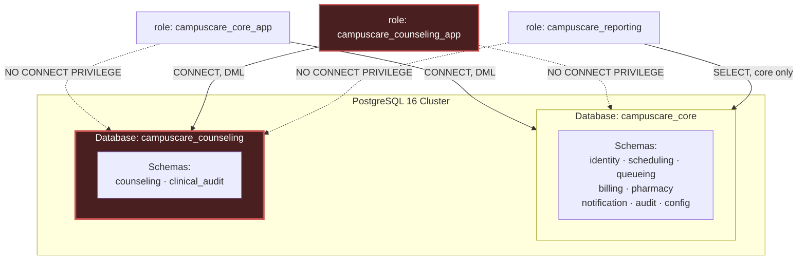
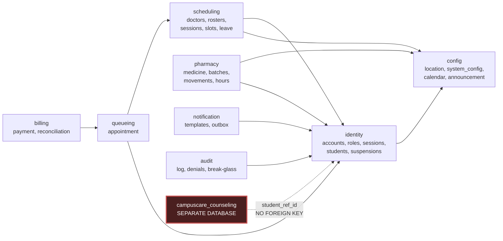
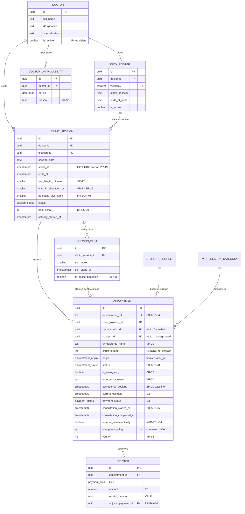
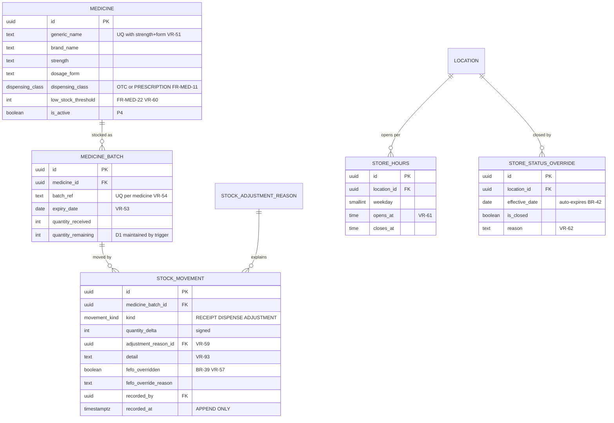
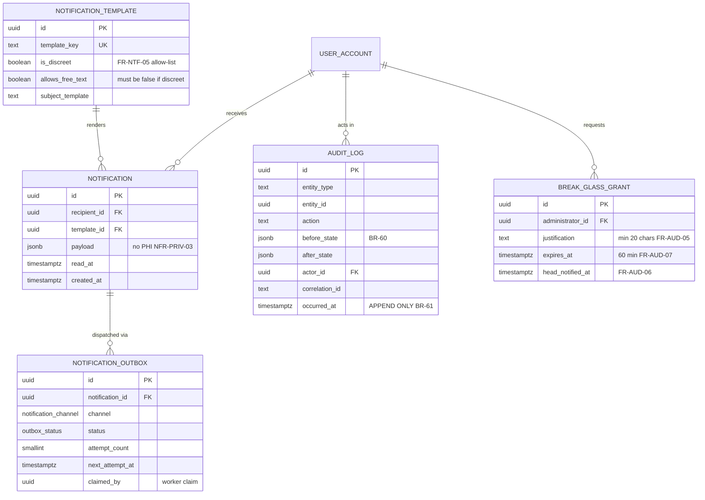

# Database Design Specification
## DIU CampusCare — PostgreSQL 16

**Document ID:** DIU-CC-DB-001
**Version:** 1.0
**Date:** 3 August 2026
**Release:** Phase 1 (MVP)
**Target:** PostgreSQL 16
**Basis:** `ARCHITECTURE.md` v1.0 (approved), `SRS.md` v1.0, `PROJECT_PLANNING.md` v1.0

**Scope:** Physical data model — entities, attributes, keys, relationships, constraints, indexes, DDL. **No API design.** No query implementation beyond what constraints and indexes require.

**Two decisions taken by the product owner before writing:**
1. Counseling is a **separate PostgreSQL database on the same cluster**, distinct roles, no cross-database foreign keys.
2. **UUIDv7 primary keys throughout**, with human-readable business keys as separate unique columns.

---

# 1. Design Principles

Eleven principles govern every decision below. Where a table deviates, the deviation is named and justified.

| # | Principle | Rationale |
|---|---|---|
| **P1** | **The database enforces structural invariants; the application enforces configurable policy** | BR-70 requires every 【A】 value to be changeable without redeployment. A `CHECK` on "max 2 active bookings" would hard-code a configurable threshold. But "an appointment cannot reference a slot in another session" is structural and belongs here |
| **P2** | **Third Normal Form by default; every denormalisation is named in §4.3** | Correctness first. The four denormalisations that exist are each justified against a specific NFR |
| **P3** | **Append-only means enforced append-only** | BR-61 and FR-MED-21 require immutability against *every* role, including administrators. Achieved with `REVOKE` plus a `BEFORE UPDATE OR DELETE` trigger that raises — belt and braces, because a future `GRANT` could undo the first |
| **P4** | **Nothing is ever hard-deleted in Phase 1** | NFR-RET-01: retain everything, delete nothing, pending OI-02. All "deletion" is a status transition |
| **P5** | **`timestamptz` everywhere; never `timestamp`** | EC-54 requires all time-sensitive decisions to use server time. `timestamptz` stores an absolute instant; `timestamp` silently loses the offset |
| **P6** | **Money is `numeric`, never `float`** | NFR-ACC-04 forbids floating-point rounding error |
| **P7** | **Optimistic concurrency via a `version` column on every mutable row** | VR-92 requires stale writes to be *rejected*, not merged |
| **P8** | **Every table scoped by location carries `location_id` from day one** | ADR-013. One location exists; the column costs 16 bytes and saves a Phase 3 migration across the whole schema |
| **P9** | **Lookup values that users configure are tables; values that are structural are enums** | Status lifecycles (FR-APT-28) are structural — an enum. Waiver reasons and visit categories are configurable — tables |
| **P10** | **The counseling database shares no foreign key with core** | ADR-001. A cross-database FK is impossible in PostgreSQL, which is precisely the property being relied upon |
| **P11** | **Every constraint traces to a numbered SRS rule** | §7 and §14 carry the mapping. A constraint with no requirement behind it is removed |

---

# 2. Physical Topology

## 2.1 Two databases, one cluster



**Why a separate database rather than a separate schema.** A schema boundary is enforced by `GRANT`, and a `GRANT` can be widened by anyone with the authority to issue one — including a well-meaning administrator debugging a production issue at 11 p.m. A database boundary additionally requires `CONNECT`, and PostgreSQL provides no mechanism for a session connected to `campuscare_core` to read a table in `campuscare_counseling`. There is no `search_path` mistake, no accidental join, and no cross-schema view that can reach it. NFR-SEC-06 asked for an access path that a defect in the general permission check cannot traverse; this is that path made physical.

**Why not a separate cluster.** CON-11 — a part-time team. One cluster is one backup job, one monitoring target, one upgrade. The residual risk (a cluster superuser compromise reaches both) is accepted and recorded in §15.

## 2.2 Roles and grants

| Role | Privileges | Deliberately denied |
|---|---|---|
| `campuscare_core_migrator` | DDL on `campuscare_core` | Any access to counseling |
| `campuscare_core_app` | `SELECT/INSERT/UPDATE` on core tables; **no `DELETE` anywhere** (P4); **no `UPDATE/DELETE` on audit or movement tables** (P3) | `CONNECT` on `campuscare_counseling` |
| `campuscare_counseling_migrator` | DDL on `campuscare_counseling` | `CONNECT` on `campuscare_core` |
| `campuscare_counseling_app` | `SELECT/INSERT/UPDATE` on counseling tables; **no `UPDATE/DELETE` on the access log** | `CONNECT` on `campuscare_core` |
| `campuscare_reporting` | `SELECT` on core operational tables and views only | Counseling entirely; audit detail; credential tables |

**Note on `campuscare_reporting`.** FR-ADM-09 and NFR-PRIV-06 require that no Phase 1 export contains counseling data. Because the reporting role cannot connect to the counseling database, this is not a filter that could be misconfigured — it is unreachable. This is ADR-001 paying its rent.

## 2.3 Extensions

| Extension | Purpose | Requirement |
|---|---|---|
| `pgcrypto` | `gen_random_uuid()` as an emergency fallback only | — |
| `citext` | Case-insensitive email uniqueness without a functional index | VR-01 |
| `btree_gist` | UUID equality inside `EXCLUDE` constraints | VR-19 |
| `pg_trgm` | Trigram GIN index for approximate medicine search | **FR-MED-02**, NFR-PERF-06 |

`pg_trgm` is not optional. FR-MED-02 requires partial *and approximate* matching across brand and generic names, and NFR-PERF-06 caps search at 2 s p95. A `LIKE '%query%'` scan over the catalogue cannot be indexed without it.

---

# 3. Conventions

| Concern | Decision | Reasoning |
|---|---|---|
| **Primary keys** | `uuid`, UUIDv7, **generated by the application**, `NOT NULL` with **no default** | PostgreSQL 16 has no native `uuidv7()` — it arrives in 18. Generating application-side avoids an extension dependency and keeps the value time-ordered for index locality. Omitting the default is deliberate: a missing ID fails loudly rather than silently inserting a scattered v4 |
| **Business keys** | Separate `text` column with `UNIQUE`, e.g. `appointment_ref = 'MED-2026-0081'` | FR-APT-04 requires a human-readable identifier. Making it the PK would couple every foreign key to a format decision |
| **Naming** | `snake_case`; tables singular; FKs `<referenced_table>_id`; indexes `ix_<table>_<cols>`; constraints `ck_/uq_/fk_/ex_<table>_<rule>` | Named constraints appear in error messages; the application maps them to SRS rule numbers |
| **Timestamps** | `timestamptz`, default `now()` where a creation time | P5 |
| **Audit columns** | `created_at`, `created_by`, `updated_at`, `updated_by`, `version` on every mutable table | BR-60, VR-92 |
| **Soft state** | `status` enum or `is_active boolean`; no `DELETE` | P4 |
| **Money** | `numeric(10,2)` | P6 |
| **Free text with a length rule** | `varchar(n)` where the SRS states a limit (VR-25: 200, VR-72: 1000, VR-79: 5000); `text` otherwise | The limit is a requirement, so it is a constraint |
| **Reason fields** | `varchar` with `CHECK (length(btrim(col)) >= 10)` | VR-93 |
| **Enums** | Native `CREATE TYPE ... AS ENUM` | Type-safe, compact, and adding a value is a cheap `ALTER TYPE` |

---

# 4. Normalization

## 4.1 Analysis

The core schema is in **Third Normal Form**, verified domain by domain.

| Form | Check | Result |
|---|---|---|
| **1NF** | Atomic values, no repeating groups | Passed. Multi-valued facts are separate tables: `user_role`, `duty_roster`, `store_hours`, `medicine_batch`. No arrays carry business meaning; `jsonb` appears only in audit payloads, which are documents by nature |
| **2NF** | No partial dependency on a composite key | Trivially satisfied — every table has a single-column surrogate PK |
| **3NF** | No transitive dependency | Passed after four deliberate exceptions (§4.3). Notably `appointment` does not carry `doctor_id`; the doctor is reached via `clinic_session`, because `doctor_id` depends on the session, not on the appointment |
| **BCNF** | Every determinant is a candidate key | Passed. Composite uniques (`session_id, serial_number`) and (`generic_name, strength, dosage_form`) are candidate keys, not determinants of non-key attributes |

## 4.2 Worked example — why `appointment` has no `doctor_id`

An appointment belongs to a session; a session belongs to a doctor. Storing `doctor_id` on `appointment` creates `appointment → session_id → doctor_id`, a transitive dependency. If a session were reassigned to a covering doctor, two rows would disagree and one would be wrong.

The cost is a join on the queue console's hot path (AD-2, NFR-PERF-04 at 1 s p95). Measured against a session of 30 appointments, that join is negligible. **Correctness wins; the denormalisation is not needed and therefore is not made.** This is the discipline that makes the four exceptions below credible.

## 4.3 The four deliberate denormalisations

| # | Denormalisation | Requirement forcing it | How divergence is prevented |
|---|---|---|---|
| **D1** | `medicine_batch.quantity_remaining` — derivable by summing `stock_movement` | NFR-PERF-06 caps search at 2 s. Summing the full movement log per item per search is O(movements), unbounded, and grows daily | Maintained by trigger inside the same transaction as the movement insert. A weekly reconciliation job compares the column against the movement sum and alerts on drift. **`stock_movement` remains the sole source of truth** (FR-MED-20) |
| **D2** | `appointment.current_estimated_time` — derivable from queue position and session pace | AD-4/NFR-PERF-05 require ≤ 30 s staleness for every waiting patient. Recomputing per read multiplies work by the number of watchers | Written only by the Estimation Engine, only on the five events of FR-APT-21. A stale value is bounded by the recalculation cadence, not by user activity |
| **D3** | `appointment.payment_status` — derivable from the `payment` ledger | FR-PAY-05 blocks the `In Consultation` transition on unpaid status. That check sits on the counter's 1 s path | Maintained by trigger on `payment` insert. The ledger is authoritative; the column is a cached projection |
| **D4** | `clinic_session.next_serial` — derivable as `MAX(serial_number) + 1` | EC-09 requires a single gap-free per-session sequence shared by booked and walk-in patients. `MAX+1` under concurrency produces duplicates or requires a table-level lock | Incremented under row lock inside the booking transaction, serialising **per session** rather than globally — exactly the isolation the architecture's §12.2 assumed. `UNIQUE(session_id, serial_number)` is the backstop |

**Rejected denormalisations**, for the record: doctor name on appointment (join is cheap); student name on appointment (join is cheap, and copying identity data widens the privacy surface); current queue position as a column (it changes on every event for every waiting row — a write amplification disaster; it is computed at read time by `ORDER BY is_emergency DESC, serial_number ASC`).

---

# 5. Entity Catalogue

## 5.1 Core database — 31 tables

| Schema | Entity | Purpose | Key requirements |
|---|---|---|---|
| **config** | `location` | Campus/center scope | ADR-013, CON-13 |
| | `system_config` | Every 【A】 value with typed range | FR-ADM-01, BR-70, VR-94 |
| | `service_calendar` | Non-service days | FR-SCH-10, BR-28 |
| | `announcement` | Dated banner | FR-ADM-04 |
| **identity** | `user_account` | All users, all roles | FR-AUTH-01…12 |
| | `role` | Role catalogue | §3.5.1 |
| | `user_role` | Role assignment (M:N) | FR-AUTH-03, BR-03 |
| | `local_credential` | Password hash — fallback auth only | FR-AUTH-08, NFR-SEC-02, OI-03 |
| | `user_session` | Server-side revocable sessions | FR-AUTH-06/07, PRM-15 |
| | `login_attempt` | Success and failure | FR-AUTH-13/14 |
| | `student_profile` | Student-specific attributes | BR-01, VR-03 |
| | `booking_suspension` | No-show throttle | BR-15 |
| **scheduling** | `doctor` | Doctor profile | FR-SCH-01 |
| | `duty_roster` | Recurring weekly pattern | FR-SCH-02 |
| | `clinic_session` | A materialised session on a date | FR-SCH-03/05 |
| | `session_slot` | A bookable subdivision | FR-SCH-05, **EC-01** |
| | `doctor_unavailability` | Leave | FR-SCH-06 |
| **queueing** | `visit_reason_category` | Configurable categories | FR-APT-06, SI-15 |
| | `appointment` | **Unified queue entry — booked and walk-in** | FR-APT-01…42 |
| **billing** | `fee_waiver_reason` | Configurable waiver reasons | VR-42 |
| | `payment` | Immutable financial ledger | FR-PAY-03/10 |
| | `daily_reconciliation` | Cash count vs system | FR-PAY-09, BR-34 |
| **pharmacy** | `medicine` | Catalogue | FR-MED-10/11 |
| | `medicine_batch` | Batch with expiry | FR-MED-13 |
| | `stock_adjustment_reason` | Configurable reasons | VR-59 |
| | `stock_movement` | **Append-only movement ledger** | FR-MED-20/21 |
| | `store_hours` | Scheduled weekly hours | FR-MED-25 |
| | `store_status_override` | Manual, auto-expiring | FR-MED-27, BR-42 |
| **notification** | `notification_template` | Registry with discreet flag | FR-NTF-05 |
| | `notification` | Per-recipient record | FR-NTF-01/07 |
| | `notification_outbox` | Transactional outbox | ADR-006 |
| **audit** | `audit_log` | **Append-only state changes** | FR-AUD-01/02, BR-60/61 |
| | `authz_denial` | Denied authorisation attempts | PRM-12 |
| | `data_access_log` | Access to another user's data | FR-AUD-03 |
| | `break_glass_grant` | Emergency access grants | FR-AUD-05…07 |

## 5.2 Counseling database — 11 tables

| Schema | Entity | Purpose | Key requirements |
|---|---|---|---|
| **counseling** | `clinical_roster` | **Independent CNP registry — ADR-012** | NFR-SEC-06 |
| | `counseling_category` | Configurable categories | VR-70 |
| | `counseling_config` | Vault-local configuration | Self-sufficiency |
| | `crisis_acknowledgement` | Proof the interstitial was shown | **VR-75**, FR-CNS-06 |
| | `counseling_request` | Intake | FR-CNS-07…13 |
| | `counseling_case` | Case lifecycle | FR-CSE-10 |
| | `case_priority_change` | Every priority decision | FR-CSE-06, BR-45 |
| | `case_status_transition` | Lifecycle trail | FR-CSE-11 |
| | `case_session` | Scheduled and completed sessions | FR-CNS-14, FR-CSE-20 |
| | `case_note` | Confidential notes | FR-CSE-12/13 |
| | `escalation_invocation` | Escalation record | FR-CSE-18 |
| **clinical_audit** | `counseling_access_log` | **Every read** | FR-CSE-15/16, BR-51 |

---

# 6. ER Diagrams

## 6.1 Domain map



## 6.2 Identity

```mermaid
erDiagram
    LOCATION ||--o{ USER_ACCOUNT : "scopes"
    USER_ACCOUNT ||--o| LOCAL_CREDENTIAL : "may have"
    USER_ACCOUNT ||--o| STUDENT_PROFILE : "may have"
    USER_ACCOUNT ||--o{ USER_ROLE : "holds"
    ROLE ||--o{ USER_ROLE : "granted via"
    USER_ACCOUNT ||--o{ USER_SESSION : "opens"
    USER_ACCOUNT ||--o{ LOGIN_ATTEMPT : "generates"
    STUDENT_PROFILE ||--o{ BOOKING_SUSPENSION : "incurs"

    USER_ACCOUNT {
        uuid id PK
        citext email UK "VR-01"
        text external_subject UK "SSO subject, nullable"
        text full_name
        account_status status "FR-AUTH-10"
        uuid location_id FK
        int version "VR-92"
    }
    LOCAL_CREDENTIAL {
        uuid user_account_id PK-FK
        text password_hash "NFR-SEC-02"
        smallint failed_attempts "FR-AUTH-14"
        timestamptz locked_until
    }
    STUDENT_PROFILE {
        uuid user_account_id PK-FK
        text student_ref UK "VR-03"
        text programme
        boolean is_enrolled "BR-01"
    }
    ROLE {
        uuid id PK
        text code UK "STU DOC MCS STO CNP ADM"
    }
    USER_ROLE {
        uuid id PK
        uuid user_account_id FK
        uuid role_id FK
        uuid granted_by FK "PRM-13"
    }
    USER_SESSION {
        uuid id PK
        uuid user_account_id FK
        timestamptz expires_at "FR-AUTH-06"
        timestamptz revoked_at "NFR-SEC-08"
    }
    BOOKING_SUSPENSION {
        uuid id PK
        uuid student_id FK
        timestamptz suspended_until "BR-15"
        smallint triggering_no_show_count
    }
```

## 6.3 Scheduling and queue — the core domain



## 6.4 Pharmacy



## 6.5 Notification and audit



## 6.6 Counseling database

```mermaid
erDiagram
    COUNSELING_CATEGORY ||--o{ COUNSELING_REQUEST : "categorises"
    CRISIS_ACKNOWLEDGEMENT ||--o| COUNSELING_REQUEST : "gates VR-75"
    COUNSELING_REQUEST ||--o| COUNSELING_CASE : "becomes"
    COUNSELING_CASE ||--o{ CASE_PRIORITY_CHANGE : "reprioritised by"
    COUNSELING_CASE ||--o{ CASE_STATUS_TRANSITION : "progresses through"
    COUNSELING_CASE ||--o{ CASE_SESSION : "schedules"
    COUNSELING_CASE ||--o{ CASE_NOTE : "documented by"
    COUNSELING_CASE ||--o{ ESCALATION_INVOCATION : "escalated by"
    CLINICAL_ROSTER ||--o{ CASE_NOTE : "authored by"
    COUNSELING_CASE ||--o{ COUNSELING_ACCESS_LOG : "read recorded in"

    CLINICAL_ROSTER {
        uuid id PK
        uuid user_ref_id UK "NO FK - core is another database"
        text display_name
        boolean is_active "ADR-012 independent authority"
        uuid added_by
    }
    COUNSELING_REQUEST {
        uuid id PK
        uuid student_ref_id "NO FK - P10"
        uuid category_id FK
        self_urgency self_reported_urgency "input only BR-45"
        varchar note "max 1000 VR-72"
        jsonb preferred_windows "VR-73"
        gender_pref counselor_gender_preference "SI-7"
        request_status status
        timestamptz acknowledged_at "within 1 min BR-46"
        timestamptz triage_due_at "FR-CSE-07"
    }
    CRISIS_ACKNOWLEDGEMENT {
        uuid id PK
        uuid student_ref_id
        self_urgency urgency_shown
        timestamptz acknowledged_at
        text protocol_version "which R3 revision was shown"
    }
    COUNSELING_CASE {
        uuid id PK
        uuid counseling_request_id FK UK
        case_priority final_priority "counselor only BR-45"
        boolean priority_is_provisional "FR-CSE-04"
        case_status status "FR-CSE-10"
        timestamptz last_activity_at "90-day auto-close FR-CSE-21"
    }
    CASE_PRIORITY_CHANGE {
        uuid id PK
        uuid case_id FK
        case_priority from_priority
        case_priority to_priority
        varchar reason "min 10 VR-76"
        uuid changed_by FK "clinical_roster"
    }
    CASE_NOTE {
        uuid id PK
        uuid case_id FK
        varchar body "max 5000 VR-79"
        uuid authored_by FK "clinical_roster only"
    }
    CASE_SESSION {
        uuid id PK
        uuid case_id FK
        timestamptz scheduled_for "VR-77"
        session_outcome outcome "MISSED carries no penalty FR-CNS-17"
    }
    ESCALATION_INVOCATION {
        uuid id PK
        uuid case_id FK
        uuid invoked_by FK "human only BR-67"
        text protocol_version
    }
    COUNSELING_ACCESS_LOG {
        uuid id PK
        uuid case_id
        uuid accessor_ref_id
        text access_kind
        timestamptz accessed_at "APPEND ONLY FR-CSE-15"
    }
```

---

# 7. Constraint Catalogue

Every constraint expressible in PostgreSQL, traced to its rule. Rules absent from this table are enforced in the application under **P1**, and §7.3 says which and why.

## 7.1 Structural constraints

| Constraint | Table | Rule | Mechanism |
|---|---|---|---|
| `uq_user_account_email` | user_account | VR-01 | `UNIQUE` on `citext` |
| `uq_student_profile_ref` | student_profile | VR-03 | `UNIQUE` |
| `ck_clinic_session_time_order` | clinic_session | VR-10 | `CHECK (ends_at > starts_at)` |
| `ck_clinic_session_slot_length` | clinic_session | VR-12 | `CHECK (slot_length_minutes BETWEEN 5 AND 60)` |
| `ck_clinic_session_walkin_pct` | clinic_session | VR-13 | `CHECK (walk_in_allocation_pct BETWEEN 0 AND 99)` |
| `ex_clinic_session_no_overlap` | clinic_session | **VR-19** | `EXCLUDE USING gist` on doctor + time range |
| `uq_appointment_slot_active` | appointment | **EC-01** | **Partial unique index** on `session_slot_id` where status is active |
| `uq_appointment_session_serial` | appointment | EC-09 | `UNIQUE (clinic_session_id, serial_number)` |
| `uq_appointment_student_doctor_day` | appointment | **BR-11** | Partial unique index on student + session + active status |
| `ck_appointment_subject` | appointment | VR-29 | `CHECK (student_id IS NOT NULL OR unregistered_name IS NOT NULL)` |
| `ck_appointment_walkin_no_slot` | appointment | FR-APT-35 | `CHECK (origin <> 'walk_in' OR session_slot_id IS NULL)` |
| `ck_appointment_emergency_reason` | appointment | VR-30 | `CHECK (NOT is_emergency OR length(btrim(emergency_reason)) >= 10)` |
| `ck_appointment_reason_length` | appointment | VR-25 | `varchar(200)` |
| `uq_payment_receipt_per_day` | payment | **VR-41** | Partial unique index on `(location_id, receipt_number, recorded_on)` |
| `ck_payment_amount` | payment | VR-40 | `CHECK (amount >= 0)`, `numeric(10,2)` |
| `uq_medicine_natural_key` | medicine | **VR-51** | `UNIQUE (generic_name, strength, dosage_form)` |
| `ck_medicine_threshold` | medicine | VR-60 | `CHECK (low_stock_threshold >= 0)` |
| `uq_batch_ref_per_medicine` | medicine_batch | VR-54 | `UNIQUE (medicine_id, batch_ref)` |
| `ck_batch_quantity_received` | medicine_batch | VR-52 | `CHECK (quantity_received > 0)` |
| `ck_batch_quantity_remaining` | medicine_batch | FR-MED-14 | `CHECK (quantity_remaining BETWEEN 0 AND quantity_received)` |
| `ck_movement_delta_nonzero` | stock_movement | VR-59 | `CHECK (quantity_delta <> 0)` |
| `ck_movement_adjustment_reason` | stock_movement | VR-59 | `CHECK (kind <> 'ADJUSTMENT' OR (reason_id IS NOT NULL AND length(btrim(detail)) >= 10))` |
| `ck_movement_fefo_override` | stock_movement | VR-57 | `CHECK (NOT fefo_overridden OR length(btrim(fefo_override_reason)) >= 10)` |
| `ck_store_hours_order` | store_hours | VR-61 | `CHECK (closes_at > opens_at)` |
| `uq_store_hours_weekday` | store_hours | VR-61 | `UNIQUE (location_id, weekday)` — "at most one interval in Phase 1" |
| `ck_override_reason` | store_status_override | VR-62 | `CHECK (length(btrim(reason)) >= 10)` |
| `ck_template_discreet_no_freetext` | notification_template | **FR-NTF-05** | `CHECK (NOT is_discreet OR NOT allows_free_text)` |
| `ck_break_glass_justification` | break_glass_grant | FR-AUD-05 | `CHECK (length(btrim(justification)) >= 20)` |
| `ck_break_glass_duration` | break_glass_grant | FR-AUD-07 | `CHECK (expires_at <= granted_at + interval '60 minutes')` |
| `ck_request_note_length` | counseling_request | VR-72 | `varchar(1000)` |
| `ck_priority_change_reason` | case_priority_change | VR-76 | `CHECK (length(btrim(reason)) >= 10)` |
| `ck_note_length` | case_note | VR-79 | `varchar(5000)` |

## 7.2 Three constraints worth explaining

**`uq_appointment_slot_active` — EC-01, exactly one winner.**
```sql
CREATE UNIQUE INDEX uq_appointment_slot_active
    ON queueing.appointment (session_slot_id)
    WHERE session_slot_id IS NOT NULL
      AND status IN ('booked','checked_in','waiting','in_consultation','completed');
```
Two students committing simultaneously both attempt the insert; PostgreSQL's unique index guarantees one succeeds and one receives a violation, which the application maps to a `ConflictError` and the "that slot was just taken" message. **No application-level locking, no race window.** The partial predicate also delivers BR-21 for free: cancelling sets a status outside the set, and the slot becomes claimable again with no cleanup step.

**`ex_clinic_session_no_overlap` — VR-19 without a trigger.**
```sql
CONSTRAINT ex_clinic_session_no_overlap EXCLUDE USING gist (
    doctor_id WITH =,
    tstzrange(starts_at, ends_at, '[)') WITH &&
) WHERE (status <> 'cancelled')
```
An overlap check written as a trigger is a `SELECT` followed by an `INSERT` — a race under concurrency. An `EXCLUDE` constraint is evaluated by the index and is correct under any isolation level. This requires `btree_gist` for UUID equality.

**`ck_template_discreet_no_freetext` — FR-NTF-05 at the storage layer.**
A discreet template that accepts free text can leak counseling context, because free text is by definition unvalidatable. The Content Policy Guard (ADR-007) enforces this at dispatch; this constraint enforces it at definition, so a badly-authored template cannot be saved in the first place. **Two layers, one requirement** — appropriate for a Critical-priority privacy rule.

## 7.3 What is deliberately *not* a database constraint

Under **P1**, rules whose thresholds are configurable (BR-70) live in the application. Encoding them here would mean a `CHECK` referencing `system_config`, which is impossible in PostgreSQL and undesirable anyway.

| Rule | Why not in the database | Where enforced |
|---|---|---|
| BR-11 — max 2 active bookings | The limit is 【A: OI-08】, configurable | `AppointmentService` |
| BR-15 — 3 no-shows in 30 days | All three numbers configurable 【A: OI-10】 | `SuspensionService` |
| BR-12 — 2-hour cancellation cutoff | Configurable 【A: OI-09】 | `AppointmentService` |
| BR-14 — 20-minute grace | Configurable 【A: OI-10】 | `QueueService` |
| BR-16 — walk-in allocation | Stored per session, but overrun is **permitted** by FR-APT-42/EC-10 — a constraint would wrongly refuse care | `WalkInService` |
| BR-36 — status band thresholds | Per-item and configurable | Computed in the availability view |
| BR-40 — expired batches unavailable | Depends on `current_date`, which is not immutable and cannot appear in a `CHECK` | Partial index + view predicate + `DispenseStock` handler |
| VR-75 — crisis interstitial shown | Requires cross-table temporal reasoning | `IntakeService`, backed by `crisis_acknowledgement` |

**BR-40 deserves a note.** `CHECK (expiry_date > current_date)` is invalid — `current_date` is not immutable, and even if PostgreSQL allowed it, the constraint would be evaluated only on write, so a row valid yesterday would remain valid today. Expiry exclusion is therefore enforced in three places: the availability view predicate, the FEFO selector's `WHERE`, and an explicit guard in the dispense handler (FR-MED-18, which permits *no* override). VR-53 — expiry must be in the future *at time of receipt* — **is** expressible, and is enforced by trigger at insert.

---

# 8. Index Strategy

Every index below names the query it serves and the NFR that requires it. There are no speculative indexes — each one costs write throughput on tables the counter writes to during a rush.

## 8.1 Core indexes

| Index | Table | Serves | Requirement |
|---|---|---|---|
| `ix_appointment_session_queue` on `(clinic_session_id, is_emergency DESC, serial_number)` `WHERE status IN (waiting, checked_in, booked)` | appointment | **The queue console's primary read.** Partial, so it holds only live rows | **NFR-PERF-04** |
| `ix_appointment_student_active` on `(student_id, status)` `WHERE status IN (booked, checked_in)` | appointment | "My upcoming appointments"; BR-11 count check | FR-DASH-02 |
| `ix_appointment_session_date` on `(clinic_session_id)` | appointment | Session roll-up, no-show sweep | FR-APT-33 |
| `ix_appointment_completed_duration` on `(clinic_session_id, consultation_completed_at)` `WHERE consultation_completed_at IS NOT NULL` | appointment | Estimation rolling mean | **FR-APT-22** |
| `ix_clinic_session_date_location` on `(location_id, session_date, status)` | clinic_session | Public availability projection | **NFR-PERF-01** |
| `ix_session_slot_bookable` on `(clinic_session_id, slot_starts_at)` `WHERE is_online_bookable` | session_slot | Slot listing during the release burst | NFR-PERF-07 |
| `ix_medicine_search_trgm` **GIN** on `(generic_name gin_trgm_ops, brand_name gin_trgm_ops)` | medicine | **Approximate brand↔generic search** | **FR-MED-02, NFR-PERF-06** |
| `ix_batch_fefo` on `(medicine_id, expiry_date)` `WHERE quantity_remaining > 0` | medicine_batch | FEFO selection; status band | **BR-39** |
| `ix_batch_expiry_sweep` on `(expiry_date)` `WHERE quantity_remaining > 0` | medicine_batch | The 00:01 daily recalculation | FR-MED-17 |
| `ix_movement_batch_time` on `(medicine_batch_id, recorded_at DESC)` | stock_movement | Movement history; D1 reconciliation | FR-MED-20 |
| `ix_outbox_pending` on `(next_attempt_at)` `WHERE status = 'pending'` | notification_outbox | Worker claim poll — runs constantly | ADR-006 |
| `ix_notification_recipient_unread` on `(recipient_id, created_at DESC)` `WHERE read_at IS NULL` | notification | Notification centre badge | FR-NTF-01 |
| `ix_audit_entity` on `(entity_type, entity_id, occurred_at DESC)` | audit_log | "What happened to this appointment?" | FR-ADM-05 |
| `ix_audit_actor_time` on `(actor_id, occurred_at DESC)` | audit_log | "What did this user do?" | FR-ADM-05 |
| `ix_session_active` on `(user_account_id)` `WHERE revoked_at IS NULL` | user_session | Session validation on every request | PRM-15 |
| `ix_suspension_active` on `(student_id, suspended_until)` `WHERE suspended_until > now()` — **see note** | booking_suspension | BR-15 check on every booking | BR-15 |

**Note on the last row.** A predicate containing `now()` is not immutable and PostgreSQL rejects it in an index. The index is therefore `ON (student_id, suspended_until DESC)` and the recency filter is applied in the query. Recorded here because the naïve form is a common and instructive mistake.

## 8.2 Counseling indexes

| Index | Table | Serves | Requirement |
|---|---|---|---|
| `ix_case_triage_queue` on `(final_priority DESC, created_at)` `WHERE status IN (requested, under_review)` | counseling_case | **The triage queue's exact sort order** | **FR-CSE-01** |
| `ix_request_sla_breach` on `(triage_due_at)` `WHERE status = 'requested'` | counseling_request | Daily SLA breach sweep | FR-CSE-09 |
| `ix_request_student_active` on `(student_ref_id)` `WHERE status IN (requested, under_review)` | counseling_request | VR-74 duplicate check | VR-74 |
| `ix_case_inactivity` on `(last_activity_at)` `WHERE status NOT IN (closed, withdrawn)` | counseling_case | 90-day auto-close sweep | FR-CSE-21 |
| `ix_access_log_case` on `(case_id, accessed_at DESC)` | counseling_access_log | "Who read this case?" | **FR-CSE-15** |
| `ix_roster_active` on `(user_ref_id)` `WHERE is_active` | clinical_roster | **Authorisation check on every vault request** | **ADR-012** |

`ix_roster_active` is on the hot path of every single counseling request — the independent authorisation check of ADR-012 runs before anything else. It must be a single index lookup.

## 8.3 Indexes deliberately omitted

| Not indexed | Why |
|---|---|
| `appointment.appointment_ref` beyond its `UNIQUE` | The unique constraint already provides the index; nothing looks it up by prefix |
| `audit_log.after_state` (jsonb GIN) | No Phase 1 query searches audit payload content. A GIN index on a high-write append-only table would cost throughput for no reader |
| Every foreign key automatically | PostgreSQL does **not** auto-index FKs. Indexed here only where a query or a cascade needs it — indexing all 40 would slow writes on the counter's critical path for no benefit |
| `medicine.brand_name` btree | The trigram GIN index serves both exact and approximate lookups |

---

# 9. SQL DDL — Core Database

```sql
-- =====================================================================
-- DIU CampusCare — campuscare_core
-- PostgreSQL 16
-- =====================================================================

CREATE DATABASE campuscare_core
    ENCODING 'UTF8' LC_COLLATE 'en_US.UTF-8' LC_CTYPE 'en_US.UTF-8';

\connect campuscare_core

CREATE EXTENSION IF NOT EXISTS pgcrypto;
CREATE EXTENSION IF NOT EXISTS citext;
CREATE EXTENSION IF NOT EXISTS btree_gist;
CREATE EXTENSION IF NOT EXISTS pg_trgm;

CREATE SCHEMA config;
CREATE SCHEMA identity;
CREATE SCHEMA scheduling;
CREATE SCHEMA queueing;
CREATE SCHEMA billing;
CREATE SCHEMA pharmacy;
CREATE SCHEMA notification;
CREATE SCHEMA audit;

SET timezone = 'Asia/Dhaka';   -- BST (UTC+06); §2.4 of the SRS

-- ---------------------------------------------------------------------
-- ENUM TYPES  (P9: structural lifecycles are enums)
-- ---------------------------------------------------------------------
CREATE TYPE identity.account_status  AS ENUM ('pending','active','suspended','deactivated');            -- FR-AUTH-10
CREATE TYPE scheduling.session_status AS ENUM ('scheduled','started','interrupted','completed','cancelled'); -- EC-04
CREATE TYPE queueing.appointment_origin AS ENUM ('booked','walk_in');                                   -- FR-APT-19
CREATE TYPE queueing.appointment_status AS ENUM (
    'booked','checked_in','waiting','in_consultation','completed',
    'cancelled','late_cancellation','no_show','expired');                                               -- FR-APT-28
CREATE TYPE billing.payment_state AS ENUM ('unpaid','paid','waived');                                   -- FR-PAY-02
CREATE TYPE billing.payment_kind  AS ENUM ('counter_payment','waiver','adjustment');                    -- FR-PAY-10
CREATE TYPE pharmacy.dispensing_class AS ENUM ('otc','prescription_only');                              -- FR-MED-11
CREATE TYPE pharmacy.movement_kind AS ENUM ('receipt','dispense','adjustment');                         -- FR-MED-20
CREATE TYPE notification.channel AS ENUM ('in_app','email');                                            -- FR-NTF-03
CREATE TYPE notification.outbox_status AS ENUM ('pending','claimed','delivered','failed','skipped');

-- =====================================================================
-- SCHEMA: config
-- =====================================================================

-- ADR-013: every scoped entity carries location_id from day one, even
-- though exactly one row will exist in Phase 1. Retro-fitting this
-- dimension in Phase 3 would touch the entire schema.
CREATE TABLE config.location (
    id              uuid PRIMARY KEY,
    code            text NOT NULL UNIQUE,
    name            text NOT NULL,
    is_active       boolean NOT NULL DEFAULT true,
    created_at      timestamptz NOT NULL DEFAULT now(),
    updated_at      timestamptz NOT NULL DEFAULT now(),
    version         integer NOT NULL DEFAULT 1
);

-- FR-ADM-01 / BR-70: every 【A】 value lives here, never in code.
-- min_value / max_value implement VR-94 (range rejected at save, not at use).
CREATE TABLE config.system_config (
    id              uuid PRIMARY KEY,
    config_key      text NOT NULL UNIQUE,
    value_type      text NOT NULL CHECK (value_type IN ('integer','decimal','boolean','text','duration')),
    value_text      text NOT NULL,
    min_value       numeric,
    max_value       numeric,
    description     text NOT NULL,
    updated_by      uuid,
    updated_at      timestamptz NOT NULL DEFAULT now(),
    version         integer NOT NULL DEFAULT 1,
    CONSTRAINT ck_system_config_range
        CHECK (min_value IS NULL OR max_value IS NULL OR max_value >= min_value)
);

-- FR-SCH-10 / BR-28. reason is surfaced to students (FR-SCH-11).
CREATE TABLE config.service_calendar (
    id              uuid PRIMARY KEY,
    location_id     uuid NOT NULL REFERENCES config.location(id),
    calendar_date   date NOT NULL,
    is_service_day  boolean NOT NULL DEFAULT false,
    reason          text NOT NULL,
    created_by      uuid NOT NULL,
    created_at      timestamptz NOT NULL DEFAULT now(),
    CONSTRAINT uq_service_calendar_date UNIQUE (location_id, calendar_date)
);

CREATE TABLE config.announcement (                          -- FR-ADM-04
    id              uuid PRIMARY KEY,
    location_id     uuid REFERENCES config.location(id),
    body            varchar(500) NOT NULL,
    starts_at       timestamptz NOT NULL,
    ends_at         timestamptz NOT NULL,
    created_by      uuid NOT NULL,
    created_at      timestamptz NOT NULL DEFAULT now(),
    CONSTRAINT ck_announcement_period CHECK (ends_at > starts_at)
);

-- =====================================================================
-- SCHEMA: identity
-- =====================================================================

CREATE TABLE identity.user_account (
    id                  uuid PRIMARY KEY,
    email               citext NOT NULL UNIQUE,             -- VR-01
    external_subject    text UNIQUE,                        -- SSO subject; NULL for local accounts (OI-03)
    full_name           text NOT NULL,
    status              identity.account_status NOT NULL DEFAULT 'pending',
    location_id         uuid REFERENCES config.location(id),
    created_by          uuid,
    created_at          timestamptz NOT NULL DEFAULT now(),
    updated_at          timestamptz NOT NULL DEFAULT now(),
    version             integer NOT NULL DEFAULT 1
);

-- Separated from user_account so that SSO users have NO row here at all.
-- A nullable password_hash on user_account would leave a column that is
-- meaningless for most rows and tempting to populate.
CREATE TABLE identity.local_credential (
    user_account_id     uuid PRIMARY KEY REFERENCES identity.user_account(id),
    password_hash       text NOT NULL,                      -- NFR-SEC-02: argon2id/bcrypt, never reversible
    failed_attempts     smallint NOT NULL DEFAULT 0,        -- FR-AUTH-14
    locked_until        timestamptz,
    password_changed_at timestamptz NOT NULL DEFAULT now(),
    version             integer NOT NULL DEFAULT 1,
    CONSTRAINT ck_local_credential_attempts CHECK (failed_attempts >= 0)
);

CREATE TABLE identity.role (
    id          uuid PRIMARY KEY,
    code        text NOT NULL UNIQUE
                CHECK (code IN ('STU','DOC','MCS','STO','CNP','ADM')),   -- SRS §3.5.1
    name        text NOT NULL
);

-- BR-03: a user may hold multiple roles. Counseling access is NOT granted
-- by this table alone — the vault keeps its own roster (ADR-012).
CREATE TABLE identity.user_role (
    id              uuid PRIMARY KEY,
    user_account_id uuid NOT NULL REFERENCES identity.user_account(id),
    role_id         uuid NOT NULL REFERENCES identity.role(id),
    granted_by      uuid NOT NULL REFERENCES identity.user_account(id),  -- PRM-13
    granted_at      timestamptz NOT NULL DEFAULT now(),
    revoked_at      timestamptz,                                          -- P4: revoke, never delete
    CONSTRAINT uq_user_role UNIQUE (user_account_id, role_id)
);

-- Server-side sessions: PRM-15 requires a permission REDUCTION to take
-- effect without re-authentication. A self-contained token cannot be
-- revoked mid-flight, so session state is stored.
CREATE TABLE identity.user_session (
    id                  uuid PRIMARY KEY,
    user_account_id     uuid NOT NULL REFERENCES identity.user_account(id),
    issued_at           timestamptz NOT NULL DEFAULT now(),
    expires_at          timestamptz NOT NULL,               -- FR-AUTH-06
    last_seen_at        timestamptz NOT NULL DEFAULT now(),
    revoked_at          timestamptz,                        -- NFR-SEC-08
    client_fingerprint  text,
    CONSTRAINT ck_user_session_expiry CHECK (expires_at > issued_at)
);

CREATE TABLE identity.login_attempt (                       -- FR-AUTH-13
    id              uuid PRIMARY KEY,
    email_attempted citext NOT NULL,
    user_account_id uuid REFERENCES identity.user_account(id),
    succeeded       boolean NOT NULL,
    source_address  inet,
    attempted_at    timestamptz NOT NULL DEFAULT now()
);

CREATE TABLE identity.student_profile (
    user_account_id uuid PRIMARY KEY REFERENCES identity.user_account(id),
    student_ref     text NOT NULL UNIQUE,                   -- VR-03
    programme       text,
    is_enrolled     boolean NOT NULL DEFAULT true,          -- BR-01
    version         integer NOT NULL DEFAULT 1
);

-- BR-15. Note: this suspends ONLINE BOOKING only. Nothing in the schema
-- references it from the walk-in path — FR-APT-38 requires walk-in
-- registration to succeed regardless.
CREATE TABLE identity.booking_suspension (
    id                  uuid PRIMARY KEY,
    student_id          uuid NOT NULL REFERENCES identity.student_profile(user_account_id),
    suspended_from      timestamptz NOT NULL DEFAULT now(),
    suspended_until     timestamptz NOT NULL,
    no_show_count       smallint NOT NULL,
    lifted_at           timestamptz,
    lifted_by           uuid REFERENCES identity.user_account(id),
    lift_reason         varchar(500),
    created_at          timestamptz NOT NULL DEFAULT now(),
    CONSTRAINT ck_suspension_period CHECK (suspended_until > suspended_from)
);

-- =====================================================================
-- SCHEMA: scheduling
-- =====================================================================

CREATE TABLE scheduling.doctor (
    id                  uuid PRIMARY KEY,
    user_account_id     uuid UNIQUE REFERENCES identity.user_account(id),  -- nullable: CON-02, doctors need no login
    full_name           text NOT NULL,
    designation         text,
    specialisation      text,
    photo_url           text,
    location_id         uuid NOT NULL REFERENCES config.location(id),
    is_active           boolean NOT NULL DEFAULT true,      -- EC-20: deactivate, never delete
    created_at          timestamptz NOT NULL DEFAULT now(),
    updated_at          timestamptz NOT NULL DEFAULT now(),
    version             integer NOT NULL DEFAULT 1
);

-- FR-SCH-02. Local wall-clock times: a roster is "every Sunday 09:00",
-- a recurring intention rather than an absolute instant.
CREATE TABLE scheduling.duty_roster (
    id              uuid PRIMARY KEY,
    doctor_id       uuid NOT NULL REFERENCES scheduling.doctor(id),
    weekday         smallint NOT NULL CHECK (weekday BETWEEN 0 AND 6),
    starts_at_local time NOT NULL,
    ends_at_local   time NOT NULL,
    effective_from  date NOT NULL,
    effective_to    date,
    is_active       boolean NOT NULL DEFAULT true,
    created_by      uuid NOT NULL,
    created_at      timestamptz NOT NULL DEFAULT now(),
    version         integer NOT NULL DEFAULT 1,
    CONSTRAINT ck_roster_time_order CHECK (ends_at_local > starts_at_local),
    CONSTRAINT ck_roster_effective  CHECK (effective_to IS NULL OR effective_to >= effective_from)
);

-- A session is materialised (not computed) because EC-01 needs slot rows
-- to claim, and because FR-SCH-03 overrides must be storable.
--
-- session_date is a stored column rather than GENERATED: converting
-- timestamptz to a local date requires AT TIME ZONE, which is STABLE and
-- therefore not permitted in a generated column. The application sets it.
CREATE TABLE scheduling.clinic_session (
    id                      uuid PRIMARY KEY,
    doctor_id               uuid NOT NULL REFERENCES scheduling.doctor(id),
    location_id             uuid NOT NULL REFERENCES config.location(id),
    duty_roster_id          uuid REFERENCES scheduling.duty_roster(id),   -- NULL when created as an override
    session_date            date NOT NULL,
    starts_at               timestamptz NOT NULL,
    ends_at                 timestamptz NOT NULL,
    slot_length_minutes     smallint NOT NULL,                            -- 【A: OI-05】
    walk_in_allocation_pct  smallint NOT NULL,                            -- 【A: OI-06】 BR-16
    total_slot_count        smallint NOT NULL,
    bookable_slot_count     smallint NOT NULL,                            -- FR-SCH-05
    status                  scheduling.session_status NOT NULL DEFAULT 'scheduled',
    next_serial             integer NOT NULL DEFAULT 1,                   -- D4, EC-09
    actually_started_at     timestamptz,                                  -- EC-02
    actually_ended_at       timestamptz,
    change_reason           varchar(500),                                 -- BR-29
    created_by              uuid NOT NULL,
    created_at              timestamptz NOT NULL DEFAULT now(),
    updated_at              timestamptz NOT NULL DEFAULT now(),
    version                 integer NOT NULL DEFAULT 1,

    CONSTRAINT ck_session_time_order   CHECK (ends_at > starts_at),                       -- VR-10
    CONSTRAINT ck_session_slot_length  CHECK (slot_length_minutes BETWEEN 5 AND 60),      -- VR-12
    CONSTRAINT ck_session_walkin_pct   CHECK (walk_in_allocation_pct BETWEEN 0 AND 99),   -- VR-13
    CONSTRAINT ck_session_bookable     CHECK (bookable_slot_count BETWEEN 0 AND total_slot_count),
    CONSTRAINT ck_session_next_serial  CHECK (next_serial >= 1),

    -- VR-19: no two sessions for one doctor may overlap. An EXCLUDE
    -- constraint is race-free; a trigger doing SELECT-then-INSERT is not.
    CONSTRAINT ex_session_no_overlap EXCLUDE USING gist (
        doctor_id WITH =,
        tstzrange(starts_at, ends_at, '[)') WITH &&
    ) WHERE (status <> 'cancelled')
);

CREATE TABLE scheduling.session_slot (
    id                  uuid PRIMARY KEY,
    clinic_session_id   uuid NOT NULL REFERENCES scheduling.clinic_session(id),
    slot_index          smallint NOT NULL,
    slot_starts_at      timestamptz NOT NULL,
    is_online_bookable  boolean NOT NULL,                   -- false for the walk-in allocation (BR-16)
    CONSTRAINT uq_session_slot_index UNIQUE (clinic_session_id, slot_index)
);

CREATE TABLE scheduling.doctor_unavailability (             -- FR-SCH-06
    id              uuid PRIMARY KEY,
    doctor_id       uuid NOT NULL REFERENCES scheduling.doctor(id),
    period          daterange NOT NULL,
    reason          varchar(500) NOT NULL,
    created_by      uuid NOT NULL,
    created_at      timestamptz NOT NULL DEFAULT now(),
    CONSTRAINT ck_unavailability_reason CHECK (length(btrim(reason)) >= 10),   -- VR-93
    CONSTRAINT ex_unavailability_no_overlap EXCLUDE USING gist (
        doctor_id WITH =, period WITH &&
    )
);

-- =====================================================================
-- SCHEMA: queueing
-- =====================================================================

CREATE TABLE queueing.visit_reason_category (               -- FR-APT-06, SI-15
    id          uuid PRIMARY KEY,
    code        text NOT NULL UNIQUE,
    label       text NOT NULL,
    is_active   boolean NOT NULL DEFAULT true,
    sort_order  smallint NOT NULL DEFAULT 0
);

-- THE UNIFIED QUEUE ENTRY.
--
-- One table holds both booked appointments and walk-ins because FR-APT-19
-- and BR-18 mandate a single ordered queue with one serial sequence
-- (EC-09). Two tables would require a UNION on the console's hot path and
-- would make the shared serial sequence unenforceable.
--
-- Note the ABSENCE of doctor_id: it is reachable via clinic_session, and
-- duplicating it would create a transitive dependency (§4.2).
CREATE TABLE queueing.appointment (
    id                          uuid PRIMARY KEY,
    appointment_ref             text NOT NULL UNIQUE,       -- FR-APT-04, 'MED-2026-0081'
    clinic_session_id           uuid NOT NULL REFERENCES scheduling.clinic_session(id),
    session_slot_id             uuid REFERENCES scheduling.session_slot(id),  -- NULL for walk-ins
    student_id                  uuid REFERENCES identity.student_profile(user_account_id),
    unregistered_name           text,                       -- VR-29
    serial_number               integer NOT NULL,
    origin                      queueing.appointment_origin NOT NULL,
    status                      queueing.appointment_status NOT NULL DEFAULT 'booked',

    is_emergency                boolean NOT NULL DEFAULT false,   -- BR-17
    emergency_reason            varchar(500),                      -- VR-30
    exceeded_walkin_allocation  boolean NOT NULL DEFAULT false,   -- FR-APT-42 / EC-10

    visit_reason_category_id    uuid REFERENCES queueing.visit_reason_category(id),
    visit_reason_note           varchar(200),               -- VR-25

    estimate_at_booking         timestamptz,                -- BR-20 baseline for slip detection
    current_estimate            timestamptz,                -- D2
    last_slip_notified_at       timestamptz,                -- EC-12 flood control
    payment_status              billing.payment_state NOT NULL DEFAULT 'unpaid',   -- D3

    checked_in_at               timestamptz,
    consultation_started_at     timestamptz,                -- FR-APT-25
    consultation_completed_at   timestamptz,
    no_show_marked_at           timestamptz,
    no_show_marked_by           uuid REFERENCES identity.user_account(id),   -- FR-APT-32: never automatic
    cancelled_at                timestamptz,
    cancellation_reason         varchar(500),

    entered_retrospectively     boolean NOT NULL DEFAULT false,  -- NFR-REL-04, EC-18
    idempotency_key             text UNIQUE,                     -- command-buffer replay (§5.6)

    created_by                  uuid NOT NULL,
    created_at                  timestamptz NOT NULL DEFAULT now(),
    updated_at                  timestamptz NOT NULL DEFAULT now(),
    version                     integer NOT NULL DEFAULT 1,       -- VR-92

    CONSTRAINT ck_appointment_subject
        CHECK (student_id IS NOT NULL OR unregistered_name IS NOT NULL),          -- VR-29
    CONSTRAINT ck_appointment_walkin_slot
        CHECK (origin <> 'walk_in' OR session_slot_id IS NULL),                   -- FR-APT-35
    CONSTRAINT ck_appointment_booked_slot
        CHECK (origin <> 'booked' OR session_slot_id IS NOT NULL),
    CONSTRAINT ck_appointment_emergency_reason
        CHECK (NOT is_emergency OR length(btrim(coalesce(emergency_reason,''))) >= 10),  -- VR-30
    CONSTRAINT ck_appointment_serial CHECK (serial_number >= 1),
    CONSTRAINT ck_appointment_consult_order
        CHECK (consultation_completed_at IS NULL
               OR consultation_started_at IS NULL
               OR consultation_completed_at >= consultation_started_at),
    CONSTRAINT uq_appointment_session_serial UNIQUE (clinic_session_id, serial_number)  -- EC-09
);

-- EC-01: exactly one winner for a contested slot, enforced by the index.
-- The partial predicate also delivers BR-21 — a cancelled appointment
-- leaves the set and the slot becomes claimable with no cleanup step.
CREATE UNIQUE INDEX uq_appointment_slot_active
    ON queueing.appointment (session_slot_id)
    WHERE session_slot_id IS NOT NULL
      AND status IN ('booked','checked_in','waiting','in_consultation','completed');

-- BR-11, second clause: at most one active booking per student per doctor
-- per day. Enforced against the session (which carries doctor + date).
CREATE UNIQUE INDEX uq_appointment_student_session_active
    ON queueing.appointment (student_id, clinic_session_id)
    WHERE student_id IS NOT NULL
      AND status IN ('booked','checked_in','waiting','in_consultation');

-- =====================================================================
-- SCHEMA: billing
-- =====================================================================

CREATE TABLE billing.fee_waiver_reason (                    -- VR-42
    id          uuid PRIMARY KEY,
    code        text NOT NULL UNIQUE,
    label       text NOT NULL,
    is_active   boolean NOT NULL DEFAULT true
);

-- An immutable financial ledger. FR-PAY-10 forbids overwriting or
-- deleting a payment; corrections are new rows referencing the original.
CREATE TABLE billing.payment (
    id                  uuid PRIMARY KEY,
    appointment_id      uuid NOT NULL REFERENCES queueing.appointment(id),
    location_id         uuid NOT NULL REFERENCES config.location(id),
    kind                billing.payment_kind NOT NULL,
    amount              numeric(10,2) NOT NULL,             -- P6, NFR-ACC-04
    receipt_number      text,                               -- VR-41; NULL for waivers
    waiver_reason_id    uuid REFERENCES billing.fee_waiver_reason(id),
    adjusts_payment_id  uuid REFERENCES billing.payment(id),    -- FR-PAY-10, EC-23
    adjustment_reason   varchar(500),
    recorded_on         date NOT NULL,                      -- receipt uniqueness is per day (VR-41)
    recorded_by         uuid NOT NULL REFERENCES identity.user_account(id),
    recorded_at         timestamptz NOT NULL DEFAULT now(),

    CONSTRAINT ck_payment_amount CHECK (amount >= 0),                              -- VR-40
    CONSTRAINT ck_payment_receipt
        CHECK (kind <> 'counter_payment' OR receipt_number IS NOT NULL),           -- VR-41
    CONSTRAINT ck_payment_waiver
        CHECK (kind <> 'waiver' OR waiver_reason_id IS NOT NULL),                  -- BR-33, VR-42
    CONSTRAINT ck_payment_adjustment
        CHECK (kind <> 'adjustment'
               OR (adjusts_payment_id IS NOT NULL
                   AND length(btrim(coalesce(adjustment_reason,''))) >= 10))       -- VR-93
);

CREATE UNIQUE INDEX uq_payment_receipt_per_day                                     -- VR-41
    ON billing.payment (location_id, recorded_on, receipt_number)
    WHERE receipt_number IS NOT NULL;

-- BR-34 / FR-PAY-09: discrepancies are RECORDED, never silently corrected.
-- discrepancy is GENERATED because the expression is immutable.
CREATE TABLE billing.daily_reconciliation (
    id                  uuid PRIMARY KEY,
    location_id         uuid NOT NULL REFERENCES config.location(id),
    business_date       date NOT NULL,
    system_total        numeric(10,2) NOT NULL,
    counted_cash        numeric(10,2) NOT NULL,
    discrepancy         numeric(10,2) GENERATED ALWAYS AS (counted_cash - system_total) STORED,
    discrepancy_reason  varchar(500),
    reconciled_by       uuid NOT NULL REFERENCES identity.user_account(id),
    reconciled_at       timestamptz NOT NULL DEFAULT now(),
    CONSTRAINT uq_reconciliation_day UNIQUE (location_id, business_date),
    CONSTRAINT ck_reconciliation_reason                                            -- VR-43
        CHECK (counted_cash = system_total
               OR length(btrim(coalesce(discrepancy_reason,''))) >= 10)
);

-- =====================================================================
-- SCHEMA: pharmacy
-- =====================================================================

CREATE TABLE pharmacy.medicine (
    id                      uuid PRIMARY KEY,
    generic_name            text NOT NULL,
    brand_name              text,
    strength                text NOT NULL,
    dosage_form             text NOT NULL,
    dispensing_class        pharmacy.dispensing_class NOT NULL,     -- FR-MED-11: never unclassified
    low_stock_threshold     integer NOT NULL DEFAULT 0,             -- FR-MED-22
    is_active               boolean NOT NULL DEFAULT true,          -- EC-35: deactivate, never delete
    created_by              uuid NOT NULL,
    created_at              timestamptz NOT NULL DEFAULT now(),
    updated_at              timestamptz NOT NULL DEFAULT now(),
    version                 integer NOT NULL DEFAULT 1,
    CONSTRAINT uq_medicine_natural_key
        UNIQUE (generic_name, strength, dosage_form),                -- VR-51
    CONSTRAINT ck_medicine_threshold CHECK (low_stock_threshold >= 0)  -- VR-60
);

-- FR-MED-13: batch-level stock. quantity_remaining is D1 — a maintained
-- aggregate over stock_movement, which remains the source of truth.
CREATE TABLE pharmacy.medicine_batch (
    id                  uuid PRIMARY KEY,
    medicine_id         uuid NOT NULL REFERENCES pharmacy.medicine(id),
    location_id         uuid NOT NULL REFERENCES config.location(id),
    batch_ref           text NOT NULL,
    expiry_date         date NOT NULL,
    quantity_received   integer NOT NULL,
    quantity_remaining  integer NOT NULL,
    received_by         uuid NOT NULL REFERENCES identity.user_account(id),
    received_at         timestamptz NOT NULL DEFAULT now(),
    version             integer NOT NULL DEFAULT 1,
    CONSTRAINT uq_batch_ref UNIQUE (medicine_id, batch_ref),                       -- VR-54
    CONSTRAINT ck_batch_received CHECK (quantity_received > 0),                    -- VR-52
    CONSTRAINT ck_batch_remaining
        CHECK (quantity_remaining >= 0 AND quantity_remaining <= quantity_received)
    -- VR-53 (expiry must be in the future AT RECEIPT) is enforced by trigger:
    -- current_date is not immutable and cannot appear in a CHECK.
);

CREATE TABLE pharmacy.stock_adjustment_reason (             -- VR-59
    id          uuid PRIMARY KEY,
    code        text NOT NULL UNIQUE
                CHECK (code IN ('DAMAGE','LOSS','CORRECTION','EXPIRY_REMOVAL')),
    label       text NOT NULL
);

-- APPEND-ONLY (FR-MED-21, P3). No updated_at, no version — nothing here
-- is ever modified. Corrections are new rows (EC-30).
CREATE TABLE pharmacy.stock_movement (
    id                      uuid PRIMARY KEY,
    medicine_batch_id       uuid NOT NULL REFERENCES pharmacy.medicine_batch(id),
    kind                    pharmacy.movement_kind NOT NULL,
    quantity_delta          integer NOT NULL,               -- +receipt, -dispense, signed adjustment
    adjustment_reason_id    uuid REFERENCES pharmacy.stock_adjustment_reason(id),
    detail                  varchar(500),
    fefo_overridden         boolean NOT NULL DEFAULT false, -- BR-39
    fefo_override_reason    varchar(500),                   -- VR-57
    dispensing_limit_overridden boolean NOT NULL DEFAULT false,  -- VR-58, EC-29
    limit_override_reason   varchar(500),
    recorded_by             uuid NOT NULL REFERENCES identity.user_account(id),
    recorded_at             timestamptz NOT NULL DEFAULT now(),
    correlation_id          text,

    CONSTRAINT ck_movement_delta CHECK (quantity_delta <> 0),
    CONSTRAINT ck_movement_receipt_sign  CHECK (kind <> 'receipt'  OR quantity_delta > 0),
    CONSTRAINT ck_movement_dispense_sign CHECK (kind <> 'dispense' OR quantity_delta < 0),
    CONSTRAINT ck_movement_adjustment                                              -- VR-59
        CHECK (kind <> 'adjustment'
               OR (adjustment_reason_id IS NOT NULL
                   AND length(btrim(coalesce(detail,''))) >= 10)),
    CONSTRAINT ck_movement_fefo_override                                           -- VR-57
        CHECK (NOT fefo_overridden OR length(btrim(coalesce(fefo_override_reason,''))) >= 10),
    CONSTRAINT ck_movement_limit_override                                          -- VR-58
        CHECK (NOT dispensing_limit_overridden
               OR length(btrim(coalesce(limit_override_reason,''))) >= 10)
);

-- BR-42: scheduled hours are the DEFAULT source of truth.
-- VR-61: at most one interval per weekday in Phase 1.
CREATE TABLE pharmacy.store_hours (
    id              uuid PRIMARY KEY,
    location_id     uuid NOT NULL REFERENCES config.location(id),
    weekday         smallint NOT NULL CHECK (weekday BETWEEN 0 AND 6),
    opens_at        time NOT NULL,
    closes_at       time NOT NULL,
    updated_by      uuid NOT NULL,
    updated_at      timestamptz NOT NULL DEFAULT now(),
    version         integer NOT NULL DEFAULT 1,
    CONSTRAINT uq_store_hours_weekday UNIQUE (location_id, weekday),
    CONSTRAINT ck_store_hours_order CHECK (closes_at > opens_at)                   -- VR-61
);

-- BR-42: a manual override expires automatically at end of day. Modelled
-- as a dated row rather than a mutable flag, so expiry needs no job — a
-- query for "today" simply finds nothing tomorrow.
CREATE TABLE pharmacy.store_status_override (
    id              uuid PRIMARY KEY,
    location_id     uuid NOT NULL REFERENCES config.location(id),
    effective_date  date NOT NULL,
    is_closed       boolean NOT NULL,
    reason          varchar(500) NOT NULL,
    created_by      uuid NOT NULL REFERENCES identity.user_account(id),
    created_at      timestamptz NOT NULL DEFAULT now(),
    CONSTRAINT uq_store_override_day UNIQUE (location_id, effective_date),
    CONSTRAINT ck_store_override_reason CHECK (length(btrim(reason)) >= 10)        -- VR-62
);

-- =====================================================================
-- SCHEMA: notification
-- =====================================================================

-- FR-NTF-05 enforced at DEFINITION time: a discreet template may not
-- accept free text, because free text cannot be validated for leakage.
-- The Content Policy Guard (ADR-007) enforces the same rule at dispatch.
CREATE TABLE notification.notification_template (
    id                  uuid PRIMARY KEY,
    template_key        text NOT NULL UNIQUE,
    is_discreet         boolean NOT NULL DEFAULT false,
    allows_free_text    boolean NOT NULL DEFAULT false,
    subject_template    text NOT NULL,
    body_template       text NOT NULL,
    is_active           boolean NOT NULL DEFAULT true,
    version             integer NOT NULL DEFAULT 1,
    CONSTRAINT ck_template_discreet_no_freetext
        CHECK (NOT is_discreet OR NOT allows_free_text)
);

CREATE TABLE notification.notification (
    id              uuid PRIMARY KEY,
    recipient_id    uuid NOT NULL REFERENCES identity.user_account(id),
    template_id     uuid NOT NULL REFERENCES notification.notification_template(id),
    payload         jsonb NOT NULL DEFAULT '{}'::jsonb,     -- NFR-PRIV-03: never PHI
    read_at         timestamptz,
    correlation_id  text,
    created_at      timestamptz NOT NULL DEFAULT now()
);

-- ADR-006: transactional outbox. claimed_by + claimed_at permit multiple
-- workers without double dispatch (architecture §12.5).
CREATE TABLE notification.notification_outbox (
    id                  uuid PRIMARY KEY,
    notification_id     uuid NOT NULL REFERENCES notification.notification(id),
    channel             notification.channel NOT NULL,
    status              notification.outbox_status NOT NULL DEFAULT 'pending',
    attempt_count       smallint NOT NULL DEFAULT 0,
    next_attempt_at     timestamptz NOT NULL DEFAULT now(),
    claimed_by          text,
    claimed_at          timestamptz,
    last_error          text,
    delivered_at        timestamptz,
    CONSTRAINT ck_outbox_attempts CHECK (attempt_count >= 0 AND attempt_count <= 3)
);

-- =====================================================================
-- SCHEMA: audit
-- =====================================================================

-- APPEND-ONLY (BR-61, P3). Enforced twice: REVOKE in §11 and a trigger
-- that raises. Two mechanisms because a future GRANT could undo the first.
CREATE TABLE audit.audit_log (
    id              uuid PRIMARY KEY,
    entity_type     text NOT NULL,
    entity_id       uuid,
    action          text NOT NULL,
    before_state    jsonb,                                  -- BR-60
    after_state     jsonb,
    actor_id        uuid REFERENCES identity.user_account(id),
    actor_role      text,
    correlation_id  text,                                   -- §11.3 of the architecture
    occurred_at     timestamptz NOT NULL DEFAULT now()
);

-- PRM-12. Separated from audit_log: potentially high volume under attack,
-- different retention, different query pattern.
CREATE TABLE audit.authz_denial (
    id              uuid PRIMARY KEY,
    actor_id        uuid REFERENCES identity.user_account(id),
    attempted_role  text,
    resource        text NOT NULL,
    operation       text NOT NULL,
    reason          text NOT NULL,
    source_address  inet,
    correlation_id  text,
    occurred_at     timestamptz NOT NULL DEFAULT now()
);

CREATE TABLE audit.data_access_log (                        -- FR-AUD-03
    id              uuid PRIMARY KEY,
    accessor_id     uuid NOT NULL REFERENCES identity.user_account(id),
    subject_id      uuid NOT NULL REFERENCES identity.user_account(id),
    data_category   text NOT NULL,
    correlation_id  text,
    occurred_at     timestamptz NOT NULL DEFAULT now()
);

-- FR-AUD-05/06/07. Deliberately uncomfortable: a long justification, an
-- immediate notification, a hard expiry, no silent renewal.
CREATE TABLE audit.break_glass_grant (
    id                  uuid PRIMARY KEY,
    administrator_id    uuid NOT NULL REFERENCES identity.user_account(id),
    justification       text NOT NULL,
    granted_at          timestamptz NOT NULL DEFAULT now(),
    expires_at          timestamptz NOT NULL,
    head_notified_at    timestamptz,                        -- FR-AUD-06
    revoked_at          timestamptz,
    CONSTRAINT ck_break_glass_justification
        CHECK (length(btrim(justification)) >= 20),         -- FR-AUD-05
    CONSTRAINT ck_break_glass_duration
        CHECK (expires_at > granted_at
               AND expires_at <= granted_at + interval '60 minutes')   -- FR-AUD-07
);
```

## 9.1 Indexes — core

```sql
-- ---- queueing: the hot path (NFR-PERF-04, < 1 s p95) ----------------
-- Column order mirrors the queue's ORDER BY exactly:
--   ORDER BY is_emergency DESC, serial_number ASC   (BR-17, BR-18)
-- Partial, so the index holds only live rows — a fraction of the table.
CREATE INDEX ix_appointment_session_queue
    ON queueing.appointment (clinic_session_id, is_emergency DESC, serial_number)
    WHERE status IN ('booked','checked_in','waiting');

CREATE INDEX ix_appointment_student_active
    ON queueing.appointment (student_id, status)
    WHERE status IN ('booked','checked_in','waiting');

-- FR-APT-22: rolling mean over completed consultations in this session.
CREATE INDEX ix_appointment_completed_duration
    ON queueing.appointment (clinic_session_id, consultation_completed_at)
    WHERE consultation_completed_at IS NOT NULL;

CREATE INDEX ix_appointment_session_all
    ON queueing.appointment (clinic_session_id);

-- ---- scheduling: public availability (NFR-PERF-01, < 3 s on 3G) -----
CREATE INDEX ix_clinic_session_date_location
    ON scheduling.clinic_session (location_id, session_date, status);

CREATE INDEX ix_clinic_session_doctor_date
    ON scheduling.clinic_session (doctor_id, session_date);

CREATE INDEX ix_session_slot_bookable
    ON scheduling.session_slot (clinic_session_id, slot_starts_at)
    WHERE is_online_bookable;

-- ---- pharmacy -------------------------------------------------------
-- FR-MED-02: approximate matching across BOTH names. Without pg_trgm a
-- leading-wildcard LIKE cannot use an index at all.
CREATE INDEX ix_medicine_generic_trgm
    ON pharmacy.medicine USING gin (generic_name gin_trgm_ops);
CREATE INDEX ix_medicine_brand_trgm
    ON pharmacy.medicine USING gin (brand_name gin_trgm_ops)
    WHERE brand_name IS NOT NULL;

-- BR-39: FEFO selection — earliest-expiring batch with stock remaining.
CREATE INDEX ix_batch_fefo
    ON pharmacy.medicine_batch (medicine_id, expiry_date)
    WHERE quantity_remaining > 0;

-- FR-MED-17: the 00:01 daily expiry sweep.
CREATE INDEX ix_batch_expiry_sweep
    ON pharmacy.medicine_batch (expiry_date)
    WHERE quantity_remaining > 0;

CREATE INDEX ix_movement_batch_time
    ON pharmacy.stock_movement (medicine_batch_id, recorded_at DESC);

-- ---- identity -------------------------------------------------------
CREATE INDEX ix_user_session_active
    ON identity.user_session (user_account_id)
    WHERE revoked_at IS NULL;

CREATE INDEX ix_login_attempt_email_time
    ON identity.login_attempt (email_attempted, attempted_at DESC);

-- BR-15. NOTE: the predicate cannot contain now() — it is not immutable
-- and PostgreSQL rejects it. Recency is filtered in the query instead.
CREATE INDEX ix_suspension_student
    ON identity.booking_suspension (student_id, suspended_until DESC);

-- ---- notification ---------------------------------------------------
CREATE INDEX ix_outbox_pending
    ON notification.notification_outbox (next_attempt_at)
    WHERE status = 'pending';

CREATE INDEX ix_notification_recipient_unread
    ON notification.notification (recipient_id, created_at DESC)
    WHERE read_at IS NULL;

-- ---- audit ----------------------------------------------------------
CREATE INDEX ix_audit_entity
    ON audit.audit_log (entity_type, entity_id, occurred_at DESC);
CREATE INDEX ix_audit_actor_time
    ON audit.audit_log (actor_id, occurred_at DESC);
CREATE INDEX ix_audit_correlation
    ON audit.audit_log (correlation_id) WHERE correlation_id IS NOT NULL;
CREATE INDEX ix_authz_denial_actor
    ON audit.authz_denial (actor_id, occurred_at DESC);
CREATE INDEX ix_break_glass_active
    ON audit.break_glass_grant (administrator_id, expires_at DESC);
```

## 9.2 Triggers and functions — core

```sql
-- ---------------------------------------------------------------------
-- P3: append-only enforcement.
-- REVOKE alone is insufficient — a future GRANT could undo it. The
-- trigger makes the prohibition intrinsic to the table.
-- ---------------------------------------------------------------------
CREATE OR REPLACE FUNCTION audit.fn_forbid_mutation()
RETURNS trigger LANGUAGE plpgsql AS $$
BEGIN
    RAISE EXCEPTION
        'Table %.% is append-only (BR-61 / FR-MED-21). Attempted: %',
        TG_TABLE_SCHEMA, TG_TABLE_NAME, TG_OP
        USING ERRCODE = 'restrict_violation';
END;
$$;

CREATE TRIGGER trg_audit_log_immutable
    BEFORE UPDATE OR DELETE ON audit.audit_log
    FOR EACH ROW EXECUTE FUNCTION audit.fn_forbid_mutation();

CREATE TRIGGER trg_stock_movement_immutable
    BEFORE UPDATE OR DELETE ON pharmacy.stock_movement
    FOR EACH ROW EXECUTE FUNCTION audit.fn_forbid_mutation();

CREATE TRIGGER trg_payment_immutable                        -- FR-PAY-10
    BEFORE UPDATE OR DELETE ON billing.payment
    FOR EACH ROW EXECUTE FUNCTION audit.fn_forbid_mutation();

CREATE TRIGGER trg_authz_denial_immutable
    BEFORE UPDATE OR DELETE ON audit.authz_denial
    FOR EACH ROW EXECUTE FUNCTION audit.fn_forbid_mutation();

-- ---------------------------------------------------------------------
-- P7: optimistic concurrency (VR-92 — reject stale writes, never merge).
-- ---------------------------------------------------------------------
CREATE OR REPLACE FUNCTION config.fn_bump_version()
RETURNS trigger LANGUAGE plpgsql AS $$
BEGIN
    IF NEW.version <> OLD.version THEN
        RAISE EXCEPTION
            'Concurrent modification of %.% id=% (VR-92). Expected version %, found %.',
            TG_TABLE_SCHEMA, TG_TABLE_NAME, OLD.id, NEW.version, OLD.version
            USING ERRCODE = 'serialization_failure';
    END IF;
    NEW.version    := OLD.version + 1;
    NEW.updated_at := now();
    RETURN NEW;
END;
$$;

CREATE TRIGGER trg_appointment_version
    BEFORE UPDATE ON queueing.appointment
    FOR EACH ROW EXECUTE FUNCTION config.fn_bump_version();

CREATE TRIGGER trg_clinic_session_version
    BEFORE UPDATE ON scheduling.clinic_session
    FOR EACH ROW EXECUTE FUNCTION config.fn_bump_version();

CREATE TRIGGER trg_medicine_batch_version
    BEFORE UPDATE ON pharmacy.medicine_batch
    FOR EACH ROW EXECUTE FUNCTION config.fn_bump_version();

-- ---------------------------------------------------------------------
-- D1: maintain medicine_batch.quantity_remaining from stock_movement.
-- Same transaction as the movement, so the two can never disagree.
-- The movement log stays authoritative (FR-MED-20).
-- ---------------------------------------------------------------------
CREATE OR REPLACE FUNCTION pharmacy.fn_apply_stock_movement()
RETURNS trigger LANGUAGE plpgsql AS $$
DECLARE
    v_remaining integer;
    v_expiry    date;
BEGIN
    SELECT quantity_remaining, expiry_date
      INTO v_remaining, v_expiry
      FROM pharmacy.medicine_batch
     WHERE id = NEW.medicine_batch_id
       FOR UPDATE;                                  -- serialise per batch

    -- BR-40 / FR-MED-18: dispensing from an expired batch is refused
    -- with NO override available. current_date cannot live in a CHECK,
    -- so the rule is enforced here at the moment of the movement.
    IF NEW.kind = 'dispense' AND v_expiry <= current_date THEN
        RAISE EXCEPTION
            'Batch % expired on % — dispensing is prohibited (BR-40, FR-MED-18).',
            NEW.medicine_batch_id, v_expiry
            USING ERRCODE = 'check_violation';
    END IF;

    IF v_remaining + NEW.quantity_delta < 0 THEN
        RAISE EXCEPTION
            'Insufficient stock in batch %: % remaining, % requested (VR-55).',
            NEW.medicine_batch_id, v_remaining, abs(NEW.quantity_delta)
            USING ERRCODE = 'check_violation';
    END IF;

    UPDATE pharmacy.medicine_batch
       SET quantity_remaining = quantity_remaining + NEW.quantity_delta,
           version            = version + 1
     WHERE id = NEW.medicine_batch_id;

    RETURN NEW;
END;
$$;

CREATE TRIGGER trg_stock_movement_apply
    AFTER INSERT ON pharmacy.stock_movement
    FOR EACH ROW EXECUTE FUNCTION pharmacy.fn_apply_stock_movement();

-- ---------------------------------------------------------------------
-- VR-53: expiry must be in the future AT RECEIPT.
-- Not a CHECK, because current_date is not immutable.
-- ---------------------------------------------------------------------
CREATE OR REPLACE FUNCTION pharmacy.fn_validate_batch_expiry()
RETURNS trigger LANGUAGE plpgsql AS $$
BEGIN
    IF NEW.expiry_date <= current_date THEN
        RAISE EXCEPTION
            'Cannot receive stock expiring on % — already expired (VR-53).',
            NEW.expiry_date
            USING ERRCODE = 'check_violation';
    END IF;
    RETURN NEW;
END;
$$;

CREATE TRIGGER trg_batch_expiry_validate
    BEFORE INSERT ON pharmacy.medicine_batch
    FOR EACH ROW EXECUTE FUNCTION pharmacy.fn_validate_batch_expiry();

-- ---------------------------------------------------------------------
-- D3: maintain appointment.payment_status from the payment ledger.
-- ---------------------------------------------------------------------
CREATE OR REPLACE FUNCTION billing.fn_sync_payment_status()
RETURNS trigger LANGUAGE plpgsql AS $$
BEGIN
    UPDATE queueing.appointment
       SET payment_status = CASE NEW.kind
                                WHEN 'counter_payment' THEN 'paid'::billing.payment_state
                                WHEN 'waiver'          THEN 'waived'::billing.payment_state
                                ELSE payment_status
                            END
     WHERE id = NEW.appointment_id;
    RETURN NEW;
END;
$$;

CREATE TRIGGER trg_payment_sync_status
    AFTER INSERT ON billing.payment
    FOR EACH ROW EXECUTE FUNCTION billing.fn_sync_payment_status();

-- ---------------------------------------------------------------------
-- D4 / EC-09: allocate the next serial for a session.
-- Serialises PER SESSION (row lock), not globally — matching the
-- concurrency assumption in ARCHITECTURE §12.2.
-- ---------------------------------------------------------------------
CREATE OR REPLACE FUNCTION queueing.fn_next_serial(p_session_id uuid)
RETURNS integer LANGUAGE plpgsql AS $$
DECLARE v_serial integer;
BEGIN
    UPDATE scheduling.clinic_session
       SET next_serial = next_serial + 1
     WHERE id = p_session_id
    RETURNING next_serial - 1 INTO v_serial;

    IF v_serial IS NULL THEN
        RAISE EXCEPTION 'Session % not found (BR-25).', p_session_id
            USING ERRCODE = 'foreign_key_violation';
    END IF;
    RETURN v_serial;
END;
$$;
```

## 9.3 Availability projection — materialized views

```sql
-- AD-5 / NFR-PERF-01: the anonymous public read path. Refreshed by the
-- worker on StockLevelChanged and by the 00:01 expiry sweep (FR-MED-17).
-- CONCURRENTLY requires a unique index, hence the one below.
CREATE MATERIALIZED VIEW pharmacy.mv_medicine_availability AS
SELECT
    m.id                        AS medicine_id,
    m.generic_name,
    m.brand_name,
    m.strength,
    m.dosage_form,
    m.dispensing_class,
    COALESCE(SUM(b.quantity_remaining) FILTER (
        WHERE b.expiry_date > current_date), 0)   AS dispensable_quantity,
    CASE                                                    -- BR-36
        WHEN COALESCE(SUM(b.quantity_remaining) FILTER (
             WHERE b.expiry_date > current_date), 0) = 0
            THEN 'out_of_stock'
        WHEN COALESCE(SUM(b.quantity_remaining) FILTER (
             WHERE b.expiry_date > current_date), 0) <= m.low_stock_threshold
            THEN 'low_stock'
        ELSE 'available'
    END                                            AS status_band,
    MAX(mv.recorded_at)                            AS last_movement_at,  -- FR-MED-04 freshness stamp
    b.location_id
FROM pharmacy.medicine m
LEFT JOIN pharmacy.medicine_batch b ON b.medicine_id = m.id
LEFT JOIN LATERAL (
    SELECT max(recorded_at) AS recorded_at
      FROM pharmacy.stock_movement sm
     WHERE sm.medicine_batch_id = b.id
) mv ON true
WHERE m.is_active
GROUP BY m.id, m.generic_name, m.brand_name, m.strength,
         m.dosage_form, m.dispensing_class, m.low_stock_threshold, b.location_id;

CREATE UNIQUE INDEX uq_mv_medicine_availability
    ON pharmacy.mv_medicine_availability (medicine_id, location_id);

-- NOTE: dispensable_quantity is present because the OPERATOR role needs
-- it (FR-MED-05 permits operator and administrator only). The student-
-- facing read path selects status_band and last_movement_at ONLY.
-- Column-level GRANTs in §11 enforce this rather than trusting the query.
```

---

# 10. SQL DDL — Counseling Database

```sql
-- =====================================================================
-- DIU CampusCare — campuscare_counseling
-- SEPARATE DATABASE. ADR-001.
-- campuscare_core_app has NO CONNECT privilege here.
-- =====================================================================

CREATE DATABASE campuscare_counseling
    ENCODING 'UTF8' LC_COLLATE 'en_US.UTF-8' LC_CTYPE 'en_US.UTF-8';

\connect campuscare_counseling

CREATE EXTENSION IF NOT EXISTS pgcrypto;

CREATE SCHEMA counseling;
CREATE SCHEMA clinical_audit;

SET timezone = 'Asia/Dhaka';

CREATE TYPE counseling.self_urgency   AS ENUM ('routine','soon','urgent');           -- BR-45: INPUT ONLY
CREATE TYPE counseling.case_priority  AS ENUM ('normal','priority','urgent');        -- FR-CSE-03
CREATE TYPE counseling.request_status AS ENUM ('requested','under_review','scheduled','withdrawn','declined');
CREATE TYPE counseling.case_status    AS ENUM (
    'requested','under_review','scheduled','session_completed',
    'follow_up_required','closed','withdrawn','declined');                           -- FR-CSE-10
CREATE TYPE counseling.session_outcome AS ENUM ('attended','missed','cancelled');    -- FR-CNS-17
CREATE TYPE counseling.gender_pref    AS ENUM ('no_preference','female','male');     -- SI-7

-- ---------------------------------------------------------------------
-- ADR-012: THE INDEPENDENT AUTHORISATION AUTHORITY.
--
-- The vault receives a session assertion from Core carrying role=CNP.
-- It does NOT trust that claim. Every request is checked against this
-- table. A forged CNP claim from a compromised IAM is still refused,
-- because the subject is not on this roster.
--
-- user_ref_id has NO foreign key: identity.user_account lives in another
-- database, and that is the point (P10).
-- ---------------------------------------------------------------------
CREATE TABLE counseling.clinical_roster (
    id              uuid PRIMARY KEY,
    user_ref_id     uuid NOT NULL UNIQUE,
    display_name    text NOT NULL,
    is_service_head boolean NOT NULL DEFAULT false,     -- receives break-glass alerts (FR-AUD-06)
    is_active       boolean NOT NULL DEFAULT true,
    added_by        uuid REFERENCES counseling.clinical_roster(id),
    added_at        timestamptz NOT NULL DEFAULT now(),
    deactivated_at  timestamptz,
    version         integer NOT NULL DEFAULT 1
);

CREATE TABLE counseling.counseling_category (           -- VR-70
    id          uuid PRIMARY KEY,
    code        text NOT NULL UNIQUE,
    label       text NOT NULL,
    is_active   boolean NOT NULL DEFAULT true,
    sort_order  smallint NOT NULL DEFAULT 0
);

-- The vault holds its own configuration so it remains self-sufficient
-- when Core is unavailable (ARCHITECTURE §10.4, failure mode F3).
CREATE TABLE counseling.counseling_config (
    id              uuid PRIMARY KEY,
    config_key      text NOT NULL UNIQUE,
    value_text      text NOT NULL,
    description     text NOT NULL,
    updated_at      timestamptz NOT NULL DEFAULT now()
);

-- VR-75: server-side proof that the crisis interstitial was shown and
-- acknowledged BEFORE a high-urgency request is accepted. Without a
-- record, the interface alone could be bypassed.
--
-- protocol_version records WHICH revision of [R3] was displayed — if the
-- crisis protocol changes, we can still say what a given student saw.
CREATE TABLE counseling.crisis_acknowledgement (
    id                  uuid PRIMARY KEY,
    student_ref_id      uuid NOT NULL,                  -- no FK (P10)
    urgency_shown       counseling.self_urgency NOT NULL,
    protocol_version    text NOT NULL,
    acknowledged_at     timestamptz NOT NULL DEFAULT now(),
    expires_at          timestamptz NOT NULL,           -- short-lived; cannot be reused later
    consumed_by_request uuid,
    CONSTRAINT ck_ack_window CHECK (expires_at > acknowledged_at)
);

CREATE TABLE counseling.counseling_request (
    id                          uuid PRIMARY KEY,
    student_ref_id              uuid NOT NULL,          -- NO FK — ADR-001 / P10
    category_id                 uuid NOT NULL REFERENCES counseling.counseling_category(id),
    self_reported_urgency       counseling.self_urgency NOT NULL,   -- BR-45: triage INPUT only
    note                        varchar(1000),                       -- VR-72
    preferred_windows           jsonb NOT NULL,                      -- VR-73, at least one
    counselor_gender_preference counseling.gender_pref NOT NULL DEFAULT 'no_preference',  -- SI-7
    crisis_acknowledgement_id   uuid REFERENCES counseling.crisis_acknowledgement(id),
    status                      counseling.request_status NOT NULL DEFAULT 'requested',
    acknowledged_at             timestamptz,            -- BR-46: within 1 minute
    triage_due_at               timestamptz NOT NULL,   -- FR-CSE-07 SLA
    withdrawn_at                timestamptz,            -- BR-56
    submitted_at                timestamptz NOT NULL DEFAULT now(),
    version                     integer NOT NULL DEFAULT 1,

    CONSTRAINT ck_request_windows CHECK (jsonb_array_length(preferred_windows) >= 1),  -- VR-73
    -- FR-CNS-06 / VR-75: a highest-urgency request REQUIRES a recorded
    -- crisis acknowledgement. Enforced structurally, not by the interface.
    CONSTRAINT ck_request_crisis_gate
        CHECK (self_reported_urgency <> 'urgent' OR crisis_acknowledgement_id IS NOT NULL)
);

-- VR-74: at most one request in flight per student. Supportive wording
-- on violation is an application concern (EC-39) — but the invariant
-- itself belongs here.
CREATE UNIQUE INDEX uq_request_active_per_student
    ON counseling.counseling_request (student_ref_id)
    WHERE status IN ('requested','under_review');

CREATE TABLE counseling.counseling_case (
    id                      uuid PRIMARY KEY,
    counseling_request_id   uuid NOT NULL UNIQUE REFERENCES counseling.counseling_request(id),
    final_priority          counseling.case_priority NOT NULL DEFAULT 'normal',
    priority_is_provisional boolean NOT NULL DEFAULT true,   -- FR-CSE-04
    status                  counseling.case_status NOT NULL DEFAULT 'requested',
    opened_at               timestamptz NOT NULL DEFAULT now(),
    last_activity_at        timestamptz NOT NULL DEFAULT now(),   -- FR-CSE-21, 90-day sweep
    closed_at               timestamptz,
    closure_reason          varchar(500),                         -- VR-78
    version                 integer NOT NULL DEFAULT 1,
    CONSTRAINT ck_case_closure                                    -- VR-78
        CHECK (status <> 'closed' OR length(btrim(coalesce(closure_reason,''))) >= 1)
);

-- BR-45 / FR-CSE-05: only a Counseling Professional may set final
-- priority. changed_by references clinical_roster — a non-counselor
-- literally has no row to reference.
CREATE TABLE counseling.case_priority_change (
    id              uuid PRIMARY KEY,
    case_id         uuid NOT NULL REFERENCES counseling.counseling_case(id),
    from_priority   counseling.case_priority,
    to_priority     counseling.case_priority NOT NULL,
    reason          varchar(500) NOT NULL,
    changed_by      uuid NOT NULL REFERENCES counseling.clinical_roster(id),
    changed_at      timestamptz NOT NULL DEFAULT now(),
    CONSTRAINT ck_priority_reason CHECK (length(btrim(reason)) >= 10)   -- VR-76
);

CREATE TABLE counseling.case_status_transition (        -- FR-CSE-11
    id              uuid PRIMARY KEY,
    case_id         uuid NOT NULL REFERENCES counseling.counseling_case(id),
    from_status     counseling.case_status,
    to_status       counseling.case_status NOT NULL,
    note            varchar(500),
    -- BR-67: nullable ONLY for the 90-day auto-close (FR-CSE-21), which
    -- is the single permitted system-actor transition. Every other row
    -- must name a human.
    changed_by      uuid REFERENCES counseling.clinical_roster(id),
    is_system_action boolean NOT NULL DEFAULT false,
    changed_at      timestamptz NOT NULL DEFAULT now(),
    CONSTRAINT ck_transition_actor                                     -- BR-67
        CHECK (is_system_action OR changed_by IS NOT NULL)
);

CREATE TABLE counseling.case_session (
    id              uuid PRIMARY KEY,
    case_id         uuid NOT NULL REFERENCES counseling.counseling_case(id),
    scheduled_for   timestamptz NOT NULL,
    duration_minutes smallint NOT NULL DEFAULT 45,
    mode            text NOT NULL DEFAULT 'in_person',
    outside_window_reason varchar(500),                 -- VR-77
    student_confirmed_at timestamptz,                   -- FR-CNS-16
    outcome         counseling.session_outcome,
    -- FR-CNS-17 / EC-42: a MISSED outcome carries NO penalty. There is
    -- deliberately no counter, no flag, and no suspension linkage here —
    -- the absence is the requirement.
    completed_at    timestamptz,
    scheduled_by    uuid NOT NULL REFERENCES counseling.clinical_roster(id),
    created_at      timestamptz NOT NULL DEFAULT now(),
    version         integer NOT NULL DEFAULT 1,
    CONSTRAINT ck_session_duration CHECK (duration_minutes BETWEEN 5 AND 240)
);

-- FR-CSE-12/13: readable ONLY by Counseling Professionals. The authorship
-- FK to clinical_roster means a non-counselor cannot author a row at all.
CREATE TABLE counseling.case_note (
    id              uuid PRIMARY KEY,
    case_id         uuid NOT NULL REFERENCES counseling.counseling_case(id),
    case_session_id uuid REFERENCES counseling.case_session(id),
    body            varchar(5000) NOT NULL,             -- VR-79
    authored_by     uuid NOT NULL REFERENCES counseling.clinical_roster(id),
    authored_at     timestamptz NOT NULL DEFAULT now(),
    CONSTRAINT ck_note_body CHECK (length(btrim(body)) >= 1)
);

-- FR-CSE-18 / BR-67. protocol_version records which revision of [R3] was
-- in force — the escalation steps are authored by DIU, not by us.
CREATE TABLE counseling.escalation_invocation (
    id                  uuid PRIMARY KEY,
    case_id             uuid NOT NULL REFERENCES counseling.counseling_case(id),
    invoked_by          uuid NOT NULL REFERENCES counseling.clinical_roster(id),  -- human only
    protocol_version    text NOT NULL,
    note                varchar(2000),
    invoked_at          timestamptz NOT NULL DEFAULT now()
);

-- ---------------------------------------------------------------------
-- FR-CSE-15/16, BR-51: EVERY READ of case data is recorded.
--
-- Lives inside the vault, so the Core administrator cannot read it —
-- which is precisely what FR-CSE-16 requires and what a single-database
-- design cannot honestly deliver.
--
-- Append-only, enforced by trigger as well as by REVOKE.
-- ---------------------------------------------------------------------
CREATE TABLE clinical_audit.counseling_access_log (
    id              uuid PRIMARY KEY,
    case_id         uuid,
    request_id      uuid,
    accessor_ref_id uuid NOT NULL,
    access_kind     text NOT NULL
                    CHECK (access_kind IN ('case_read','note_read','request_read',
                                           'timeline_read','list_read','export_read')),
    was_break_glass boolean NOT NULL DEFAULT false,     -- FR-AUD-05
    correlation_id  text,
    accessed_at     timestamptz NOT NULL DEFAULT now()
);

CREATE OR REPLACE FUNCTION clinical_audit.fn_forbid_mutation()
RETURNS trigger LANGUAGE plpgsql AS $$
BEGIN
    RAISE EXCEPTION 'counseling_access_log is append-only (FR-CSE-15, BR-51). Attempted: %', TG_OP
        USING ERRCODE = 'restrict_violation';
END;
$$;

CREATE TRIGGER trg_access_log_immutable
    BEFORE UPDATE OR DELETE ON clinical_audit.counseling_access_log
    FOR EACH ROW EXECUTE FUNCTION clinical_audit.fn_forbid_mutation();
```

## 10.1 Indexes — counseling

```sql
-- FR-CSE-01: the triage queue's exact sort — priority DESC, then waiting
-- time. Partial, so it holds only untriaged and in-review work.
CREATE INDEX ix_case_triage_queue
    ON counseling.counseling_case (final_priority DESC, opened_at ASC)
    WHERE status IN ('requested','under_review');

CREATE INDEX ix_request_sla_due
    ON counseling.counseling_request (triage_due_at)
    WHERE status = 'requested';

CREATE INDEX ix_case_inactivity
    ON counseling.counseling_case (last_activity_at)
    WHERE status NOT IN ('closed','withdrawn','declined');

CREATE INDEX ix_case_note_case
    ON counseling.case_note (case_id, authored_at DESC);

CREATE INDEX ix_case_session_upcoming
    ON counseling.case_session (scheduled_for)
    WHERE outcome IS NULL;

CREATE INDEX ix_access_log_case
    ON clinical_audit.counseling_access_log (case_id, accessed_at DESC);
CREATE INDEX ix_access_log_accessor
    ON clinical_audit.counseling_access_log (accessor_ref_id, accessed_at DESC);

-- ADR-012: hit on EVERY vault request, before anything else happens.
CREATE INDEX ix_roster_active_user
    ON counseling.clinical_roster (user_ref_id)
    WHERE is_active;
```

---

# 11. Roles, Grants and Row-Level Security

```sql
-- =====================================================================
-- ROLES — the enforcement of ADR-001 at the cluster level
-- =====================================================================
CREATE ROLE campuscare_core_migrator         LOGIN PASSWORD :'core_migrator_pw';
CREATE ROLE campuscare_core_app              LOGIN PASSWORD :'core_app_pw';
CREATE ROLE campuscare_counseling_migrator   LOGIN PASSWORD :'cns_migrator_pw';
CREATE ROLE campuscare_counseling_app        LOGIN PASSWORD :'cns_app_pw';
CREATE ROLE campuscare_reporting             LOGIN PASSWORD :'reporting_pw';

-- ---- THE BOUNDARY ---------------------------------------------------
-- PUBLIC connect is revoked, then granted only where intended.
REVOKE CONNECT ON DATABASE campuscare_core       FROM PUBLIC;
REVOKE CONNECT ON DATABASE campuscare_counseling FROM PUBLIC;

GRANT CONNECT ON DATABASE campuscare_core       TO campuscare_core_app,
                                                   campuscare_core_migrator,
                                                   campuscare_reporting;
GRANT CONNECT ON DATABASE campuscare_counseling TO campuscare_counseling_app,
                                                   campuscare_counseling_migrator;

-- campuscare_core_app and campuscare_reporting are ABSENT from the second
-- GRANT. That absence is ADR-001. There is no code path, no view, no
-- join, and no search_path trick that crosses it.

\connect campuscare_core

GRANT USAGE ON SCHEMA config, identity, scheduling, queueing,
                       billing, pharmacy, notification, audit
    TO campuscare_core_app;

GRANT SELECT, INSERT, UPDATE ON ALL TABLES IN SCHEMA
      config, identity, scheduling, queueing, billing, pharmacy, notification
    TO campuscare_core_app;

-- P4: nothing is ever deleted in Phase 1 (NFR-RET-01).
-- No DELETE is granted anywhere, deliberately.

-- P3: append-only tables get INSERT and SELECT only.
GRANT SELECT, INSERT ON audit.audit_log,
                        audit.authz_denial,
                        audit.data_access_log,
                        pharmacy.stock_movement,
                        billing.payment
    TO campuscare_core_app;
REVOKE UPDATE, DELETE ON audit.audit_log,
                         audit.authz_denial,
                         audit.data_access_log,
                         pharmacy.stock_movement,
                         billing.payment
    FROM campuscare_core_app;

GRANT SELECT, INSERT, UPDATE ON audit.break_glass_grant TO campuscare_core_app;

-- ---- Reporting: FR-ADM-09 / NFR-PRIV-06 ------------------------------
GRANT USAGE ON SCHEMA queueing, scheduling, billing, pharmacy TO campuscare_reporting;
GRANT SELECT ON queueing.appointment,
                scheduling.clinic_session,
                scheduling.doctor,
                billing.payment,
                billing.daily_reconciliation,
                pharmacy.stock_movement,
                pharmacy.medicine
    TO campuscare_reporting;

-- Credentials and sessions are withheld from reporting entirely.
REVOKE ALL ON identity.local_credential, identity.user_session FROM campuscare_reporting;

-- FR-MED-05: students and non-operator roles must never see exact
-- quantities. Column-level GRANT enforces this at the engine rather than
-- relying on every query being written correctly.
REVOKE ALL ON pharmacy.mv_medicine_availability FROM campuscare_reporting;
GRANT SELECT (medicine_id, generic_name, brand_name, strength, dosage_form,
              dispensing_class, status_band, last_movement_at, location_id)
    ON pharmacy.mv_medicine_availability TO campuscare_reporting;

\connect campuscare_counseling

GRANT USAGE ON SCHEMA counseling, clinical_audit TO campuscare_counseling_app;
GRANT SELECT, INSERT, UPDATE ON ALL TABLES IN SCHEMA counseling
    TO campuscare_counseling_app;

-- FR-CSE-15/16: the access log is written and read, never altered.
GRANT SELECT, INSERT ON clinical_audit.counseling_access_log TO campuscare_counseling_app;
REVOKE UPDATE, DELETE ON clinical_audit.counseling_access_log FROM campuscare_counseling_app;
```

## 11.1 Row-Level Security — vault only

```sql
-- Defence in depth for the one dataset rated Critical (NFR-SEC-06).
-- Even if the Clinical PEP were bypassed, a session that has not set
-- app.current_counselor to an ACTIVE roster member sees zero rows.
--
-- Applied ONLY to the counseling database. Adding RLS across the core
-- schema would add complexity for data whose exposure is rated Medium,
-- and PRM-01 already places authoritative enforcement in the PDP.

ALTER TABLE counseling.counseling_case ENABLE ROW LEVEL SECURITY;
ALTER TABLE counseling.case_note       ENABLE ROW LEVEL SECURITY;
ALTER TABLE counseling.counseling_request ENABLE ROW LEVEL SECURITY;

CREATE POLICY p_case_counselor_only ON counseling.counseling_case
    FOR ALL TO campuscare_counseling_app
    USING (EXISTS (
        SELECT 1 FROM counseling.clinical_roster r
         WHERE r.user_ref_id = current_setting('app.current_counselor', true)::uuid
           AND r.is_active
    ));

CREATE POLICY p_note_counselor_only ON counseling.case_note
    FOR ALL TO campuscare_counseling_app
    USING (EXISTS (
        SELECT 1 FROM counseling.clinical_roster r
         WHERE r.user_ref_id = current_setting('app.current_counselor', true)::uuid
           AND r.is_active
    ));

CREATE POLICY p_request_counselor_only ON counseling.counseling_request
    FOR ALL TO campuscare_counseling_app
    USING (EXISTS (
        SELECT 1 FROM counseling.clinical_roster r
         WHERE r.user_ref_id = current_setting('app.current_counselor', true)::uuid
           AND r.is_active
    ));

-- current_setting(..., true) returns NULL when unset, and NULL::uuid
-- matches nothing — so an unconfigured session sees no rows. Fails closed,
-- consistent with PRM-02.
```

---

# 12. Growth, Partitioning and Operations

## 12.1 Projected volumes

| Table | Rows/year | 5-year | Verdict |
|---|---|---|---|
| `appointment` | ~110,000 | ~550,000 | Trivial |
| `stock_movement` | ~50,000 | ~250,000 | Trivial |
| `audit_log` | ~1,200,000 | ~6,000,000 | Manageable |
| `login_attempt` | ~500,000 | ~2,500,000 | Prune candidate |
| `notification` | ~400,000 | ~2,000,000 | Manageable |
| `counseling_case` | ~1,500 | ~7,500 | Trivial |
| `counseling_access_log` | ~30,000 | ~150,000 | Trivial |

## 12.2 Partitioning — deliberately not implemented

PostgreSQL handles a 6-million-row `audit_log` with an appropriate index without difficulty. Declarative partitioning would add per-partition maintenance, planning overhead on cross-partition queries, and a monthly DDL job — for a table nobody queries interactively.

**The trigger point is stated so the decision can be revisited on evidence, not on anxiety:** partition `audit_log` by month when it exceeds ~50 million rows *or* when `ix_audit_entity` no longer fits comfortably in shared buffers. Neither is projected within five years.

`login_attempt` is the exception worth automating: rows older than 90 days serve no purpose once FR-AUTH-14's lockout window has passed. A scheduled prune is appropriate — and is the **only** table in the schema from which rows are ever removed, which is why it is called out explicitly against P4.

## 12.3 Backup and recovery

| Requirement | Implementation |
|---|---|
| NFR-REL-02 — daily backup, 30-day retention | `pg_dump` per database, nightly, plus WAL archiving for PITR |
| NFR-REL-03 — restorable within 4 hours, verified before go-live | Restore rehearsal is a milestone M9 exit criterion |
| ADR-001 boundary preserved in backup | **Separate dump files, separate storage paths, separate access controls.** A single combined dump readable by one operator would recreate in the backup store exactly the exposure the live boundary prevents |

**That last row matters and is routinely missed.** A confidentiality boundary that exists in production and dissolves in the backup archive is not a boundary.

---

# 13. Design Decision Log

Every non-obvious decision, with the alternative that was rejected.

| # | Decision | Rejected alternative | Reason |
|---|---|---|---|
| 1 | Two databases, one cluster | Separate schemas | A `GRANT` can be widened by an administrator; `CONNECT` on another database cannot be traversed at all |
| 2 | UUIDv7 PKs, app-generated | `bigserial`; UUIDv4 | v4 scatters index writes; `bigserial` enumerates students in URLs and is guessable across the vault boundary. PG16 has no native `uuidv7()` |
| 3 | One `appointment` table for booked and walk-in | Separate tables | FR-APT-19 mandates one queue with one serial sequence (EC-09). Two tables force a `UNION` on the 1 s hot path and make the shared sequence unenforceable |
| 4 | No `doctor_id` on `appointment` | Denormalise for the join | Transitive dependency (§4.2). The join is negligible at 30 rows/session; correctness is not |
| 5 | Queue position computed, never stored | A `queue_position` column | Every event would rewrite every waiting row — write amplification for a value derivable by `ORDER BY` |
| 6 | Materialised `session_slot` rows | Compute slots on the fly | EC-01 needs a uniquely-constrained row to claim. Without slot rows there is nothing for the unique index to protect |
| 7 | Partial unique index for slot claiming | Advisory locks; `SELECT FOR UPDATE` | The index is race-free at any isolation level and needs no lock discipline. Cancellation frees the slot with no cleanup |
| 8 | `EXCLUDE USING gist` for session overlap | A `BEFORE INSERT` trigger | A trigger doing `SELECT` then `INSERT` has a race window; an exclusion constraint does not |
| 9 | `next_serial` counter on `clinic_session` | `MAX(serial)+1` | `MAX+1` under concurrency duplicates or requires a table lock. The counter serialises per session — matching ARCHITECTURE §12.2 |
| 10 | `quantity_remaining` maintained by trigger | Sum movements per read | NFR-PERF-06 caps search at 2 s; the sum is O(movements) and grows daily |
| 11 | Expiry blocking in a trigger, not a `CHECK` | `CHECK (expiry_date > current_date)` | `current_date` is not immutable and is evaluated only on write — a row valid yesterday would stay valid today |
| 12 | Immutability by `REVOKE` **and** trigger | Either alone | A future `GRANT` undoes the revoke; the trigger makes the prohibition intrinsic |
| 13 | `local_credential` split from `user_account` | Nullable `password_hash` column | SSO users get no row at all, rather than a meaningless nullable column inviting misuse |
| 14 | Server-side sessions | Self-contained tokens | PRM-15 requires a permission *reduction* to take effect without re-authentication — impossible to revoke a stateless token mid-flight |
| 15 | `store_status_override` as a dated row | A mutable boolean | BR-42 requires automatic end-of-day expiry. A dated row expires by not matching tomorrow's query — no job, no missed cron |
| 16 | Enums for lifecycles, tables for configurable lists | All enums, or all tables | P9. A status lifecycle is structural; a waiver reason is configurable and users must add to it |
| 17 | `pg_trgm` GIN on both name columns | `LIKE`, or `tsvector` full-text | FR-MED-02 needs approximate matching on short names; full-text search stems and tokenises, which is wrong for drug names |
| 18 | `discrepancy` as `GENERATED ... STORED` | Application computation | The expression is immutable, so PostgreSQL guarantees the two can never disagree |
| 19 | RLS on the vault only | RLS everywhere, or nowhere | Proportionate: the Critical dataset gets a second layer; the Medium data relies on the PDP, which PRM-01 already makes authoritative |
| 20 | `case_note.authored_by` → `clinical_roster` | → a generic user table | A non-counselor has no roster row and therefore cannot author a note. The FK *is* the access rule |
| 21 | No `missed_session_count` on any counseling table | A counter mirroring the medical no-show design | FR-CNS-17 and EC-42 forbid penalties. **The absence of the column is the requirement** — a counter would eventually be used |
| 22 | `crisis_acknowledgement` as a table with expiry | A boolean on the request | VR-75 requires server-side proof the interstitial was shown. A boolean the client sets is not proof; a short-lived row is |
| 23 | `protocol_version` on crisis and escalation records | Assume one protocol forever | [R3] will be revised. We must be able to say which revision a given student was shown |
| 24 | Separate backup artefacts per database | One cluster-wide dump | A boundary that dissolves in the backup archive is not a boundary |
| 25 | No partitioning in Phase 1 | Partition `audit_log` by month now | 6M rows in 5 years does not need it. Trigger point stated so the decision is revisited on evidence |

---

# 14. Traceability

## 14.1 SRS rule → schema object (representative)

| Rule | Enforced by |
|---|---|
| BR-11 (per doctor/day) | `uq_appointment_student_session_active` |
| BR-15 | `identity.booking_suspension` + app (threshold configurable) |
| BR-17, BR-18 | `appointment.is_emergency` + `ix_appointment_session_queue` sort order |
| BR-21 | Partial predicate of `uq_appointment_slot_active` |
| BR-25 | `appointment.clinic_session_id` NOT NULL FK |
| BR-30…BR-34 | `billing.payment`, `daily_reconciliation`, `trg_payment_immutable` |
| BR-36 | `mv_medicine_availability.status_band` |
| BR-39 | `ix_batch_fefo` + `stock_movement.fefo_overridden` |
| BR-40 | `fn_apply_stock_movement` + view predicate |
| BR-41 | `stock_movement` + `trg_stock_movement_immutable` |
| BR-42 | `store_hours` + dated `store_status_override` |
| BR-45 | `case_priority_change.changed_by` → `clinical_roster` |
| BR-49, BR-50 | **Separate database + no CONNECT grant** |
| BR-51 | `clinical_audit.counseling_access_log` |
| BR-53 | `ck_template_discreet_no_freetext` |
| BR-56 | `counseling_request.withdrawn_at` |
| BR-60, BR-61 | `audit.audit_log` + `trg_audit_log_immutable` |
| BR-67 | `ck_transition_actor` |
| BR-70 | `config.system_config` (§7.3 lists what is deliberately not a constraint) |
| EC-01 | `uq_appointment_slot_active` |
| EC-09 | `uq_appointment_session_serial` + `fn_next_serial` |
| EC-10 | `appointment.exceeded_walkin_allocation` — recorded, never refused |
| EC-18 | `appointment.entered_retrospectively` + `idempotency_key` |
| FR-CNS-17 | **Deliberate absence** of any penalty column |
| VR-19 | `ex_session_no_overlap` |
| VR-41 | `uq_payment_receipt_per_day` |
| VR-51 | `uq_medicine_natural_key` |
| VR-74 | `uq_request_active_per_student` |
| VR-75 | `ck_request_crisis_gate` + `crisis_acknowledgement` |
| VR-92 | `version` column + `fn_bump_version` |
| NFR-SEC-06 | Two databases + `clinical_roster` + RLS |
| NFR-RET-01 | No `DELETE` granted to any application role |

## 14.2 Coverage

| Category | Count |
|---|---|
| Tables — core | 31 |
| Tables — counseling | 12 |
| Enum types | 16 |
| Primary keys | 43 (all UUIDv7) |
| Foreign keys | 47 (**0 crossing the database boundary**) |
| Check constraints | 41 |
| Unique constraints / indexes | 19 |
| Exclusion constraints | 2 |
| Performance indexes | 31 |
| Triggers | 11 |
| Functions | 6 |
| Materialized views | 1 |
| RLS policies | 3 |

---

# 15. Open Items and Residual Risks

| ID | Item | Impact | Owner |
|---|---|---|---|
| **DB-1** | **OI-02 retention policy absent.** NFR-RET-01 holds everything; no `DELETE` is granted. `login_attempt` pruning is the sole exception | Storage grows monotonically. Acceptable at these volumes | DIU Administration |
| **DB-2** | **OI-18 — dispensing is not linked to a student.** `stock_movement` has no student reference, per FR-MED-28. The per-student 24-hour limit (FR-MED-24) is therefore **advisory**, applied by the operator from the ID card, not enforceable by the schema | No accountability for who received what; no cohort analytics | Medical Center + Administration |
| **DB-3** | **OI-04 unconfirmed.** `location_id` is present throughout, but multi-location *behaviour* is unbuilt | Adding a second location is a data change, not a migration | Medical Center |
| **DB-4** | **Cluster superuser reaches both databases.** Accepted when a separate cluster was declined | Mitigate operationally: no shared superuser credentials, superuser logins alerted | DIU IT |
| **DB-5** | `uuidv7()` is generated application-side on PG16 | If UUIDv7 generation is buggy, index locality degrades — a performance issue, not a correctness one. Revisit on PG18 | Development |
| **DB-6** | **D1 drift** — `quantity_remaining` vs the movement sum | A weekly reconciliation job must exist before go-live, or FR-MED-04's freshness stamp becomes a false assurance | Development |
| **DB-7** | `preferred_windows` is `jsonb` | Deliberate: VR-73 requires only "at least one future window" and the shape is not queried relationally in Phase 1. Promote to a table if Phase 2 needs slot matching | Development |

---

## Document Control

| Item | Value |
|---|---|
| Version | 1.0 |
| Target | PostgreSQL 16 |
| Databases | `campuscare_core` (31 tables) · `campuscare_counseling` (12 tables) |
| Depends on | `ARCHITECTURE.md` v1.0, `SRS.md` v1.0 |
| Deliberately excludes | API design, query implementation, migration tooling, seed data |
| Approval required from | DIU IT (§11 roles and grants, §12.3 backup) · Counseling Service (§10, §11.1) · Project Sponsor |
| Blocking | **OI-02** retention · **OI-04** single/multi-location · **OI-18** dispensing linkage |
| Next document | API Contract Specification |

*End of Database Design Specification v1.0 — DIU CampusCare, Phase 1.*
