# Frontend Experience Specification
## DIU CampusCare — Smart Medical & Counseling Management System

| | |
|---|---|
| **Document** | Frontend Experience Design |
| **Version** | 1.0 |
| **Status** | For review |
| **Depends on** | [SRS.md](SRS.md) · [ARCHITECTURE.md](ARCHITECTURE.md) · [DATABASE.md](DATABASE.md) · [API.md](API.md) |
| **Scope** | Phase 1. One responsive PWA, six role contexts, one kiosk view. No implementation code. |

This document specifies the interface for all 147 endpoints of [API.md](API.md). It is the authority on layout, interaction, visual language and accessibility. Where it disagrees with the SRS, the SRS wins and this document is defective.

---

# Table of Contents

| Part | Contents |
|---|---|
| **0** | [Foundations](#part-0--foundations) |
| **1** | [Information Architecture](#part-1--information-architecture) |
| **2** | [Navigation](#part-2--navigation) |
| **3** | [User Flows](#part-3--user-flows) |
| **4** | [Design System](#part-4--design-system) |
| **5** | [Components](#part-5--components) |
| **6** | [Forms](#part-6--forms) |
| **7** | [Tables](#part-7--tables) |
| **8** | [Cards](#part-8--cards) |
| **9** | [Dashboards](#part-9--dashboards) |
| **10** | [All Pages](#part-10--all-pages) |
| **11** | [Responsive Layout](#part-11--responsive-layout) |
| **12** | [Role-Based UI](#part-12--role-based-ui) |
| **13** | [Accessibility](#part-13--accessibility) |
| **14** | [UX Improvements](#part-14--ux-improvements) |
| **15** | [Traceability](#part-15--traceability) |

---

# Part 0 — Foundations

## 0.1 Who this is for

Seven user classes, with wildly different devices, skill levels and stakes (SRS §2.3).

| Class | Device reality | Frequency | What failure looks like |
|---|---|---|---|
| **Anonymous** | Anything | Occasional | Cannot find out whether a doctor is on duty |
| **Student** | Mid-range Android, mobile data, weak signal. **Will not install an app. Abandons slow pages** | A few times a semester | Books nothing; walks to the centre and queues blind |
| **Medical Center Staff** | Desktop at the counter, physical queue in front of them | Continuous during service hours | **Reverts to paper.** The system dies here |
| **Doctor** | Read-only display, if anything | Per session | Irrelevant — no Phase 1 function requires a doctor to log in (CON-02) |
| **Store Operator** | Desktop, high data-entry load, sole custodian of stock accuracy | Continuous | Stock data goes stale; the student feature becomes actively harmful (CON-03) |
| **Counseling Professional** | Desktop, holds a professional veto over the module | Daily | Refuses to move casework into the system (ASM-10) |
| **Administrator** | Desktop, DIU IT, part-time | Weekly | Cannot answer "is anything broken?" |

**The Medical Center Staff row is the one that decides the project.** [R1] records it as risk R3 — probability High, impact Critical. Everything in Part 9.2 and Part 10.4 follows from it.

## 0.2 The four constraints that shape every decision

| Constraint | Design consequence |
|---|---|
| **CON-01 — staff will revert to paper if slower** | The queue console is keyboard-first, has no modal in its hot path, and shows one visible control per permitted transition. Check-in is a single interaction (NFR-USE-01) |
| **CON-06 — mid-to-low-end Android on mobile data** | 500 KB compressed per view, FCP ≤ 3.0 s on throttled 3G (NFR-PERF-01/02). Consequences in §0.4 |
| **CON-15 — never present as an emergency service** | Every counseling surface carries the crisis banner and the "not an emergency service" notice. No wording anywhere implies immediate human monitoring (FR-CNS-05, BR-48) |
| **CON-04 — counseling confidentiality** | The counselor console is a separate app segment talking to `counseling-api` only. No staff, operator or admin surface renders a counseling field — including counts, badges and empty states |

## 0.3 The six interface obligations

These requirements live **only** in the interface. No server check can catch a violation, because the server has no way to know what was rendered. Each is therefore specified as *structural* — something a future edit must deliberately defeat rather than accidentally omit.

| # | Obligation | Requirement | Structural mechanism |
|---|---|---|---|
| **O1** | **A time is never a guarantee** | FR-APT-07/08, BR-19 | `EstimateDisplay` takes the disclaimer as a **required** slot. It cannot render a time without one. Used on the dashboard, appointment detail, booking confirmation, queue position, staff console and every notification |
| **O2** | **Crisis banner on every counseling screen, above the fold, at every viewport** | FR-CNS-03/04, BR-47 | Mounted by the counseling route **layout**, never composed into a form (ARCHITECTURE §6.4). A new counseling screen inherits it by default; omitting it requires editing the layout. Contrast ≥ 7:1 (NFR-A11Y-03) |
| **O3** | **Status is never conveyed by colour alone** | NFR-A11Y-04 | `StatusBadge` renders icon + text + colour. **There is no colour-only variant of the component.** A colour prop without a label fails type-check |
| **O4** | **No counseling surface outside the counselor context** | PRM-05/08/09, BR-50, EC-46 | Counseling routes are a separate app segment with a separate API client. Staff, operator and admin bundles have no counseling component and no counseling API binding to import |
| **O5** | **Exact stock quantities only for Store Operator and Administrator** | FR-MED-05, BR-35 | Two distinct result components. `MedicineResultPublic` has **no quantity prop to pass** — the restriction is in the type, not in a conditional |
| **O6** | **Destructive actions name their consequence** | NFR-USE-08 | `ConfirmDialog` requires a `consequence` string. "14 patients will be cancelled and notified", never "Are you sure?" |

**On O3 and O5 particularly.** Both are commonly implemented as a conditional inside one component — `{isOperator && <Quantity/>}`. That works until someone renders it in a new context and forgets the guard. Two components with different prop types cannot be misused the same way. The cost is a little duplication; the benefit is that the failure mode becomes a compile error rather than a privacy incident.

## 0.4 The performance budget is a design constraint

NFR-PERF-01 requires first contentful paint within 3.0 s on simulated 3G (1.6 Mbps, 300 ms RTT) on a mid-range Android. NFR-PERF-02 caps any student-facing view at 500 KB compressed. Those two numbers rule things out before any visual decision is made:

| Ruled out | Reason | What we do instead |
|---|---|---|
| Downloaded web fonts | 100–300 KB and a render delay on the critical path | **System font stack** (§4.2), which also solves Bangla rendering (NFR-LOC-03) |
| Icon fonts | Whole-set download for a handful of glyphs; renders as boxes on failure | **Inline SVG**, only the icons a view uses |
| A full component-kit dependency | Typically 80–200 KB before any application code | Primitives specified in Part 5, built against the token layer |
| Client-side chart libraries | 50–150 KB for the admin health view alone | Server-computed figures; CSS bar/meter for the few visualisations |
| Route-level animation libraries | Cost on the critical path for decoration | CSS transitions only, ≤ 200 ms (§4.6) |
| Large hero imagery | Dominates a 500 KB budget | Doctor photographs are the only images; lazy-loaded, ≤ 40 KB each, with a text-initial fallback |

**Per-view budget allocation** (compressed, student-facing):

| Slice | Budget |
|---|---|
| HTML shell | 15 KB |
| CSS (tokens + primitives + route) | 45 KB |
| JS runtime + framework | 140 KB |
| Route JS | 60 KB |
| Icons (inline SVG, per view) | 10 KB |
| Data (initial JSON payload) | 30 KB |
| Images (lazy, off critical path) | 200 KB |
| **Total on critical path** | **300 KB** — 200 KB headroom against NFR-PERF-02 |

Staff, operator, counselor and admin contexts run on desktop over campus LAN and are exempt from the 500 KB cap — but not from the 1-second interaction budget (NFR-PERF-04), which is a different discipline: no full-page reload on a queue action, ever.

## 0.5 What "clinical-calm" means here

The visual direction, stated so it can be checked rather than felt:

1. **Colour carries meaning, never decoration.** A coloured element is a status, an action, or an error. Nothing is coloured to look designed. This is what makes O3 workable — when colour is scarce, the eye trusts it.
2. **Type does the hierarchy.** Weight and size separate content, not boxes and rules. Fewer borders means less visual noise on a screen a staff member scans forty times an hour.
3. **Generous target sizes.** 44 × 44 px minimum on touch, 32 px minimum on desktop pointer. A student tapping on a bus and a staff member working at speed have the same requirement for different reasons.
4. **Sunlight legibility.** A student checks their queue position standing outside the medical centre. Body text is 16 px minimum, contrast is well above the 4.5:1 floor (§4.1 — body text measures 17.63:1), and nothing important is a light grey on white.
5. **No cleverness in the hot path.** The queue console uses plain buttons with plain labels. Discoverability beats elegance when NFR-USE-02 allows 30 minutes of training.
6. **Calm under bad news.** Cancellations, SLA breaches, stock-outs and errors are presented in a steady register. The crisis banner is the single place the interface raises its voice, and it does so with contrast and position rather than alarm colour.

## 0.6 Voice and tone

Governed by NFR-USE-06 (every error states what went wrong and what to do next, in plain language, without technical terms) and NFR-USE-07 (all counseling-context copy reviewed by a Counseling Professional before release).

| Context | Register | Example |
|---|---|---|
| **Neutral system** | Plain, direct, second person | "Your appointment is booked." |
| **Estimates** | Explicitly provisional, never apologetic | "You'll be seen around 10:40 AM. This is an estimate, not a guaranteed time." |
| **Errors the user caused** | Non-blaming, always with the next step | "That slot was just taken. Here are the times still available." |
| **Errors the system caused** | Owns it, reassures about data, gives a reference | "Something went wrong. Your data is safe. Quote 01J8ZQ7K if you contact support." |
| **Destructive confirmation** | States the consequence in numbers | "This cancels 14 booked appointments and notifies each student." |
| **Counseling** | Warm, unhurried, never clinical, never a rebuke | "You already have a request with us — we've received it and it's being reviewed." |
| **Crisis banner** | Calm, concrete, actionable | "Need help now? DIU Counseling Centre — +880… · National emergency — 999" |

**Words this interface never uses:** *confirmed time*, *guaranteed*, *your appointment is at* (O1); *reserved*, *held for you* (FR-MED-09, BR-37); *emergency service*, *we're monitoring* (CON-15, BR-48); *invalid*, *illegal*, *violation*, *constraint*, *duplicate* in any user-facing string (NFR-USE-06).

**Every counseling-context string in this document is draft copy pending professional review** (NFR-USE-07, CON-04). It is written to be reviewed, not to be shipped as-is.

## 0.7 Notation used in this document

Wireframes are drawn at two widths. `[ ]` is a button, `( )` a radio, `[x]` a checkbox, `▾` a select, `___` a text input, `▸` an expandable row, `⟳` a loading state, `※` a required field.

Mobile wireframes are drawn at **32 characters ≈ 320 px** — the NFR-COMP-03 floor. If content does not fit the box, it does not fit the device.

Each screen entry carries the same nine fields:

```
### <ID> · Screen name
**Purpose** — what the user came here to do
**Route** — /student/appointments/{id}
**Role** — STU (own records only)
**API** — API.md §4.4, §4.5
**Wireframe** — mobile and desktop where they differ
**States** — loading · empty · error · offline · success
**Requirements** — FR-…, NFR-…, EC-…
```

Screen IDs are prefixed by context: `P-` public · `S-` student · `F-` staff · `O-` operator · `C-` counsellor · `A-` admin · `X-` system.

---
# Part 1 — Information Architecture

## 1.1 The shape of the product

Six contexts, one codebase, one deployment (SRS §2.4). Contexts are **route segments**, not separate applications — but the counselor segment is bundled separately because it talks to a different API with different credentials (ARCHITECTURE §6.4, O4).

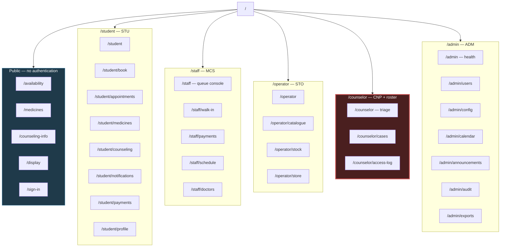

**The counselor segment is drawn apart deliberately.** It is the only segment whose API client points at `counseling-api`. Nothing in `/staff`, `/operator` or `/admin` can import from it, and the build fails if it tries (ARCHITECTURE DR-3).

## 1.2 URL structure

Routes mirror the API's own segmentation, so a reader of [API.md](API.md) can predict them.

| Segment | Pattern | Auth | Notes |
|---|---|---|---|
| Public | `/`, `/availability`, `/medicines`, `/medicines/{id}`, `/counseling-info`, `/display`, `/sign-in`, `/reset-password` | None | Indexable. Cacheable at the edge |
| Student | `/student/**` | STU | Own records only, server-scoped |
| Staff | `/staff/**` | MCS | Desktop-first |
| Operator | `/operator/**` | STO | Desktop-first |
| Counselor | `/counselor/**` | CNP **and** clinical roster | Separate bundle, separate API client |
| Admin | `/admin/**` | ADM | Desktop-first |
| System | `/offline`, `/error`, `/not-found`, `/no-access`, `/session-expired` | Any | Shared |

**Rules.**

- **No identifier in a path a user does not own.** `/student/appointments/{id}` is scoped server-side; a student pasting another student's id gets a **404, not a 403** — a 403 confirms the record exists (API.md §0.4).
- **No counseling identifier appears in a Core route, ever.** The counseling segment's own routes use `/counselor/cases/{caseId}`, served by the vault.
- **Query state is in the URL.** Date, doctor filter, search term and tab are query parameters, so a staff member can bookmark "today, Dr. Rahman" and a student can share a medicine search result.
- **The kiosk route takes no parameters** beyond an optional `?location=`. It must survive being left open for a week on a screen nobody touches.

## 1.3 Content hierarchy per context

What each context puts first, and why.

| Context | First | Second | Third | Deliberately absent |
|---|---|---|---|---|
| **Public landing** | Who is on duty today | Store open/closed | Medicine search | Any patient data, any counseling entry point beyond the informational page |
| **Student dashboard** | Next appointment with live position and estimate | Three service entry points | Notifications, announcements | Priority, triage state, counselor identity, other students |
| **Staff console** | The ordered queue for every session today | Per-session counts | Schedule and payment entry points | Any counseling surface (O4) |
| **Operator** | Items needing attention — low, out, expiring | Catalogue search | Movement ledger | Appointments, students, counseling |
| **Counselor** | SLA-breaching requests | Triage queue | Caseload, cases | Medicine stock, payments, queue management (PRM-10) |
| **Admin** | Health indicators | Accounts, configuration | Audit, exports | **Counseling case content of any kind** (PRM-08/09) |
| **Kiosk** | Now-serving serial per doctor | Waiting count | — | Everything else. No names, no navigation, no chrome |

## 1.4 Page-title convention

`<Page> · <Context> · DIU CampusCare` — for example `Queue console · Staff · DIU CampusCare`. Titles are announced by screen readers on route change (§13.4) and are what a staff member sees across eight browser tabs.

The counselor context uses `<Page> · DIU CampusCare` with **no context word** — a browser tab reading "Triage · Counseling · DIU CampusCare" on a shared desktop discloses more than it needs to (BR-53's discretion principle applied to chrome).

## 1.5 What is deliberately unreachable

Listed because an absent route looks like an oversight, and someone will otherwise add it.

| Not reachable | Why |
|---|---|
| A staff or admin route to any counseling data | O4. No component, no client, no route exists |
| An admin route to the counseling access log | FR-CSE-16 — Counseling Professionals and the service head only, break-glass included |
| A student route to another student's anything | BR-04, PRM-04 |
| A "mark no-show" control on any student screen | FR-APT-32 — a staff decision, never automatic, never the patient's |
| A payment-edit or movement-edit screen | FR-PAY-10, FR-MED-21 — corrections are new adjusting entries, so the UI offers "record a correction", not "edit" |
| An audit-log edit or delete control | FR-AUD-02, BR-61 — append-only, and the interface offers no affordance suggesting otherwise |
| A doctor login-dependent screen | CON-02 — `/staff` covers the workflow; the doctor's own view is read-only and optional |
| A medicine reservation or request flow | FR-MED-09 — Phase 1 has no reservation, and no button implies one |

---

# Part 2 — Navigation

## 2.1 One pattern per context, chosen for the device

| Context | Pattern | Why |
|---|---|---|
| **Public** | Top bar, three links, no menu | Two or three destinations. A hamburger for three links hides them for nothing |
| **Student, mobile** | **Bottom tab bar**, 4 tabs | Thumb-reachable one-handed. The dominant student device is a mid-range Android held in one hand |
| **Student, ≥768 px** | Top bar with inline nav | Bottom bars read as mobile chrome on a wide viewport |
| **Staff** | **Persistent left rail**, always expanded | Desktop at a counter. A collapsed rail costs a click on every navigation, and CON-01 counts clicks |
| **Operator** | Persistent left rail | Same reasoning |
| **Admin** | Left rail, grouped sections | More destinations; grouping beats a flat list of nine |
| **Counselor** | Minimal top bar, three destinations | Low chrome by intent — see §2.5 |
| **Kiosk** | **None** | No navigation, no header, no footer. The screen has one job |

## 2.2 Student navigation

```
Mobile ≤767px — bottom tab bar, 4 tabs, 56px tall

┌──────────────────────────────┐
│                              │
│         page content         │
│                              │
├──────────────────────────────┤
│  ⌂       ⊞       ⚕       ☰   │
│ Home   Book  Medicine  More  │
└──────────────────────────────┘
```

Four tabs, chosen from the three service entry points of FR-DASH-01 plus home:

| Tab | Route | Notes |
|---|---|---|
| **Home** | `/student` | Dashboard. Badge shows unread notification count |
| **Book** | `/student/book` | The primary task. Given a top-level tab because NFR-USE-04 budgets 5 interactions total and navigation costs one |
| **Medicine** | `/student/medicines` | Search |
| **More** | Sheet | Counseling, appointments, notifications, payments, profile, sign out |

**Counseling is in the "More" sheet, not on the tab bar.** A tab labelled "Counseling", visible whenever the student's phone is unlocked in a shared space, discloses interest in the service to anyone glancing at the screen. The same discretion principle as BR-53 applied to navigation chrome. It is one tap away, clearly labelled inside the sheet, and reachable directly from the dashboard tile.

## 2.3 Staff navigation

```
Desktop ≥1280px — persistent left rail, 220px

┌────────────┬───────────────────────────────────────────┐
│ CampusCare │  Queue console          03 Aug · 10:22 AM │
│            ├───────────────────────────────────────────┤
│ ▸ Queue    │                                           │
│   Walk-in  │            page content                   │
│   Payments │                                           │
│   Schedule │                                           │
│   Doctors  │                                           │
│            │                                           │
│ ─────────  │                                           │
│ ● Online   │                                           │
│ Farhana A. │                                           │
│ Sign out   │                                           │
└────────────┴───────────────────────────────────────────┘
```

The rail carries a **connection indicator** (`● Online` / `◐ Offline — 3 queued`), because a staff member acting on a dropped connection needs to know before they act, not after (§10.4.6, NFR-REL-04).

## 2.4 Admin navigation — grouped

```
┌────────────────┐
│ CampusCare     │
│                │
│ OPERATIONS     │
│  Health        │
│  Audit log     │
│  Exports       │
│                │
│ PEOPLE         │
│  Accounts      │
│  Roles         │
│                │
│ CONFIGURATION  │
│  Settings      │
│  Calendar      │
│  Announcements │
│  Notifications │
│                │
│ ─────────────  │
│ Break-glass    │
└────────────────┘
```

**Break-glass sits alone at the bottom, separated by a rule, styled as a plain link rather than an action.** It is not a feature to be discovered casually — FR-AUD-05…07 make it deliberately uncomfortable, and its placement should match (§10.7.7).

## 2.5 Counselor navigation — deliberately minimal

```
┌───────────────────────────────────────────────────────┐
│ CampusCare      Triage   Cases   Access log      S.K. │
├───────────────────────────────────────────────────────┤
│ ⚠ Need help now? DIU Counseling Centre +880… · 999    │  ← crisis banner (O2)
├───────────────────────────────────────────────────────┤
│                     page content                      │
└───────────────────────────────────────────────────────┘
```

Three destinations, no rail, no badges, no counts in the chrome. **No unread indicator, no case count, no SLA number in the navigation** — a counselor's screen is often visible to whoever walks into the room, and a "14" next to "Cases" is a disclosure about volume that costs nothing to omit.

The crisis banner sits **below the navigation and above all content**, mounted by the layout (O2). It is present on the counselor's screens too, not only the student's — FR-CNS-03 says *every counseling screen*.

## 2.6 Back behaviour and deep links

| Situation | Behaviour | Requirement |
|---|---|---|
| **Session expires mid-booking** | On re-authentication, return to the **availability list**, never to the held slot. A banner explains: "Your session timed out. Choose a time again — nothing was booked." | **EC-49** |
| Deep link to a route the role cannot reach | Redirect to that role's home with a neutral notice. Never render a shell that hints at the content | PRM-02 |
| Deep link to a record the user does not own | 404 page, identical to a genuinely missing record | PRM-04, BR-50 |
| Browser back after a completed booking | Returns to availability, refreshed. The confirmation is not re-submittable | EC-01 |
| Browser back out of a multi-step form | Step-by-step, preserving entered values | — |
| Back out of the crisis interstitial | Returns to the request form with urgency **reset to unselected**, so the gate is re-crossed deliberately | FR-CNS-06, VR-75 |
| Refresh on the staff console | Preserves date and doctor filter from the URL; re-establishes the live connection | — |
| Deep link into counseling while `counseling.enabled` is off | **404**, not a disabled state — the routes do not exist | BR-68 |

## 2.7 Breadcrumbs

Used only where hierarchy exceeds two levels — the operator's catalogue and the admin's configuration. Everywhere else the left rail or tab bar is the orientation, and a breadcrumb duplicating it is noise.

```
Catalogue  ›  Paracetamol 500 mg Tablet  ›  Batch B-2026-114
```

Never used in the counselor context: `Cases › 01921400 › Notes` in a browser history entry is a disclosure.

---
# Part 3 — User Flows

Twelve journeys. Five carry a hard SRS budget; each of those is counted below and the count is a **pass/fail test, not a note**.

**What counts as an interaction.** One deliberate user act that advances the task: a tap, a click, a selection, a typed field committed, a form submission. Scrolling, reading and system responses do not count. This is the strictest reasonable reading — if the design passes under it, it passes.

## 3.1 Budget summary

| Flow | Budget | Design | Verdict |
|---|---|---|---|
| Book an appointment | ≤ 5 interactions, ≤ 60 s (NFR-USE-04) | **5** | **Pass — at budget** |
| Check in a patient | 1 interaction, ≤ 15 s (NFR-USE-01) | **1** | **Pass** |
| Register a walk-in | ≤ 3 mandatory fields (FR-APT-36) | **3** | **Pass — at budget** |
| Dispense medicine | ≤ 4 interactions (NFR-USE-03) | **4** | **Pass — at budget** |
| Submit a counseling request | ≤ 6 interactions, 2 mandatory fields (NFR-USE-05) | **5**, 2 mandatory | **Pass — 1 under** |

Three flows sit exactly at budget. That is a design constraint with no slack: **any future step added to booking, walk-in registration or dispensing breaks a critical requirement.** Recorded here so the cost is visible before someone proposes an extra confirmation screen.

---

## 3.2 Book an appointment — 5 interactions

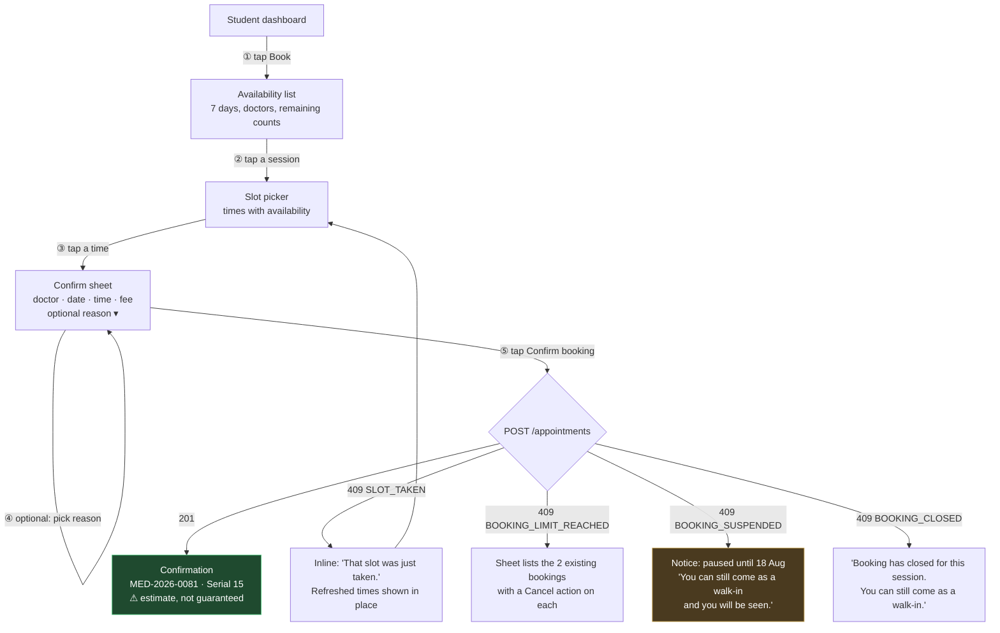

**Interaction ledger:** ① Book tab · ② session · ③ time · ④ reason *(optional — does not count against the budget when skipped)* · ⑤ Confirm. **5 with the optional step, 4 without.**

**Design decisions this flow forces:**

- **No separate date-picker step.** Dates and sessions are one scrollable list. A calendar widget would add an interaction the budget cannot afford.
- **The confirm sheet is a sheet, not a route.** It overlays the slot picker so a `SLOT_TAKEN` rejection can refresh the list *behind* it and return the student to step ③ without a page transition (EC-01).
- **`SLOT_TAKEN` never navigates away.** The refreshed slot list arrives in `error.details.availableSlots` (API.md §4.2) and replaces the times in place. Losing a race should cost one tap, not a restart.
- **The suspension message leads with what the student can still do.** FR-APT-13 makes this absolute — a suspension never prevents care. The notice names the walk-in path in its first sentence, not its last.

## 3.3 Check in a patient — 1 interaction, ≤ 15 s

The single most important flow in the product (CON-01, risk R3).

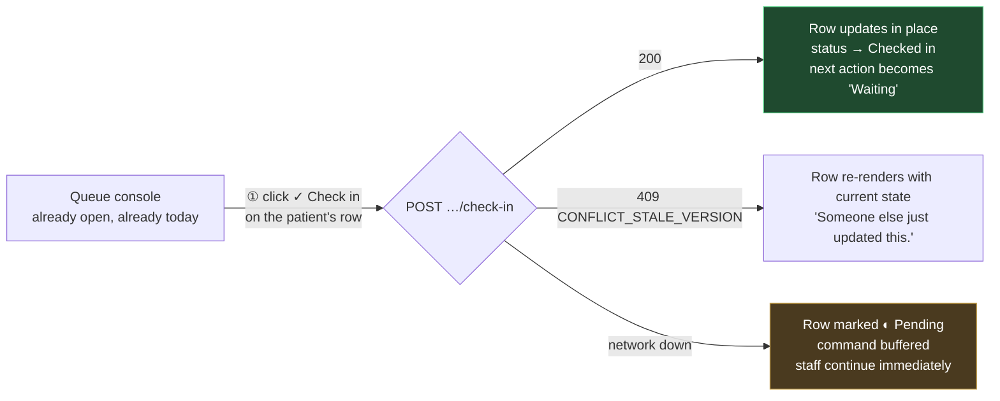

**Interaction ledger:** ① one click. **1.**

**How the 15 seconds are spent** — the budget includes identity verification (NFR-USE-01), which is a human act, not a software one:

| Step | Actor | Time |
|---|---|---|
| Student presents ID card (ASM-17) | Human | ~5 s |
| Staff locates the row — sorted, serial-numbered, searchable by typing | Human + UI | ~6 s |
| Click *Check in* | Human | ~1 s |
| Server responds (NFR-PERF-04 caps at 1.0 s p95) | System | ≤ 1 s |
| **Total** | | **~13 s** |

**Design decisions this flow forces:**

- **No confirmation dialog.** Check-in is not destructive and is reversible (FR-APT-34). A dialog would double the interaction count and break NFR-USE-01 outright.
- **No navigation.** The action happens on the console. Opening a detail page to check someone in is the design that makes staff go back to paper.
- **The row updates in place**, and the button relabels to the next permitted transition — driven by `permittedTransitions` from the API (§4.9), so the console never offers an illegal move (VR-28).
- **Type-to-find.** Typing digits anywhere on the console filters by serial; typing letters filters by name. No click into a search box — that would be interaction zero, spent on navigation.
- **Offline is not an error state.** The row marks pending, the command buffers, and the staff member moves on. They find out about the network from the rail indicator, not from a blocking dialog (NFR-REL-04, §5.6 of ARCHITECTURE).

## 3.4 Register a walk-in — 3 mandatory fields

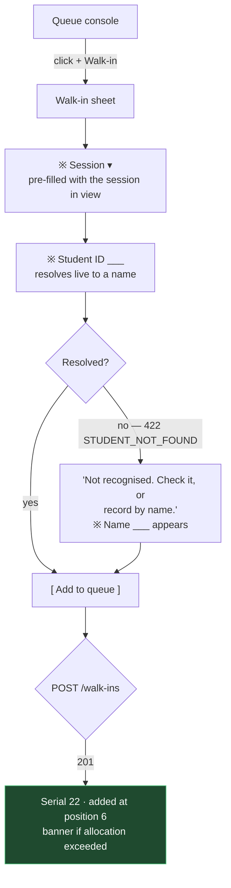

**Mandatory field ledger:** session *(pre-filled)* · student ID *(or name if unresolved)* · that is **2 in the common case, 3 in the fallback**. Emergency reason appears only when Emergency is ticked, and is conditional rather than mandatory. **At or under the FR-APT-36 cap of 3.**

**Design decisions this flow forces:**

- **Session is pre-filled from the console context.** The staff member is looking at a session; asking them to pick it again is a field spent on nothing.
- **The unregistered-name path is offered in the error, not as a competing field.** VR-29 allows either; showing both up front makes every walk-in a choice. Showing the second only when the first fails keeps the common case at two fields.
- **The suspension check is absent by design.** A suspended student registers normally, and the response's `suspensionIgnored` flag drives no warning, no badge and no confirmation — FR-APT-38 and BR-15 require registration to succeed, and surfacing the suspension here would invite a staff member to hesitate.
- **Exceeded allocation is a banner after success, never a block.** EC-10 — care is never refused.

## 3.5 Dispense medicine — 4 interactions

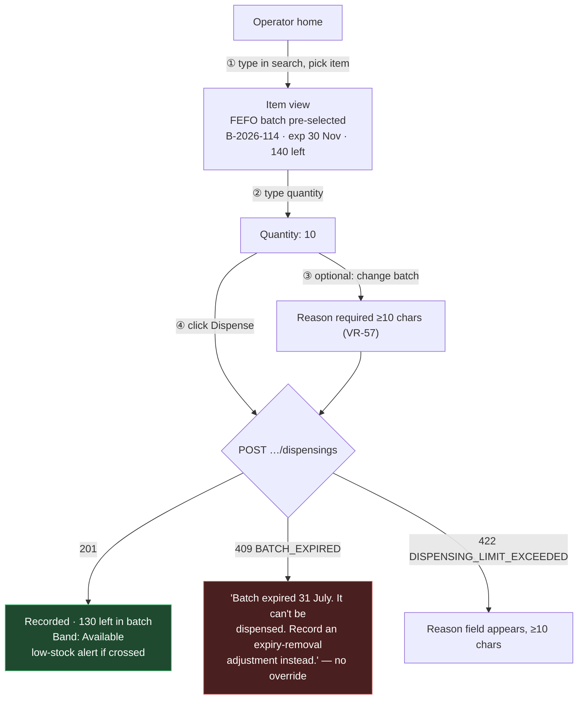

**Interaction ledger:** ① find and select the item *(search-and-pick counts as one — the operator types and clicks a result)* · ② quantity · ③ batch change *(optional, skipped in the FEFO case)* · ④ Dispense. **4 with a batch override, 3 without.** Within the NFR-USE-03 cap of 4.

**Design decisions this flow forces:**

- **FEFO is pre-selected, not proposed.** BR-39 requires the earliest-expiring batch to be *proposed*; making it the default means the compliant path costs zero interactions and the deviation costs one plus a reason (VR-57).
- **Expired batches are not in the list at all.** VR-56 rejects them unconditionally with no override, so offering them and then refusing wastes the operator's time and teaches them the interface lies about its options.
- **No student identity field exists.** FR-MED-28 / OI-18 — the field is absent from the schema and absent from this form. Its absence is a recorded decision, not an omission (§10.6.4).

## 3.6 Submit a counseling request — 5 interactions, 2 mandatory fields

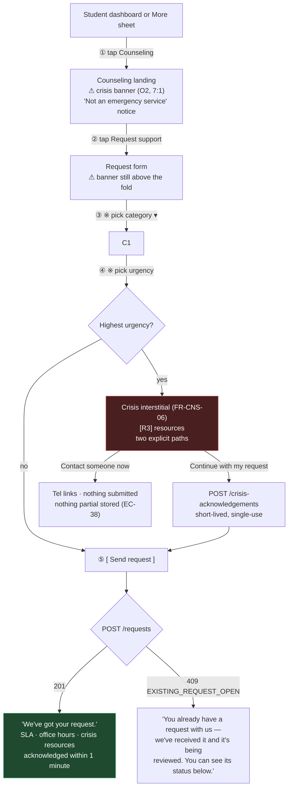

**Interaction ledger:** ① Counseling · ② Request support · ③ category · ④ urgency · ⑤ Send. **5, one under the NFR-USE-05 budget of 6.** The spare interaction is the crisis interstitial's *Continue* on the highest-urgency path, which brings that path to exactly 6 — still within budget.

**Mandatory fields: 2** — category and urgency (FR-CNS-08). Note, preferred windows and gender preference are optional in the form; VR-73's "at least one window" is satisfied by a pre-selected default of "any time in the next two weeks", which the student can refine but need not touch.

**Design decisions this flow forces:**

- **The interstitial is a route, not a modal.** A dismissible modal can be closed without a decision. FR-CNS-06 requires **two explicit paths**, and a route with two buttons and no close affordance is the only honest rendering of that.
- **"Contact someone now" submits nothing.** EC-38 — a student who abandons the form at any point leaves nothing partial stored, and the crisis banner remains visible throughout.
- **The duplicate message is the tested copy.** EC-39 requires it *must not read as a rebuke*; ARCHITECTURE §10.3 gives the exact wording. It renders with the existing request's status inline, so the student sees the answer, not just the refusal.
- **The banner is above the fold on the form**, not only on the landing — FR-CNS-04 says every counseling screen, at every viewport (O2, verified at 320 px in §11.6).

---

## 3.7 The remaining seven flows

### Crisis interstitial gate (server-enforced)

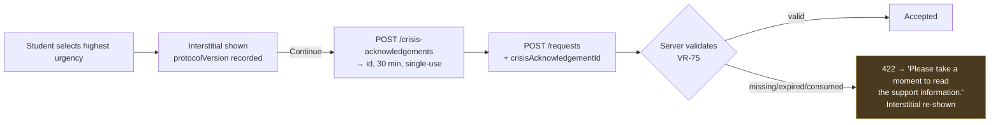

The client cannot bypass this by skipping the interstitial — the acknowledgement id is issued only by the endpoint that serves it, and VR-75 rejects the submission without one. **The UI gate and the server gate are independent**, which is what "not enforceable by the interface alone" requires.

### Doctor leave — impact preview then confirm

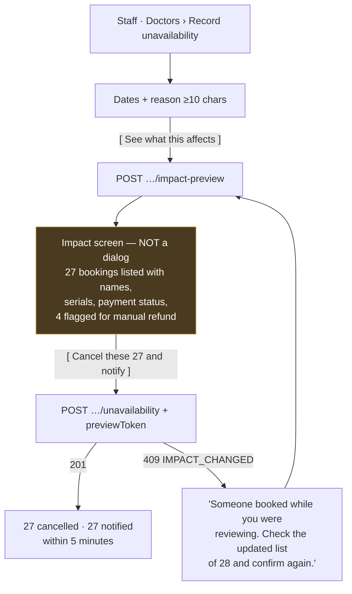

**The impact list is a full screen, not a dialog.** FR-SCH-07 requires every affected booking to be *presented* before committing; 27 rows in a scrolling dialog is technically a presentation and practically a click-through. The confirm button carries the count (O6).

### Emergency insertion

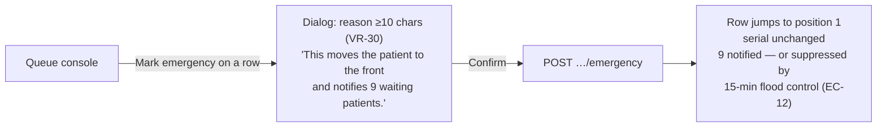

Serial number does **not** change — the entry moves in ordering only (EC-09). The console shows this explicitly, because a serial that appeared to change would undermine the queue's one visible guarantee.

### Offline and reconnect

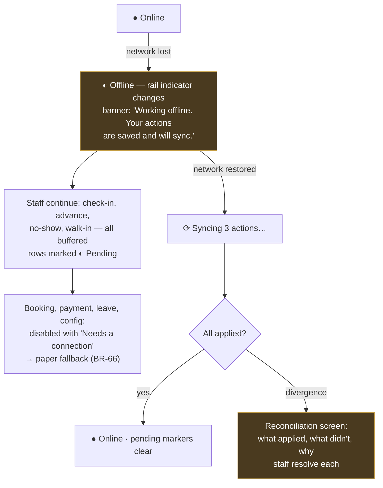

The bufferable set is exactly ARCHITECTURE §5.6's whitelist, mirrored in API.md §0.7. Non-bufferable actions are **visibly disabled with a reason**, not hidden — a staff member needs to know to reach for paper (BR-66, ASM-18).

### Break-glass

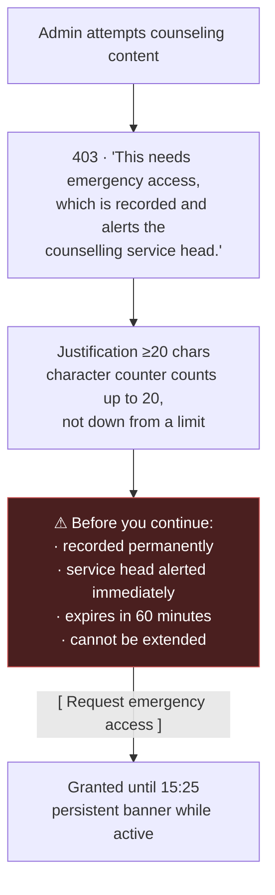

The interface makes break-glass **feel** like what it is. FR-AUD-05…07 design it to be uncomfortable; a smooth flow here would undo the requirement's intent.

### Triage a request

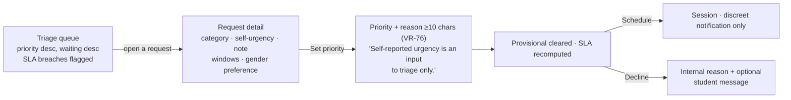

The form states that self-reported urgency does not set priority (FR-CNS-09, BR-45) at the point of decision, where it matters, rather than in documentation nobody reads.

### Payment and end-of-day reconciliation

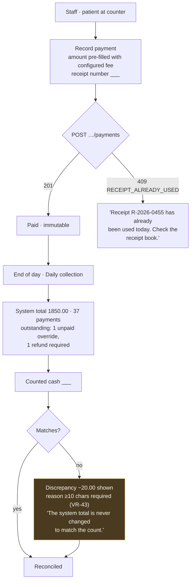

The reconciliation screen states EC-22 in the interface: the system total is never adjusted to match the count. Staff who expect the software to "fix" the figure need to be told once, at the moment they are looking at a mismatch.

---
# Part 4 — Design System

Every value here is final and implementable. Every colour pair carries a **computed** contrast ratio, not an asserted one — the arithmetic is in `contrast.py` and reproduced in §4.1.3.

## 4.1 Colour

### 4.1.1 Why the palette is this small

Twelve semantic colours, four of them neutrals. The restraint is functional, not stylistic: **O3 forbids conveying status by colour alone**, which only works if colour is scarce enough to be trusted when it does appear. A palette with fourteen decorative tints trains the eye to ignore colour, and then the one colour that means "out of stock" is ignored too.

### 4.1.2 Tokens

```css
/* ---- Surfaces ---------------------------------------------------- */
--color-bg:              #FFFFFF;   /* page */
--color-surface:         #F7F8F9;   /* cards, raised panels */
--color-surface-sunken:  #EDEFF2;   /* wells, table headers, disabled */

/* ---- Text -------------------------------------------------------- */
--color-text:            #16191D;   /* body, headings */
--color-text-secondary:  #5A626D;   /* labels, metadata */
--color-text-muted:      #6B737E;   /* timestamps, help text */
--color-text-on-fill:    #FFFFFF;   /* text on primary/danger fills */

/* ---- Lines ------------------------------------------------------- */
--color-border:          #D4D8DE;   /* dividers, card edges (decorative) */
--color-border-strong:   #868D97;   /* input borders, control outlines */

/* ---- Primary action ---------------------------------------------- */
--color-primary:         #0B5FA5;
--color-primary-hover:   #094C84;
--color-primary-subtle:  #E8F1F9;
--color-focus-ring:      #0B5FA5;

/* ---- Status ------------------------------------------------------ */
--color-success:         #0E6E3F;   --color-success-bg:  #E8F5EE;
--color-warning:         #8A5A00;   --color-warning-bg:  #FDF3E0;
--color-danger:          #A32218;   --color-danger-bg:   #FDECEA;
--color-info:            #0B5FA5;   --color-info-bg:     #E8F1F9;
--color-neutral:         #5A626D;   --color-neutral-bg:  #EDEFF2;

/* ---- Crisis (counseling only — NFR-A11Y-03 requires >= 7:1) ------- */
--color-crisis-fg:       #6B1018;
--color-crisis-link:     #5C0E14;
--color-crisis-bg:       #FDF2F3;
--color-crisis-border:   #C9808A;

/* ---- Kiosk (dark, legibility at 3 m — NFR-A11Y-05) --------------- */
--color-kiosk-bg:        #101418;
--color-kiosk-text:      #F2F4F7;
--color-kiosk-serial:    #4FA3E3;
--color-kiosk-muted:     #A8B2BF;
```

### 4.1.3 Contrast verification

Computed by WCAG 2.1 relative-luminance formula. **Required minima:** 4.5:1 body text (SC 1.4.3, NFR-A11Y-03) · 3:1 non-text UI boundaries (SC 1.4.11) · **7:1 crisis banner** (NFR-A11Y-03, stricter than AA by requirement).

| Pair | Foreground | Background | Ratio | Min | |
|---|---|---|---|---|---|
| Body text on page | `#16191D` | `#FFFFFF` | **17.63:1** | 4.5 | ✅ AAA |
| Body text on surface | `#16191D` | `#F7F8F9` | **16.58:1** | 4.5 | ✅ AAA |
| Secondary text on page | `#5A626D` | `#FFFFFF` | **6.17:1** | 4.5 | ✅ AA |
| Secondary text on surface | `#5A626D` | `#F7F8F9` | **5.80:1** | 4.5 | ✅ AA |
| Muted text on page | `#6B737E` | `#FFFFFF` | **4.80:1** | 4.5 | ✅ AA |
| Input border | `#868D97` | `#FFFFFF` | **3.35:1** | 3.0 | ✅ |
| Input border on surface | `#868D97` | `#F7F8F9` | **3.15:1** | 3.0 | ✅ |
| Primary link/text | `#0B5FA5` | `#FFFFFF` | **6.57:1** | 4.5 | ✅ AA |
| Primary hover | `#094C84` | `#FFFFFF` | **8.83:1** | 4.5 | ✅ AAA |
| Label on primary fill | `#FFFFFF` | `#0B5FA5` | **6.57:1** | 4.5 | ✅ AA |
| Label on primary hover fill | `#FFFFFF` | `#094C84` | **8.83:1** | 4.5 | ✅ AAA |
| Focus ring | `#0B5FA5` | `#FFFFFF` | **6.57:1** | 3.0 | ✅ |
| Success on tint | `#0E6E3F` | `#E8F5EE` | **5.64:1** | 4.5 | ✅ AA |
| Success on page | `#0E6E3F` | `#FFFFFF` | **6.32:1** | 4.5 | ✅ AA |
| Warning on tint | `#8A5A00` | `#FDF3E0` | **5.38:1** | 4.5 | ✅ AA |
| Warning on page | `#8A5A00` | `#FFFFFF` | **5.93:1** | 4.5 | ✅ AA |
| Danger on tint | `#A32218` | `#FDECEA` | **6.56:1** | 4.5 | ✅ AA |
| Danger on page | `#A32218` | `#FFFFFF` | **7.50:1** | 4.5 | ✅ AAA |
| Label on danger fill | `#FFFFFF` | `#A32218` | **7.50:1** | 4.5 | ✅ AAA |
| Info on tint | `#0B5FA5` | `#E8F1F9` | **5.75:1** | 4.5 | ✅ AA |
| Neutral on tint | `#5A626D` | `#EDEFF2` | **5.36:1** | 4.5 | ✅ AA |
| **Crisis text** | `#6B1018` | `#FDF2F3` | **11.20:1** | **7.0** | ✅ |
| **Crisis link** | `#5C0E14` | `#FDF2F3` | **12.55:1** | **7.0** | ✅ |
| **Crisis on white** | `#6B1018` | `#FFFFFF` | **12.26:1** | **7.0** | ✅ |
| Kiosk text | `#F2F4F7` | `#101418` | **16.79:1** | 4.5 | ✅ AAA |
| Kiosk serial | `#4FA3E3` | `#101418` | **6.77:1** | 4.5 | ✅ AA |
| Kiosk muted | `#A8B2BF` | `#101418` | **8.62:1** | 4.5 | ✅ AAA |

**28 of 28 pairs pass.** Two notes on how this table was arrived at, because both are the kind of thing that gets asserted and turns out to be wrong:

- `--color-border-strong` was first specified as `#9AA1AB`. It measured **2.61:1** and **failed** SC 1.4.11's 3:1 minimum for the visible boundary of an input. It was darkened to `#868D97` (3.35:1). An input border that a low-vision user cannot see is a real failure, and it is invisible to anyone testing with normal vision.
- The crisis colours are deliberately far above 7:1 rather than at it. NFR-A11Y-03 sets 7:1 as a floor, and the banner is the one element in the product where a rendering environment we did not anticipate — a sun-washed phone screen — must not degrade it below the requirement.

`--color-border` at 1.43:1 is **decorative only** and never the sole boundary of an interactive control. Where a border is the control's boundary, `--color-border-strong` is used.

### 4.1.4 Status colour assignments

Colour is one of three signals. Icon and text are the other two, and either alone is sufficient (O3, NFR-A11Y-04).

| Domain status | Token | Icon | Text |
|---|---|---|---|
| Appointment `booked` | info | ○ | Booked |
| Appointment `checked_in` | info | ◉ | Checked in |
| Appointment `waiting` | warning | ◔ | Waiting |
| Appointment `in_consultation` | success | ▶ | In consultation |
| Appointment `completed` | neutral | ✓ | Completed |
| Appointment `cancelled` | neutral | ✕ | Cancelled |
| Appointment `late_cancellation` | neutral | ✕ | Late cancellation |
| Appointment `no_show` | danger | ⊘ | No-show |
| Appointment `expired` | neutral | ⏱ | Expired |
| Emergency flag | danger | ⚠ | Emergency |
| Medicine `available` | success | ● | Available |
| Medicine `low_stock` | warning | ◐ | Low stock |
| Medicine `out_of_stock` | danger | ○ | Out of stock |
| Payment `unpaid` | warning | ○ | Unpaid |
| Payment `paid` | success | ✓ | Paid |
| Payment `waived` | neutral | — | Waived |
| Case priority `urgent` | danger | ▲▲▲ | Urgent |
| Case priority `priority` | warning | ▲▲ | Priority |
| Case priority `normal` | neutral | ▲ | Normal |
| SLA `breached` | danger | ⚠ | SLA breached |
| SLA `due_soon` | warning | ⏱ | Due soon |
| Connection `offline` | warning | ◐ | Offline |
| Command `pending` | warning | ◐ | Pending sync |

**A greyscale print of any screen in this product remains fully legible.** That is the test for O3, and it is a test somebody should actually run before go-live.

## 4.2 Typography

### 4.2.1 Font stack — no download, Bengali-capable

```css
--font-sans:
  system-ui, -apple-system, "Segoe UI", Roboto,
  "Noto Sans Bengali", "Nirmala UI", "Vrinda",   /* Bangla — NFR-LOC-03 */
  "Helvetica Neue", Arial, sans-serif;

--font-mono:
  ui-monospace, SFMono-Regular, "SF Mono", Menlo,
  Consolas, "Liberation Mono", monospace;
```

**Zero bytes downloaded.** This is forced by the 500 KB budget (NFR-PERF-02) and the 3.0 s FCP on throttled 3G (NFR-PERF-01) — a 120 KB webfont on the critical path spends a quarter of the budget on letterforms.

It also solves NFR-LOC-03. Phase 1 ships in English (NFR-LOC-02, ASM-15), but students type Bangla into free-text fields — reason-for-visit notes, counseling notes — and that text must render. Android carries Noto Sans Bengali, Windows carries Nirmala UI and Vrinda, iOS and macOS carry Bangla MN via `system-ui`. Every target platform in SRS §2.4 renders Bangla with no download.

Monospace is used for the appointment reference, receipt number, batch reference and correlation ID — values a person reads aloud over a phone or copies onto paper, where `0`/`O` and `1`/`l` confusion has a real cost.

### 4.2.2 Scale

1 rem = 16 px. **16 px is the body-text floor** — smaller text on a mid-range Android in sunlight is the most common real-world accessibility failure in this class of product, and it is not covered by any WCAG success criterion.

| Token | Size | Line height | Weight | Use |
|---|---|---|---|---|
| `--text-xs` | 0.75rem / 12px | 1.4 | 500 | Badge text, table meta. **Never body copy** |
| `--text-sm` | 0.875rem / 14px | 1.5 | 400 | Dense table cells, help text (desktop only) |
| `--text-base` | 1rem / 16px | 1.5 | 400 | **Body default, all contexts** |
| `--text-lg` | 1.125rem / 18px | 1.5 | 400 | Lead paragraphs, card primaries |
| `--text-xl` | 1.25rem / 20px | 1.4 | 600 | Card titles, section headings |
| `--text-2xl` | 1.5rem / 24px | 1.3 | 600 | Page titles |
| `--text-3xl` | 1.875rem / 30px | 1.25 | 600 | Dashboard stat figures |
| `--text-4xl` | 2.5rem / 40px | 1.2 | 700 | Serial number on the student's queue view |
| `--text-kiosk-label` | 2rem / 32px | 1.3 | 600 | Kiosk doctor name |
| `--text-kiosk-serial` | 7.5rem / 120px | 1.0 | 700 | Kiosk now-serving numeral |

`--text-sm` is permitted **only** in the staff, operator, counselor and admin contexts, which are desktop-only at ≥1280 px (SRS §2.4). No student-facing view uses it.

The kiosk sizes derive from NFR-A11Y-05 — legible at 3 metres on a 1280×720 screen. At 3 m, a character needs roughly 1/200 of viewing distance in cap height to be comfortably read: ≈15 mm, which on a typical 27-inch 1280×720 panel is ~120 px for the numeral. The 32 px label is the supporting text, read at closer range or as context.

### 4.2.3 Rules

- Line length is capped at **70 characters** for body copy (`max-width: 65ch`). Full-width paragraphs on a 1280 px staff console are unreadable.
- Never below `--text-base` for anything a student reads.
- Headings step down without skipping: no `h4` under an `h2` (SC 1.3.1, §13.3).
- Numerals are tabular in tables and in the queue (`font-variant-numeric: tabular-nums`) so serial columns align.

## 4.3 Spacing

An 8 px base scale, with a 4 px half-step for dense controls.

| Token | Value | Use |
|---|---|---|
| `--space-0-5` | 4px | Icon-to-label, badge padding |
| `--space-1` | 8px | Tight grouping |
| `--space-2` | 16px | **Default gap.** Field to field, card padding on mobile |
| `--space-3` | 24px | Card padding on desktop, section internal |
| `--space-4` | 32px | Between sections |
| `--space-6` | 48px | Between major page regions |
| `--space-8` | 64px | Page top/bottom on desktop |

**Touch and pointer targets:**

| Context | Minimum | Source |
|---|---|---|
| Touch (any student view) | **44 × 44 px** | SC 2.5.5 (AAA) adopted as a floor — students tap while walking |
| Pointer (staff, operator, admin) | **32 × 32 px** | Density matters more on a console; SC 2.5.8 AA requires 24 |
| Queue console primary action | **40 px tall, ≥96 px wide** | NFR-USE-01 — the check-in target must be unmissable at speed |
| Spacing between adjacent targets | ≥ 8 px | Prevents mis-taps on a bus |

## 4.4 Radii, borders, elevation

```css
--radius-sm:  4px;   /* badges, inputs, small buttons */
--radius-md:  8px;   /* cards, dialogs, sheets */
--radius-lg: 12px;   /* bottom sheets, modal on mobile */
--radius-full: 999px;/* avatar, pill counters */

--border-width: 1px;
--border-width-strong: 2px;    /* focus ring, emergency row */

--shadow-sm: 0 1px 2px rgb(22 25 29 / 0.06);
--shadow-md: 0 2px 8px rgb(22 25 29 / 0.10);
--shadow-lg: 0 8px 24px rgb(22 25 29 / 0.14);
```

Elevation is used sparingly — three levels, each with a meaning:

| Level | Meaning | Applied to |
|---|---|---|
| flat | Content in the page | Cards in a list, table rows |
| `--shadow-sm` | Lifted, still in flow | Sticky table header, dashboard stat tile |
| `--shadow-md` | Floating over content | Dropdown, popover, toast |
| `--shadow-lg` | Modal layer | Dialog, bottom sheet |

Cards are separated by `--color-border` and background, not by shadow. A list of twelve shadowed cards is visual noise on a console someone reads all day.

## 4.5 Layout primitives

```css
--container-narrow:  480px;   /* single-column forms, auth */
--container-content: 768px;   /* student reading views */
--container-wide:   1200px;   /* staff/operator/admin consoles */
--container-full:    100%;    /* kiosk, queue console */

--rail-width:        220px;   /* staff/operator/admin left rail */
--tabbar-height:      56px;   /* student mobile bottom nav */
--appbar-height:      56px;
```

## 4.6 Motion

| Token | Duration | Curve | Use |
|---|---|---|---|
| `--motion-instant` | 0ms | — | Queue row state change (see below) |
| `--motion-fast` | 120ms | `cubic-bezier(.2,0,.38,.9)` | Hover, focus, badge change |
| `--motion-base` | 200ms | `cubic-bezier(.2,0,.38,.9)` | Dropdown, toast, accordion |
| `--motion-sheet` | 240ms | `cubic-bezier(.2,0,0,1)` | Bottom sheet, dialog entrance |

**Nothing exceeds 240 ms.** And two hard rules:

1. **Queue console state changes are instant.** A row transitioning `waiting` → `in_consultation` does not animate. NFR-PERF-04 gives the whole operation 1.0 s; spending 200 ms of it on a transition that tells the staff member nothing is a cost against the requirement that decides the project (CON-01).
2. **Reduced motion is honoured completely**, not partially:

```css
@media (prefers-reduced-motion: reduce) {
  *, *::before, *::after {
    animation-duration: 0.01ms !important;
    animation-iteration-count: 1 !important;
    transition-duration: 0.01ms !important;
    scroll-behavior: auto !important;
  }
}
```

No loading spinner rotates under reduced motion — skeletons and static text (`Loading…`) are used instead (§5.11).

## 4.7 Icons

**Inline SVG, 24 × 24 viewBox, 1.5 px stroke, `currentColor`.** Only the icons a view actually uses are included in its bundle (§0.4). No icon font: a font downloads the whole set for a handful of glyphs and renders as tofu boxes when it fails.

Every icon that carries meaning has a text label beside it (O3). Icons that are decorative carry `aria-hidden="true"`. **No icon is the sole label of an interactive control** except the app-bar menu and close buttons, which carry `aria-label`.

The set is deliberately small — 24 glyphs:

`check` · `x` · `alert-triangle` · `alert-circle` · `info` · `clock` · `calendar` · `user` · `users` · `search` · `plus` · `minus` · `chevron-down` · `chevron-right` · `arrow-left` · `menu` · `bell` · `pill` · `stethoscope` · `heart-hand` · `package` · `wifi-off` · `refresh` · `external-link`

`heart-hand` is the counseling glyph. It is **not** a medical cross, a brain, or anything clinical — CON-15 and BR-53 both push toward iconography that does not announce the nature of the service to someone glancing at a student's screen.

## 4.8 Voice and tone

Specified in **§0.6**, which governs every string in this document. In summary: plain language, no technical terms, every error states the next step (NFR-USE-06); counseling copy is warm, unhurried and never a rebuke, and is **draft pending Counseling Professional review** (NFR-USE-07, CON-04).

The banned-words list in §0.6 is worth repeating here because it constrains component copy directly: never *confirmed time*, *guaranteed* (O1); never *reserved*, *held for you* (FR-MED-09); never *emergency service*, *we're monitoring* (CON-15); never *invalid*, *violation*, *constraint*, *duplicate* in user-facing text (NFR-USE-06).

## 4.9 Dark mode

**Not in Phase 1**, with one exception: the kiosk display is dark by default (§4.1.2), because a bright 27-inch panel in a waiting room at night is unpleasant and the kiosk has no other content to match.

The token layer makes a later dark theme a re-mapping of surface and text tokens rather than a rewrite — but every pair would need re-verification against §4.1.3, and that work is not in Phase 1 scope.

---
# Part 5 — Components

Sixteen primitives. Each carries anatomy, states, keyboard behaviour and ARIA. Four of them — `StatusBadge`, `EstimateDisplay`, `CrisisBanner`, `ConfirmDialog` — are the structural mechanisms for obligations O1, O2, O3 and O6, and their API shapes are load-bearing rather than stylistic.

## 5.1 Button

```
┌────────────────────┐   ┌──────────────────┐   ┌──────────────┐
│   Confirm booking  │   │     Cancel       │   │  Sign out    │
└────────────────────┘   └──────────────────┘   └──────────────┘
   primary (filled)         secondary (outline)     tertiary (text)

┌────────────────────┐   ┌──────────────────┐
│ ⚠ Cancel 27 bookings│   │  ⟳ Booking…      │
└────────────────────┘   └──────────────────┘
   danger                    loading
```

| Variant | Fill | Text | Border | Use |
|---|---|---|---|---|
| `primary` | `--color-primary` | `--color-text-on-fill` | none | One per view. The thing the user came to do |
| `secondary` | transparent | `--color-primary` | `--color-border-strong` | Alternative actions |
| `tertiary` | transparent | `--color-primary` | none | Low-emphasis, inline |
| `danger` | `--color-danger` | `--color-text-on-fill` | none | Destructive. **Always paired with `ConfirmDialog`** (O6) |

**Sizes:** `sm` 32 px (desktop consoles only) · `md` 40 px (default) · `lg` 48 px (student primary actions, mobile).

| State | Treatment |
|---|---|
| default | As above |
| hover | `--color-primary-hover`; 120 ms |
| focus-visible | **2 px `--color-focus-ring` at 2 px offset.** Never removed, never replaced by a colour change alone |
| active | Hover fill, no transform |
| disabled | `--color-surface-sunken` fill, `--color-text-muted` text, `cursor: not-allowed`, `aria-disabled="true"` |
| loading | Spinner replaces the icon slot, label becomes present-tense (`Booking…`), `aria-busy="true"`, pointer events off |

**Disabled buttons always carry a reason.** A disabled control with no explanation is the single most common frustration in staff software. Either a `title`+`aria-describedby` hint ("Needs a connection") or visible help text beneath. This matters most in the offline state (§10.4.14), where non-bufferable actions are disabled on purpose.

**Keyboard:** `Enter` and `Space` activate. Tab order follows DOM order. **A loading button retains focus** — moving focus on completion would strand a keyboard user.

## 5.2 StatusBadge — obligation O3

The component that makes NFR-A11Y-04 structural.

```
┌──────────────┐  ┌──────────────┐  ┌────────────────┐  ┌────────────┐
│ ○ Booked     │  │ ◔ Waiting    │  │ ▶ In consult.  │  │ ⊘ No-show  │
└──────────────┘  └──────────────┘  └────────────────┘  └────────────┘
   info              warning            success             danger
```

**API shape — the enforcement:**

```
StatusBadge {
  tone:  'info' | 'success' | 'warning' | 'danger' | 'neutral'   // required
  icon:  IconName                                                 // required
  label: string                                                   // required
}
```

**All three are required. There is no colour-only variant, and there is no way to construct one.** A `tone` without a `label` fails type-check at build. This is the difference between a convention someone remembers and a mechanism that holds.

- Anatomy: 4 px icon-label gap, `--space-0-5` padding, `--radius-sm`, `--text-xs` at weight 500, tinted background from the tone's `-bg` token.
- Icon and label come from the assignment table in §4.1.4. That table is the single source; badges do not invent their own mappings.
- Not interactive. Never a button, never a link, no focus, no hover.
- Screen readers announce the label as text; the icon is `aria-hidden`.
- **Greyscale test:** every badge is fully legible with colour removed, because the icon and text carry the meaning independently.

## 5.3 EstimateDisplay — obligation O1

The component that makes FR-APT-07/08 and BR-19 structural.

```
Mobile                              Compact (staff console)
┌──────────────────────────────┐    ┌──────────────────────┐
│ ⏱  Around 10:40 AM           │    │ ⏱ ~10:40  (estimate) │
│                              │    └──────────────────────┘
│ ⓘ This is an estimate, not a │
│   guaranteed appointment     │
│   time. Your position may    │
│   change if emergencies      │
│   arrive.                    │
└──────────────────────────────┘
```

**API shape — the enforcement:**

```
EstimateDisplay {
  at:         ISO8601        // required
  disclaimer: string         // REQUIRED — no default, not optional
  variant:    'full' | 'compact'
}
```

**`disclaimer` has no default value.** Omitting it is a compile error, not a rendering with missing text. The `compact` variant still renders the word "(estimate)" inline — it shortens the disclaimer, it does not drop it.

- The time is rendered as `Around 10:40 AM`, never `10:40 AM` alone. The word "Around" is part of the value, not decoration.
- Used on: S-01 dashboard, S-05 booking confirmation, S-07 appointment detail, F-01 queue console, and every notification body carrying a time.
- **Forbidden strings anywhere near this component:** *confirmed*, *guaranteed*, *your appointment is at*, *scheduled for* (§0.6).

## 5.4 CrisisBanner — obligation O2

```
┌──────────────────────────────────────────────────────────────┐
│ ⚠  Need help right now?                                      │
│                                                              │
│    DIU Counseling Centre  +880-XXXX-XXXXXX                   │
│    Sun–Thu, 9:00 AM – 5:00 PM                                │
│                                                              │
│    National emergency  999   ·  24 hours                     │
│                                                              │
│    This service is not an emergency service. Requests are    │
│    reviewed during office hours only.                        │
└──────────────────────────────────────────────────────────────┘
```

**Mounted by the counseling route layout, never composed into a page or a form** (ARCHITECTURE §6.4). A new counseling screen inherits it; omitting it requires deliberately editing the layout.

| Property | Value | Requirement |
|---|---|---|
| Contrast | `#6B1018` on `#FDF2F3` = **11.20:1** | NFR-A11Y-03 (≥7:1) |
| Link contrast | `#5C0E14` on `#FDF2F3` = **12.55:1** | NFR-A11Y-03 |
| Position | Above all page content, below navigation | FR-CNS-04 |
| Visibility | **Above the fold at every supported viewport width, without scrolling** — verified at 320 px in §11.6 | FR-CNS-04, CON-15 |
| Dismissible | **No.** No close button, no collapse, no "don't show again" | FR-CNS-03 |
| Phone numbers | `tel:` links, ≥44 px tap targets | — |
| Content source | `GET /counseling/api/v1/crisis-resources`, [R3] | FR-CNS-03 |
| Failure | If the endpoint fails, render **cached last-known content**; if none, render a static fallback with the centre number and 999. **Never render empty** | EC-48 |

The last row matters more than it looks. A banner that disappears when an API call fails is worse than no banner, because the screens around it were designed assuming it is there.

Copy is **draft pending Counseling Professional review** (NFR-USE-07).

## 5.5 ConfirmDialog — obligation O6

```
┌────────────────────────────────────────────────┐
│  Cancel this session?                          │
│                                                │
│  This cancels 14 booked appointments and       │
│  notifies each student. Four of them have      │
│  paid and will need a manual refund.           │
│                                                │
│  Reason (required, at least 10 characters)     │
│  ┌──────────────────────────────────────────┐  │
│  │                                          │  │
│  └──────────────────────────────────────────┘  │
│  12 / 10 minimum ✓                             │
│                                                │
│            [ Keep session ]  [ Cancel 14 ]     │
└────────────────────────────────────────────────┘
```

**API shape — the enforcement:**

```
ConfirmDialog {
  title:       string     // required
  consequence: string     // REQUIRED — states the effect in numbers
  confirmLabel:string     // required — names the action, never "OK"
  cancelLabel: string     // required — names the escape, never "Cancel" alone
  reason?:     { required: boolean, minLength: number }
}
```

**`consequence` is required and has no default.** NFR-USE-08 requires destructive actions to name the consequence, and "Are you sure?" names nothing. The confirm label carries the count too — `Cancel 14`, not `Confirm`.

- Cancel is always the **left**, lower-emphasis button. The destructive action is never the default focus.
- **Initial focus lands on the cancel/safe action.** A keyboard user hitting `Enter` reflexively does not destroy anything.
- `Esc` closes as cancel. Focus returns to the trigger.
- Focus is trapped within the dialog while open; background content is `inert`.
- `role="alertdialog"`, `aria-labelledby` the title, `aria-describedby` the consequence.
- When `reason` is required, the confirm button stays disabled until the minimum length is met, and the counter **counts up toward the minimum** (`12 / 10 minimum ✓`) rather than down from a limit — a minimum framed as a limit reads as a restriction.

Used by: session cancel (F-12), leave confirm (F-13), account deactivate (A-03), emergency designation (F-04), status reversal (F-05), catalogue delete (O-03), break-glass (A-09).

## 5.6 Input

```
  Label ※
┌──────────────────────────────────────┐
│ placeholder                          │
└──────────────────────────────────────┘
  Help text explaining the format

  Label ※                              ← error state
┌──────────────────────────────────────┐
│ 221-15-                              │  2px danger border
└──────────────────────────────────────┘
  ⚠ That student ID isn't recognised. Check it, or
    record the patient by name.
```

| Property | Value |
|---|---|
| Height | 40 px (`md`), 48 px on student mobile |
| Border | 1 px `--color-border-strong` (**3.35:1** — SC 1.4.11) |
| Focus | 2 px `--color-focus-ring`, 2 px offset |
| Error | 2 px `--color-danger` border **plus** the ⚠ icon **plus** the message — three signals, never colour alone (O3 principle applied to form state) |
| Label | Always visible above the field. **Never a placeholder-as-label** — it vanishes on input and fails SC 3.3.2 |
| Required | `※` glyph plus `required` attribute plus `aria-required="true"` |
| Help | Below the field, `--color-text-secondary`, linked by `aria-describedby` |
| Error message | Below help, `role="alert"`, linked by `aria-describedby`, `aria-invalid="true"` on the field |

**Mobile keyboard hints** matter on the dominant student device: `inputmode="numeric"` for student ID and quantity, `type="email"` for email, `enterkeyhint="search"` on search fields, `autocomplete` on every identity field.

## 5.7 Select, Combobox, DateField

| Component | Implementation | Why |
|---|---|---|
| **Select** (< 12 options) | Native `<select>` | Native mobile pickers are faster, accessible for free, and cost zero bytes. Categories, waiver reasons, adjustment reasons |
| **Combobox** (≥ 12 options, searchable) | Custom, `role="combobox"` + `aria-expanded` + `aria-activedescendant` | Medicine search, student lookup, doctor filter |
| **DateField** | Native `<input type="date">` | Native pickers again. Displayed as `DD MMM YYYY` per FR-UI-03 when read-only |
| **TimeField** | Native `<input type="time">`, 12-hour display | FR-UI-03 — 12-hour with meridiem |

Combobox keyboard: `↓`/`↑` move, `Enter` selects, `Esc` closes and restores, `Home`/`End` jump. Results announced via `aria-live="polite"` as "8 results".

**All dates render `DD MMM YYYY`, all times 12-hour with meridiem, all in BST** (FR-UI-03, VR-91). No relative-only timestamps for anything actionable — "in 2 hours" is friendly and useless when a student is deciding when to leave home. Relative time may accompany absolute time, never replace it.

## 5.8 Banner (page-level message)

```
┌──────────────────────────────────────────────────────────┐
│ ⚠  Booking is paused on your account until 18 August.    │
│    You can still come to the medical centre as a walk-in │
│    and you will be seen.                                 │
└──────────────────────────────────────────────────────────┘
```

Tones: `info`, `success`, `warning`, `danger`, and `crisis` (reserved to `CrisisBanner`).

- Icon + heading + body. Optional single action link.
- `role="status"` for info/success, `role="alert"` for warning/danger.
- Dismissible only when purely informational. A banner conveying an active constraint — a suspension, an offline state, an active break-glass grant — **is not dismissible**, because dismissing it does not change the constraint.
- Announcements (FR-ADM-04) render as `info`, dismissible per session.

## 5.9 Toast

Transient confirmation for actions whose result is not otherwise visible.

- Bottom-centre on mobile, bottom-right on desktop. `--shadow-md`.
- 4 s auto-dismiss for success; **errors do not auto-dismiss**.
- `aria-live="polite"` for success, `assertive` for error.
- Maximum 3 stacked; older ones collapse.
- **Not used on the queue console.** A state change there is visible in the row itself; a toast would be redundant motion in a 1-second budget (NFR-PERF-04).

## 5.10 Modal and BottomSheet

| Viewport | Presentation |
|---|---|
| ≥ 768 px | Centred modal, max 560 px, `--shadow-lg`, scrim `rgb(22 25 29 / 0.45)` |
| < 768 px | Bottom sheet, full width, `--radius-lg` top corners, drag-to-dismiss |

Focus trapped, background `inert`, `Esc` closes, focus returns to trigger, `role="dialog"` + `aria-modal="true"` + `aria-labelledby`.

**No modal in the queue console hot path.** Check-in, advance and no-show act on the row directly. Only emergency designation and status reversal — both requiring a typed reason — use a dialog, and both are deliberate, infrequent acts (§10.4.1).

## 5.11 Skeleton and loading

Three loading treatments, chosen by expected wait:

| Wait | Treatment |
|---|---|
| < 300 ms | **Nothing.** A flash of skeleton is worse than a brief pause |
| 300 ms – 2 s | Skeleton matching the final layout's shape |
| > 2 s | Skeleton plus text: `Loading your appointments…` |

- Skeletons are `--color-surface-sunken` blocks. **They pulse only when motion is allowed**; under `prefers-reduced-motion` they are static (§4.6).
- Container marked `aria-busy="true"`; completion announced politely.
- **Never a full-page spinner on a route that has cached data.** The student dashboard renders last-known content immediately and refreshes underneath — on a 3G connection (CON-06) this is the difference between usable and abandoned.

## 5.12 EmptyState

```
┌──────────────────────────────────────────────┐
│                    ⊞                         │
│         No appointments coming up            │
│                                              │
│   When you book, it'll show here with your   │
│   serial number and estimated time.          │
│                                              │
│            [ Book an appointment ]           │
└──────────────────────────────────────────────┘
```

Icon + heading + one sentence + primary action where one exists. **Never just "No data".**

**Two empty states carry specific requirements:**

| Empty state | Copy | Requirement |
|---|---|---|
| Medicine search, no results | "This medicine isn't in the DIU catalogue. That's different from being out of stock." | **EC-33** — the two must be distinguished |
| Counseling, no requests | "You don't have any requests with us right now." — neutral, no encouragement either way | CON-15, NFR-USE-07 |

## 5.13 Pagination

Cursor-based, matching API.md §0.8.

- Desktop: `Showing 1–50 of 214` + `[ Load more ]`.
- Mobile: `[ Load more ]` alone.
- Infinite scroll is **not** used on the audit log, movement ledger or access log — records someone is auditing need a stable, countable position.
- New items announced politely: "50 more loaded".

## 5.14 ConnectionIndicator

Lives in the staff and operator rail. The UI surface of ARCHITECTURE §5.6.

```
● Online                    ◐ Offline — 3 queued        ⟳ Syncing 3…
```

| State | Icon | Colour | Meaning |
|---|---|---|---|
| online | ● | success | Normal |
| offline | ◐ | warning | Buffering; bufferable commands still work |
| syncing | ⟳ | info | Replaying |
| diverged | ⚠ | danger | Reconciliation needed → F-14 |

Icon + text, never colour alone (O3). State changes announced via `aria-live="polite"`. **Going offline is not modal** — it must not interrupt a staff member mid-check-in (NFR-REL-04).

## 5.15 Tabs and SegmentedControl

Tabs for view switching (`Upcoming` / `Past`); segmented control for filters (`All` / `Breached` / `Due soon`).

`role="tablist"` + `role="tab"` + `role="tabpanel"`; `←`/`→` move, `Home`/`End` jump; selected tab is `aria-selected="true"` and carries a 2 px underline **plus** weight change — not colour alone.

## 5.16 Component inventory

| Component | Obligation | Primary use |
|---|---|---|
| `Button` | O6 (danger pairing) | Everywhere |
| `StatusBadge` | **O3** | Every status in the product |
| `EstimateDisplay` | **O1** | Dashboard, booking, queue |
| `CrisisBanner` | **O2** | Counseling layout |
| `ConfirmDialog` | **O6** | 7 destructive actions |
| `Input` / `Textarea` | | All forms |
| `Select` / `Combobox` | | Categories, lookups |
| `DateField` / `TimeField` | | Scheduling |
| `Banner` | | Suspensions, offline, announcements |
| `Toast` | | Transient confirmations |
| `Modal` / `BottomSheet` | | Dialogs |
| `Skeleton` | | Loading |
| `EmptyState` | | Empty lists |
| `Pagination` | | Long lists |
| `ConnectionIndicator` | | Staff/operator rail |
| `Tabs` / `SegmentedControl` | | View switching |

---
# Part 6 — Forms

## 6.1 Principles

1. **One column, always.** Two-column forms break at every narrow width and are read in the wrong order by screen readers. The widest form here is 480 px (`--container-narrow`).
2. **Labels above fields, always visible.** Placeholder-as-label fails SC 3.3.2 the moment the user types.
3. **Mandatory fields are the exception, and they are counted.** Three SRS budgets cap them: walk-in ≤3 (FR-APT-36), counseling request 2 (FR-CNS-08), and everything else is judged against "would a person at a counter tolerate this?"
4. **Validate on blur, never on keystroke.** Errors appearing mid-word are hostile. Re-validate on submit.
5. **The server is the authority.** Client validation is *feedback only* (ARCHITECTURE §1.3). Every rule in this part is also enforced server-side, and the client never treats its own check as sufficient.
6. **Reason fields count up, not down.** `12 / 10 minimum ✓`, not `12/500`. A minimum framed as a limit reads as a restriction (§5.5).

## 6.2 The API error envelope → UI mapping

This is the contract that makes NFR-USE-06 mechanical. Every error response from [API.md](API.md) §0.4 carries the same shape, and each part of it has exactly one destination.

```json
{
  "error": {
    "code": "BOOKING_LIMIT_REACHED",
    "message": "You already have 2 upcoming appointments. Cancel one before booking another.",
    "correlationId": "01J8ZQ7K4M9X2P",
    "fields": [{ "field": "sessionSlotId", "rule": "VR-21", "message": "Maximum active bookings reached" }],
    "details": { }
  }
}
```

| Envelope part | Destination | Treatment |
|---|---|---|
| `error.fields[]` | **Field-level**, beneath the named input | `aria-invalid="true"`, `role="alert"`, 2 px danger border, ⚠ icon, `field.message` as text. Focus moves to the **first** errored field |
| `error.message` | **Page-level banner** at the top of the form | Danger `Banner` (§5.8). This is the sentence the user reads — it is written to state the next step, per NFR-USE-06 |
| `error.code` | **Never displayed.** Branching only | The client selects behaviour by `code`; it never renders it. `BOOKING_LIMIT_REACHED` is not language |
| `error.correlationId` | **Footer of the banner**, small, selectable, only on 5xx | `Reference 01J8ZQ7K4M9X2P` — quotable to support (NFR-MNT-03) |
| `error.details` | **Behaviour**, not text | Drives in-place recovery — see §6.3 |
| `rule` (`VR-*`) | **Nothing user-facing.** Test hook | Rendered as `data-rule="VR-21"` so the traceability check in §15.2 can assert coverage automatically |

**Status-code behaviour:**

| Status | UI |
|---|---|
| 422 | Field errors + banner. Form stays, values preserved, focus to first error |
| 409 | Banner + **in-place recovery** per §6.3. Never a dead end |
| 401 | Route to X-05 session expired, preserving intent (EC-49) |
| 403 | Route to X-02. Never explain what was refused |
| 404 | X-01. Identical whether the record is missing or merely not the caller's (BR-50) |
| 500 / 503 | Banner: "Something went wrong. Your data is safe." + correlation ID + retry. **Never lose entered values** |

## 6.3 Conflict recovery — 409 is never a dead end

Every 409 in the API carries recovery material in `error.details`. The form uses it rather than telling the user to start over.

| Code | Recovery |
|---|---|
| `SLOT_TAKEN` | `details.availableSlots[]` replaces the slot list **in place**. The confirm sheet stays open. One tap to recover (EC-01, §3.2) |
| `BOOKING_LIMIT_REACHED` | `details.activeAppointments[]` renders as a list **with a Cancel action on each**. The user resolves the blocker without leaving |
| `BOOKING_SUSPENDED` | `details.suspendedUntil` renders in a banner that **leads with the walk-in path** (FR-APT-13) |
| `CONFLICT_STALE_VERSION` | `details.current` re-renders the record; see §6.4 |
| `IMPACT_CHANGED` | Returns to the impact preview with the new count (FR-SCH-07) |
| `RECEIPT_ALREADY_USED` | Focus the receipt field, select its contents, message names the receipt book |
| `EXISTING_REQUEST_OPEN` | `details.existingRequest` renders with its **status inline** — the student sees the answer, not the refusal (EC-39) |

## 6.4 Optimistic concurrency — VR-92

VR-92 requires a stale write to be **rejected, not merged**. EC-19 requires the current state to be re-presented. The UI must not undo that by helpfully merging.

```
┌────────────────────────────────────────────────────┐
│ ⚠  Someone else updated this a moment ago          │
│                                                    │
│    Farhana Akter changed this patient's status     │
│    to Waiting at 10:31 AM.                         │
│                                                    │
│    ┌──────────────────────────────────────────┐    │
│    │ Current state                            │    │
│    │ Serial 15 · Nusrat Jahan · ◔ Waiting     │    │
│    └──────────────────────────────────────────┘    │
│                                                    │
│    Review it and try again if you still need to.   │
│                       [ Dismiss ]  [ Reload row ]  │
└────────────────────────────────────────────────────┘
```

**Rules:**

- The current state is **shown**, not merged. There is no "keep my changes" and no `force` option — API.md §0.6 provides none, deliberately.
- The user's typed input is **preserved** in the form so they can re-apply it knowingly.
- On the queue console the conflict resolves inline in the row, not in a dialog — it happens often enough during a rush that a dialog would be an interruption (EC-19).

## 6.5 Form specifications

Twelve substantive forms. Each names its mandatory field count against any budget.

### 6.5.1 Book appointment — S-04

| | |
|---|---|
| **Fields** | `sessionSlotId` (from selection, not a visible field) · reason category ▾ *(optional)* · reason note *(optional, ≤200)* |
| **Mandatory** | 0 visible — the slot is chosen by tapping, not by a field |
| **Validation** | VR-20 slot free at commit *(server only — a client check would be a lie)* · VR-25 note ≤200, counter at 180 |
| **Errors** | `SLOT_TAKEN`, `BOOKING_LIMIT_REACHED`, `DUPLICATE_DOCTOR_DAY`, `BOOKING_SUSPENDED`, `BOOKING_CLOSED`, `NON_SERVICE_DAY` — all recovering per §6.3 |
| **Submit** | `[ Confirm booking ]` → `POST /appointments` (API.md §4.2) |
| **Note** | Fee and "payment isn't needed to confirm" shown before submit (FR-PAY-04, BR-31) |

### 6.5.2 Walk-in registration — F-02

| | |
|---|---|
| **Fields** | Session ▾ *(pre-filled from console)* · Student ID ※ · Name ※ *(only if ID unresolved)* · reason ▾ *(optional)* · Emergency ☐ + reason *(conditional)* |
| **Mandatory** | **2 common / 3 fallback — at the FR-APT-36 cap of 3** |
| **Validation** | VR-29 ID resolves or name given · VR-30 emergency reason ≥10 · VR-25 category |
| **Behaviour** | ID resolves live, showing the name beneath as confirmation. Emergency checkbox reveals the reason field |
| **Deliberately absent** | Any suspension warning. FR-APT-38 requires registration to succeed; surfacing a suspension invites hesitation |
| **Submit** | `POST /walk-ins` with `Idempotency-Key` (bufferable) |

### 6.5.3 Counseling request — S-16

| | |
|---|---|
| **Fields** | Category ▾ ※ · Urgency (radio) ※ · Note *(optional, ≤1000)* · Preferred windows *(pre-set to "any time in the next two weeks")* · Counsellor gender preference ▾ *(optional)* |
| **Mandatory** | **2 — exactly the FR-CNS-08 requirement** |
| **Validation** | VR-70 category · VR-71 urgency · VR-72 note ≤1000, **truncate with a visible counter, never silently discard** · VR-73 ≥1 future window · VR-75 crisis acknowledgement when urgency is highest |
| **Gate** | Selecting the highest urgency routes to the interstitial (S-17) before submission is possible |
| **Errors** | `EXISTING_REQUEST_OPEN` → supportive copy with status inline (EC-39) · `CRISIS_ACKNOWLEDGEMENT_REQUIRED` → re-show interstitial |
| **Layout** | `CrisisBanner` above the form at every viewport (O2) |
| **Copy** | **Draft pending Counseling Professional review** (NFR-USE-07) |

### 6.5.4 Dispense medicine — O-06

| | |
|---|---|
| **Fields** | Batch ▾ *(FEFO pre-selected)* · Quantity ※ · FEFO override reason *(conditional)* · Limit override reason *(conditional)* |
| **Mandatory** | 1 visible (quantity) — batch is pre-filled |
| **Validation** | VR-55 >0 and ≤ remaining · VR-56 expired batches **absent from the list entirely** · VR-57 non-FEFO reason ≥10 · VR-58 over-limit reason ≥10 |
| **Behaviour** | Changing away from the FEFO batch reveals the reason field. Quantity over the 24 h limit reveals the second |
| **Deliberately absent** | Student identity field — FR-MED-28 / OI-18 |
| **Errors** | `BATCH_EXPIRED` (no override offered), `INSUFFICIENT_BATCH_QUANTITY` (states available) |

### 6.5.5 Record payment — F-06

| | |
|---|---|
| **Fields** | Amount ※ *(pre-filled with configured fee)* · Receipt number ※ · Override reason *(conditional)* |
| **Mandatory** | 2 |
| **Validation** | VR-40 ≥0, ≤2 decimals, equals fee unless override reason · VR-41 receipt required and unique per day · VR-44 not on a cancelled appointment |
| **Errors** | `RECEIPT_ALREADY_USED` → focus and select the receipt field |
| **Note** | No `Idempotency-Key` — API.md §0.7 rejects it here. The submit button disables during flight to prevent double-submit |

### 6.5.6 Reconciliation — F-08

| | |
|---|---|
| **Fields** | Counted cash ※ · Discrepancy reason *(conditional, ≥10)* |
| **Validation** | VR-43 — reason mandatory when the count differs from the system total |
| **Behaviour** | Discrepancy computes live as the amount is typed and shows signed (`−20.00`). The reason field appears the moment a difference exists |
| **Copy** | States EC-22 at the point of mismatch: *"The system total is never changed to match the count."* |

### 6.5.7 Doctor unavailability — F-13

Two-step (FR-SCH-07). Step 1 collects dates + reason ≥10 and submits to `impact-preview`; step 2 is a **full screen** listing every affected booking, with a confirm button carrying the count (O6). Handles `IMPACT_CHANGED` by returning to step 2 refreshed.

### 6.5.8 Session create / edit — F-12

| | |
|---|---|
| **Fields** | Doctor ▾ ※ · Date ※ · Start ※ · End ※ · Slot length *(default from config)* · Walk-in % *(default from config)* · Change reason *(conditional)* · Override non-service day ☐ *(conditional)* |
| **Validation** | VR-10 end after start · VR-11 ≥ one slot · VR-12 5–60 · VR-13 0–99, **100 rejected with the explanation that no slots would be bookable** · VR-15 within window · VR-17 non-service day needs explicit override · VR-18 reason ≥10 when within 24 h · VR-19 no overlap |
| **Behaviour** | Derived slot count previews live: *"24 slots, 17 bookable online."* A session starting within 24 h reveals the reason field |
| **Errors** | `SESSION_OVERLAP` names the conflicting session; `NON_SERVICE_DAY` names the calendar entry |

### 6.5.9 Stock receipt — O-05

Fields: batch ref ※ · expiry ※ · quantity ※. VR-52 >0 · VR-53 **strictly future at receipt** → `"Cannot receive stock that is already expired."` · VR-54 unique per item.

### 6.5.10 Stock adjustment — O-07

Fields: batch ▾ ※ · signed quantity ※ · reason category ▾ ※ · detail ※ ≥10. VR-59. Copy frames it as *"Record a correction"* — FR-MED-21 means nothing is ever edited, and the verb should say so.

### 6.5.11 Set case priority — C-03

Fields: priority (radio) ※ · reason ※ ≥10 (VR-76). Displays the student's self-reported urgency **with the label** *"Self-reported urgency is an input to triage only."* (FR-CNS-09, BR-45) at the point of decision.

### 6.5.12 Break-glass request — A-09

Fields: justification ※ **≥20 characters** (FR-AUD-05). Preceded by a non-dismissible warning listing all four consequences (§3.7). The counter counts up to 20. Submit is `[ Request emergency access ]` — never "OK".

## 6.6 Autosave and draft policy

| Form | Draft behaviour | Why |
|---|---|---|
| Counseling request | **No draft. Nothing partial is stored** | **EC-38** — explicit requirement |
| Case notes | Local draft, cleared on submit, **never leaves the browser** | A counsellor losing 900 words to a session timeout is a real harm; sending drafts to a server is not |
| Booking | No draft — slots are contended (EC-01) | A resumed draft would point at a slot someone else has |
| Everything else | Values preserved across validation errors, not across navigation | — |

## 6.7 Submission safety

- Submit disables during flight and relabels present-tense (`Booking…`), preventing double-submit.
- Bufferable forms (check-in, advance, no-show, walk-in) carry `Idempotency-Key`; a replay returns the original result (API.md §0.7).
- Non-bufferable forms are **visibly disabled with a reason** when offline — `"Needs a connection"` — rather than hidden, so staff know to reach for paper (BR-66, §5.1).
- `Enter` submits single-field forms; multi-field forms require the button, to avoid accidental submission mid-form.

---
# Part 7 — Tables

## 7.1 The mobile transformation rule

**Below 768 px, every table in this product becomes a list of stacked cards.** No horizontal scroll, ever (NFR-COMP-03: no horizontal scrolling from 320 px upward).

```
Desktop ≥768px                          Mobile <768px
┌────────┬──────────┬─────────┬──────┐  ┌──────────────────────────────┐
│ Serial │ Patient  │ Status  │ Act. │  │ 15 · Nusrat Jahan            │
├────────┼──────────┼─────────┼──────┤  │ ◔ Waiting  ·  ○ Unpaid       │
│ 15     │ Nusrat J.│ ◔ Wait  │ [▸]  │  │ ~10:40 (estimate)            │
│ 16     │ Rakib H. │ ○ Booked│ [▸]  │  │              [ Start ]       │
└────────┴──────────┴─────────┴──────┘  ├──────────────────────────────┤
                                        │ 16 · Rakib Hasan             │
                                        │ ○ Booked  ·  ✓ Paid          │
                                        └──────────────────────────────┘
```

The transformation is not a fallback — it is the primary mobile presentation, specified per table in §7.5. A table squeezed onto a phone with hidden columns and a scroll hint is a worse artefact than a card list, and the staff/operator/admin tables are desktop-only anyway (SRS §2.4), so the transformation matters most for the student's own lists.

## 7.2 Column priority

Every table declares a column priority. As width narrows, columns drop from the bottom of the priority list — but the drop order is declared, not emergent.

| Priority | Meaning | Behaviour |
|---|---|---|
| **P1** | Identity — what row is this? | Never dropped. Becomes the card title |
| **P2** | The reason for looking | Never dropped. Becomes the card's second line |
| **P3** | Supporting detail | Dropped ≤1024 px; appears in the card body |
| **P4** | Rarely needed | Dropped ≤1280 px; appears only in row detail |
| **Actions** | — | Never dropped. Becomes the card's action row |

## 7.3 Anatomy and density

| Property | Comfortable | Compact |
|---|---|---|
| Row height | 56 px | 44 px |
| Cell padding | 16 px | 8 px 12 px |
| Font | `--text-base` | `--text-sm` (desktop contexts only) |
| Used by | Student lists, audit log | Queue console, movement ledger |

- Header: `--color-surface-sunken`, weight 600, `--text-sm`, **sticky** on tall tables (`--shadow-sm` when stuck).
- Row separators: 1 px `--color-border`. No zebra striping — it fights the status tints that carry meaning.
- Row hover: `--color-surface`. **Not on touch devices**, where hover is a lie.
- Numeric columns right-aligned with `tabular-nums`; serial columns align by construction.
- Timestamps: `DD MMM YYYY` and 12-hour with meridiem (FR-UI-03), BST only (VR-91).

## 7.4 Sort, filter, actions

- **Sort** lives in the column header, `aria-sort` set, one sorted column at a time, direction shown by a chevron **plus** `aria-sort` — never colour alone.
- **Filters** sit above the table in a toolbar and are reflected in the URL query string (§1.2), so a staff member can bookmark "today, Dr. Rahman".
- **Row actions** are visible buttons, not a hidden overflow menu, wherever there are ≤3 — a `⋯` menu costs a click, and CON-01 counts clicks.
- **Selection** is used in exactly one place (the leave impact list, and there it is informational rather than actionable). There is no bulk-action pattern in Phase 1 — every state change in this system is individually attributable (NFR-AUD-01).
- **Empty:** `EmptyState` (§5.12) spanning the full width, never a blank table body.
- **Loading:** three skeleton rows matching final row height, `aria-busy` on the container.

## 7.5 Table specifications

### T-1 Queue console — the critical table

| | |
|---|---|
| **Screen** | F-01 · **Density** compact · **Sort** fixed: `is_emergency DESC, serial ASC` — **not user-sortable** |
| **Columns** | P1 Serial · P1 Patient · P2 Status · P2 Action · P3 Origin · P3 Payment · P3 Estimate · P4 Reason |
| **Row states** | Emergency: 2 px `--color-danger` left border **plus** `⚠ Emergency` badge · Pending sync: `◐` marker plus reduced opacity · Now serving: `--color-success-bg` tint **plus** `▶ In consultation` badge |
| **Actions** | One button per `permittedTransitions` entry from API.md §4.9 — the table never offers an illegal move (VR-28) |
| **Notes** | Type-to-find: digits filter by serial, letters by name, no click into a search box (§3.3). Rows update **in place**, no animation (§4.6) |

### T-2 My appointments — S-06

Comfortable density; **card list below 768 px** (the dominant student viewport). P1 doctor + date · P2 status + serial · P3 estimate · P4 payment. Tabs for `Upcoming` / `Past`.

### T-3 Medicine catalogue — O-02

Compact. P1 generic + strength + form · P2 status band · P2 dispensable quantity **(STO/ADM only — O5)** · P3 brand · P3 threshold · P4 batch count. Filter chips: `All` / `Low stock` / `Out of stock` / `Expiring 30 days`.

### T-4 Stock movement ledger — O-08

Compact, **append-only, read-only**. P1 timestamp · P1 item · P2 kind + signed quantity · P2 batch · P3 actor · P4 reason detail. **No row action of any kind** — FR-MED-21 means nothing here is editable, and offering no affordance is how the interface says so. Cursor pagination, never infinite scroll (§5.13). No student identity column (FR-MED-28).

### T-5 Daily collection — F-07

Comfortable. P1 receipt · P1 amount · P2 appointment ref · P2 kind · P3 staff · P4 time. Footer row: system total and count. Separate **Outstanding items** block for unpaid-consultation overrides (EC-21) and refund-required entries (EC-24). No edit action — corrections are adjusting entries (FR-PAY-10), offered as `[ Record a correction ]`.

### T-6 Triage queue — C-01

Comfortable. Fixed sort: priority DESC, waiting time DESC (FR-CSE-01) — **not user-sortable**, because the ordering is the clinical policy. P1 category · P1 waiting time · P2 priority badge · P2 SLA badge · P3 self-reported urgency · P3 gender preference (FR-CSE-23, visible attribute, not enforced) · P4 submitted at. SLA-breached rows carry a 2 px danger left border **plus** the `⚠ SLA breached` badge (FR-CSE-02).

### T-7 Audit log — A-08

Compact. P1 timestamp · P1 entity type · P2 action · P2 actor · P3 entity ref · P4 before/after (expandable row). Filters: actor, date range, entity type, action (FR-ADM-05).

**Counseling rows render with `entityId`, actor identity and correlation ID all null** — a non-identifying activity record only (FR-ADM-06, BR-52). They are visually identical to other rows except that their cells read `—`. The table does not flag them as special, because flagging them would itself signal that counseling activity occurred at a given moment.

### T-8 Counseling access log — C-09

Compact. P1 accessed at · P1 accessor · P2 access kind · P2 break-glass flag · P3 case ref · P4 correlation ID. **Break-glass rows carry `⚠ Emergency access` and a danger tint** — these are the rows a counsellor is looking for (FR-CSE-15/16). Read-only, append-only, no actions. Filter `breakGlassOnly`.

---

# Part 8 — Cards

## 8.1 The card taxonomy

Five card types. Each has a fixed content priority — the order is the design, not a suggestion.

## 8.2 AppointmentCard — student

```
┌────────────────────────────────────┐
│ MED-2026-0081          ○ Booked    │  ← ref (mono) + status badge
│                                    │
│ Dr. Rahman                         │  ← P1 who
│ Mon 4 Aug 2026                     │  ← P1 when
│                                    │
│ ┌────────┐                         │
│ │   15   │  3 people ahead         │  ← P1 serial (--text-4xl) + position
│ └────────┘                         │
│                                    │
│ ⏱ Around 10:40 AM                  │  ← EstimateDisplay (O1)
│ ⓘ This is an estimate, not a       │
│   guaranteed appointment time.     │
│                                    │
│ ○ Unpaid · 50.00 BDT               │
│                        [ Cancel ]  │
└────────────────────────────────────┘
```

**Content priority:** serial → position → estimate (with mandatory disclaimer) → doctor/date → reference → payment → actions.

The serial is the largest element on the card at `--text-4xl`. It is what a student holds in their head, reads off to staff, and matches against the wall display. Everything else is context.

`EstimateDisplay` is used, not a raw time (O1). The disclaimer is inside the card, not in a footnote — FR-APT-08 forbids presenting a booked time as confirmed *in any interface*.

`[ Cancel ]` is hidden once status is `checked_in`; the card then reads *"You're checked in — speak to the front desk if you need to leave."* (EC-17, VR-26).

## 8.3 QueueEntryCard — staff, mobile fallback of T-1

```
┌──────────────────────────────────────┐
│ ⚠ EMERGENCY                          │  ← only when flagged; danger border
│ 22 · Rakib Hasan          walk-in    │
│ ◔ Waiting · ○ Unpaid                 │
│ Chest pain                           │
│              [ Start consultation ]  │
└──────────────────────────────────────┘
```

Serial and name on one line — the two things a staff member matches against a person standing in front of them. One primary action from `permittedTransitions`; any others behind `⋯`. Emergency cards sort to the top and carry both the border and the badge (never colour alone, O3).

## 8.4 MedicineResultCard — two components, per O5

**`MedicineResultPublic`** — anonymous, student, staff, counselor:

```
┌────────────────────────────────────┐
│ Paracetamol 500 mg                 │
│ Napa · Tablet                      │
│                                    │
│ ● Available        as of 09:12     │
│                                    │
│ Stock is not reserved. Availability│
│ can change before you arrive.      │
└────────────────────────────────────┘
```

**`MedicineResultOperator`** — STO and ADM only, adds:

```
│ 240 dispensable · threshold 50     │
│ 3 batches · earliest exp 30 Nov    │
│ ⚠ 30 units expired — remove        │
```

**The public component has no quantity prop to pass** (O5). This is the enforcement — not a conditional inside one component, but two components with different types. A developer rendering the public card in a new context cannot leak a quantity because there is no way to supply one.

Every public card carries the freshness stamp (`as of 09:12`) and the not-reserved sentence (FR-MED-04, BR-37). Prescription-only items add *"Requires a doctor's prescription."* and **no collection affordance** (FR-MED-07, EC-34).

## 8.5 CaseCard — counselor

```
┌────────────────────────────────────┐
│ Academic stress      ▲▲ Priority   │
│ ⚠ SLA breached · waiting 31 h      │
│                                    │
│ Submitted 4 Aug · 1 session held   │
│ Next: 7 Aug, 3:00 PM               │
│                    [ Open case ]   │
└────────────────────────────────────┘
```

**No student name, no student identifier on the card face.** A counsellor's screen is often visible to whoever enters the room; identity appears on the case detail, one deliberate click in (BR-53's discretion principle). Category and priority are enough to work the queue.

## 8.6 StatTile — dashboards

```
┌──────────────────┐
│ Waiting          │
│                  │
│       9          │  ← --text-3xl
│                  │
│ across 3 doctors │
└──────────────────┘
```

Label → figure → context. Interactive tiles navigate to the filtered list and are real buttons with focus states. **No sparklines, no trend arrows** — the 500 KB budget rules out a chart library (§0.4), and a trend on a nine-person queue is noise.

## 8.7 Shared card rules

| Rule | |
|---|---|
| Container | `--color-bg` on `--color-surface` page, 1 px `--color-border`, `--radius-md` |
| Padding | `--space-2` mobile, `--space-3` desktop |
| Elevation | **Flat.** Shadow is reserved for floating layers (§4.4) |
| Whole-card click | Only when there is exactly one action. Otherwise the action is a button, so keyboard users get a real target |
| Focus | 2 px `--color-focus-ring` at 2 px offset on the card when it is itself interactive |
| Semantics | `<article>` with an `<h3>` title; lists of cards are `<ul>`/`<li>` |
| Truncation | Two lines then ellipsis, with the full value in `title`. **Never truncate a serial, reference, receipt or batch number** — those are read aloud and copied onto paper |

---
# Part 9 — Dashboards

Six dashboards. Each is built around **the one question that role opens the app to answer.** Everything else on the screen is secondary by construction — if a dashboard answers three questions equally, it answers none of them quickly.

| Role | The question | Answered by |
|---|---|---|
| Student | *When will I be seen?* | Serial + position + estimate, above everything |
| Staff | *Who's next?* | The ordered queue, on one screen, all doctors |
| Operator | *What needs my attention?* | Exceptions first: out, low, expiring |
| Counselor | *What's breaching SLA?* | Breach count, then the triage queue |
| Admin | *Is anything broken?* | Health indicators, then everything else |
| Kiosk | *What serial is being seen?* | One enormous number per doctor |

---

## 9.1 Student dashboard — S-01

**Composed from two services.** This is the only screen in the product that calls both Core and the vault, and it must degrade independently (ARCHITECTURE §10.4 F3, API.md §0.11).

```
Mobile 320px                        Desktop ≥1024px
┌──────────────────────────────┐    ┌───────────────────────────────────────────────┐
│ ☰  DIU CampusCare      🔔 2  │    │ DIU CampusCare    Home Book Medicine   🔔2 NJ │
├──────────────────────────────┤    ├───────────────────────────────────────────────┤
│ ⓘ Medical centre closes 1 PM │    │ ⓘ Medical centre closes 1 PM on 12 August     │
│   on 12 August               │    ├────────────────────────┬──────────────────────┤
├──────────────────────────────┤    │ NEXT APPOINTMENT       │ TODAY                │
│ NEXT APPOINTMENT             │    │ ┌────────────────────┐ │ On duty              │
│ ┌──────────────────────────┐ │    │ │ MED-2026-0081      │ │ Dr. Rahman           │
│ │ MED-2026-0081   ○ Booked │ │    │ │ Dr. Rahman         │ │ 9:00 AM – 1:00 PM    │
│ │ Dr. Rahman               │ │    │ │ Mon 4 Aug 2026     │ │ ▶ Running            │
│ │ Mon 4 Aug 2026           │ │    │ │                    │ │                      │
│ │ ┌────┐                   │ │    │ │ ┌────┐             │ │ Medicine store       │
│ │ │ 15 │ 3 people ahead    │ │    │ │ │ 15 │ 3 ahead     │ │ ● Open until 5:00 PM │
│ │ └────┘                   │ │    │ │ └────┘             │ │                      │
│ │ ⏱ Around 10:40 AM        │ │    │ │ ⏱ Around 10:40 AM  │ │ SUPPORT              │
│ │ ⓘ This is an estimate,   │ │    │ │ ⓘ Estimate, not a  │ │ [ neutral panel ]    │
│ │   not a guaranteed time. │ │    │ │   guaranteed time. │ │                      │
│ │ ○ Unpaid · 50.00 BDT     │ │    │ │ ○ Unpaid · 50 BDT  │ │                      │
│ │              [ Cancel ]  │ │    │ │         [ Cancel ] │ │                      │
│ └──────────────────────────┘ │    │ └────────────────────┘ │                      │
├──────────────────────────────┤    ├────────────────────────┴──────────────────────┤
│ TODAY                        │    │ [ Book appointment ] [ Find medicine ]        │
│ Dr. Rahman  9:00–1:00 ▶      │    │ [ Support ]                                   │
│ Store ● Open until 5:00 PM   │    └───────────────────────────────────────────────┘
├──────────────────────────────┤
│ [ ⚕ Book appointment ]       │
│ [ ⊞ Find medicine ]          │
│ [ ♡ Support ]                │
├──────────────────────────────┤
│  ⌂      ⊞      ⚕      ☰      │
│ Home  Book  Medicine  More   │
└──────────────────────────────┘
```

| | |
|---|---|
| **Purpose** | Answer "when will I be seen?" in the first screenful, without scrolling |
| **Route** | `/student` |
| **Role** | STU (own records, server-scoped — no `userId` parameter exists) |
| **API** | `GET /api/v1/me/dashboard` (§2.1) **+** `GET /counseling/api/v1/me/requests` (§10.6) — two calls, two services |
| **States** | Loading: cached content renders immediately, refresh underneath (§5.11) · Empty: `EmptyState` with `[ Book an appointment ]` · Offline: last-known content plus a banner · **Vault down: medical and medicine panels render normally; the support panel shows a neutral unavailable state** |
| **Requirements** | FR-DASH-01…05, FR-DASH-08, FR-APT-20, **O1**, EC-51, EC-52 |

**Three decisions worth stating:**

**The counseling panel is labelled "Support", not "Counseling", and shows no status text on the dashboard face.** It is a tile that navigates. FR-DASH-03 wants the student's counseling request status on the dashboard and FR-DASH-05 restricts it to that student — but a dashboard is the screen most likely to be glanced at over a shoulder in a corridor. The status is one tap away at S-18. This is BR-53's discretion principle applied to a surface the SRS did not anticipate.

**When the vault is unreachable, the panel reads "Support — unavailable right now"** and nothing else. Not an error, not a retry spinner, no diagnostic. A student who never uses the service should not learn anything from its outage, and a student who does should not be told their case is broken when it is not.

**The estimate disclaimer is inside the card** (O1), not a footnote and not a tooltip. FR-APT-08 says no interface may present a booked time as guaranteed; a disclaimer behind a tap is a presentation without one.

---

## 9.2 Staff queue console — F-01

**The screen the project succeeds or fails on** (CON-01, risk R3). Desktop only, ≥1280 px (SRS §2.4).

```
┌──────────┬─────────────────────────────────────────────────────────────────────────┐
│CampusCare│ Queue console            Mon 4 Aug 2026 · 10:22 AM    [ + Walk-in ]     │
│          ├─────────────────────────────────────────────────────────────────────────┤
│▸ Queue   │ ┌─ Dr. Rahman · 9:00–1:00 ─────────────────── ▶ Running ──────────────┐ │
│  Walk-in │ │ Waiting 9  Done 5  No-show 1     ⚠ Walk-in allocation exceeded      │ │
│  Payments│ ├──────┬───────────────┬───────────┬──────────┬───────────────────────┤ │
│  Schedule│ │ Ser. │ Patient       │ Status    │ Payment  │ Action                │ │
│  Doctors │ ├──────┼───────────────┼───────────┼──────────┼───────────────────────┤ │
│          │ │⚠ 22  │ Rakib Hasan   │ ◔ Waiting │ ○ Unpaid │ [ Start consultation ]│ │
│          │ │      │ walk-in · EMERGENCY — chest pain                             │ │
│          │ ├──────┼───────────────┼───────────┼──────────┼───────────────────────┤ │
│──────────│ │  11  │ Farhana Islam │ ▶ In cons.│ ✓ Paid   │ [ Complete ]          │ │
│● Online  │ ├──────┼───────────────┼───────────┼──────────┼───────────────────────┤ │
│          │ │  15  │ Nusrat Jahan  │ ○ Booked  │ ○ Unpaid │ [ ✓ Check in ]        │ │
│Farhana A.│ ├──────┼───────────────┼───────────┼──────────┼───────────────────────┤ │
│Sign out  │ │  16◐ │ Tanvir Ahmed  │ ◔ Waiting │ ✓ Paid   │ [ Start consultation ]│ │
│          │ │      │ ◐ Pending sync                                               │ │
│          │ └──────┴───────────────┴───────────┴──────────┴───────────────────────┘ │
│          │ ┌─ Dr. Chowdhury · 10:00–2:00 ──────────────── ◔ Not started ─────────┐ │
│          │ │ Waiting 4  Done 0                            [ Start session ]      │ │
│          │ └──────────────────────────────────────────────────────────────────────┘ │
└──────────┴─────────────────────────────────────────────────────────────────────────┘
```

| | |
|---|---|
| **Purpose** | Answer "who's next?" and move one patient forward in one interaction |
| **Route** | `/staff?date=2026-08-04` |
| **Role** | MCS |
| **API** | `GET /api/v1/queue/console` (§4.9); actions `POST …/check-in`, `…/advance`, `…/no-show`, `…/emergency`, `…/reverse` (§4.12–4.16) |
| **States** | Loading: skeleton rows · Empty: "No sessions scheduled today" · **Offline: rows still actionable, `◐ Pending` markers, rail shows `◐ Offline — 3 queued`** · Conflict: row re-renders inline, no dialog (§6.4) |
| **Requirements** | FR-APT-19, FR-APT-26…31, FR-APT-42, **NFR-USE-01, NFR-USE-02, NFR-PERF-04**, EC-10, EC-12, EC-19, NFR-REL-04 |

**Six decisions, each traceable to a requirement:**

1. **One button per row, labelled with the next transition.** Driven by `permittedTransitions` from the API, so the console never offers an illegal move (VR-28) and the staff member never has to remember the lifecycle. NFR-USE-02 gives 30 minutes of training; a labelled button needs none.
2. **No modal in the hot path.** Check-in, advance and complete act on the row. Only emergency and reversal — both requiring typed reasons — open dialogs, and both are deliberate acts (§5.10).
3. **No confirmation on check-in.** It is non-destructive and reversible (FR-APT-34). A dialog would double the interaction count and break NFR-USE-01 outright.
4. **Type-to-find with no search box.** Digits filter by serial, letters by name, focus stays wherever it is. A click into a search field is an interaction spent on navigation, and the budget is one (§3.3).
5. **All doctors on one screen** (FR-APT-26), sessions stacked, each with its own queue. Tabbing between doctors would hide the second queue behind an interaction.
6. **Rows update in place with no animation** (§4.6). NFR-PERF-04 allows 1.0 s for the whole operation; spending 200 ms on a transition that communicates nothing is a cost against the requirement that decides the project.

**Keyboard-first operation** (§13.3): `↑`/`↓` move the row cursor · `Enter` fires the row's primary action · `c` check in · `s` start · `d` complete · `n` no-show *(opens the grace-period check)* · `e` emergency *(opens the reason dialog)* · `/` focus filter · `Esc` clear. Every shortcut is discoverable from a `?` overlay, and every one has a visible button equivalent — shortcuts are an accelerator, never the only path (SC 2.1.1).

---

## 9.3 Operator dashboard — O-01

```
┌──────────┬────────────────────────────────────────────────────────────────┐
│CampusCare│ Medicine store                        Mon 4 Aug · 10:22 AM     │
│          ├────────────────────────────────────────────────────────────────┤
│▸ Home    │ ┌────────────┐ ┌────────────┐ ┌────────────┐ ┌──────────────┐ │
│  Catalogue│ │ Out of     │ │ Low stock  │ │ Expiring   │ │ Expired —    │ │
│  Stock   │ │ stock      │ │            │ │ ≤30 days   │ │ remove       │ │
│  Store   │ │            │ │            │ │            │ │              │ │
│          │ │     3      │ │     11     │ │     7      │ │      2       │ │
│          │ │ items      │ │ items      │ │ batches    │ │ batches      │ │
│          │ └────────────┘ └────────────┘ └────────────┘ └──────────────┘ │
│──────────│                                                                │
│● Online  │ NEEDS ATTENTION                                                │
│          │ ┌────────────────────────────────────────────────────────────┐ │
│Imran H.  │ │ ○ Amoxicillin 250 mg Capsule    Out of stock   as of 08:40 │ │
│Sign out  │ │ ◐ Paracetamol 500 mg Tablet     Low · 40/50   as of 09:12  │ │
│          │ │ ⚠ Cetirizine 10 mg Tablet       30 units expired 31 Jul    │ │
│          │ └────────────────────────────────────────────────────────────┘ │
│          │ [ Record receipt ]  [ Dispense ]  [ Record correction ]        │
│          │                                                                │
│          │ Store ● Open until 5:00 PM · scheduled hours   [ Override ]    │
│          └────────────────────────────────────────────────────────────────┘
```

| | |
|---|---|
| **Purpose** | Answer "what needs my attention?" — exceptions first, catalogue second |
| **Route** | `/operator` · **Role** STO |
| **API** | `GET /api/v1/medicines?…` (§6.1, operator shape), `GET /api/v1/store/status` (§6.14) |
| **States** | Loading skeleton · Empty: "Nothing needs attention right now" · Offline: read-only with a banner — **stock entry is not bufferable** (API.md §0.7) |
| **Requirements** | FR-MED-06, FR-MED-17, FR-MED-22/23, FR-MED-26, EC-28, CON-03, **O5** |

**Exceptions lead because CON-03 makes the operator the single point of failure for stock accuracy.** A dashboard opening on a catalogue search assumes the operator knows what to look for; opening on "3 out, 11 low, 2 expired" tells them. The expired-batch tile implements EC-28's requirement that the operator be alerted that expired stock requires removal.

Quantities appear because this is the STO context (O5). The same items rendered for a student show a band and a freshness stamp only.

---

## 9.4 Counselor dashboard — C-01

```
┌───────────────────────────────────────────────────────────────────────┐
│ CampusCare        Triage    Cases    Access log                  S.K. │
├───────────────────────────────────────────────────────────────────────┤
│ ⚠  Need help right now?                                               │
│    DIU Counseling Centre  +880-XXXX-XXXXXX  ·  National emergency 999 │
│    This service is not an emergency service.                          │
├───────────────────────────────────────────────────────────────────────┤
│ ┌─────────────┐ ┌─────────────┐ ┌─────────────┐ ┌─────────────┐      │
│ │ SLA         │ │ Awaiting    │ │ Open cases  │ │ Follow-up   │      │
│ │ breached    │ │ triage      │ │             │ │ overdue     │      │
│ │      1      │ │      3      │ │     14      │ │      2      │      │
│ └─────────────┘ └─────────────┘ └─────────────┘ └─────────────┘      │
│                                                                       │
│ TRIAGE QUEUE            [ All ] [ Breached ] [ Due soon ]             │
│ ┌───────────────────────────────────────────────────────────────────┐ │
│ │⚠│ Academic stress    ▲▲▲ Urgent  ⚠ SLA breached  waiting 31 h    │ │
│ │ │ self-reported: urgent · prefers female counsellor  [ Review ]   │ │
│ ├─┼─────────────────────────────────────────────────────────────────┤ │
│ │ │ Relationships      ▲▲ Priority  ⏱ Due soon     waiting 19 h    │ │
│ │ │ self-reported: soon                             [ Review ]      │ │
│ └───────────────────────────────────────────────────────────────────┘ │
│ Requests are held in a shared pool, not assigned to an individual.    │
└───────────────────────────────────────────────────────────────────────┘
```

| | |
|---|---|
| **Purpose** | Answer "what's breaching SLA?" then work the queue in policy order |
| **Route** | `/counselor` · **Role** CNP **and** active on the clinical roster (ADR-012) |
| **API** | `GET /counseling/api/v1/triage-queue` (§11.1), `GET …/me/caseload` (§11.15) |
| **States** | Loading skeleton · Empty: "Nothing waiting for triage" · Not on roster: X-02, logged as a security event |
| **Requirements** | FR-CSE-01/02/07/17/22/23, BR-45, **O2** |

**No student names on this screen.** Category, priority, SLA state and waiting time are enough to triage; identity appears on the request detail, one deliberate click in (§8.5). A counsellor's monitor is frequently visible to whoever walks in.

**Sort order is fixed** — priority descending, then waiting time descending (FR-CSE-01) — and is **not user-sortable**. The ordering is clinical policy, not a view preference.

**Self-reported urgency is shown but visually subordinate**, with the reminder that it is an input to triage only (FR-CNS-09, BR-45). The crisis banner is present here too — FR-CNS-03 says *every* counseling screen, and the counsellor's own screens are counseling screens.

---

## 9.5 Admin dashboard — A-01

```
┌──────────────┬────────────────────────────────────────────────────────────┐
│ CampusCare   │ System health                       Last 24 hours ▾        │
│              ├────────────────────────────────────────────────────────────┤
│ OPERATIONS   │ ┌──────────────┐ ┌──────────────┐ ┌──────────────┐        │
│ ▸ Health     │ │ Failed       │ │ Notifications│ │ Data entry   │        │
│   Audit log  │ │ logins       │ │ failed       │ │ backlog      │        │
│   Exports    │ │      37      │ │      2       │ │      3       │        │
│              │ │ 9 accounts   │ │ 4 pending    │ │ see below    │        │
│ PEOPLE       │ │ 2 locked     │ │              │ │              │        │
│   Accounts   │ └──────────────┘ └──────────────┘ └──────────────┘        │
│   Roles      │                                                            │
│              │ SERVICES                                                   │
│ CONFIGURATION│ ● Core API      ● Email relay      ● Counseling service    │
│   Settings   │                                                            │
│   Calendar   │ BACKLOG                                                    │
│   Announce…  │ · 1 session ended without being completed                  │
│   Notifica…  │ · 2 collection days unreconciled                           │
│ ──────────── │ · 3 expired batches awaiting removal                       │
│ Break-glass  │                                                            │
└──────────────┴────────────────────────────────────────────────────────────┘
```

| | |
|---|---|
| **Purpose** | Answer "is anything broken?" |
| **Route** | `/admin` · **Role** ADM |
| **API** | `GET /api/v1/admin/health` (§8.11) |
| **States** | Loading skeleton · Degraded: affected service indicator turns warning with a plain-language line |
| **Requirements** | FR-ADM-07, NFR-MNT-02, EC-51, **PRM-08/09** |

**The counseling service indicator is a liveness dot and nothing else.** No request count, no case count, no queue depth, no SLA figure. A count is a disclosure — an administrator watching "3 → 4" learns that someone submitted a request (BR-50, PRM-09). The tile says the service answers, or it does not.

**Break-glass sits alone at the bottom of the rail**, below a divider, styled as a plain link (§2.4). It is not a feature to discover casually.

---

## 9.6 Public kiosk — P-04

Full-screen, dark, no chrome, no navigation, no authentication (FR-UI-04). Minimum 1280×720, legible at 3 metres (NFR-A11Y-05).

```
┌──────────────────────────────────────────────────────────────────────────┐
│                                                                          │
│   DIU Medical Centre                              Mon 4 Aug · 10:22 AM   │
│                                                                          │
│  ┌────────────────────────────┐  ┌────────────────────────────┐         │
│  │  Dr. Rahman        Room 2  │  │  Dr. Chowdhury     Room 3  │         │
│  │                            │  │                            │         │
│  │                            │  │                            │         │
│  │         11                 │  │          —                 │         │
│  │                            │  │                            │         │
│  │      NOW SERVING           │  │     NOT STARTED            │         │
│  │      9 waiting             │  │     4 waiting              │         │
│  └────────────────────────────┘  └────────────────────────────┘         │
│                                                                          │
│                                                    Updated 10:22:14      │
└──────────────────────────────────────────────────────────────────────────┘
```

| | |
|---|---|
| **Purpose** | Answer "what serial is being seen?" from across a waiting room |
| **Route** | `/display` · **Role** None (anonymous) |
| **API** | `GET /api/v1/public/queue-display` (§2.3), polled every 15 s |
| **States** | Loading: last-known values retained, never blank · Stale >90 s: "Updated 10:22:14" turns warning · Offline: last values plus a discreet "Reconnecting" line — **never a full-screen error** |
| **Requirements** | FR-UI-04, FR-APT-30, **NFR-A11Y-05**, BR-04, PRM-04, PRM-11 |

**Type sizes** from §4.2.2: serial at `--text-kiosk-serial` (120 px), doctor name at 32 px. At 3 m a numeral needs roughly 15 mm cap height, which is ~120 px on a 27-inch 1280×720 panel.

**No names, no student references, no reasons, no appointment references.** A serial number alone is not identifying, which is exactly why the queue is serial-ordered (BR-04). This screen hangs in a public corridor and its content must survive being photographed.

**It must survive a week untouched:** no session, no auth, no memory growth from an unbounded log, and last-known values on every failure path. A kiosk showing a stack trace is worse than a kiosk showing a stale number.

---
# Part 10 — All Pages

76 screens. Six are dashboards specified in Part 9 and cross-referenced here rather than repeated.

Each entry carries: **Purpose · Route · Role · API · Wireframe · States · Requirements.**

| Group | Count | Section |
|---|---|---|
| Public | 8 | §10.1 |
| Student | 19 | §10.2 |
| Staff | 14 | §10.3 |
| Operator | 9 | §10.4 |
| Counselor | 9 | §10.5 |
| Admin | 11 | §10.6 |
| System | 6 | §10.7 |
| **Total** | **76** | |

---

## 10.1 Public — 8 screens

### P-01 · Landing / public availability

**Purpose** — Show an unauthenticated visitor who is on duty over the current and next 7 days, without any login.
**Route** — `/` and `/availability?from=&to=&doctorId=`
**Role** — None (ANON)
**API** — `GET /api/v1/public/availability` (§2.2), `GET /api/v1/public/announcements` (§2.5)

```
Mobile 320px                        Desktop
┌──────────────────────────────┐    ┌────────────────────────────────────────────┐
│ DIU CampusCare     [Sign in] │    │ DIU CampusCare  Availability Medicine  [In]│
├──────────────────────────────┤    ├────────────────────────────────────────────┤
│ ⓘ Closes 1 PM on 12 August   │    │ ⓘ Medical centre closes 1 PM on 12 August  │
├──────────────────────────────┤    ├────────────────────────────────────────────┤
│ Today · Mon 4 Aug            │    │ Today · Mon 4 Aug 2026                     │
│ ┌──────────────────────────┐ │    │ ┌────────────────────┐ ┌─────────────────┐ │
│ │ Dr. Rahman               │ │    │ │ Dr. Rahman         │ │ Dr. Chowdhury   │ │
│ │ General Medicine         │ │    │ │ General Medicine   │ │ Paediatrics     │ │
│ │ 9:00 AM – 1:00 PM        │ │    │ │ 9:00 AM – 1:00 PM  │ │ 10:00 – 2:00 PM │ │
│ │ ▶ Running · 3 of 17 left │ │    │ │ ▶ Running          │ │ ◔ Not started   │ │
│ └──────────────────────────┘ │    │ │ 3 of 17 slots left │ │ 9 of 20 left    │ │
│ ┌──────────────────────────┐ │    │ └────────────────────┘ └─────────────────┘ │
│ │ Dr. Chowdhury            │ │    │                                            │
│ │ 10:00 AM – 2:00 PM       │ │    │ Tue 5 Aug 2026                             │
│ │ ◔ Not started · 9 left   │ │    │ …                                          │
│ └──────────────────────────┘ │    │                                            │
│                              │    │ Fri 8 Aug — Closed · Weekly holiday        │
│ Tue 5 Aug ▸                  │    │                                            │
│ Fri 8 Aug — Closed           │    │ Medicine store ● Open until 5:00 PM        │
│ Weekly holiday               │    │ [ Search medicines ]                       │
├──────────────────────────────┤    └────────────────────────────────────────────┘
│ Store ● Open until 5:00 PM   │
│ [ Search medicines ]         │
│ [ Sign in to book ]          │
└──────────────────────────────┘
```

**States** — Loading: skeleton day cards · Empty: "No sessions published for these dates" · Error: cached content plus a discreet retry line · Non-service days rendered **with their reason**, not hidden (FR-SCH-11)
**Requirements** — FR-DASH-06/07, FR-UI-05, FR-SCH-11, FR-APT-02, BR-04, BR-28, PRM-11, NFR-PERF-01

Slot counts only — **no patient identity of any kind** (BR-04). `Cache-Control: public, max-age=60`; the response is identical for every viewer, which is what makes it edge-cacheable and safe.

---

### P-02 · Public medicine search

**Purpose** — Let anyone check whether a medicine is stocked, without login.
**Route** — `/medicines?q=`
**Role** — None (ANON)
**API** — `GET /api/v1/medicines?q=` (§6.1, public shape)

```
┌──────────────────────────────┐
│ ← Find medicine              │
├──────────────────────────────┤
│ 🔍 paracet________           │
├──────────────────────────────┤
│ ┌──────────────────────────┐ │
│ │ Paracetamol 500 mg       │ │
│ │ Napa · Tablet            │ │
│ │ ● Available   as of 09:12│ │
│ │ Stock is not reserved.   │ │
│ │ Availability can change  │ │
│ │ before you arrive.       │ │
│ └──────────────────────────┘ │
│ ┌──────────────────────────┐ │
│ │ Paracetamol 250 mg       │ │
│ │ Syrup                    │ │
│ │ ◐ Low stock  as of 08:40 │ │
│ │ Stock is not reserved.   │ │
│ └──────────────────────────┘ │
└──────────────────────────────┘
```

**States** — Idle: "Type at least 2 characters" · Loading: skeleton cards · **Empty: "This medicine isn't in the DIU catalogue. That's different from being out of stock."** (EC-33) · Error: retry
**Requirements** — FR-MED-01…07, FR-MED-09, VR-63, BR-35, BR-37, EC-26, EC-33, EC-34, NFR-PERF-06, **O5**

Uses `MedicineResultPublic` (§8.4) — **no quantity prop exists**. Every card carries the freshness stamp and the not-reserved sentence (FR-MED-04). No reserve, hold or request affordance anywhere (FR-MED-09).

---

### P-03 · Public medicine detail

**Purpose** — Full detail for one catalogue item.
**Route** — `/medicines/{id}` · **Role** — None
**API** — `GET /api/v1/medicines/{id}` (§6.2)

```
┌──────────────────────────────┐
│ ← Amoxicillin 250 mg         │
├──────────────────────────────┤
│ Amoxil · Capsule             │
│                              │
│ ◐ Low stock                  │
│ as of 08:40                  │
│                              │
│ ⓘ Requires a doctor's        │
│   prescription.              │
│                              │
│ Stock is not reserved.       │
│ Availability can change      │
│ before you arrive.           │
│                              │
│ Medicine store               │
│ ● Open until 5:00 PM         │
└──────────────────────────────┘
```

**States** — Loading skeleton · 404: X-01 · Inactive item: "No longer stocked at DIU"
**Requirements** — FR-MED-03/04/07/09, BR-38, EC-34, **O5**

Prescription-only items show the FR-MED-07 wording and **no collection path** — no "reserve", no "request", no directions implying direct pickup.

---

### P-04 · Public kiosk queue display

**Specified in §9.6.** Route `/display`. Anonymous, full-screen, dark, no navigation. FR-UI-04, NFR-A11Y-05.

---

### P-05 · Counseling information (unauthenticated)

**Purpose** — Explain the service and carry the crisis resources to visitors who are not signed in.
**Route** — `/counseling-info` · **Role** — None
**API** — `GET /counseling/api/v1/crisis-resources` (§10.1), `GET …/counselor-availability` (§10.12)

```
┌──────────────────────────────┐
│ ← Support                    │
├──────────────────────────────┤
│ ⚠ Need help right now?       │  ← CrisisBanner, 11.20:1, above the fold
│                              │
│   DIU Counseling Centre      │
│   +880-XXXX-XXXXXX           │
│   Sun–Thu, 9 AM – 5 PM       │
│                              │
│   National emergency  999    │
│   24 hours                   │
│                              │
│   This service is not an     │
│   emergency service.         │
│   Requests are reviewed      │
│   during office hours only.  │
├──────────────────────────────┤
│ About this service           │
│ You can ask to talk to a     │
│ counsellor. Sign in to send  │
│ a request.                   │
│                              │
│ Generally available          │
│ Wed 6 Aug  2:00 – 5:00 PM    │
│ Thu 7 Aug  10:00 AM – 1 PM   │
│                              │
│ [ Sign in to ask for support]│
└──────────────────────────────┘
```

**States** — Loading: banner renders from cache first · **Crisis content unavailable: static fallback with the centre number and 999 — never blank** (§5.4) · `counseling.enabled` off: X-06
**Requirements** — FR-CNS-02/03/04/05, BR-47, BR-48, CON-15, EC-48, **O2**

Availability is shown as **windows, not bookable slots** (FR-CNS-02). No counsellor names. Copy is **draft pending Counseling Professional review** (NFR-USE-07).

---

### P-06 · Sign in

**Purpose** — Authenticate by institutional SSO, with a password fallback.
**Route** — `/sign-in?redirectTo=` · **Role** — None
**API** — `GET /api/v1/auth/sso/login` (§1.1), `POST /api/v1/auth/login` (§1.3)

```
┌──────────────────────────────┐
│      DIU CampusCare          │
│                              │
│  ┌────────────────────────┐  │
│  │ Sign in with DIU       │  │
│  │ account                │  │
│  └────────────────────────┘  │
│                              │
│  ──────── or ────────        │
│                              │
│  University email            │
│  ┌────────────────────────┐  │
│  │                        │  │
│  └────────────────────────┘  │
│  Password                    │
│  ┌────────────────────────┐  │
│  │                     👁 │  │
│  └────────────────────────┘  │
│  [ Sign in ]                 │
│  Forgot your password?       │
└──────────────────────────────┘
```

**States** — Loading · `401 INVALID_CREDENTIALS`: **one generic message for both unknown email and wrong password** — "That email address and password don't match. Check both and try again." · `423 ACCOUNT_LOCKED`: "Too many attempts. Your account is locked until 3:20 PM. We've emailed you about this." · `403 ACCOUNT_NOT_ACTIVE` · `503 SSO_UNAVAILABLE`: SSO button disabled with an explanation, password path still offered
**Requirements** — FR-AUTH-01/02/09/14, VR-01, VR-02, NFR-SEC-04, ARCHITECTURE §7.2

**The generic 401 is a requirement, not an oversight.** A message distinguishing "no such account" from "wrong password" enumerates valid accounts. The UI must not helpfully improve on it.

SSO is the primary path and the larger target; the password form is present because SSO availability is not guaranteed (CON-05, OI-03).

---

### P-07 · Request password reset

**Purpose** — Send a single-use, time-limited reset link.
**Route** — `/reset-password` · **Role** — None
**API** — `POST /api/v1/auth/password-reset/request` (§1.7)

```
┌──────────────────────────────┐
│ ← Reset your password        │
│                              │
│ University email             │
│ ┌──────────────────────────┐ │
│ │                          │ │
│ └──────────────────────────┘ │
│ [ Send reset link ]          │
└──────────────────────────────┘
```

**States** — **Always the same success message**, whether or not the account exists: "If that email address has a password account with us, we've sent a reset link. It expires in 30 minutes." · 422 on non-DIU domain
**Requirements** — FR-AUTH-08, VR-01

Same reasoning as P-06: a response that varied would enumerate accounts.

---

### P-08 · Set new password

**Purpose** — Consume a reset token and set a new password.
**Route** — `/reset-password/confirm?token=` · **Role** — None
**API** — `POST /api/v1/auth/password-reset/confirm` (§1.8)

```
┌──────────────────────────────┐
│ Choose a new password        │
│                              │
│ New password                 │
│ ┌──────────────────────────┐ │
│ │                       👁 │ │
│ └──────────────────────────┘ │
│ ✓ At least 10 characters     │
│ ✓ A lowercase letter         │
│ ✓ An uppercase letter        │
│ ○ A digit                    │
│ ○ A symbol                   │
│ Meet at least three of the   │
│ four above.                  │
│                              │
│ [ Save password ]            │
└──────────────────────────────┘
```

**States** — Live criteria checklist, each with icon + text (never colour alone, O3) · `422 RESET_TOKEN_INVALID`: "That reset link has expired or has already been used. Request a new one." with a link back to P-07 · Success: routes to P-06, **not signed in automatically**
**Requirements** — FR-AUTH-08, VR-02

The checklist shows **which criteria are unmet**, per VR-02's "reject with the unmet criteria listed".

---

## 10.2 Student — 19 screens

### S-01 · Dashboard

**Specified in §9.1.** Route `/student`. Two services, independent degradation. FR-DASH-01…05/08, **O1**.

---

### S-02 · Availability list (book, step 1)

**Purpose** — Browse doctors, dates and remaining slots inside the publication window.
**Route** — `/student/book?from=&doctorId=` · **Role** — STU
**API** — `GET /api/v1/availability` (§4.1)

```
┌──────────────────────────────┐
│ ← Book an appointment        │
├──────────────────────────────┤
│ ⚠ Booking is paused on your  │  ← only when suspended
│   account until 18 August.   │
│   You can still come to the  │
│   medical centre as a walk-  │
│   in and you will be seen.   │
├──────────────────────────────┤
│ Today · Mon 4 Aug            │
│ ┌──────────────────────────┐ │
│ │ Dr. Rahman               │ │
│ │ General Medicine         │ │
│ │ 9:00 AM – 1:00 PM        │ │
│ │ 3 of 17 slots left       │ │
│ │              [ Choose ]  │ │
│ └──────────────────────────┘ │
│ ┌──────────────────────────┐ │
│ │ Dr. Chowdhury            │ │
│ │ You already have an      │ │  ← studentAlreadyBooked
│ │ appointment with this    │ │
│ │ doctor on this date.     │ │
│ └──────────────────────────┘ │
│                              │
│ Fri 8 Aug — Closed           │
│ Weekly holiday               │
└──────────────────────────────┘
```

**States** — Loading skeleton · Empty: "No sessions available in the next 7 days" · **Suspended: banner leads with the walk-in path** (FR-APT-13) · Already booked with that doctor that day: card disabled with the reason shown, so the student never hits a 409 they could have been spared (VR-22)
**Requirements** — FR-APT-01/02, FR-SCH-11/12, VR-14, BR-04, BR-15, **NFR-USE-04 (interaction ①)**

---

### S-03 · Slot picker (book, step 2)

**Purpose** — Choose a time within the chosen session.
**Route** — `/student/book/{sessionId}` · **Role** — STU
**API** — `GET /api/v1/sessions/{id}/slots` (§3.19)

```
┌──────────────────────────────┐
│ ← Dr. Rahman · Mon 4 Aug     │
├──────────────────────────────┤
│ Booking closes at 9:00 AM    │
│                              │
│ ┌────────┐ ┌────────┐        │
│ │ 9:00 AM│ │ 9:10 AM│        │
│ │  taken │ │        │        │
│ └────────┘ └────────┘        │
│ ┌────────┐ ┌────────┐        │
│ │ 9:20 AM│ │ 9:30 AM│        │
│ │        │ │  taken │        │
│ └────────┘ └────────┘        │
│                              │
│ 3 of 17 slots left           │
│                              │
│ ⓘ The time you pick is a     │
│   starting estimate, not a   │
│   guaranteed appointment     │
│   time.                      │
└──────────────────────────────┘
```

**States** — Loading skeleton grid · Empty: "All slots for this session are taken" with alternatives · Taken slots are visibly disabled with the word "taken" — **never colour alone** (O3)
**Requirements** — FR-SCH-05, FR-APT-11, VR-20, VR-24, BR-16, **O1**, **NFR-USE-04 (interaction ②–③)**

Only online-bookable slots appear — the walk-in allocation is not offered (BR-16). The disclaimer appears **before** the student commits, not only on the confirmation.

---

### S-04 · Confirm booking (book, step 3)

**Purpose** — Confirm the choice and optionally record a reason for visit.
**Route** — sheet over S-03 · **Role** — STU
**API** — `POST /api/v1/appointments` (§4.2)

```
┌──────────────────────────────┐
│ Confirm your booking      ✕  │
├──────────────────────────────┤
│ Dr. Rahman                   │
│ Mon 4 Aug 2026 · 9:20 AM     │
│                              │
│ What's it about? (optional)  │
│ ┌──────────────────────────┐ │
│ │ Fever / Infection      ▾ │ │
│ └──────────────────────────┘ │
│ Anything else? (optional)    │
│ ┌──────────────────────────┐ │
│ │                          │ │
│ └──────────────────────────┘ │
│ 0 / 200                      │
│                              │
│ Consultation fee 50.00 BDT   │
│ You can pay at the counter.  │
│ Payment isn't needed to      │
│ confirm this booking.        │
│                              │
│ [ Confirm booking ]          │
└──────────────────────────────┘
```

**States** — Submitting: button disabled, "Booking…" · **`409 SLOT_TAKEN`: sheet stays open, "That slot was just taken", refreshed times replace the grid behind it — one tap to recover** (EC-01) · `409 BOOKING_LIMIT_REACHED`: existing bookings listed with a Cancel action on each · `409 BOOKING_SUSPENDED` / `BOOKING_CLOSED`: both lead with the walk-in path
**Requirements** — FR-APT-03/06, FR-PAY-04, VR-20…VR-25, BR-31, EC-01, **NFR-USE-04 (interactions ④–⑤)**

A **sheet, not a route**, so a lost slot race can refresh the grid underneath without a page transition (§3.2).

---

### S-05 · Booking confirmation

**Purpose** — Give the student their reference and serial, and set expectations correctly.
**Route** — `/student/appointments/{id}?new=1` · **Role** — STU (own)
**API** — response of `POST /api/v1/appointments`

```
┌──────────────────────────────┐
│ ✓ You're booked              │
├──────────────────────────────┤
│ MED-2026-0081                │
│                              │
│ ┌────┐                       │
│ │ 15 │  Your serial number   │
│ └────┘                       │
│                              │
│ Dr. Rahman                   │
│ Mon 4 Aug 2026               │
│                              │
│ ⏱ Around 9:20 AM             │
│ ⓘ This is an estimate of     │
│   when you'll be seen, not   │
│   a guaranteed appointment   │
│   time. Your position may    │
│   change if emergencies      │
│   arrive.                    │
│                              │
│ ○ Unpaid · 50.00 BDT         │
│ Pay at the counter.          │
│                              │
│ [ Add to my calendar ]       │
│ [ Back to home ]             │
└──────────────────────────────┘
```

**States** — Success only (reached after a 201) · Back-navigation returns to S-02 refreshed, **not re-submittable**
**Requirements** — FR-APT-03/04/05/07/08, BR-19, **O1**

Serial is the largest element (`--text-4xl`). The disclaimer is full-length here — this is the moment expectations are set (FR-APT-07).

---

### S-06 · My appointments

**Purpose** — List the student's own appointments, upcoming and past.
**Route** — `/student/appointments?scope=upcoming` · **Role** — STU (own)
**API** — `GET /api/v1/me/appointments` (§4.3)

```
┌──────────────────────────────┐
│ ← My appointments            │
│ [ Upcoming ] [ Past ]        │
├──────────────────────────────┤
│ ┌──────────────────────────┐ │
│ │ MED-2026-0081  ○ Booked  │ │
│ │ Dr. Rahman · Mon 4 Aug   │ │
│ │ Serial 15 · 3 ahead      │ │
│ │ ⏱ Around 10:40 AM        │ │
│ │ ⓘ Estimate, not a        │ │
│ │   guaranteed time.       │ │
│ │ ○ Unpaid      [ Cancel ] │ │
│ └──────────────────────────┘ │
│ ┌──────────────────────────┐ │
│ │ MED-2026-0074 ✓ Completed│ │
│ │ Dr. Chowdhury · 28 Jul   │ │
│ │ ✓ Paid · 50.00 BDT       │ │
│ └──────────────────────────┘ │
└──────────────────────────────┘
```

**States** — Loading skeleton · Empty: "No appointments coming up" + `[ Book an appointment ]` · Card list at every width (T-2, §7.5)
**Requirements** — FR-DASH-02, FR-AUTH-11, PRM-03, **O1**, **O3**

---

### S-07 · Appointment detail / live position

**Purpose** — The student's live view while waiting: serial, patients ahead, current estimate.
**Route** — `/student/appointments/{id}` · **Role** — STU (own)
**API** — `GET /api/v1/appointments/{id}` (§4.4), `GET …/queue-position` (§4.6) polled at the server-advised interval

```
┌──────────────────────────────┐
│ ← MED-2026-0081              │
├──────────────────────────────┤
│        ┌────────┐            │
│        │   15   │            │
│        └────────┘            │
│      Your serial number      │
│                              │
│   ┌──────────────────────┐   │
│   │  3 people ahead      │   │
│   │  Now serving: 11     │   │
│   └──────────────────────┘   │
│                              │
│ ⏱ Around 10:40 AM            │
│ ⓘ This is an estimate, not   │
│   a guaranteed appointment   │
│   time.                      │
│                              │
│ Updated 10:22 · refreshing   │
│                              │
│ Dr. Rahman · Mon 4 Aug       │
│ ○ Booked · ○ Unpaid          │
│                              │
│ [ Cancel this appointment ]  │
└──────────────────────────────┘
```

**States** — Loading skeleton · Polling: "Updated 10:22" with a quiet refresh, **never a blocking spinner** · Stale >60 s: timestamp turns warning · `409 NOT_IN_QUEUE`: card switches to the terminal state · **Checked in: cancel is replaced by "You're checked in — speak to the front desk if you need to leave"** (EC-17)
**Requirements** — FR-APT-15/20, VR-26, EC-17, NFR-PERF-05, FR-CI-02, **O1**

Position updates are announced via `aria-live="polite"` (§13.5). **No other patient's identity appears** (BR-04, PRM-04).

---

### S-08 · Cancel appointment

**Purpose** — Cancel a booking, making clear there is no penalty.
**Route** — dialog over S-06/S-07 · **Role** — STU (own)
**API** — `POST /api/v1/appointments/{id}/cancel` (§4.5)

```
┌────────────────────────────────────┐
│ Cancel this appointment?           │
│                                    │
│ MED-2026-0081 · Dr. Rahman         │
│ Mon 4 Aug, around 10:40 AM         │
│                                    │
│ Your slot is released straight     │
│ away so someone else can book it.  │
│ Cancelling never counts against    │
│ you.                               │
│                                    │
│   [ Keep it ]  [ Cancel booking ]  │
└────────────────────────────────────┘
```

**States** — Confirming · Success toast + list refresh · `409 CANNOT_CANCEL_CHECKED_IN`: replaced with "You're already checked in. Please speak to the front desk — they'll sort it out for you." (EC-17)
**Requirements** — FR-APT-15…18, VR-26, BR-12, BR-21, NFR-USE-08, **O6**

`ConfirmDialog` with the consequence stated (O6). **"Cancelling never counts against you"** is FR-APT-18 and BR-12 made visible — students otherwise avoid cancelling for fear of a penalty, which produces the no-shows the penalty exists to prevent.

---

### S-09 · Medicine search (authenticated)

**Purpose** — Let a signed-in student search the catalogue, without leaving the student shell.
**Route** — `/student/medicines?q=`
**Role** — STU (the endpoint is anonymous; the shell is not)
**API** — `GET /api/v1/medicines?q=` (§6.1, **public shape**)
**Wireframe** — identical to **P-02**, inside the student shell with the bottom tab bar (§2.2)
**States** — as P-02: idle prompt · loading skeleton · **empty distinguishes "not in the catalogue" from "out of stock"** (EC-33) · error
**Requirements** — FR-MED-01…07, FR-MED-09, VR-63, BR-35, BR-37, EC-26, EC-33, EC-34, **O5**

Uses `MedicineResultPublic` — **a signed-in student sees exactly what an anonymous visitor sees.** Authentication grants no additional stock detail; only `STO` and `ADM` receive quantities (FR-MED-05, O5).

---

### S-10 · Medicine detail (authenticated)

**Purpose** — Full detail for one item, inside the student shell.
**Route** — `/student/medicines/{id}`
**Role** — STU
**API** — `GET /api/v1/medicines/{id}` (§6.2, public shape)
**Wireframe** — identical to **P-03**
**States** — loading skeleton · 404 → X-01 · inactive item: "No longer stocked at DIU"
**Requirements** — FR-MED-03/04/07/09, BR-38, EC-34, **O5**

---

### S-11 · Notifications

**Purpose** — The student's in-app notification centre.
**Route** — `/student/notifications` · **Role** — STU (own)
**API** — `GET /api/v1/me/notifications` (§7.1), `POST …/{id}/read` (§7.2), `POST …/read-all` (§7.3)

```
┌──────────────────────────────┐
│ ← Notifications  [Mark all]  │
├──────────────────────────────┤
│ ● You're next but one        │
│   2 patients ahead of you    │
│   for Dr. Rahman. About 20   │
│   minutes.                   │
│   10:18 AM                   │
├──────────────────────────────┤
│ ● You have an update         │
│   There's an update waiting  │
│   for you. Sign in to view.  │
│   9:02 AM                    │
├──────────────────────────────┤
│   Booking confirmed          │
│   MED-2026-0081 · Serial 15  │
│   Yesterday, 4:12 PM         │
└──────────────────────────────┘
```

**States** — Loading skeleton · Empty: "Nothing new" · Offline: cached list · **No email warning: banner "You don't have an email address registered, so you'll only see notifications here"** (EC-52)
**Requirements** — FR-NTF-01/05/06/08, FR-DASH-04, BR-53, EC-47, EC-51, EC-52

**The second item is a discreet counseling notification.** It says an update exists and nothing more — no category, no urgency, no counsellor, no clinical term (FR-NTF-05/06). It is visually identical to every other notification; a distinct style would itself be the disclosure.

---

### S-12 · My payments

**Purpose** — The student's own payment history.
**Route** — `/student/payments` · **Role** — STU (own)
**API** — `GET /api/v1/me/payments` (§5.6)

```
┌──────────────────────────────┐
│ ← Payments                   │
├──────────────────────────────┤
│ ┌──────────────────────────┐ │
│ │ MED-2026-0074   ✓ Paid   │ │
│ │ Dr. Chowdhury · 28 Jul   │ │
│ │ 50.00 BDT                │ │
│ │ Receipt R-2026-0398      │ │
│ └──────────────────────────┘ │
│ ┌──────────────────────────┐ │
│ │ MED-2026-0066  — Waived  │ │
│ │ Dr. Rahman · 21 Jul      │ │
│ │ Follow-up within 7 days  │ │
│ └──────────────────────────┘ │
└──────────────────────────────┘
```

**States** — Loading · Empty: "No payments recorded" · Own records only, scoped server-side
**Requirements** — FR-PAY-02, PRM-03

Receipt numbers render in monospace — students read them aloud at the counter (§4.2.1).

---

### S-13 · Profile

**Purpose** — View and edit the student's own editable details.
**Route** — `/student/profile` · **Role** — STU (own)
**API** — `GET /api/v1/me` (§1.9), `PATCH /api/v1/me` (§1.10)

```
┌──────────────────────────────┐
│ ← My profile                 │
├──────────────────────────────┤
│ Full name                    │
│ ┌──────────────────────────┐ │
│ │ Nusrat Jahan             │ │
│ └──────────────────────────┘ │
│                              │
│ University email             │
│ student@diu.edu.bd           │
│ Contact DIU IT to change     │
│                              │
│ Student ID   221-15-5678     │
│ Programme    BSc in CSE      │
│ Status       ● Active        │
│                              │
│ [ Save changes ]             │
│                              │
│ [ Sign out ]                 │
└──────────────────────────────┘
```

**States** — Idle / dirty / saving / saved toast · `409 CONFLICT_STALE_VERSION`: current state re-presented (§6.4)
**Requirements** — FR-AUTH-07, VR-92

Non-editable fields render as **text with an explanation**, not as disabled inputs. A disabled input invites a user to try.

---

### S-14 · Booking suspension notice

**Purpose** — Explain a suspension and make clear that care is still available.
**Route** — `/student/suspension` · **Role** — STU (own)
**API** — `GET /api/v1/me/booking-suspension` (§4.7)

```
┌──────────────────────────────┐
│ ← Online booking             │
├──────────────────────────────┤
│ ⚠ Online booking is paused   │
│   until 18 August            │
│                              │
│ You can still come to the    │
│ medical centre as a walk-in  │
│ and you will be seen.        │
│                              │
│ Why                          │
│ 3 appointments were missed   │
│ in the last 30 days.         │
│                              │
│ What happens next            │
│ Online booking turns back    │
│ on automatically on          │
│ 18 August 2026.              │
│                              │
│ [ Find opening hours ]       │
└──────────────────────────────┘
```

**States** — Suspended / not suspended (redirects to S-01)
**Requirements** — FR-APT-12/13/14, BR-15

**The walk-in sentence is second, before the reason.** FR-APT-13 makes it absolute that a suspension never prevents care; leading with the reason and burying the remedy would be technically compliant and practically cruel.

---

### S-15 · Counseling landing

**Purpose** — The authenticated entry point to the counseling service.
**Route** — `/student/counseling` · **Role** — STU
**API** — `GET /counseling/api/v1/crisis-resources` (§10.1), `GET …/me/requests` (§10.6)

```
┌──────────────────────────────┐
│ ← Support                    │
├──────────────────────────────┤
│ ⚠ Need help right now?       │  ← CrisisBanner, layout-mounted (O2)
│   DIU Counseling Centre      │
│   +880-XXXX-XXXXXX           │
│   Sun–Thu, 9 AM – 5 PM       │
│   National emergency  999    │
│   This service is not an     │
│   emergency service.         │
├──────────────────────────────┤
│ You can ask to talk to       │
│ someone. Requests are        │
│ reviewed during office hours.│
│                              │
│ [ Ask for support ]          │
│                              │
│ Your requests                │
│ ┌──────────────────────────┐ │
│ │ Being reviewed           │ │
│ │ Sent 4 Aug               │ │
│ │            [ View ]      │ │
│ └──────────────────────────┘ │
└──────────────────────────────┘
```

**States** — Loading: banner from cache first · Empty: no request list, just the action · Existing open request: `[ Ask for support ]` becomes `[ View your request ]` — **so the student never hits the VR-74 rejection** · Vault down: X-06
**Requirements** — FR-CNS-02/03/04/05/11, BR-47, BR-48, VR-74, EC-39, **O2**

---

### S-16 · Counseling request form

**Purpose** — Submit a request with two mandatory fields.
**Route** — `/student/counseling/request` · **Role** — STU
**API** — `POST /counseling/api/v1/requests` (§10.5), `GET …/categories` (§10.2)

```
┌──────────────────────────────┐
│ ← Ask for support            │
├──────────────────────────────┤
│ ⚠ Need help right now?       │  ← banner stays above the fold (O2)
│   DIU Counseling Centre …    │
│   National emergency  999    │
├──────────────────────────────┤
│ What's it about? ※           │
│ ┌──────────────────────────┐ │
│ │ Choose one             ▾ │ │
│ └──────────────────────────┘ │
│                              │
│ How soon would you like to   │
│ talk? ※                      │
│ ( ) When someone is free     │
│ ( ) Soon                     │
│ ( ) As soon as possible      │
│                              │
│ Anything you'd like to add?  │
│ ┌──────────────────────────┐ │
│ │                          │ │
│ └──────────────────────────┘ │
│ 0 / 1000                     │
│                              │
│ ▸ When suits you? (optional) │
│ ▸ Counsellor preference      │
│                              │
│ [ Send request ]             │
└──────────────────────────────┘
```

**States** — Two mandatory fields only (FR-CNS-08) · Selecting "As soon as possible" routes to S-17 **before** submission is possible · `409 EXISTING_REQUEST_OPEN`: supportive copy with the existing status inline (EC-39) · Optional sections collapsed by default to keep the interaction count at 5 (§3.6)
**Requirements** — FR-CNS-05/06/07/08, VR-70…VR-75, **NFR-USE-05**, EC-38, EC-39, **O2**

**No draft is stored** (EC-38). Copy is **draft pending Counseling Professional review**.

---

### S-17 · Crisis interstitial

**Purpose** — Present the [R3] crisis resources and two explicit paths before a highest-urgency request is accepted.
**Route** — `/student/counseling/request/support` · **Role** — STU
**API** — `POST /counseling/api/v1/crisis-acknowledgements` (§10.4)

```
┌──────────────────────────────┐
│                              │
│  Before you send this        │
│                              │
│  It sounds like you'd like   │
│  to talk to someone soon.    │
│                              │
│  If you need help right now, │
│  these people can talk to    │
│  you today:                  │
│                              │
│  DIU Counseling Centre       │
│  +880-XXXX-XXXXXX            │
│  Sun–Thu, 9 AM – 5 PM        │
│                              │
│  National emergency          │
│  999 · 24 hours              │
│                              │
│  This service is not an      │
│  emergency service and is    │
│  reviewed during office      │
│  hours only.                 │
│                              │
│  ┌────────────────────────┐  │
│  │ Contact someone now    │  │
│  └────────────────────────┘  │
│  ┌────────────────────────┐  │
│  │ Continue with my       │  │
│  │ request                │  │
│  └────────────────────────┘  │
│                              │
└──────────────────────────────┘
```

**States** — Two paths, both explicit. **No close button, no dismiss, no back-to-form escape** — a route, not a modal · "Contact someone now": `tel:` links, **nothing submitted, nothing stored** (EC-38) · "Continue": acknowledgement recorded, returns to S-16 with submission enabled · Browser back: returns to S-16 with urgency **reset to unselected**, so the gate is re-crossed deliberately (§2.6)
**Requirements** — **FR-CNS-06, VR-75**, EC-37, EC-38, CON-15, **O2**

**A route rather than a modal**, because a dismissible modal can be closed without a decision, and FR-CNS-06 requires two explicit paths. Phone numbers are `tel:` links with ≥44 px targets. Copy comes from [R3] and is **not written by the development team** (FR-CSE-19, CON-15).

---

### S-18 · Counseling request status

**Purpose** — Let the student see where their own request stands.
**Route** — `/student/counseling/requests/{id}` · **Role** — STU (own)
**API** — `GET /counseling/api/v1/me/requests/{id}` (§10.7)

```
┌──────────────────────────────┐
│ ← Your request               │
├──────────────────────────────┤
│ ⚠ Need help right now? …     │  ← banner (O2)
├──────────────────────────────┤
│ Being reviewed               │
│ Sent 4 August                │
│                              │
│ A counsellor is reviewing    │
│ your request.                │
│                              │
│ What you told us             │
│ Academic stress              │
│ "I've been struggling to     │
│  sleep and keep up with      │
│  coursework."                │
│                              │
│ [ Withdraw this request ]    │
└──────────────────────────────┘
```

**States** — Per status · Scheduled: session card with confirm/decline · Withdrawn / declined: terminal message · `canWithdraw` false: the button is absent, replaced by "Contact the Counseling Centre" (EC-43)
**Requirements** — FR-CNS-11/12/13, VR-80, BR-49, BR-63, EC-43, **O2**

**Never shown here:** priority, triage reasoning, counsellor commentary, notes, SLA timers, counsellor name (FR-CNS-12, BR-49). The student sees their own words and a status.

---

### S-19 · Counseling session confirm/decline

**Purpose** — Confirm or decline a scheduled session.
**Route** — `/student/counseling/sessions/{id}` · **Role** — STU (own)
**API** — `GET /counseling/api/v1/me/sessions` (§10.9), `POST …/confirm` (§10.10), `POST …/decline` (§10.11)

```
┌──────────────────────────────┐
│ ← Your session               │
├──────────────────────────────┤
│ ⚠ Need help right now? …     │
├──────────────────────────────┤
│ Thu 7 August 2026            │
│ 3:00 PM · 45 minutes         │
│ Counseling Centre, Room 4    │
│                              │
│ Can you make it?             │
│                              │
│ [ Yes, I'll be there ]       │
│ [ I can't make this time ]   │
│                              │
│ If you can't make it, that's │
│ completely fine — someone    │
│ will be in touch to arrange  │
│ another time.                │
└──────────────────────────────┘
```

**States** — Pending / confirmed / declined / past · `409 SESSION_NOT_PENDING`
**Requirements** — FR-CNS-15/16/17, EC-42, BR-53, **O2**

**No counsellor name** (BR-53). **No penalty language anywhere** — FR-CNS-17 and EC-42 forbid any consequence for a missed session, and the copy actively reassures rather than staying silent, because silence reads as a threat in this context.

---
## 10.3 Staff — 14 screens

All desktop-first, ≥1280 px (SRS §2.4). Every screen in this section renders **no counseling surface of any kind** (O4, PRM-05).

### F-01 · Queue console
**Specified in §9.2.** Route `/staff?date=`. The screen CON-01 lands on. NFR-USE-01, NFR-USE-02, NFR-PERF-04.

---

### F-02 · Walk-in registration
**Purpose** — Add a walk-in patient to a session's live queue in three mandatory fields or fewer.
**Route** — sheet over F-01 · **Role** — MCS
**API** — `POST /api/v1/walk-ins` (§4.17), `GET /api/v1/visit-reason-categories` (§4.8)

```
┌────────────────────────────────────────────┐
│ Add a walk-in                           ✕  │
├────────────────────────────────────────────┤
│ Session ※                                  │
│ ┌────────────────────────────────────────┐ │
│ │ Dr. Rahman · 9:00–1:00 · running     ▾ │ │
│ └────────────────────────────────────────┘ │
│                                            │
│ Student ID ※                               │
│ ┌────────────────────────────────────────┐ │
│ │ 221-15-1122                            │ │
│ └────────────────────────────────────────┘ │
│ ✓ Rakib Hasan                              │
│                                            │
│ What's it about? (optional)                │
│ ┌────────────────────────────────────────┐ │
│ │ Chest pain                           ▾ │ │
│ └────────────────────────────────────────┘ │
│                                            │
│ [x] Emergency — see immediately            │
│ Reason ※ (at least 10 characters)          │
│ ┌────────────────────────────────────────┐ │
│ │ Severe chest pain on arrival           │ │
│ └────────────────────────────────────────┘ │
│ 28 / 10 minimum ✓                          │
│                                            │
│                        [ Add to queue ]    │
└────────────────────────────────────────────┘
```

**States** — Session pre-filled from the console · ID resolves live, name confirms beneath · `422 STUDENT_NOT_FOUND`: "That student ID isn't recognised. Check it, or record the patient by name as an unregistered walk-in." + a Name field appears (VR-29) · Success: banner if `exceededWalkinAllocation` — **registration still succeeds** (EC-10) · Offline: buffered, row marked pending
**Requirements** — FR-APT-35…38, FR-APT-42, VR-25, VR-29, VR-30, **FR-APT-36 (≤3 mandatory)**, BR-15, EC-10

**No suspension warning appears, ever.** FR-APT-38 requires walk-in registration to succeed for a suspended student; showing the suspension invites hesitation at a counter where someone is waiting to be seen.

---

### F-03 · Appointment detail (staff)
**Purpose** — Full record for one queue entry.
**Route** — `/staff/appointments/{id}` · **Role** — MCS
**API** — `GET /api/v1/appointments/{id}` (§4.4)

```
┌──────────────────────────────────────────────────────────┐
│ ← MED-2026-0081                          Serial 15       │
├──────────────────────────────────────────────────────────┤
│ Nusrat Jahan · 221-15-5678                               │
│ Dr. Rahman · Mon 4 Aug 2026 · booked                     │
│ ○ Booked · ○ Unpaid · 3 people ahead                     │
│ ⏱ ~10:40 (estimate)                                      │
│ Reason  Fever / Infection — "Fever and sore throat"      │
│                                                          │
│ [ ✓ Check in ]  [ Record payment ]  [ ⋯ ]                │
│                                                          │
│ TIMELINE                                                 │
│ 4 Aug 08:41  Booked by student                           │
└──────────────────────────────────────────────────────────┘
```

**States** — Loading · 404 · Actions from `permittedTransitions`
**Requirements** — FR-APT-28, FR-AUD-03 (this read writes `data_access_log`), **O1**, **O3**

---

### F-04 · Emergency designation
**Purpose** — Move a queue entry to the head, with a mandatory recorded reason.
**Route** — dialog over F-01 · **Role** — MCS
**API** — `POST /api/v1/appointments/{id}/emergency` (§4.16)

```
┌────────────────────────────────────────────┐
│ Mark as emergency?                         │
│                                            │
│ Serial 22 · Rakib Hasan                    │
│                                            │
│ This moves the patient to the front of     │
│ the queue and notifies 9 waiting patients  │
│ that their estimate has changed.           │
│ The serial number does not change.         │
│                                            │
│ Reason ※ (at least 10 characters)          │
│ ┌────────────────────────────────────────┐ │
│ │ Severe chest pain and shortness of br… │ │
│ └────────────────────────────────────────┘ │
│ 42 / 10 minimum ✓                          │
│                                            │
│        [ Keep position ]  [ Mark emergency]│
└────────────────────────────────────────────┘
```

**States** — Reason under 10 chars: confirm disabled · Success: row jumps to position 1, serial unchanged · Flood control active: "Waiting patients were notified recently, so no new message was sent" (EC-12)
**Requirements** — FR-APT-39/40/41, VR-30, BR-17, EC-09, EC-11, EC-12, **O6**

The consequence names the count of people affected (O6), and states that the serial does not change — otherwise staff assume renumbering and lose trust in the sequence.

---

### F-05 · Status reversal
**Purpose** — Undo an incorrect transition within the same session.
**Route** — dialog over F-01 · **Role** — MCS
**API** — `POST /api/v1/appointments/{id}/reverse` (§4.15)

```
┌────────────────────────────────────────────┐
│ Correct this status?                       │
│                                            │
│ Serial 15 · Nusrat Jahan                   │
│ Currently: ⊘ No-show                       │
│ Change back to: ◔ Waiting                  │
│                                            │
│ This correction is recorded with your      │
│ name and reason. If a booking suspension   │
│ was applied because of this record, it     │
│ will be lifted.                            │
│                                            │
│ Reason ※ (at least 10 characters)          │
│ ┌────────────────────────────────────────┐ │
│ │ Marked by mistake; patient was in the… │ │
│ └────────────────────────────────────────┘ │
│                                            │
│            [ Leave it ]  [ Correct it ]    │
└────────────────────────────────────────────┘
```

**States** — `409 SESSION_ALREADY_ENDED`: "That session has ended. A correction now needs an administrator."
**Requirements** — FR-APT-34, VR-32, EC-08, EC-16, **O6**

---

### F-06 · Record payment
**Purpose** — Record a counter payment against an appointment.
**Route** — `/staff/payments/new?appointmentId=` · **Role** — MCS
**API** — `POST /api/v1/appointments/{id}/payments` (§5.3)

```
┌────────────────────────────────────────────┐
│ Record payment                             │
│ MED-2026-0081 · Nusrat Jahan               │
│                                            │
│ Amount ※                    Receipt no. ※  │
│ ┌──────────────┐            ┌────────────┐ │
│ │ 50.00        │            │ R-2026-0455│ │
│ └──────────────┘            └────────────┘ │
│ Configured fee 50.00 BDT                   │
│                                            │
│ [ Record payment ]  [ Waive fee instead ]  │
└────────────────────────────────────────────┘
```

**States** — Amount pre-filled with the configured fee · Differing amount reveals a mandatory reason (VR-40) · `409 RECEIPT_ALREADY_USED`: focus + select the receipt field, "Check the receipt book" · `409 ALREADY_SETTLED`: offers `[ Record a correction ]` instead (FR-PAY-10) · Offline: **disabled with "Needs a connection"** — payments are not bufferable
**Requirements** — FR-PAY-03, VR-40/41/44, EC-23

---

### F-07 · Daily collection summary
**Purpose** — The day's payments with totals and outstanding items.
**Route** — `/staff/payments?date=` · **Role** — MCS, ADM
**API** — `GET /api/v1/reports/daily-collection` (§5.7)

```
┌──────────────────────────────────────────────────────────────┐
│ Daily collection            Mon 4 Aug 2026 ▾   [ Reconcile ] │
├──────────────────────────────────────────────────────────────┤
│ System total  1,850.00 BDT      37 payments                  │
│ Counter 1,900.00 · Waivers 4 · Corrections −50.00            │
│                                                              │
│ ⚠ OUTSTANDING                                                │
│ · MED-2026-0079 — seen without payment                       │
│   "Student had no cash; asked to pay after" — Farhana A.     │
│ · MED-2026-0066 — 50.00 refund required (cancelled after pay)│
│                                                              │
│ ┌────────────┬────────────┬──────────┬───────────┬─────────┐ │
│ │ Receipt    │ Appointment│ Kind     │ Staff     │  Amount │ │
│ ├────────────┼────────────┼──────────┼───────────┼─────────┤ │
│ │ R-2026-0455│ MED-…-0081 │ Counter  │ Farhana A.│   50.00 │ │
│ └────────────┴────────────┴──────────┴───────────┴─────────┘ │
└──────────────────────────────────────────────────────────────┘
```

**States** — Loading · Empty: "No payments recorded" · Already reconciled: banner with the recorded figures
**Requirements** — FR-PAY-08, BR-34, EC-21, EC-24

Outstanding items lead, because they are the reason anyone opens this screen at 5 PM. No edit action anywhere — corrections are adjusting entries (FR-PAY-10).

---

### F-08 · Reconciliation
**Purpose** — Record the counted cash against the system total.
**Route** — dialog over F-07 · **Role** — MCS
**API** — `POST /api/v1/reports/daily-collection/{date}/reconciliation` (§5.8)

```
┌────────────────────────────────────────────┐
│ Reconcile Mon 4 Aug 2026                   │
│                                            │
│ System total          1,850.00 BDT         │
│ Counted cash ※                             │
│ ┌────────────────────────────────────────┐ │
│ │ 1,830.00                               │ │
│ └────────────────────────────────────────┘ │
│ Difference             −20.00 BDT          │
│                                            │
│ ⚠ The system total is never changed to     │
│   match the count. The difference is       │
│   recorded as it stands.                   │
│                                            │
│ Reason ※ (at least 10 characters)          │
│ ┌────────────────────────────────────────┐ │
│ │ Two 10-taka notes missing at close; a… │ │
│ └────────────────────────────────────────┘ │
│                                            │
│               [ Cancel ]  [ Record ]       │
└────────────────────────────────────────────┘
```

**States** — Difference computes live and shows signed · Reason field appears the moment a difference exists (VR-43) · `409 ALREADY_RECONCILED`
**Requirements** — FR-PAY-09, VR-43, BR-34, EC-22

EC-22 is stated **at the point of mismatch**, where a staff member is deciding whether the software will "fix" the number.

---

### F-09 · Doctors list
**Purpose** — Manage doctor profiles.
**Route** — `/staff/doctors` · **Role** — MCS
**API** — `GET /api/v1/doctors` (§3.1)

Table: name · designation · specialisation · active · rosters · upcoming sessions. Actions `[ Edit ]` `[ Deactivate ]`. `[ + Add doctor ]`.
**States** — Loading · Empty · Inactive shown with `— Inactive` badge, filterable
**Requirements** — FR-SCH-01, EC-20

---

### F-10 · Doctor profile editor
**Purpose** — Create or edit a doctor profile.
**Route** — `/staff/doctors/{id}` · **Role** — MCS
**API** — `POST /api/v1/doctors` (§3.2), `PATCH …` (§3.4), `POST …/deactivate` (§3.5), `DELETE …` (§3.6)

Fields: full name ※ · designation · specialisation · photo · linked account (optional — **CON-02: doctors need no login**).
**States** — `409 DOCTOR_HAS_HISTORY` on delete: "This doctor has 214 appointment records and can't be deleted. Deactivate the profile instead — the records stay intact." with `[ Deactivate instead ]`
**Requirements** — FR-SCH-01, EC-20, **O6**

---

### F-11 · Duty roster editor
**Purpose** — Define a doctor's recurring weekly pattern.
**Route** — `/staff/doctors/{id}/roster` · **Role** — MCS
**API** — `GET|POST /api/v1/doctors/{id}/duty-rosters` (§3.7–3.8), `PATCH|DELETE /api/v1/duty-rosters/{id}` (§3.9–3.10)

```
┌──────────────────────────────────────────────────────┐
│ Dr. Rahman · Weekly duty                             │
│ ┌─────────┬───────────┬───────────┬────────────────┐ │
│ │ Day     │ From      │ To        │                │ │
│ ├─────────┼───────────┼───────────┼────────────────┤ │
│ │ Sunday  │ 9:00 AM   │ 1:00 PM   │ [Edit][Remove] │ │
│ │ Monday  │ 9:00 AM   │ 1:00 PM   │ [Edit][Remove] │ │
│ └─────────┴───────────┴───────────┴────────────────┘ │
│ [ + Add a day ]                                      │
│ ⓘ Changing the pattern doesn't move sessions that    │
│   are already scheduled.                             │
└──────────────────────────────────────────────────────┘
```

**States** — `409 ROSTER_OVERLAP` names the conflicting entry
**Requirements** — FR-SCH-02, VR-10, FR-SCH-15

The note states the template-vs-instance rule (§3.3 of Part 3) — staff otherwise assume a roster edit moves existing appointments.

---

### F-12 · Sessions list and editor
**Purpose** — Create, edit, cancel and run date-specific sessions.
**Route** — `/staff/schedule?date=` · **Role** — MCS
**API** — `GET|POST /api/v1/sessions` (§3.11–3.12), `PATCH` (§3.14), `POST …/cancel|start|interrupt|complete` (§3.15–3.18)

```
┌──────────────────────────────────────────────────────────────┐
│ Schedule                    Week of 4 Aug ▾   [ + Session ]  │
├──────────────────────────────────────────────────────────────┤
│ Mon 4 Aug                                                    │
│ ┌──────────────────────────────────────────────────────────┐ │
│ │ Dr. Rahman   9:00 AM–1:00 PM   ▶ Running                 │ │
│ │ 24 slots · 17 bookable · 14 booked                       │ │
│ │            [ Interrupt ]  [ Complete ]  [ Edit ]         │ │
│ └──────────────────────────────────────────────────────────┘ │
│ Fri 8 Aug — Closed · Weekly holiday                          │
└──────────────────────────────────────────────────────────────┘
```

**States** — Create form previews derived slots live ("24 slots, 17 bookable online") · `409 SESSION_OVERLAP` names the conflict (VR-19) · `409 NON_SERVICE_DAY` names the calendar entry with an override checkbox (VR-17) · Session within 24 h reveals the mandatory reason (VR-18) · Cancel opens `ConfirmDialog` carrying the booking count (O6) · Complete: warns if bookings will become `expired`, **not** `no_show` (BR-22, EC-13) · Interrupt: notifies remaining patients, **does not auto-cancel** (EC-04)
**Requirements** — FR-SCH-03/04/05/13/14/16, VR-10…VR-19, EC-04, EC-13, **O6**

---

### F-13 · Doctor unavailability — impact preview and confirm
**Purpose** — The two-step leave flow (FR-SCH-07).
**Route** — `/staff/doctors/{id}/unavailability` · **Role** — MCS
**API** — `POST …/unavailability/impact-preview` (§3.21), `POST …/unavailability` (§3.22)

```
Step 2 — a full screen, not a dialog
┌──────────────────────────────────────────────────────────────┐
│ ← Dr. Rahman unavailable 20–24 August                        │
├──────────────────────────────────────────────────────────────┤
│ ⚠ This cancels 27 booked appointments across 3 sessions.     │
│   Each student is notified within 5 minutes and offered      │
│   other available times. 4 have paid and need a manual       │
│   refund — Phase 1 has no automated refund.                  │
│                                                              │
│ ┌───────────┬──────────────┬──────────┬────────┬──────────┐  │
│ │ Reference │ Student      │ Date     │ Serial │ Payment  │  │
│ ├───────────┼──────────────┼──────────┼────────┼──────────┤  │
│ │ MED-…0081 │ Nusrat Jahan │ 20 Aug   │ 7      │ ✓ Paid ⚠ │  │
│ │ MED-…0092 │ Rakib Hasan  │ 20 Aug   │ 9      │ ○ Unpaid │  │
│ │ …27 rows                                                │  │
│ └───────────┴──────────────┴──────────┴────────┴──────────┘  │
│                                                              │
│ [ Go back ]              [ Cancel these 27 and notify ]      │
└──────────────────────────────────────────────────────────────┘
```

**States** — Preview expires in 15 min · `409 IMPACT_CHANGED`: "Someone booked this session while you were reviewing. Check the updated list of 28 and confirm again." → refreshed preview · `409 UNAVAILABILITY_OVERLAP`
**Requirements** — **FR-SCH-06/07/08/09**, VR-16, VR-93, BR-26, BR-27, EC-24, **O6**

**A full screen, not a dialog.** FR-SCH-07 requires every affected booking to be presented; 27 rows in a scrolling dialog is a technical presentation and a practical click-through. The confirm button carries the count.

---

### F-14 · Offline reconciliation
**Purpose** — Resolve buffered commands that did not apply cleanly on reconnection.
**Route** — `/staff/sync` · **Role** — MCS
**API** — replay of buffered commands (ARCHITECTURE §5.6)

```
┌──────────────────────────────────────────────────────────────┐
│ ⚠ 3 actions need your attention                              │
│ You were offline from 10:14 to 10:31. Most actions synced.   │
├──────────────────────────────────────────────────────────────┤
│ ✓ Applied                                                    │
│   10:16  Checked in Serial 15 · Nusrat Jahan                 │
│   10:22  Walk-in added Serial 22 · Rakib Hasan               │
│                                                              │
│ ⚠ Didn't apply                                               │
│   10:19  Start consultation Serial 11                        │
│          Someone else had already completed this patient.    │
│          Current status: ✓ Completed          [ Dismiss ]    │
│                                                              │
│   10:25  No-show Serial 16                                   │
│          The grace period hadn't elapsed at the server.      │
│          Current status: ◔ Waiting     [ Try again ] [Dismiss]│
│                                                              │
│                             [ Done — back to queue ]         │
└──────────────────────────────────────────────────────────────┘
```

**States** — All applied: brief toast, no screen · Divergence: this screen, each item resolved individually
**Requirements** — NFR-REL-04, EC-18, EC-19, ARCHITECTURE §5.6

Each failure states **what the current state is**, per EC-19's re-presentation requirement. Nothing is auto-retried and nothing is merged — the staff member decides.

---

## 10.4 Operator — 9 screens

### O-01 · Operator dashboard
**Specified in §9.3.** Route `/operator`. Exceptions first (CON-03). **O5**.

### O-02 · Catalogue list
**Purpose** — Browse and search catalogue items with quantities.
**Route** — `/operator/catalogue?q=&filter=` · **Role** — STO
**API** — `GET /api/v1/medicines` (§6.1, operator shape)
Table **T-3** (§7.5). Filter chips: All · Low stock · Out of stock · Expiring ≤30 days. `[ + Add item ]`.
**States** — Loading · Empty (EC-33 wording) · Inactive items filterable
**Requirements** — FR-MED-01/03/06, VR-63, **O5**

### O-03 · Catalogue item editor
**Purpose** — Create or edit an item.
**Route** — `/operator/catalogue/{id}` · **Role** — STO
**API** — `POST /api/v1/medicines` (§6.3), `PATCH` (§6.4), `POST …/deactivate` (§6.5), `DELETE` (§6.6)
Fields: generic ※ · brand · strength ※ · form ※ · **classification ※ (OTC / prescription-only — no default, no null)** · low-stock threshold.
**States** — `409 CATALOGUE_DUPLICATE` offers the existing item (VR-51) · `422 CLASSIFICATION_REQUIRED` (FR-MED-11) · `409 MEDICINE_HAS_MOVEMENTS` on delete → `[ Deactivate instead ]` (EC-35)
**Requirements** — FR-MED-10/11/22, VR-50/51/60, EC-35, **O6**

### O-04 · Item detail and batches
**Purpose** — See an item's batches, quantities and expiry.
**Route** — `/operator/catalogue/{id}/batches` · **Role** — STO, ADM
**API** — `GET /api/v1/medicines/{id}/batches` (§6.5)

```
┌──────────────────────────────────────────────────────────────┐
│ ← Paracetamol 500 mg Tablet          ● Available · 240       │
├──────────────────────────────────────────────────────────────┤
│ ⚠ 30 units in expired batches need removing.  [ Remove ]     │
│ ┌───────────┬────────────┬──────────┬───────────┬──────────┐ │
│ │ Batch     │ Expiry     │ Received │ Remaining │          │ │
│ ├───────────┼────────────┼──────────┼───────────┼──────────┤ │
│ │ B-2026-114│ 30 Nov 2026│ 200      │ 140  FEFO │ [Dispense]│ │
│ │ B-2025-088│ 31 Jul 2026│ 100      │  30  ⚠ Exp│ [Correct] │ │
│ └───────────┴────────────┴──────────┴───────────┴──────────┘ │
│ [ Record receipt ]                                           │
└──────────────────────────────────────────────────────────────┘
```
**States** — Expired batches shown with `⚠ Expired` and **no Dispense action** (VR-56)
**Requirements** — FR-MED-13/16, BR-40, EC-28, **O5**

### O-05 · Stock receipt
**Purpose** — Record incoming stock as a new batch with its own expiry.
**Route** — dialog over O-04 · **Role** — STO
**API** — `POST /api/v1/medicines/{id}/batches` (§6.6)
Fields: batch ref ※ · expiry ※ · quantity ※.
**States** — `422 EXPIRY_IN_PAST`: "Cannot receive stock that is already expired." (VR-53) · `409 BATCH_REF_DUPLICATE` (VR-54)
**Requirements** — FR-MED-12/13, VR-52/53/54

### O-06 · Dispense
**Purpose** — Record a dispensing event in four interactions or fewer.
**Route** — `/operator/dispense?medicineId=` · **Role** — STO
**API** — `GET …/fefo-batch` (§6.7), `POST …/dispensings` (§6.8)

```
┌────────────────────────────────────────────┐
│ Dispense · Paracetamol 500 mg Tablet       │
│                                            │
│ Batch                                      │
│ ┌────────────────────────────────────────┐ │
│ │ B-2026-114 · exp 30 Nov · 140 left   ▾ │ │
│ └────────────────────────────────────────┘ │
│ Earliest expiry — recommended              │
│                                            │
│ Quantity ※                                 │
│ ┌──────────────┐                           │
│ │ 10           │  140 available            │
│ └──────────────┘                           │
│                                            │
│                          [ Dispense ]      │
└────────────────────────────────────────────┘
```
**States** — FEFO pre-selected · Changing batch reveals a mandatory reason (VR-57) · Quantity over the 24 h limit reveals a second reason (VR-58) · `409 BATCH_EXPIRED`: **no override offered** · Success: new band + low-stock alert if crossed
**Requirements** — FR-MED-14/15/16/18/23/24, VR-55…VR-58, BR-39, BR-40, **NFR-USE-03**, EC-29, **FR-MED-28 — no student identity field exists**

### O-07 · Stock correction
**Purpose** — Correct a stock figure by recording a new adjusting movement — the only correction mechanism in the module.
**Route** — dialog over O-04 · **Role** — STO
**API** — `POST /api/v1/medicines/{id}/adjustments` (§6.9)
Fields: batch ※ · signed quantity ※ · reason category ※ (Damage / Loss / Correction / Expiry removal) · detail ※ ≥10.
Labelled **"Record a correction"**, never "Edit" — FR-MED-21 means nothing is ever edited (EC-30).
**States** — loading · `409 ADJUSTMENT_OUT_OF_RANGE`: "That adjustment would leave the batch at −5 units. Check the figure." · `422` on detail under 10 characters · offline: **disabled, "Needs a connection"** — stock entry is not bufferable
**Requirements** — FR-MED-19/20/21, VR-59, BR-41

### O-08 · Movement ledger
**Purpose** — Read the append-only movement log, the source of truth for every stock figure.
**Route** — `/operator/stock/movements?medicineId=&kind=&from=&to=` · **Role** — STO, ADM
**API** — `GET /api/v1/stock-movements` (§6.10)
Table **T-4** (§7.5). **Read-only, no row actions of any kind.** Cursor pagination, never infinite scroll (§5.13).
**States** — loading skeleton · empty: "No movements in this date range" · `422 INVALID_DATE_RANGE` over 365 days · no student identity column exists (FR-MED-28)
**Requirements** — FR-MED-20/21, BR-41, BR-61, FR-MED-28

### O-09 · Store hours and status
**Purpose** — Maintain the weekly opening schedule and apply a same-day override.
**Route** — `/operator/store` · **Role** — STO
**API** — `GET|PUT /api/v1/store/hours` (§6.12–6.13), `GET /api/v1/store/status` (§6.14), `POST|DELETE …/status-override` (§6.15–6.16)
**States** — loading · `422 INCOMPLETE_WEEK` if a weekday is missing · `422 INVALID_HOURS` if closing is at or before opening (VR-61) · `409 OVERRIDE_ALREADY_SET` · override active: banner showing its reason and automatic expiry
Seven-day table with open/close times; current state with source (`scheduled hours` / `manual override`); `[ Override today ]` requiring a reason ≥10 (VR-62), stating it **expires automatically at 11:59 PM**.
**Requirements** — FR-MED-25/26/27, VR-61/62, BR-42, EC-31, EC-32

---

## 10.5 Counselor — 9 screens

Every screen: `Session + ClinicalRoster` (ADR-012), `CrisisBanner` layout-mounted (O2), **every read writes `counseling_access_log`** (FR-CSE-15).

### C-01 · Triage queue
**Specified in §9.4.** Route `/counselor`. Fixed sort, no student names on the queue face.

### C-02 · Request detail
**Purpose** — Read one request in full in order to triage it.
**Route** — `/counselor/requests/{id}` · **Role** — CNP **and** active on the clinical roster
**API** — `GET …/requests/{id}` (§11.2)
Shows category, self-reported urgency **labelled as a triage input only** (BR-45), the student's note, preferred windows, gender preference (FR-CSE-23, visible not enforced), crisis-acknowledgement record, SLA state. Student identity appears **here**, not on C-01.
**States** — `403 NOT_ON_CLINICAL_ROSTER` → X-02, logged as a security event
**Requirements** — FR-CSE-01, FR-CNS-09, BR-45, FR-CSE-15, **O2**

### C-03 · Set priority
**Purpose** — Set the final priority of a request — a decision only a Counseling Professional may make.
**Route** — dialog over C-02 · **Role** — CNP + roster
**API** — `POST …/requests/{id}/priority` (§11.3)
Radio Normal / Priority / Urgent + reason ※ ≥10 (VR-76). Shows the new SLA due date live. Carries the line *"Self-reported urgency is an input to triage only."*
**States** — confirm disabled until the reason reaches 10 characters · `409 CASE_CLOSED` · `403 NOT_ON_CLINICAL_ROSTER` → X-02, logged as a security event
**Requirements** — FR-CSE-03/04/05/06/07, VR-76, BR-45

### C-04 · Case list
**Purpose** — Work the open caseload.
**Route** — `/counselor/cases?status=&openOnly=` · **Role** — CNP + roster
**API** — `GET …/cases` (§11.5)
`CaseCard` grid (§8.5) — category, priority, SLA, next session. **No names on card faces.**
**States** — loading skeleton · empty: "No open cases" · every read writes `counseling_access_log` with `list_read`
**Requirements** — FR-CSE-10, FR-CSE-15, BR-53

### C-05 · Case detail
**Purpose** — The working view of a case: history, sessions, notes and the actions available on it.
**Route** — `/counselor/cases/{id}` · **Role** — CNP + roster, **or** ADM under an active break-glass grant
**API** — `GET …/cases/{id}` (§11.6), `…/timeline` (§11.7)
Header (student, category, priority, status) · **timeline** with actor and timestamp per entry, system actions labelled as such (BR-67) · sessions · notes · `[ Schedule session ]` `[ Add note ]` `[ Close case ]` `[ Invoke escalation ]`.
**States** — Break-glass read: persistent banner "This case is being viewed under emergency access. This is recorded."
**Requirements** — FR-CSE-10/11/12, BR-67, FR-CSE-15

### C-06 · Note composer
**Purpose** — Record a confidential session note.
**Route** — dialog over C-05 · **Role** — CNP + roster. **Break-glass grants read access only, never write**
**API** — `POST …/cases/{id}/notes` (§11.12)
Textarea ≤5000 (VR-79), optional session link, local draft that **never leaves the browser** (§6.6).
**States** — `403` on a non-CNP attempt is **logged as a security event** (VR-79)
**Requirements** — FR-CSE-12/13, VR-79, BR-49

### C-07 · Session scheduler
**Purpose** — Schedule, reschedule or record the outcome of a counseling session.
**Route** — dialog over C-05 · **Role** — CNP + roster
**API** — `POST …/cases/{id}/sessions` (§11.8), `PATCH` (§11.9), `POST …/outcome` (§11.10)
**States** — `422 SESSION_IN_PAST` · `422 OUTSIDE_AVAILABILITY_WINDOW` reveals the mandatory reason (VR-77) · `409 SESSION_ALREADY_CONCLUDED` · `409 SESSION_NOT_YET_DUE` on recording an outcome early
Date ※ · time ※ · duration · mode · location · out-of-window reason (conditional, VR-77). States that the student receives **a discreet notification only** (FR-CNS-15, BR-53). Outcome recording offers attended / missed / cancelled with the line **"A missed session carries no penalty."** (FR-CNS-17, EC-42)
**Requirements** — FR-CNS-14/15/16/17, VR-77, EC-42

### C-08 · Caseload summary
**Purpose** — Answer "what is outstanding across the service?"
**Route** — `/counselor/caseload` · **Role** — CNP + roster
**API** — `GET …/me/caseload` (§11.15)
Stat tiles: open cases · pending triage · overdue follow-up · inactive 60 days+ (early warning of the 90-day auto-close). Shared-pool note (FR-CSE-22).
**States** — loading skeleton · empty: "Nothing outstanding" · counts span the **shared pool**, not an individual's assignment (FR-CSE-22, OI-20)
**Requirements** — FR-CSE-17/21/22

### C-09 · Access log
**Purpose** — Show which people read which counseling records, and when — including under emergency access.
**Route** — `/counselor/access-log?caseId=&accessKind=&breakGlassOnly=` · **Role** — CNP + roster, **and the designated service head**
**API** — `GET …/access-log` (§11.16)
Table **T-8** (§7.5). Break-glass rows highlighted with `⚠ Emergency access`. Filters: case, accessor, kind, break-glass only.
**The one screen no administrator can reach by any route, break-glass included** (FR-CSE-16).
**States** — loading · empty: "No access recorded in this range" · `403` for an administrator **even with an active break-glass grant** · read-only, append-only, no row actions
**Requirements** — FR-CSE-15/16, FR-AUD-04, BR-51

---

## 10.6 Admin — 11 screens

### A-01 · Health dashboard
**Specified in §9.5.** Route `/admin`. Counseling service is a **liveness dot only** (PRM-09).

### A-02 · Accounts list
**Purpose** — Find and manage user accounts.
**Route** — `/admin/users?q=&status=&role=` · **Role** — ADM
**API** — `GET /api/v1/users` (§1.11)
**States** — loading skeleton · empty: "No accounts match those filters" · `422` when `q` is under 2 characters
Table: name · email · roles · status · student ref · created. `[ + Create account ]`.
Account metadata only — **no appointment, payment, medicine or counseling information** (PRM-09).
**Requirements** — FR-AUTH-12, PRM-09

### A-03 · Account detail and editor
**Purpose** — Inspect one account and move it through its lifecycle.
**Route** — `/admin/users/{id}` · **Role** — ADM
**API** — `GET` (§1.13), `PATCH` (§1.14), `POST …/suspend|activate|deactivate` (§1.15–1.17)
**States** — loading · 404 · `409 CONFIRMATION_REQUIRED` on deactivate lists the active bookings (VR-05) · `409 INVALID_STATUS_TRANSITION` · this read writes `data_access_log` (FR-AUD-03)
Deactivate opens `ConfirmDialog` listing active bookings by reference and date (VR-05, O6): *"This account has 2 upcoming appointments. They'll be cancelled and the student notified."*
**Requirements** — FR-AUTH-10/11/12, VR-05, BR-06, EC-06, **O6**

### A-04 · Role assignment
**Purpose** — Grant or revoke a role, with a recorded reason.
**Route** — dialog over A-03 · **Role** — ADM (only an Administrator may assign roles, PRM-13)
**API** — `POST …/roles` (§1.18), `DELETE …/roles/{code}` (§1.19)
Role checkboxes + reason ※ ≥10. **`CNP` is disabled unless the account is flagged clinical staff** (VR-04), with the reason shown. On granting `CNP`, a note: *"This does not by itself give access to counseling records. A Counseling Professional must add them to the clinical roster separately."* (ADR-012)
**States** — `409 LAST_ADMIN_ROLE`: "You can't remove the last administrator."
**Requirements** — FR-AUTH-03/04, VR-04, PRM-13, BR-03

### A-05 · Configuration
**Purpose** — Change any 【A】-marked runtime value without redeployment.
**Route** — `/admin/config?prefix=` · **Role** — ADM
**API** — `GET /api/v1/config` (§8.1), `PATCH /api/v1/config/{key}` (§8.3)
Grouped list; each row shows key, description, current value, permitted range, last change. Editing requires a reason ≥10 and shows the range inline.
**States** — `422 CONFIG_OUT_OF_RANGE` names the permitted range (VR-94) · Success banner states EC-50: *"Bookings made before this change keep the terms they were made under."*
**Requirements** — FR-ADM-01/02, VR-94, BR-70, EC-50

### A-06 · Service calendar
**Purpose** — Maintain non-service days so booking is blocked and the reason is shown to students.
**Route** — `/admin/calendar?from=&to=` · **Role** — ADM
**API** — `GET|POST /api/v1/service-calendar` (§8.4–8.5), `PATCH|DELETE` (§8.6)
Month view; closures with reasons. Creating a closure lists **conflicting sessions without cancelling them** — cancellation goes through F-13's impact preview.
**States** — loading · `409 CALENDAR_ENTRY_EXISTS` offers the existing entry · `409 CANNOT_EDIT_PAST` on removing a closure that has already happened
**Requirements** — FR-SCH-10, FR-ADM-03, BR-28

### A-07 · Announcements
**Purpose** — Publish a dated banner to students and the public view.
**Route** — `/admin/announcements?state=` · **Role** — ADM
**API** — `GET|POST` (§8.7–8.8), `PATCH|DELETE` (§8.9–8.10)
Body ≤500 plain text (VR-90), start and end. Note: maintenance during service hours requires 24 h notice (EC-53, NFR-AVL-02).
**States** — loading · empty · `422 INVALID_PERIOD` when the end is at or before the start · filter by active / scheduled / expired
**Requirements** — FR-ADM-04, EC-53

### A-08 · Audit log viewer
**Purpose** — Answer "who changed what, and when?"
**Route** — `/admin/audit?actor=&entityType=&action=&from=&to=` · **Role** — ADM
**API** — `GET /api/v1/admin/audit-log` (§9.1)
**States** — loading skeleton · empty: "No entries match those filters" · `422 INVALID_DATE_RANGE` over 90 days · cursor pagination, never infinite scroll (§5.13)
Table **T-7** (§7.5). **Counseling rows render with entity id, actor identity and correlation id all null** — non-identifying activity records only (FR-ADM-06). **No edit or delete affordance exists anywhere on this screen** (FR-AUD-02, BR-61).
**Requirements** — FR-ADM-05/06, FR-AUD-01/02, BR-52, BR-61

### A-09 · Break-glass request
**Purpose** — Obtain time-limited emergency access to counseling content, deliberately uncomfortably.
**Route** — `/admin/break-glass` · **Role** — ADM (available to no other role, PRM-14)
**API** — `POST /api/v1/admin/break-glass` (§9.4)

```
┌────────────────────────────────────────────┐
│ Request emergency access                   │
│                                            │
│ ⚠ Before you continue                      │
│   · This is recorded permanently.          │
│   · The counselling service head is        │
│     alerted immediately.                   │
│   · Access expires after 60 minutes.       │
│   · It cannot be extended — a new          │
│     justification is required.             │
│                                            │
│ Why is this needed? ※ (at least 20 chars)  │
│ ┌────────────────────────────────────────┐ │
│ │                                        │ │
│ └────────────────────────────────────────┘ │
│ 0 / 20 minimum                             │
│                                            │
│      [ Cancel ]  [ Request emergency access]│
└────────────────────────────────────────────┘
```
**States** — `422 JUSTIFICATION_TOO_SHORT` · `409 GRANT_ALREADY_ACTIVE` · Granted: persistent banner "Emergency access active until 3:25 PM"
**Requirements** — FR-AUD-05/06/07, PRM-14, EC-45

Deliberately uncomfortable, per the requirement's intent (§3.7).

### A-10 · Break-glass history
**Purpose** — Show every emergency-access grant, active and historical.
**Route** — `/admin/break-glass/history?activeOnly=` · **Role** — ADM
**API** — `GET` (§9.5), `DELETE …/{id}` (§9.6)
Grants with justification, times, head-notified timestamp. Shows **that** access was granted — **not what was read**; that trail lives in C-09 (FR-CSE-16).
**States** — loading · empty: "No emergency access has been requested" · active grant: persistent banner with its expiry · `409 GRANT_NOT_ACTIVE` on revoking an expired grant · **grants are never deleted, only revoked** (BR-61)
**Requirements** — FR-AUD-06/07

### A-11 · Exports
**Purpose** — Export operational data for a date range, for baseline and reporting (CON-09).
**Route** — `/admin/exports` · **Role** — ADM
**API** — `POST` (§8.12), `GET …/{id}` (§8.13)
Dataset checkboxes (appointments, queue events, payments, inventory movements, schedules), date range, format. Async with a job list.
**States** — queued / running / ready / failed / expired · `422 INVALID_DATE_RANGE` over 366 days · `410 EXPORT_EXPIRED` after 7 days · **no counseling dataset appears in the picker**
Note on the form: *"Counselling data is not included. The system that produces exports has no access to it."* — **structural, not filtered** (FR-ADM-09).
**Requirements** — FR-ADM-08/09, CON-09

---

## 10.7 System — 6 screens

Specified in condensed form — each is a single message and one action, with no wireframe beyond a centred column. All six share: **Role** any (including anonymous) · **API** none · **States** the single state named · **Wireframe** centred, `--container-narrow`, icon + heading + one sentence + one action.

| ID | Screen | Route | Purpose & behaviour | Requirements |
|---|---|---|---|---|
| **X-01** | Not found | `/not-found` | "We couldn't find that page." Role-appropriate home link. **Rendered identically for a record that exists but isn't the caller's** — a distinguishable 403 would confirm existence | BR-50, PRM-04 |
| **X-02** | No access | `/no-access` | "You don't have access to this area." **Never names the resource or the missing permission.** The attempt is logged server-side | PRM-02, PRM-12, EC-45 |
| **X-03** | Something went wrong | `/error` | "Something went wrong. Your data is safe." + selectable correlation ID + `[ Try again ]`. No stack trace, no internal identifier | NFR-USE-06, NFR-MNT-03, NFR-SEC-07 |
| **X-04** | Offline | `/offline` | Student PWA offline shell: cached dashboard content with "You're offline. This is what we last saw at 10:22 AM." Never a blank screen | NFR-REL-05, CON-06 |
| **X-05** | Session expired | `/session-expired` | "Your session timed out. Sign in again." On re-authentication **returns to the availability list, never a held slot** | **EC-49**, FR-AUTH-06 |
| **X-06** | Support unavailable | in-place panel on S-01/S-15 | Vault unreachable or `counseling.enabled` off. "Support isn't available right now." **No diagnostics, no retry count, no error code** — a student who never uses the service learns nothing from its outage | BR-50, BR-68, ARCHITECTURE §10.4 F3 |

---

## 10.8 No UI by design

Endpoints and behaviours with no screen. Listed so their absence reads as a decision.

| Behaviour | Why no screen |
|---|---|
| `POST /api/v1/internal/sessions/validate` (§12.1) | Service-to-service, not routable from the browser |
| `POST /api/v1/internal/notifications` (§12.2) | Service-to-service. The vault→Core discreet-template boundary |
| `POST /counseling/api/v1/internal/account-events` (§12.3) | Service-to-service |
| FR-APT-33 — expire unstarted bookings | System outcome of session completion and the scheduled sweep. **No "expire this booking" control exists** — it would be used where `no_show` belongs (BR-22, EC-13) |
| FR-APT-32 — automatic no-show | **The absence is the requirement.** Only a staff action exists |
| FR-MED-17 — 00:01 band recalculation | Scheduled job. A manual trigger would let someone mask a failed expiry sweep |
| FR-CSE-21 — 90-day auto-close | Scheduled job; the single system-actor transition BR-67 permits |
| FR-CSE-08/09 — urgent and SLA notifications | Vault scheduler → §12.2. Not client-triggerable |
| FR-PAY-07 — automatic follow-up waiver | Applied by the system; visible on F-06/F-07 as `wasAutomatic` |
| Payment edit / delete | FR-PAY-10 — corrections only. The UI offers `[ Record a correction ]` |
| Stock movement edit / delete | FR-MED-21 — corrections only |
| Audit log edit / delete | FR-AUD-02, BR-61 — no affordance anywhere |
| Doctor login-dependent workflow | CON-02 — no Phase 1 function requires it |
| Medicine reservation / request | FR-MED-09 — Phase 1 has none, and no button implies one |
| Bulk actions anywhere | NFR-AUD-01 — every state change is individually attributable |

---
# Part 11 — Responsive Layout

## 11.1 Breakpoints

Four, derived from the operating environment in SRS §2.4 rather than from device fashion.

| Token | Range | Primary occupant | Source |
|---|---|---|---|
| `xs` | **320 – 479 px** | Student on a mid-range Android | **NFR-COMP-03 floor** |
| `sm` | 480 – 767 px | Large phone, small tablet | — |
| `md` | 768 – 1279 px | Tablet, small laptop | Table→card threshold (§7.1) |
| `lg` | **≥ 1280 px** | Staff, operator, counsellor, admin consoles; kiosk | SRS §2.4 minimum 1280×720 |

```css
--bp-sm: 480px;  --bp-md: 768px;  --bp-lg: 1280px;
```

Mobile-first: base styles target `xs`, and each breakpoint adds. A desktop-first cascade would leave the 320 px case as an afterthought, and 320 px is the requirement.

## 11.2 Which contexts exist at which width

| Context | xs | sm | md | lg |
|---|---|---|---|---|
| Public | ✅ | ✅ | ✅ | ✅ |
| Student | ✅ **primary** | ✅ | ✅ | ✅ |
| Staff | ⚠ read-only degraded | ⚠ | ✅ | ✅ **primary** |
| Operator | ⚠ read-only degraded | ⚠ | ✅ | ✅ **primary** |
| Counsellor | ⚠ | ⚠ | ✅ | ✅ **primary** |
| Admin | ⚠ | ⚠ | ✅ | ✅ **primary** |
| Kiosk | — | — | — | ✅ **only** |

**The console contexts are specified for desktop and degrade rather than adapt below 768 px.** SRS §2.4 puts staff, operator, counsellor and admin on desktop at a minimum 1280×720. Building a full mobile queue console would mean designing the CON-01-critical screen twice, at the cost of the version that matters. Below `md` those contexts render **read-only** with a banner: *"This screen needs a wider window. Open it on the counter computer to make changes."* Read-only is deliberate — a staff member checking the queue from a phone is useful; editing it with 44 px targets on a 320 px screen at speed is not.

The kiosk exists only at `lg` — it is a wall display, and nothing else.

## 11.3 Grid

```
xs  ┌────────────────────┐   4 columns · 16px gutter · 16px margin
    │ ████████████████   │   single column content
sm  ┌──────────────────────┐ 8 columns · 16px gutter · 24px margin
md  ┌────────────────────────────┐ 12 col · 24px gutter · 32px margin
lg  ┌──────────────────────────────────────┐ 12 col · 24px gutter
    │ rail 220px │ content max 1200px      │
```

Layouts use CSS Grid with `minmax()` and `auto-fit` so most reflow happens without a media query. Media queries handle **structural** changes only — navigation pattern, table→card, rail appear/disappear.

## 11.4 Per-archetype adaptation

| Archetype | xs | md | lg |
|---|---|---|---|
| **Dashboard** | Single column, stacked, priority order | 2 columns | 3 columns + stat row |
| **List/table** | **Stacked cards** (§7.1) | Table, P1–P3 columns | Table, all columns |
| **Detail** | Single column, actions pinned to bottom | Single column, actions inline | 2 columns: content + metadata sidebar |
| **Form** | Full width, 48 px fields, sticky submit | 480 px centred | 480 px centred |
| **Modal** | **Bottom sheet**, full width, drag-dismiss | Centred, 560 px | Centred, 560 px |
| **Navigation** | Bottom tab bar (student) | Top bar / rail | Persistent rail |
| **Queue console** | Read-only cards | Table, compact | Table + multi-session stack |

## 11.5 Touch and pointer targets

| Context | Minimum | Rationale |
|---|---|---|
| Any student view | **44 × 44 px** | SC 2.5.5 (AAA) adopted as a floor — students tap while walking |
| Console pointer targets | **32 × 32 px** | SC 2.5.8 AA requires 24; density matters on a console |
| Queue console primary action | **40 px tall, ≥ 96 px wide** | NFR-USE-01 — unmissable at speed |
| Gap between adjacent targets | ≥ 8 px | Mis-tap prevention |
| Kiosk | n/a | Not interactive |

## 11.6 The 320 px verification

NFR-COMP-03 requires no horizontal scrolling from 320 px upward. Every mobile wireframe in Part 10 is drawn at **32 characters ≈ 320 px** — if the content did not fit the box, it does not fit the device.

**The case that decides this is the crisis banner** (O2, FR-CNS-04): it must be visible **without scrolling** on the initial view of every counseling screen, at every supported viewport width. At 320 × 568 px — an iPhone SE, the smallest realistic target:

```
320 × 568 px viewport, S-16 counseling request form

┌──────────────────────────────┐  0px
│ ← Ask for support            │  56px  app bar
├──────────────────────────────┤
│ ⚠ Need help right now?       │  
│                              │  
│   DIU Counseling Centre      │  
│   +880-XXXX-XXXXXX           │  
│   Sun–Thu, 9 AM – 5 PM       │  
│                              │  
│   National emergency  999    │  
│                              │  
│   This service is not an     │  
│   emergency service.         │  272px  banner
├──────────────────────────────┤  328px  ← banner fully visible
│ What's it about? ※           │
│ ┌──────────────────────────┐ │  
│ │ Choose one             ▾ │ │  
│ └──────────────────────────┘ │  
│                              │
│ How soon would you like      │
│ to talk? ※                   │  
│ ( ) When someone is free     │  568px  ← fold
└──────────────────────────────┘
```

**Banner ends at 328 px; the fold is at 568 px. It clears by 240 px.** FR-CNS-04 is satisfied at the smallest supported viewport, which is the only width at which it was ever in doubt.

Three rules keep it that way:

1. The banner is **capped at 280 px tall** on `xs`. If [R3] supplies more resources than fit, the first two render and the rest sit behind a "More ways to get help" disclosure — but the phone number and 999 are always in the visible portion.
2. **No element above the banner may grow.** The app bar is fixed at 56 px; no promotional strip, no cookie notice, no install prompt may be inserted above it on a counseling route.
3. This is a **layout test**, not a review item — a snapshot at 320 × 568 asserting the banner's bounding box ends above 568 px (§13.8).

Other 320 px pressure points, all resolved in Part 10: the appointment card's serial + position row wraps to two lines rather than shrinking the serial · the slot picker is a 2-column grid, not 3 · the queue console does not exist at this width (§11.2) · long medicine names wrap to two lines and truncate on the third, but **references, serials, receipts and batch numbers never truncate** (§8.7).

## 11.7 Kiosk scaling

The kiosk is the only fixed-viewport design in the product: 1280 × 720 minimum, viewed at ~3 m (NFR-A11Y-05).

| Element | Size | Basis |
|---|---|---|
| Now-serving numeral | 120 px / `--text-kiosk-serial` | ≈15 mm cap height at 3 m on a 27″ 1280×720 panel |
| Doctor name | 32 px | Supporting, read at closer range |
| Waiting count | 24 px | Context |
| Timestamp | 18 px | Reference only |

Two doctors side by side at 1280 px; three or more wrap to a second row with the numeral reduced to 96 px — still above the 3 m threshold. **Beyond six doctors the display paginates on a 10-second rotation** rather than shrinking further, because a number too small to read from the far side of the room fails the requirement no matter how many fit.

## 11.8 Orientation, zoom, print

- **Orientation** is never locked (SC 1.3.4). Landscape phone: the student dashboard becomes two columns; the bottom tab bar stays.
- **Zoom to 200% must not lose content or function** (SC 1.4.4). Since layout is rem-based with no fixed pixel heights on text containers, 200% zoom at 1280 px behaves as the 640 px layout.
- **Text spacing overrides** must not clip content (SC 1.4.12): line-height 1.5×, paragraph spacing 2×, letter spacing 0.12em, word spacing 0.16em. No fixed-height text container anywhere.
- **Print** is styled for exactly two screens — the daily collection summary (F-07) and the leave impact list (F-13) — because both get printed for the paper fallback (BR-66, ASM-18). Print styles drop navigation, expand tables, and render status badges as text. Everything else prints with default styles; **the counselor context sets `@media print { display: none }` with a "Not for printing" message** (BR-51, BR-53).

---

# Part 12 — Role-Based UI

## 12.1 Client-side role checks enforce nothing

Stated first because everything after it depends on the reader having it in mind. From ARCHITECTURE §8.5:

| Location | Status |
|---|---|
| Client-side route guards | **Cosmetic only.** They hide UI. They enforce nothing (PRM-01) |
| DTO validation | Enforces shape, not permission |
| Database constraints | Enforce integrity, not permission |
| **PEP middleware + PDP** | **The only authoritative enforcement point** |

Everything in this part is about **not showing a user things they cannot use** — a usability and confidentiality concern, not a security control. A user who edits their bundle to reveal an admin route gets a 403 from the server, and the attempt is logged (PRM-12).

**Two exceptions where the client-side arrangement is load-bearing:**

1. **O4 — the counselor segment is a separate bundle with a separate API client.** Staff, operator and admin bundles have no counseling component to render and no counseling API binding to import; the build fails on an attempt (ARCHITECTURE DR-3). This is not a hidden route — the code is not there.
2. **O5 — `MedicineResultPublic` has no quantity prop.** A leak is a type error, not a missed conditional.

## 12.2 What each role sees

Derived directly from the permission matrix (SRS §3.5.2) and API.md Part 13.1.

### Anonymous (ANON)
**Sees:** public availability · public medicine search with status bands · store hours and status · announcements · kiosk display · counseling information page with crisis resources · sign-in.
**Cannot see:** any patient identity, any appointment detail, any exact quantity, any counseling record, anything requiring a session (PRM-11).

### Student (STU)
**Sees:** own dashboard, appointments, queue position, payments, notifications, profile · booking · medicine search (bands only) · own counseling requests and sessions.
**Cannot see:** any other student, in any list, count, search result or queue view (BR-04, PRM-04) · exact stock quantities (FR-MED-05) · any staff, operator, counsellor or admin surface · own counseling **priority, triage reasoning, counsellor commentary, notes or counsellor identity** (FR-CNS-12, BR-49).

### Doctor (DOC)
**Sees:** own sessions and their queues, read-only (PRM-07).
**Cannot see:** other doctors' sessions — a request returns **404, not 403**, so the doctor does not learn which other sessions exist · any counseling data · payments · inventory.
**Note:** no Phase 1 function requires a doctor to log in (CON-02). This context is optional.

### Medical Center Staff (MCS)
**Sees:** queue console (all doctors, today) · walk-in registration · emergency and reversal · payments and reconciliation · doctor profiles, rosters, sessions, leave · counsellor **availability windows** (matrix: *Counseling availability — MCS: R U*).
**Cannot see — and this is the one that matters most:** **counseling requests, cases, notes, or the fact that any of them exist** (PRM-05, BR-50). Not a count, not a badge, not an empty state, not a search result, not an audit entry that implies one. The staff bundle contains no counseling component (O4).
**On the availability exception:** FR-CNS-01 assigns counsellor availability maintenance to MCS or ADM, and PRM-05 simultaneously forbids MCS any access to counseling records. Both hold, because a published availability timetable is not clinical data and contains no student reference. C-01's route is unreachable; §10.12's is not.

### Store Operator (STO)
**Sees:** catalogue with exact quantities · batches, expiry, movements · store hours and status (O5).
**Cannot see:** appointments · payments · counseling · student personal data beyond what a dispensing event requires — **which in Phase 1 is nothing, because FR-MED-28 records no student identity against a dispensing** (PRM-06, OI-18).

### Counseling Professional (CNP)
**Sees:** triage queue · requests · cases, timelines, sessions, notes · caseload · **the counseling access log**.
**Cannot see:** medicine stock quantities · payment records · appointment queue management (PRM-10).
**Access requires two independent facts:** a `CNP` role from Core IAM **and** an active row on `counseling.clinical_roster`. A forged role claim from a compromised IAM is still refused (ADR-012, NFR-SEC-06). The UI reflects this — a `CNP` user not on the roster reaches X-02, and the attempt is logged as a security event.

### System Administrator (ADM)
**Sees:** accounts and roles · configuration · service calendar · announcements · notification templates · general audit log · authorization denials · data access log · health · exports · break-glass.
**Cannot see:** **counseling request content, case content, or session notes — other than by break-glass** (PRM-08) · **the counseling access log, ever, break-glass included** (FR-CSE-16) · whether a given student has a counseling record, through any interface, export, log, count or search (PRM-09).

**Where PRM-09 shows up in this design, concretely:**

| Surface | Treatment |
|---|---|
| A-01 health dashboard | Counseling service is a **liveness dot** — no request count, no case count, no queue depth (§9.5) |
| A-08 audit log | Counseling rows have entity id, actor identity and correlation id **all null**, and are **not visually flagged** — flagging would itself signal that counseling activity occurred at a given time (§7.5 T-7) |
| A-11 exports | No counseling dataset exists in the picker; exclusion is structural, not filtered (FR-ADM-09) |
| A-02 accounts list | Account metadata only — nothing about service use |
| §12.3 internal account event | The vault's acknowledgement is `{ accepted: true }` regardless of whether a case exists (API.md §12.3) |

## 12.3 Dual-role users — EC-46

A user may hold several roles; permissions are the union (BR-03) — **except that counseling access is never granted by union** (FR-AUTH-04).

The realistic case is a user holding both `MCS` and `CNP`. EC-46 requires that counseling data **must not appear in any staff-context interface for that user**.

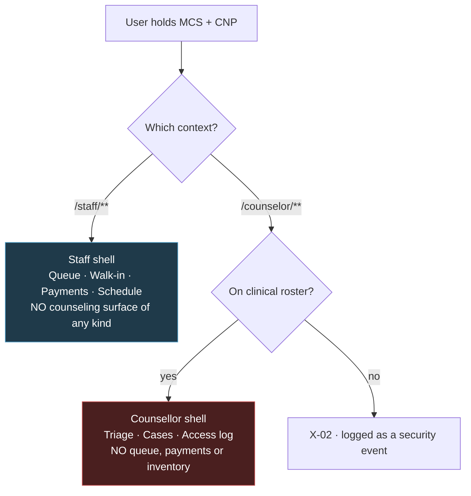

**Design rules for the dual-role case:**

1. **Context is chosen explicitly, never merged.** There is no combined dashboard, no unified inbox, no "all my work" view. The user picks a context from a switcher and the shell changes completely.
2. **The context switcher is neutral.** It reads `Staff` and `Support` — never `Counseling` — and shows **no badge or count** on either (§2.5, BR-53).
3. **No cross-context notification surfacing.** A counseling notification does not appear in the staff shell's notification bell. The bell is per-context.
4. **The browser tab title does not name the counseling context** (§1.4) — on a shared counter machine, a tab reading "Triage · Counseling" is a disclosure to anyone standing behind the desk.
5. **Sign-out clears both.** A user stepping away from a counter must not leave a counsellor session live.

## 12.4 Role-based UI checklist

For each role, before release:

- [ ] Every navigation destination resolves for this role (no dead links)
- [ ] No control appears that the server would refuse (PRM-01 alignment)
- [ ] No count, badge or empty state reveals data the role cannot read
- [ ] 404 rather than 403 wherever existence itself is confidential (PRM-04, BR-50)
- [ ] For MCS, STO, DOC and ADM: **grep the bundle for counseling components — expected result, none** (O4)
- [ ] For ADM: no screen exposes a counseling count, identifier or timing signal (PRM-09)
- [ ] For dual-role users: switching context replaces the shell entirely (EC-46)

---
# Part 13 — Accessibility

## 13.1 Target

**WCAG 2.1 Level AA for all student-facing views** (NFR-A11Y-01), plus four requirements the SRS sets above AA:

| Requirement | Above AA how |
|---|---|
| NFR-A11Y-02 | **All** functionality keyboard-operable — no "except the console" carve-out |
| NFR-A11Y-03 | Crisis banner at **7:1**, which is AAA (SC 1.4.6), not AA |
| NFR-A11Y-04 | Status **never** by colour alone — SC 1.4.1 forbids colour as the *only* visual means; this is applied absolutely via O3 |
| NFR-A11Y-05 | Kiosk legible at 3 m — no WCAG equivalent |

Staff, operator, counsellor and admin views are not exempt in practice. The same components are used, so AA conformance carries.

## 13.2 How each obligation lands

| Obligation | Accessibility effect |
|---|---|
| **O3** — `StatusBadge` = icon + text + colour, no colour-only variant | SC 1.4.1 satisfied structurally. **A greyscale print of any screen remains fully legible** — that is the test |
| **O2** — crisis banner ≥7:1, layout-mounted, non-dismissible | SC 1.4.6 (AAA) on the one element where it matters most |
| **O1** — `EstimateDisplay` requires the disclaimer | The disclaimer is real text, in the reading order, not a `title` attribute or a hover tooltip |
| **O6** — `ConfirmDialog` requires a consequence | SC 3.3.4 (error prevention) — the consequence is announced by `aria-describedby` |

## 13.3 Keyboard

Everything is operable by keyboard alone (NFR-A11Y-02, SC 2.1.1), with no keyboard trap anywhere (SC 2.1.2).

| Pattern | Keys |
|---|---|
| Global | `Tab` / `Shift+Tab` · `Enter`/`Space` activate · `Esc` closes overlays |
| Skip link | First tab stop on every page: **"Skip to main content"** (SC 2.4.1) |
| Menus, tabs, radio groups | `↑↓←→` roving tabindex, `Home`/`End` |
| Combobox | `↓↑` navigate · `Enter` select · `Esc` close and restore · results announced politely |
| Dialog | Focus trapped, background `inert`, focus returns to trigger on close |
| Bottom sheet | Same as dialog; drag is an enhancement, never the only dismissal |

**Queue console — keyboard-first** (§9.2). `↑`/`↓` move the row cursor · `Enter` fires the row's primary action · `c` check in · `s` start · `d` complete · `n` no-show · `e` emergency · `/` focus filter · `Esc` clear · `?` shortcut overlay.

Three rules make these shortcuts conformant rather than a hazard:

1. **Every shortcut has a visible button equivalent.** Shortcuts accelerate; they are never the only path (SC 2.1.1).
2. **Single-character shortcuts are disabled while focus is in a text input**, and can be turned off entirely in profile settings (**SC 2.1.4** — character key shortcuts).
3. **The `?` overlay is discoverable**, so the shortcuts are documented in the product, not in a manual nobody has.

**Focus visibility:** 2 px `--color-focus-ring` at 2 px offset, contrast **6.57:1** against white (§4.1.3) — well above SC 2.4.11's 3:1. **The focus ring is never removed.** `:focus-visible` is used so pointer users do not see rings on click, but keyboard focus is always visible.

## 13.4 Screen readers and semantics

- **Landmarks** on every page: `<header>`, `<nav>`, `<main>`, `<footer>`. One `<main>` per page (SC 1.3.1).
- **One `<h1>` per page**, headings step down without skipping.
- **Route changes** move focus to the `<h1>` and announce the new page title (§1.4) — a client-side route change is silent to a screen reader otherwise.
- **Lists are lists.** Card collections are `<ul>`/`<li>`; tables are `<table>` with `<th scope>`, `<caption>`, and `aria-sort` on sortable headers.
- **Icons** carrying meaning have adjacent text; decorative icons are `aria-hidden="true"`. **No icon is the sole label** of a control except the app-bar menu and close buttons, which carry `aria-label`.
- **Forms:** every input has a `<label for>`; help and error text linked by `aria-describedby`; errors carry `aria-invalid="true"` and `role="alert"`; required fields carry `required` and `aria-required` **and** the visible `※` (SC 3.3.2).

## 13.5 Live regions

The live queue is the hard case: it updates without user action, and a screen-reader user needs to know their position changed without being interrupted every 20 seconds.

| Surface | Politeness | What is announced |
|---|---|---|
| **Student queue position** (S-07) | `aria-live="polite"` | **Only on change**, and only the changed value: *"3 people ahead. Around 10:40 AM."* Not the whole card |
| Staff queue console (F-01) | `aria-live="polite"` on a status region | *"Serial 15 checked in."* Individual rows do **not** each announce |
| Connection indicator (§5.14) | `aria-live="polite"` | *"Working offline. Your actions are saved."* |
| Toasts | `polite` success, `assertive` error | Message text |
| Form errors | `role="alert"` | Field errors, on submit |
| **Crisis banner** | **No live region** | It is present from first render; announcing it would interrupt |
| Search results | `aria-live="polite"` | *"8 results"* |

**Throttling:** polite announcements are rate-limited to one per 10 seconds per region. A queue position recalculated on every event (FR-APT-21) would otherwise produce continuous speech.

## 13.6 Colour and contrast

Full verification table in **§4.1.3** — 28 pairs, all computed, all passing. Summary:

| Category | Minimum required | Lowest measured |
|---|---|---|
| Body text | 4.5:1 (SC 1.4.3) | 4.80:1 (muted text) |
| Large text | 3:1 | 5.36:1 |
| UI boundaries | 3:1 (SC 1.4.11) | 3.15:1 (input border on surface) |
| **Crisis banner** | **7:1 (NFR-A11Y-03)** | **11.20:1** |
| Focus ring | 3:1 (SC 2.4.11) | 6.57:1 |

**Never colour alone** (SC 1.4.1, NFR-A11Y-04): status badges carry icon + text (O3) · form errors carry a border, an icon and a message · sorted columns carry a chevron and `aria-sort` · selected tabs carry an underline and weight change · emergency rows carry a border and a badge · the connection indicator carries an icon and text.

## 13.7 Motion, timing, input

- **`prefers-reduced-motion` honoured completely** (§4.6, SC 2.3.3). Skeletons stop pulsing; no spinner rotates.
- **No content flashes more than three times per second** (SC 2.3.1). Nothing in this design flashes at all.
- **Session timeout** (FR-AUTH-06 — 30 min students, 15 min CNP/ADM) warns at 2 minutes remaining with an extend option (**SC 2.2.1**). The warning is a dialog with focus moved to it, and **the counselling context warns identically** — a counsellor losing a note draft to a silent timeout is the scenario §6.6's local draft exists for.
- **No time limit on any form.** The crisis acknowledgement expires in 30 minutes server-side (VR-75), and expiry re-shows the interstitial rather than discarding the request (§3.6).
- **Pointer gestures:** drag-to-dismiss on bottom sheets is an enhancement; a close button always exists (SC 2.5.1). No path-based or multipoint gesture anywhere.
- **Orientation never locked** (SC 1.3.4); **200% zoom** and **text-spacing overrides** verified in §11.8.

## 13.8 Verification plan

Automated checks are necessary and not sufficient. Both are in scope before go-live.

| Check | Method | Gate |
|---|---|---|
| Contrast | `contrast.py` over the token set | CI — fails the build |
| Axe/Lighthouse a11y | Automated, every route | CI — zero violations |
| **320 px crisis banner** | Snapshot at 320 × 568, assert the banner's bounding box ends above the fold | **CI — this is FR-CNS-04 as a test** (§11.6) |
| Greyscale legibility | Screenshot every status surface desaturated, review | Manual, pre-release |
| Keyboard-only pass | Complete every Part 3 flow with the mouse unplugged | Manual, pre-release |
| Screen reader | NVDA/Firefox and VoiceOver/Safari over the five budgeted flows | Manual, pre-release |
| 200% zoom | Every route at 1280 px | Manual, pre-release |
| Kiosk at 3 m | Physical check on the installed panel | Manual, pre-install |

**Automated tooling catches roughly a third of WCAG issues.** The manual rows are where the real failures are found — particularly the greyscale pass, which is the only reliable test of O3.

---

# Part 14 — UX Improvements

Proposals **beyond** the requirements. Each is labelled so it reads as a recommendation, not as scope the SRS already agreed.

## 14.1 Recommended for Phase 1 — low cost, high value

| # | Proposal | Why | Cost |
|---|---|---|---|
| **U1** | **"Cancelling never counts against you"** on every cancel surface | FR-APT-18 and BR-12 already say cancellation carries no penalty. Students who fear a penalty don't cancel — producing exactly the no-shows the penalty exists to prevent. Saying it converts a silent policy into behaviour change | Copy only |
| **U2** | **Disabled sessions on S-02 with the reason shown** | VR-22 rejects a second booking with the same doctor that day. Showing it before the tap saves a 409 the student can't act on | Small — the API already returns `studentAlreadyBooked` |
| **U3** | **Type-to-find on the queue console with no search box** | Saves the interaction that NFR-USE-01's budget of one cannot spare | Small |
| **U4** | **Show the interaction count in the `?` shortcut overlay** | Makes NFR-USE-02's 30-minute training target self-service | Small |
| **U5** | **`[ Record a correction ]` instead of a disabled "Edit"** | FR-PAY-10 and FR-MED-21 forbid mutation. A disabled Edit invites a support ticket; a correction button teaches the model | Copy + routing |
| **U6** | **Print styles for F-07 and F-13 only** | Both get printed for the paper fallback (BR-66, ASM-18). Everything else prints acceptably by default | Small CSS |
| **U7** | **Freshness stamp turns warning past 90 s on the kiosk** | A frozen wall display is worse than an obviously stale one | Small |
| **U8** | **Counseling entry labelled "Support", no status on the dashboard face** | The dashboard is the screen most likely to be glanced at over a shoulder. BR-53's discretion principle applied to a surface the SRS didn't anticipate (§9.1) | Copy + one navigation decision |

## 14.2 Recommended, deferred to Phase 2

| # | Proposal | Why deferred |
|---|---|---|
| **U9** | **SSE for live queue** instead of 20 s polling | ARCHITECTURE §5.4 specifies SSE; this document uses polling because the user scoped SSE out of the API document. Polling meets NFR-PERF-05's 30 s staleness bound, so this is an efficiency gain, not a compliance one |
| **U10** | **Bangla localisation** | NFR-LOC-02 and ASM-15 fix Phase 1 as English-only. Strings are externalised (NFR-LOC-01) and the font stack already renders Bangla (§4.2.1), so the groundwork is done |
| **U11** | **Estimate accuracy shown to students** ("usually within 10 minutes") | NFR-ACC-01 targets ±15 min for 75% of appointments and NFR-ACC-02 exposes it to the Administrator. Showing measured accuracy to students would build trust in the estimate — but only once there is data to show, which means after go-live |
| **U12** | **Dark mode** | Token layer supports it; every pair would need re-verification against §4.1.3. Not Phase 1 scope (§4.9) |
| **U13** | **Push notifications via the PWA** | CON-08 rules out paid channels; web push is free, but adds a permission prompt and a service-worker surface that Phase 1 doesn't need |
| **U14** | **Save a preferred doctor** | Would shorten booking below 5 interactions — but adds a preference store and a "why is this here?" question for one-time users |

## 14.3 Considered and rejected

Recorded so they are not re-proposed.

| Proposal | Why rejected |
|---|---|
| **Calendar-grid date picker for booking** | Adds an interaction to a flow already at the NFR-USE-04 budget of 5. The scrolling day list costs zero |
| **Confirmation dialog on check-in** | Doubles the interaction count and breaks NFR-USE-01 outright. Check-in is non-destructive and reversible (FR-APT-34) |
| **Toast on every queue console action** | Redundant — the row already changed — and it spends motion budget inside NFR-PERF-04's 1 second |
| **Counseling badge/count in navigation** | A number next to "Support" is a disclosure to anyone looking at the screen (§2.5, BR-53) |
| **Merging staff and counsellor work into one dashboard for dual-role users** | EC-46 forbids counseling data in a staff-context interface. The union would be the violation |
| **"Are you sure?" as a generic confirmation** | NFR-USE-08 requires the consequence to be named. O6 makes it a required prop |
| **Infinite scroll on audit, ledger and access logs** | Records someone is auditing need a stable, countable position (§5.13) |
| **Showing a suspended student's status during walk-in registration** | FR-APT-38 requires registration to succeed. Surfacing the suspension invites hesitation at the counter (§10.3 F-02) |
| **Bulk actions on the queue console** | NFR-AUD-01 requires every state change to be individually attributable |
| **A student-facing "request this medicine" button** | FR-MED-09 — Phase 1 has no reservation, and no affordance may imply one |

---

# Part 15 — Traceability

## 15.1 Interface requirement → screen

| Requirement | Screens |
|---|---|
| FR-UI-01 responsive from 320 px | All — §11.6 |
| FR-UI-02 role-appropriate context | §12.2, all contexts |
| FR-UI-03 `DD MMM YYYY`, 12-hour, BST | §5.7, all date/time surfaces |
| FR-UI-04 public queue display | **P-04** (§9.6) |
| FR-UI-05 availability without login | **P-01**, P-02 |
| FR-DASH-01…05, 08 | **S-01** (§9.1) |
| FR-DASH-06/07 public view | **P-01**, P-04 |
| FR-APT-01…08 booking | S-02, S-03, S-04, S-05 |
| FR-APT-15…18 cancellation | S-08 |
| FR-APT-19…25 queue and estimate | S-07, F-01 |
| FR-APT-26…34 staff console | **F-01**, F-03, F-04, F-05 |
| FR-APT-35…42 walk-in and emergency | **F-02**, F-04 |
| FR-PAY-01…10 | F-06, F-07, F-08, S-12 |
| FR-MED-01…09 student-facing | P-02, P-03, S-09, S-10 |
| FR-MED-10…28 operator | O-01…O-09 |
| FR-CNS-01…08 intake | P-05, S-15, **S-16** |
| FR-CNS-06 crisis interstitial | **S-17** |
| FR-CNS-11…17 status and sessions | S-18, S-19, C-07 |
| FR-CSE-01…09 triage | **C-01**, C-02, C-03 |
| FR-CSE-10…23 case management | C-04, C-05, C-06, C-07, C-08 |
| FR-CSE-15/16 access log | **C-09** |
| FR-NTF-01…08 | S-11 |
| FR-ADM-01…09 | A-01, A-05, A-06, A-07, A-11 |
| FR-AUD-01…07 | A-08, A-09, A-10, C-09 |
| FR-AUTH-01…15 | P-06, P-07, P-08, S-13, A-02, A-03, A-04 |

## 15.2 Usability NFR → measured result

| NFR | Budget | Design | Where |
|---|---|---|---|
| **NFR-USE-01** | Check-in, 1 interaction, ≤15 s | **1 interaction, ~13 s** | §3.3, §9.2 |
| **NFR-USE-02** | Console competence in 30 min | One labelled button per permitted transition; `?` overlay | §9.2 |
| **NFR-USE-03** | Dispense ≤4 interactions | **4 with override, 3 without** | §3.5, O-06 |
| **NFR-USE-04** | Book ≤5 interactions, ≤60 s | **5 with optional reason, 4 without** | §3.2, S-02…S-05 |
| **NFR-USE-05** | Counseling request ≤6, 2 mandatory | **5 interactions, 2 mandatory** | §3.6, S-16 |
| **NFR-USE-06** | Errors state what and what next | Envelope → UI mapping | §6.2 |
| **NFR-USE-07** | Counseling copy professionally reviewed | Flagged draft throughout Parts 10.2, 10.5 | §0.6 |
| **NFR-USE-08** | Destructive actions name the consequence | `ConfirmDialog` requires `consequence` | **O6**, §5.5 |
| **FR-APT-36** | Walk-in ≤3 mandatory fields | **2 common / 3 fallback** | §3.4, F-02 |
| **FR-CNS-08** | Only category and urgency mandatory | **Exactly 2** | S-16 |

**Three flows sit exactly at budget** — booking (5), walk-in (3), dispensing (4). Any step added to those breaks a critical requirement.

## 15.3 Accessibility NFR → mechanism

| NFR | Mechanism | Verified by |
|---|---|---|
| NFR-A11Y-01 WCAG 2.1 AA | Part 13 throughout | Axe/Lighthouse in CI + manual passes (§13.8) |
| NFR-A11Y-02 keyboard-only | §13.3, console shortcuts with visible equivalents | Keyboard-only pass, pre-release |
| NFR-A11Y-03 4.5:1 / **7:1 crisis** | §4.1.3 — 28 pairs computed; crisis measures **11.20:1** | `contrast.py` in CI |
| NFR-A11Y-04 never colour alone | **O3** — `StatusBadge` has no colour-only variant | Greyscale screenshot pass |
| NFR-A11Y-05 kiosk at 3 m | 120 px numeral (§4.2.2, §11.7) | Physical check pre-install |
| NFR-COMP-03 no horizontal scroll ≥320 px | Mobile wireframes drawn at 32 chars; tables → cards | 320 px snapshot in CI |
| NFR-LOC-03 Bangla renders | System font stack (§4.2.1) | Manual, per platform |

## 15.4 The six obligations → enforcement

| # | Obligation | Enforced by | Fails how |
|---|---|---|---|
| **O1** | Estimate never a guarantee | `EstimateDisplay.disclaimer` required, no default | Compile error |
| **O2** | Crisis banner every counseling screen | Layout-mounted; 320 px snapshot test | CI test failure |
| **O3** | Status never by colour alone | `StatusBadge` requires icon + label | Compile error |
| **O4** | No counseling outside counsellor context | Separate bundle, separate client; DR-3 build check | Build failure |
| **O5** | Quantities only for STO/ADM | `MedicineResultPublic` has no quantity prop | Compile error |
| **O6** | Destructive actions name consequences | `ConfirmDialog.consequence` required | Compile error |

**Five of the six fail at build time.** That is the point of specifying them as component shapes rather than as review checklist items — a reviewer can miss a screen, and a compiler cannot.

---

## Document Control

| | |
|---|---|
| **Title** | Frontend Experience Specification — DIU CampusCare |
| **Version** | 1.0 |
| **Status** | For review |
| **Screens specified** | 76 across 6 role contexts + 1 kiosk |
| **Components specified** | 16 primitives, 5 card types, 8 tables, 12 forms |
| **Colour pairs verified** | 28 of 28 passing |
| **Preceded by** | PROJECT_PLANNING → SRS → ARCHITECTURE → DATABASE → API |
| **Next** | Implementation of `apps/web` per ARCHITECTURE §6.4 |

**Review gates before implementation:**

1. **Counseling copy sign-off (NFR-USE-07, CON-04, OI-01)** — every user-facing string in §10.2 (S-15…S-19) and §10.5 (C-01…C-09), plus the `CrisisBanner`, `EXISTING_REQUEST_OPEN` and session-decline copy, reviewed by DIU counseling professionals. **All of it is currently draft.**
2. **[R3] crisis protocol (EC-48, BR-68)** — `CrisisBanner` and S-17 render content the development team does not author. Absent [R3], the counseling service does not deploy and its routes 404.
3. **Staff walkthrough of F-01 (CON-01)** — the queue console tested against a real rush with real staff before build. This is the screen the project's top risk lands on, and 30 minutes with a paper prototype is cheaper than discovering it after go-live.
4. **Accessibility gates wired into CI** — `contrast.py`, the 320 px crisis-banner snapshot, and Axe, before the first screen is merged.
