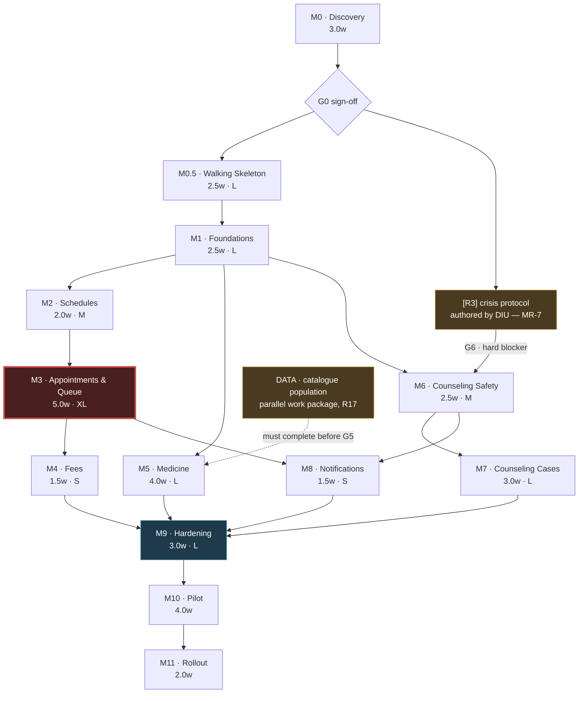

# Implementation Roadmap
## DIU CampusCare — Smart Medical & Counseling Management System

| | |
|---|---|
| **Document** | Implementation Roadmap |
| **Version** | 1.0 |
| **Status** | For review |
| **Depends on** | [PROJECT_PLANNING.md](PROJECT_PLANNING.md) · [SRS.md](SRS.md) · [ARCHITECTURE.md](ARCHITECTURE.md) · [DATABASE.md](DATABASE.md) · [API.md](API.md) · [FRONTEND.md](FRONTEND.md) |
| **Scope** | Phase 1 (MVP) in full engineering detail; Phases 2–3 outlined |
| **Supersedes** | Nothing. This **elaborates** PROJECT_PLANNING §24; it does not replace it |

---

# Table of Contents

| Part | Contents |
|---|---|
| **0** | [How to read this roadmap](#part-0--how-to-read-this-roadmap) |
| **1** | [Phase overview, critical path and gates](#part-1--phase-overview-critical-path-and-gates) |
| **2** | [M0 Discovery · M0.5 Walking Skeleton · M1 Foundations · M2 Schedules](#part-2--m0-m05-m1-m2) |
| **3** | [M3 Appointments & Queue · M4 Fees · M5 Medicine](#part-3--m3-m4-m5) |
| **4** | [M6 Counseling Safety · M7 Counseling Cases · M8 Notifications](#part-4--m6-m7-m8) |
| **5** | [M9 Hardening · M10 Pilot · M11 Rollout](#part-5--m9-m10-m11) |
| **6** | [Cross-cutting testing strategy](#part-6--cross-cutting-testing-strategy) |
| **7** | [Phases 2 and 3](#part-7--phases-2-and-3) |
| **8** | [Traceability and coverage](#part-8--traceability-and-coverage) |

---

# Part 0 — How to read this roadmap

## 0.1 What this document adds

Six specification documents are approved and no code exists. PROJECT_PLANNING §24 already defines milestones **M0–M11** with durations and gates, and that structure is signed off. This roadmap does not compete with it — it **elaborates** it, adding what a planning document could not yet know because the architecture, schema, API and interface had not been designed:

| Already in §24 | Added here |
|---|---|
| Milestone names, durations, gates | Task-level breakdown against **147 endpoints, 76 screens, 42 tables** |
| "Identity and authentication" | Which endpoints, which screens, which tables, in what order, with what tests |
| Critical-path notes | Per-milestone dependency graph, including the **hard blockers** that stop work rather than slow it |
| — | **Per-phase testing strategy** — the thing most often left until it is too late to do properly |
| — | **A walking-skeleton milestone** the original sequence lacks (§0.4) |

## 0.2 Roles, not headcount

CON-11 states a small, part-time team, and §24 says durations "should be re-based once team size is known". Neither is known now, so this roadmap assigns **roles**, and every duration carries an explicit re-basing rule.

| Code | Role | Commitment |
|---|---|---|
| **BE** | Backend engineer — domain, API, persistence | Core |
| **FE** | Frontend engineer — web client, all six role contexts | Core |
| **QA** | Test and quality — automation, non-functional verification | Core, can be shared |
| **DES** | Design / UX — screens, copy, accessibility | Part-time |
| **LIA** | **Counseling liaison** — a named DIU counseling professional | Part-time, **DIU-supplied** |
| **DATA** | Catalogue data owner — medicine catalogue population | Part-time, **DIU-supplied**, fixed deadline |
| **OWN** | Service owner — accepts handover, owns the system post-launch | **DIU-supplied**, named by M0 |

**Three of these seven roles are supplied by DIU, not by the development team.** LIA, DATA and OWN are the roles most likely to be assumed rather than staffed, and each has a milestone that cannot complete without them (M6, M5, M11 respectively). Securing them is M0 work, not a later concern.

**Re-basing rule.** Durations below assume roughly **2.0 FTE-equivalent** of BE+FE effort. Scale approximately linearly to 3 FTE. **Do not compress M3, M9 or M10 below their stated minimums regardless of team size** — M3 carries the most novel logic, and M9/M10 are the gates that turn working software into adopted software (§24 makes the same point; it bears repeating because they are the first things cut under pressure).

## 0.3 How complexity is expressed

Each milestone carries **T-shirt complexity** and **indicative weeks**, reconciled against §24.

| Complexity | Meaning | Signals |
|---|---|---|
| **S** | Well-understood work, low novelty | CRUD against a designed schema; one role context |
| **M** | Moderate; some novel logic or coordination | Multi-role, or one non-trivial invariant |
| **L** | Substantial; several interacting invariants | Multiple modules, concurrency, or external dependency |
| **XL** | The hard one. Novel logic with no reference implementation | Concurrency + real-time + human-factors risk simultaneously |

Complexity and duration are **not** the same axis. M10 Pilot is complexity **M** but four weeks, because it is calendar-bound observation rather than construction. M6 is complexity **M** but carries the highest consequence of error in the release.

## 0.4 The one structural change: M0.5

**§24 sequences M0 Discovery directly into M1 Foundations.** Read against ARCHITECTURE and DATABASE, that sequence has a gap: M1 is described as "identity, roles, permission isolation, audit skeleton, student dashboard shell" — feature work — but before any of it can be written the project needs:

- **Two deployable units** with separate credentials to two separate PostgreSQL databases (ADR-001) — the counseling vault is not a module to be added later; it is a second process, and retrofitting the separation is exactly the migration ADR-001 exists to avoid
- **CI enforcing DR-1…DR-7**, including the DR-7 architecture test that enumerates command handlers and fails the build if one lacks an audit path
- **The cross-cutting kernel** — authorization PDP with deny-by-default, policy/config store, audit recorder, event bus, transactional outbox, error envelope, correlation IDs
- **Migrations, roles and grants** across both databases (DATABASE §11), including the RLS and column-level grants that enforce FR-MED-05
- **The design-token layer and primitive components**, plus the three accessibility gates that must be in CI before the first screen is merged (FRONTEND §13.8)

That is two to three weeks of work with no user-visible output. Folding it into M1 produces a milestone that mixes platform and features, blows its estimate, and — the real risk — invites the platform half to be skipped under time pressure, because nobody demos a CI pipeline.

**So this roadmap inserts M0.5 "Walking Skeleton" between M0 and M1**, and reduces M1 from 3.0 to 2.5 weeks since the kernel work moves out of it.

| | §24 | This roadmap |
|---|---|---|
| Phase 1 total | ~34 weeks | **~36.5 weeks** |
| Net change | | **+2.5 weeks** |

That is an honest +2.5 weeks, and it should be defended rather than absorbed. The alternative is not a faster project; it is the same work done inside M1 without a name, and DR-1…DR-7 quietly not enforced.

## 0.5 Gates are the schedule

§24 puts it correctly: *"The gates matter more than the dates."* This roadmap carries **nine hard gates**. A gate is not a review meeting — it is a condition that stops work.

Three of them stop work **completely**:

| Gate | Blocks | Why it is absolute |
|---|---|---|
| **G0** — written sign-off from Medical Center, counseling service and DIU IT | All development | §24. Without it the team is building on assumptions that have never been tested with the people who must use the result |
| **G6** — [R3] crisis protocol authored and signed off by counseling professionals | All of M6, M7 | MR-7, ASM-09, BR-68, EC-48. The counseling service **refuses to start** without the protocol content (ARCHITECTURE §6.3). This is enforced in code, not by policy |
| **G9** — security and privacy review passed | Any real student data in the counseling module | §23 item 9. The module handles no real data before this passes |

## 0.6 Conventions

- **Milestone IDs** follow §24 (`M0`…`M11`), plus the inserted `M0.5`.
- **Task IDs** are `M3-T04` — milestone, then task sequence.
- References are to section numbers in the six approved documents: `API §4.2`, `FRONTEND §10.2 S-04`, `DATABASE §9`, `SRS FR-APT-03`.
- **Bold requirement IDs** mark the ones a reviewer should check first.
- Each milestone carries exactly six fields: **Objectives · Tasks · Dependencies · Estimated Complexity · Deliverables · Testing Strategy.**

---
# Part 1 — Phase Overview, Critical Path and Gates

## 1.1 Phase 1 at a glance

| # | Milestone | Complexity | Weeks | Primary roles | Gate |
|---|---|---|---|---|---|
| **M0** | Discovery & Sign-off | M *(organisationally heavy)* | 3.0 | All + DIU | **G0** |
| **M0.5** | **Walking Skeleton** *(inserted, §0.4)* | **L** | 2.5 | BE, FE, QA | G0.5 |
| **M1** | Foundations — identity & access | L | 2.5 | BE, FE | G1 |
| **M2** | Schedules | M | 2.0 | BE, FE | G2 |
| **M3** | **Appointments & Queue** | **XL** | 5.0 | BE, FE, QA | **G3** |
| **M4** | Fees | S | 1.5 | BE, FE | G4 |
| **M5** | Medicine | L | 4.0 | BE, FE, DATA | **G5** |
| **M6** | Counseling — Safety & Intake | M *(highest consequence)* | 2.5 | BE, FE, **LIA** | **G6** |
| **M7** | Counseling — Triage & Cases | L | 3.0 | BE, FE, LIA | G7 |
| **M8** | Notifications | S | 1.5 | BE | G8 |
| **M9** | Hardening & Review | L | 3.0 | All | **G9** |
| **M10** | Pilot | M *(calendar-bound)* | 4.0 | All + DIU | **G10** |
| **M11** | Rollout | S | 2.0 | All + OWN | G11 |
| | **Phase 1 total** | | **36.5** | | |

Roughly **13 of 36.5 weeks (36%)** are discovery, hardening, pilot and rollout rather than feature construction. §24 makes the case for defending that proportion; the roadmap preserves it deliberately.

## 1.2 Dependency graph



**Reading the graph:**

- **The critical path is M0 → M0.5 → M1 → M2 → M3 → M4 → M9 → M10 → M11 = 25.5 weeks.** Everything else has float.
- **M5 Medicine branches off M1**, not M3. It shares only identity and the kernel, so it can run in parallel with M2/M3 if a second engineer exists. With one engineer it is sequential and the total holds at 36.5.
- **M6 branches off M1 too**, but is gated on `[R3]`, which is authored by DIU and not by this team. **That authoring should start at G0**, not at M6 — it is the single most common way this schedule slips, because it looks like a document rather than a dependency.
- **Catalogue population (DATA) is a parallel work package** that can start during M1 and must finish before G5. R17 records that it is routinely underestimated. It is drawn on the graph so it cannot be forgotten.

## 1.3 Gate register

| Gate | At end of | Condition | If it fails |
|---|---|---|---|
| **G0** | M0 | **Written sign-off from Medical Center, counseling service and DIU IT.** MR-3/4/5/7/10/11/13 decided. Sponsor and post-launch owner named. Baseline measured (CON-09, MR-22) | **No development starts.** Re-plan; do not proceed on assumptions |
| **G0.5** | M0.5 | Both deployables build and deploy; CI enforces DR-1…DR-7; migrations run on both databases; one vertical slice renders end-to-end; three accessibility gates green | Fix before M1. Feature work on a broken platform compounds |
| **G1** | M1 | A user of each of the six roles can sign in and sees only their own domain. Permission matrix passes as a table-driven test (**PRM-01…15**) | Blocks everything |
| **G2** | M2 | Staff publish a week of schedules and take a doctor off duty cleanly, with every affected booking listed before confirmation (**FR-SCH-07**) | Blocks M3 |
| **G3** | M3 | **A receptionist runs a simulated full clinic day — 25 patients, 8 walk-ins, 1 emergency, 3 no-shows — without touching paper.** Check-in measured ≤15 s (**NFR-USE-01**) | **Do not proceed to M4.** This gate is the MVP thesis; failing it means redesigning, not continuing |
| **G4** | M4 | A day's collections reconcile against counted cash, with a recorded discrepancy path | Blocks M9 |
| **G5** | M5 | **Catalogue populated with real data** and the operator completes a full working day in the system | Blocks M9. If catalogue data is late, this gate slips — hence the DATA work package |
| **G6** | M6 | **DIU counseling professionals sign off on every safety message and the escalation protocol.** [R3] present in the deployment | **M6 and M7 do not start.** Re-sequence; never build speculatively (§24) |
| **G7** | M7 | A counselor runs a full triage-to-session cycle; the access log demonstrably records **every** read, including 404s | Blocks M9 |
| **G8** | M8 | Every trigger fires; **no counseling notification reveals the service in its subject or preview** (FR-NTF-05) | Blocks M9 |
| **G9** | M9 | **Security and privacy review passes.** Permission isolation, performance on mid-range Android over 3G, connectivity loss, accessibility | **The counseling module handles no real student data before this passes.** Non-negotiable |
| **G10** | M10 | §22.3 criteria met; **no kill criterion triggered** | Stop and re-plan rather than roll out |
| **G11** | M11 | Paper register retired at the pilot site; named owner accepted handover | Phase 1 stays open |

## 1.4 Where the risk sits

Risk IDs are from PROJECT_PLANNING §17. This maps each material risk to the milestone that carries it, so mitigation is scheduled rather than hoped for.

| Milestone | Risks carried | Mitigation scheduled in this roadmap |
|---|---|---|
| **M0** | R8 owner, R10 scope, R11 SSO, R22 baseline | G0 requires a named owner and a documented SSO fallback before any code |
| **M3** | **R3 staff abandonment**, R4 capacity, R7 estimate accuracy, R12 no-shows | Receptionist co-design **in the milestone**, not after; simulated clinic day as the gate; estimate accuracy instrumented from day one |
| **M5** | **R5 stale inventory**, R17 catalogue entry | Freshness stamps in the UI contract; DATA as a named parallel work package with a deadline |
| **M6/M7** | **R1 crisis channel**, **R2 confidentiality**, R9 counselor rejection, R14 notification leakage | LIA embedded as a role; G6 blocks the build; discreet-content guard tested as a security control |
| **M9** | R2, R16 performance | Privacy review as a hard gate; performance tested on real mid-range Android over throttled 3G |
| **M10** | R3, R7 | Kill criteria evaluated explicitly at week four |
| **M11** | R8 | Handover to a named owner is the exit condition |

**M3 concentrates four risks including the release's only Critical-probability one (R3).** §24 says to give it the most experienced person and the most slack; this roadmap adds that its gate is a rehearsal with a real receptionist, not a demo to the team.

---
# Part 2 — M0, M0.5, M1, M2

---

## M0 · Discovery & Sign-off

> **3.0 weeks · Complexity M** *(low technical, high organisational)* · Roles: all + DIU stakeholders
> **Gate G0 — no development starts without written sign-off.**

### Objectives

1. Convert the 22 open **MR-\*** items into decisions, or into explicitly deferred items with owners.
2. **Measure the baseline.** CON-09 and MR-22 record that no baseline data exists, and §22.3's success criteria are unmeasurable without it.
3. Validate the two unproven premises in PROJECT_PLANNING §3.3 — if students are not actually deterred by uncertainty, or doctor capacity is the real constraint (ASM-13), the product thesis changes before any code is written.
4. **Secure the three DIU-supplied roles**: counseling liaison (LIA), catalogue owner (DATA), post-launch service owner (OWN).
5. Start `[R3]` authoring — it gates M6 and is authored by DIU, not the team.

### Tasks

| ID | Task | Owner | Notes |
|---|---|---|---|
| M0-T01 | Stakeholder interviews — Medical Center, store, counseling, DIU IT, Accounts | All | Persona 5 (receptionist) is the make-or-break user; interview first |
| M0-T02 | **Two-week baseline measurement** — daily volume, wait times, walk-in ratio, no-show rate | QA + DIU | MR-22, CON-09. Establishes the denominators for §22.3 |
| M0-T03 | Resolve MR-3/4/5 — no-show, cancellation and fee policy | Product + Medical Center + Accounts | MR-5 (pay-to-book vs pay-on-arrival) changes the booking flow fundamentally |
| M0-T04 | Resolve **MR-10 identity approach** — SSO or standalone, with a documented fallback | DIU IT | R11. Hard blocker for M1. ASM-03 |
| M0-T05 | Resolve MR-11 eligibility, MR-12 store hours, MR-13 catalogue classification | DIU | MR-13 also unblocks the DATA work package |
| M0-T06 | **Commission [R3] crisis and escalation protocol** | Counseling service | MR-7, ASM-09. **Starts now, not at M6** |
| M0-T07 | Resolve MR-17 accessibility standard and MR-16 language | Product | Both already answered by the specs (WCAG 2.1 AA, English) — confirm formally |
| M0-T08 | Resolve MR-18 offline procedure and MR-19 support process | Product + IT | MR-18 is already designed (ARCHITECTURE §5.6); confirm the paper fallback with staff |
| M0-T09 | Validate ASM-13 — measure whether doctor-hours meet demand | Product | **If false, pure slot booking is the wrong model** and M3 must be redesigned |
| M0-T10 | Confirm ASM-01 / OI-04 single medical center | Administration | Blocking for FR-SCH-\*, FR-MED-\* |
| M0-T11 | Name sponsor, service owner (OWN), counseling liaison (LIA), catalogue owner (DATA) | DIU | R8. An unnamed owner is an unstaffed one |
| M0-T12 | Provision environments — dev, staging, production; two databases each | BE + DIU IT | Long lead time; start early |
| M0-T13 | Written scope sign-off against SRS §1.2 | All | G0 |

### Dependencies

- **Inbound:** none. This is the start.
- **Outbound:** everything. M0-T04 blocks M1; M0-T06 blocks M6; M0-T05 blocks the DATA package and M5; M0-T09 can invalidate M3's design.
- **External:** DIU stakeholder availability is the schedule risk here, not team capacity.

### Estimated Complexity

**M — 3.0 weeks.** Technically trivial, organisationally the hardest milestone in the release. The duration is bounded by stakeholder calendars, so it does not compress with a larger team. **If MR-7 or MR-10 cannot be resolved in three weeks, extend M0 rather than starting development** — that is the whole purpose of G0.

### Deliverables

- Decision register covering MR-1…MR-22, each Decided / Deferred-with-owner
- Baseline measurement report with the numbers §22.3 will be judged against
- ASM-13 capacity finding, with a written implication for M3
- Named sponsor, OWN, LIA, DATA
- `[R3]` authoring commissioned with a delivery date **before M6**
- Provisioned dev / staging / production environments
- **Signed scope document — G0**

### Testing Strategy

No software to test. Verification is **evidential**:

| What | How |
|---|---|
| Baseline is real, not estimated | Raw observation sheets retained; two independent counts on at least two days |
| Decisions are decisions | Every MR item has a named decider and a date, not a "to be confirmed" |
| §22.3 targets are measurable | Each of the nine criteria traced to a baseline figure and a measurement method **before** the pilot, not during it |
| ASM-13 conclusion is defensible | Capacity finding stated as a number (slots/week vs demand/week), not an impression |

---

## M0.5 · Walking Skeleton

> **2.5 weeks · Complexity L** · Roles: BE, FE, QA
> **Inserted by this roadmap — see §0.4.** Gate G0.5.

### Objectives

1. Stand up **both deployable units** with separate credentials to separate databases, so ADR-001's isolation exists from the first commit rather than being retrofitted.
2. Make the architecture's dependency rules **mechanically enforced** — DR-1…DR-7 failing the build, not documented in a wiki.
3. Build the cross-cutting kernel every later milestone depends on.
4. Prove the stack with **one trivial vertical slice** end to end.
5. Put the three accessibility gates into CI **before the first screen is merged**.

### Tasks

| ID | Task | Owner | Reference |
|---|---|---|---|
| M0.5-T01 | Monorepo scaffold — `apps/core-api`, `apps/counseling-api`, `apps/web`, shared packages | BE + FE | ARCHITECTURE §6 |
| M0.5-T02 | **Two databases, two credential sets.** Migration tooling; `campuscare_core` and `campuscare_counseling`; roles and grants; **verify the core app role has no CONNECT on the vault** | BE | DATABASE §9–§11, ADR-001 |
| M0.5-T03 | Schema migration v1 — all 42 tables, enums, constraints, indexes, triggers, materialized views | BE | DATABASE §9, §10 |
| M0.5-T04 | **Architecture tests in CI** — DR-1 kernel independence, DR-2 module boundaries, DR-3 no counseling import, DR-4 no business constants in code, DR-6 domain framework-freedom, **DR-7 every command handler emits audit** | BE + QA | ARCHITECTURE §3.2 |
| M0.5-T05 | Kernel: **authorization PDP with deny-by-default**, permission matrix as declarative data | BE | ARCHITECTURE §8, SRS §3.5.2 |
| M0.5-T06 | Kernel: policy/config store with range validation at save (VR-94) | BE | ARCHITECTURE §3.3 |
| M0.5-T07 | Kernel: audit recorder, write-only sink | BE | FR-AUD-01/02 |
| M0.5-T08 | Kernel: in-process event bus + **transactional outbox** | BE | ADR-006 |
| M0.5-T09 | Kernel: **uniform error envelope**, taxonomy mapper, correlation IDs, redaction filter | BE | API §0.4/0.5, ARCHITECTURE §10, §11.2 |
| M0.5-T10 | Kernel: server-side session store, cookie handling, CSRF | BE | API §0.2 |
| M0.5-T11 | Feature flags `counseling.enabled`, `notifications.email.enabled` — **routes 404 when off** | BE | ARCHITECTURE §3.4, BR-68 |
| M0.5-T12 | Design-token layer + primitive components (Button, Input, StatusBadge, Banner) | FE + DES | FRONTEND §4, §5 |
| M0.5-T13 | **Accessibility gates in CI** — `contrast.py`, axe on every route, **320 px crisis-banner snapshot** | QA + FE | FRONTEND §13.8 |
| M0.5-T14 | Performance budget check in CI — 500 KB compressed per student view | QA | NFR-PERF-02 |
| M0.5-T15 | **Vertical slice:** `GET /api/v1/public/announcements` → rendered on P-01, with audit, correlation ID and error envelope exercised | BE + FE | Proves the whole stack |
| M0.5-T16 | Deploy pipeline to staging for both units + background worker | BE | ARCHITECTURE §1.2 |

### Dependencies

- **Inbound:** **G0** (environments from M0-T12; identity approach from M0-T04 shapes T10).
- **Outbound:** every subsequent milestone. Nothing after this is safe to build without T04's architecture tests.
- **Note:** `counseling-api` is scaffolded here but **has no domain logic and is flag-off**. It exists so that DR-3 is enforceable from the start.

### Estimated Complexity

**L — 2.5 weeks.** No novel algorithms, but broad and unforgiving: a mistake in the kernel is paid for in every later milestone. The DR-7 audit-emission test (T04) is the single highest-leverage item — it makes FR-AUD-01 and BR-60 structural rather than a habit.

### Deliverables

- Two deployable units building, testing and deploying to staging
- Both databases migrated, with roles and grants applied and **isolation verified by test**
- CI enforcing DR-1…DR-7, three accessibility gates, and the performance budget
- Cross-cutting kernel: PDP, policy, audit, events, outbox, errors, sessions, flags
- Design tokens and four primitive components
- One vertical slice live on staging

### Testing Strategy

This milestone is mostly **tests about tests** — the harness the rest of the project relies on.

| Layer | What is tested | Gate |
|---|---|---|
| **Architecture** | DR-1…DR-7 as build-failing assertions. DR-7 enumerates command handlers and fails if one lacks an audit path | CI, blocking |
| **Isolation** | **A test asserts the core app's DB role cannot connect to `campuscare_counseling`.** Run it in CI forever — this is ADR-001's guarantee, and a future grant could silently undo it | CI, blocking |
| **Schema** | Migrations run forward and backward on a clean database; every CHECK, EXCLUDE, partial unique index and trigger asserted individually | CI |
| **Authorization** | **The SRS §3.5.2 matrix loaded as test data**: for every (role × resource × operation) cell, assert permit or deny. Absence of a rule must deny (PRM-02) | CI, blocking |
| **Error envelope** | Every taxonomy class maps to the right status and shape; **no stack trace, constraint name or internal ID appears in any response** (NFR-SEC-07) | CI |
| **Accessibility** | `contrast.py` over the token set; axe on all routes; 320 px banner snapshot | CI, blocking |
| **Performance** | Bundle size budget per student-facing route | CI |
| **Smoke** | The vertical slice returns 200 and renders on staging | CI |

---

## M1 · Foundations — Identity & Access

> **2.5 weeks · Complexity L** *(reduced from §24's 3.0 — kernel work moved to M0.5)* · Roles: BE, FE
> Gate G1.

### Objectives

1. Authenticate all seven roles, by institutional SSO with a working password fallback.
2. Make the permission matrix real and **verifiable as data**.
3. Deliver account lifecycle administration, including the counseling-role gate that ADR-012 depends on.
4. Ship the student dashboard shell and public views — the first thing anyone sees.

### Tasks

| ID | Task | API | Screens |
|---|---|---|---|
| M1-T01 | SSO authorization-code flow with PKCE and state verification | §1.1, §1.2 | P-06 |
| M1-T02 | Local credential fallback — Argon2id, **generic 401, no account enumeration** | §1.3 | P-06 |
| M1-T03 | Lockout after 5 failures, 15 min, with email notice | §1.3 | P-06 |
| M1-T04 | Session lifecycle — server-side, revocable, role-based idle timeouts | §1.4, §1.5 | — |
| M1-T05 | Password reset — single-use, time-limited, **identical response whether or not the account exists** | §1.7, §1.8 | P-07, P-08 |
| M1-T06 | Own profile read/update with optimistic concurrency | §1.9, §1.10 | S-13 |
| M1-T07 | Account administration — list, create, read, update | §1.11–§1.14 | A-02, A-03 |
| M1-T08 | Account lifecycle — suspend, activate, **deactivate with impact confirmation** (VR-05, EC-06) | §1.15–§1.17 | A-03 |
| M1-T09 | Role catalogue, grant and revoke; **VR-04 gate on CNP**; last-admin protection | §1.18, §1.19 | A-04 |
| M1-T10 | Student dashboard shell — **Core panels only**, counseling panel deferred to M6 | §2.1 | S-01 |
| M1-T11 | Public views — availability shell, announcements, service calendar | §2.2, §2.5, §2.6 | P-01 |
| M1-T12 | Navigation shells for all six role contexts | — | FRONTEND §2 |
| M1-T13 | System screens — 404, no-access, error, session expired | — | X-01…X-05 |

### Dependencies

- **Inbound:** **G0.5**; MR-10 identity decision (M0-T04); MR-11 eligibility (M0-T05).
- **Outbound:** **every feature milestone.** Nothing else can be built without authentication and the PDP.
- **Critical:** M1-T09's CNP gate is a precondition for M7's clinical roster (ADR-012). Granting `CNP` in Core must **not** by itself open the vault, and the UI must say so.

### Estimated Complexity

**L — 2.5 weeks.** SSO integration carries external risk (R11); the documented fallback from M0-T04 is what keeps this from becoming a blocker. Account administration is broad but well-specified CRUD.

### Deliverables

- All seven roles authenticate; six role shells render
- Account lifecycle complete with audited transitions
- **Permission matrix passing as a table-driven test**
- Student dashboard and public availability shells
- System error screens

### Testing Strategy

| Layer | Focus |
|---|---|
| **Unit** | Lockout counter, session expiry, password complexity (VR-02), email format (VR-01) |
| **Integration** | Session revocation takes effect on the next request (**PRM-15**); deactivation cancels bookings and emits `AccountDeactivated` (EC-06) |
| **Contract** | Every §1 endpoint against API.md — shape, status codes, error envelope |
| **Security** | **Account enumeration:** assert the 401 and the reset response are byte-identical for existing and non-existent accounts · **VR-04:** a CNP grant to a non-clinical account is refused *and logged as a security event* · last-admin removal refused |
| **Table-driven** | SRS §3.5.2 re-run with real sessions, not just the PDP unit |
| **E2E** | Sign in as each of the six roles; confirm each sees only its own navigation and is 403/404'd elsewhere |
| **Accessibility** | Sign-in and reset flows keyboard-only; criteria checklist announced correctly |

**Gate G1:** a user of each role signs in and sees only their own domain.

---

## M2 · Schedules

> **2.0 weeks · Complexity M** · Roles: BE, FE
> Gate G2.

### Objectives

1. Let staff maintain doctors, recurring rosters and date-specific sessions — **with no doctor login required** (CON-02, R6).
2. Derive bookable slots correctly, reserving the walk-in allocation (BR-16).
3. Deliver the **two-step leave flow**, which is the milestone's real content.
4. Enforce the non-service calendar so booking is blocked with a visible reason.

### Tasks

| ID | Task | API | Screens |
|---|---|---|---|
| M2-T01 | Doctor profiles — CRUD, deactivate, **delete refused when history exists** (EC-20) | §3.1–§3.6 | F-09, F-10 |
| M2-T02 | Duty rosters — recurring weekly pattern, overlap detection | §3.7–§3.10 | F-11 |
| M2-T03 | Clinic sessions — create, override, edit, with **VR-19 overlap via the GiST exclusion constraint** | §3.11–§3.14 | F-12 |
| M2-T04 | **Slot derivation** — total vs bookable from walk-in allocation; VR-13 rejects 100% | §3.19 | F-12, S-03 |
| M2-T05 | Session lifecycle — start, interrupt (EC-04), complete with **`expired` not `no_show`** (BR-22, EC-13) | §3.15–§3.18 | F-12 |
| M2-T06 | **Leave impact preview** — returns every affected booking, no state change | §3.21 | F-13 |
| M2-T07 | **Leave confirm** — bulk cancel, notify within 5 min, `IMPACT_CHANGED` on drift | §3.22 | F-13 |
| M2-T08 | Service calendar administration | §8.4–§8.6 | A-06 |
| M2-T09 | VR-18 mandatory reason for changes within 24 hours | §3.12, §3.14 | F-12 |
| M2-T10 | Public availability projection + 60 s edge cache | §2.2 | P-01 |

### Dependencies

- **Inbound:** **G1** (staff role and PDP); MR-12 store/holiday calendar informs A-06.
- **Outbound:** **M3 cannot start without this.** No appointment is creatable outside a published session (FR-SCH-13, BR-25).
- **Deferred:** the notifications triggered by M2-T07 are *queued* here and *delivered* in M8. The outbox makes that safe.

### Estimated Complexity

**M — 2.0 weeks.** Mostly well-specified CRUD over a schema that already encodes the hard constraints. The two genuinely non-trivial pieces are slot derivation (T04) and the two-step leave flow (T06/T07) — the latter is a requirement about *sequence*, and a single-call implementation would satisfy the API and violate FR-SCH-07.

### Deliverables

- Doctor, roster and session management
- Slot derivation honouring walk-in allocation
- **Two-endpoint leave flow with impact preview**
- Non-service calendar blocking booking with a stated reason
- Public availability projection, cached

### Testing Strategy

| Layer | Focus |
|---|---|
| **Unit** | Slot-count derivation across slot lengths and allocations; VR-10…VR-19 as table-driven cases |
| **Integration** | **`ex_session_no_overlap` under concurrent inserts** — the exclusion constraint is race-free where a check-then-insert is not; assert the constraint, not the application check |
| **Contract** | All §3 endpoints |
| **Behavioural** | **Two-step leave:** preview returns every affected booking and changes nothing; confirm without a token is refused; **a booking added between preview and confirm triggers `IMPACT_CHANGED`** — this is FR-SCH-07's real test |
| **Behavioural** | Session complete transitions stragglers to `expired`, never `no_show`, and applies no penalty (EC-13) |
| **E2E** | Publish a week; take a doctor off duty; confirm every affected booking was listed before confirmation |
| **Accessibility** | F-13 impact list is a full screen, keyboard-navigable, with the count in the confirm button |

**Gate G2:** staff publish a week of schedules and take a doctor off duty cleanly.

---
# Part 3 — M3, M4, M5

---

## M3 · Appointments & Queue — *the critical milestone*

> **5.0 weeks · Complexity XL** · Roles: BE, FE, QA + **the receptionist, as a participant**
> **Gate G3 — a simulated full clinic day, run by a real receptionist, without paper.**

**This milestone decides the project.** It carries the MVP thesis (§22.1), the only Critical-probability risk in the register (**R3 — staff revert to paper**), the most novel logic in the release (live estimation + walk-in reconciliation), and the tightest performance budget (**NFR-PERF-04, 1.0 s p95**). §24 says give it the most experienced person and the most slack. This roadmap adds: **give it the receptionist too, from week one, not at the gate.**

### Objectives

1. Deliver booking with a **gap-free per-session serial sequence shared by booked and walk-in patients** (BR-18, EC-09) — the invariant the whole queue rests on.
2. Deliver the staff console at **one interaction per transition and ≤1.0 s p95** (NFR-USE-01, NFR-PERF-04).
3. Deliver walk-in and emergency insertion, which is what makes the digital queue match the physical one (MR-1, R3).
4. Deliver the live estimate and its recalculation on the five events of FR-APT-21, with accuracy instrumented from the first day (**R7, NFR-ACC-01**).
5. Deliver **offline-tolerant counter operation** — the command buffer, pending markers and reconciliation (NFR-REL-04, EC-18).

### Tasks

| ID | Task | API | Screens | Notes |
|---|---|---|---|---|
| M3-T01 | Booking with **serial allocation under row lock** on `clinic_session.next_serial` | §4.2 | S-02…S-05 | D4. Serialises per session, not globally |
| M3-T02 | **Slot contention** — partial unique index; exactly one winner; refreshed slots in `error.details` | §4.2 | S-04 | **EC-01.** No partial booking is ever created |
| M3-T03 | Booking limits — VR-21 max active, VR-22 same-doctor-same-day, VR-24 cutoff | §4.2 | S-02, S-04 | BR-11 |
| M3-T04 | Cancellation with immediate slot release; `cancelled` vs `late_cancellation`; **no penalty ever** | §4.5 | S-08 | FR-APT-18, BR-12 |
| M3-T05 | No-show throttle — 3 in 30 days → 14-day suspension; **never blocks walk-in** | §4.7 | S-14 | BR-15, FR-APT-13 |
| M3-T06 | **Queue ordering** — `is_emergency DESC, serial ASC`, computed at read time, never stored | §4.9, §4.10 | F-01 | DATABASE §4.3 |
| M3-T07 | **Status machine** — FR-APT-28 lifecycle; `permittedTransitions` returned so the console never offers an illegal move | §4.12–§4.14 | F-01 | VR-28 |
| M3-T08 | **Check-in — one interaction, no dialog, no navigation** | §4.12 | F-01 | **NFR-USE-01** |
| M3-T09 | Advance with the FR-PAY-05 payment gate and override reason | §4.13 | F-01 | Coupled to M4; the gate ships here, the ledger in M4 |
| M3-T10 | No-show marking with grace-period check; **never automatic** | §4.14 | F-01 | FR-APT-32, VR-31 |
| M3-T11 | Status reversal with mandatory reason; recalculates any suspension | §4.15 | F-05 | FR-APT-34, EC-08, EC-16 |
| M3-T12 | **Walk-in registration** — ≤3 mandatory fields; succeeds for suspended students; records allocation overrun | §4.17 | F-02 | **MR-1**, FR-APT-36/38/42, EC-10 |
| M3-T13 | **Emergency insertion** — head of queue, serial unchanged, reason ≥10 chars, waiting patients notified | §4.16 | F-04 | BR-17, EC-09, EC-11, EC-12 |
| M3-T14 | **Estimation engine** — rolling mean, doctor 30-day fallback, slot-length floor; anomaly filter at 4× | — | — | FR-APT-22, EC-14, EC-15 |
| M3-T15 | Recalculation on all five FR-APT-21 events; slip detection at 30 min | — | S-07 | BR-20, FR-APT-24 |
| M3-T16 | Student live position view with polling and staleness bound | §4.6 | S-07 | NFR-PERF-05 |
| M3-T17 | Staff console — all doctors, one screen, type-to-find, keyboard-first | §4.9 | **F-01** | FR-APT-26, NFR-USE-02 |
| M3-T18 | **Command buffer** — IndexedDB queue, idempotency keys, pending markers, replay | — | F-01, F-14 | ARCHITECTURE §5.6, NFR-REL-04 |
| M3-T19 | Reconciliation screen for diverged commands | — | F-14 | EC-18, EC-19 |
| M3-T20 | Public kiosk display | §2.3 | P-04 | FR-UI-04 |
| M3-T21 | **Estimate-accuracy instrumentation** — record predicted vs actual on every completion | — | — | **NFR-ACC-01/02, R7** |
| M3-T22 | Session expiry sweep — unstarted sessions transition bookings to `expired` | §3.18 | — | BR-22, EC-13 |

### Dependencies

- **Inbound:** **G2** (no appointment outside a published session — FR-SCH-13, BR-25); M0-T09's ASM-13 capacity finding, which can invalidate the slot-booking model entirely.
- **Outbound:** M4 (fee gate on `in_consultation`), M8 (five of the notification triggers), M9, M10.
- **Coupling to M4:** T09 ships the *gate*; the payment *ledger* is M4. Until M4 the gate reads `payment_status`, which defaults `unpaid` — so the override path is exercised from day one, which is useful.
- **Human dependency:** the receptionist (Persona 5). Not a stakeholder to consult at the end — a participant throughout.

### Estimated Complexity

**XL — 5.0 weeks.** The only XL in the release, and the estimate should be treated as a floor. Four things compound:

| Source of difficulty | Why |
|---|---|
| **Concurrency** | Slot contention (EC-01) and serial allocation (D4) are both correctness-critical under load, and both are cheap to get subtly wrong |
| **Real-time** | Estimates recalculate on five event types for every waiting patient, within a 30 s staleness bound |
| **Offline** | The command buffer is a distributed-systems problem in a browser, with a whitelist of what may and may not be replayed |
| **Human factors** | The 1-second and 15-second budgets are *usability* requirements enforced by design, and no amount of backend correctness rescues a console the receptionist finds slower than paper |

**Do not compress this milestone.** If time must be found, take it from M5's scope or defer M4 — not from here.

### Deliverables

- Booking, cancellation, limits and suspension
- Staff console with one-interaction transitions, walk-in and emergency insertion
- Live queue and estimation with slip detection
- Offline command buffer and reconciliation
- Public kiosk display
- **Estimate-accuracy metric emitting from day one**

### Testing Strategy

The most heavily tested milestone in the release. Five layers, and two of them are unusual enough to specify precisely.

| Layer | Focus |
|---|---|
| **Unit** | Queue ordering; serial allocator; status machine (VR-28 legal/illegal transition matrix); booking limits; suspension policy; **rolling mean with <3 samples, with 30-day fallback, with no history (EC-14), and with a 4× anomaly (EC-15)** |
| **Integration** | Every DB invariant asserted against real Postgres: `uq_appointment_slot_active`, `uq_appointment_session_serial`, `uq_appointment_student_session_active`, `ck_appointment_emergency_reason` |
| **Contract** | All §4 endpoints, including the `error.details` recovery payloads |

**Concurrency testing — the EC-01 test.** N parallel clients commit to the same last slot. Assert: exactly one 201; every other response is `409 SLOT_TAKEN` carrying a refreshed slot list; **the appointment table contains exactly one row**; no partial state. Run at N = 2, 10, 50. Repeat for serial allocation: 50 concurrent walk-ins into one session must produce a **contiguous, gap-free 1…50** with no duplicates (BR-18, EC-09).

**Offline testing — the command-buffer test.** Simulate network loss mid-session; perform check-in, advance, no-show and walk-in; restore the network; assert each applied exactly once on replay. Then force divergence — apply a conflicting change server-side while offline — and assert the reconciliation screen (F-14) reports what applied, what did not, **and the current state** (EC-19). Assert that non-bufferable commands (booking, payment, leave, config) are **visibly disabled with a reason**, not silently queued.

| Layer | Focus |
|---|---|
| **Performance** | **NFR-PERF-04: every console operation ≤1.0 s p95** under a realistic session load. Measured in CI on every build, not once at the end · NFR-PERF-03 booking ≤3.0 s p95 · NFR-PERF-07 500 concurrent students in a slot-release burst |
| **Accuracy** | Replay historical consultation durations through the estimation engine; assert **≥75% within ±15 minutes** (NFR-ACC-01) before the pilot rather than discovering it during |
| **E2E** | All FRONTEND §3 flows; **book (≤5 interactions), check-in (1 interaction), walk-in (≤3 mandatory fields) counted as automated assertions**, so a future change that adds a step fails the build |
| **Accessibility** | Console keyboard-only end to end; `aria-live` position announcements throttled; greyscale pass on every queue status |

**Gate G3 — the rehearsal.** A real receptionist runs a simulated day: **25 booked patients, 8 walk-ins, 1 emergency, 3 no-shows, one mid-session network drop.** Measured: check-in time per student (**≤15 s**), any reversion to paper, any point where they hesitate. Failing this gate means redesigning the console, not proceeding to M4 — R3 is Critical because a console the staff reject makes every other milestone worthless.

---

## M4 · Fees

> **1.5 weeks · Complexity S** · Roles: BE, FE
> Gate G4.

### Objectives

1. Record counter payments against an **immutable ledger** — corrections are adjusting entries, never edits (FR-PAY-10, BR-61).
2. Enforce the FR-PAY-05 consultation gate with a recorded override.
3. Produce the daily collection summary and reconciliation, with discrepancies recorded and **never silently corrected** (EC-22, R13).

### Tasks

| ID | Task | API | Screens |
|---|---|---|---|
| M4-T01 | Fee configuration via the policy store | §8.3 | A-05 |
| M4-T02 | Counter payment — amount, receipt number, VR-41 uniqueness per location per day | §5.3 | F-06 |
| M4-T03 | Waiver with reason from the configured list, authorising user recorded | §5.4 | F-06 |
| M4-T04 | **Adjusting entries** — the only correction path; cannot adjust an adjustment | §5.5 | F-07 |
| M4-T05 | FR-PAY-07 automatic follow-up waiver within 7 days, same category | §5.4 | F-06 |
| M4-T06 | Payment-status projection maintained by trigger (D3) | — | — |
| M4-T07 | Daily collection summary with **outstanding items** — unpaid-consultation overrides (EC-21) and refunds required (EC-24) | §5.7 | F-07 |
| M4-T08 | Reconciliation with mandatory discrepancy reason | §5.8 | F-08 |
| M4-T09 | Student's own payment history | §5.6 | S-12 |

### Dependencies

- **Inbound:** **G3** (payments attach to appointments; the FR-PAY-05 gate was built in M3-T09); MR-4 fee policy and **MR-5 payment-to-booking relationship** from M0.
- **Outbound:** M9. Also feeds M2's leave flow, which flags paid-then-cancelled appointments for manual refund (EC-24).
- **Risk note:** if MR-5 resolved to *pay-to-book* rather than *pay-on-arrival*, **this milestone and M3's booking flow both change materially.** That is why MR-5 is a G0 item.

### Estimated Complexity

**S — 1.5 weeks.** Small because the schema already forbids the hard mistakes: the ledger has no UPDATE path, receipt uniqueness is a partial unique index, and the discrepancy column is generated. The work is mostly faithful implementation of constraints that already exist.

### Deliverables

- Immutable payment ledger with counter payments, waivers and adjustments
- Consultation gate with recorded overrides
- Daily collection summary with outstanding items
- Reconciliation with recorded discrepancies

### Testing Strategy

| Layer | Focus |
|---|---|
| **Unit** | Amount validation (VR-40); waiver reason (VR-42); follow-up exemption window (FR-PAY-07) |
| **Integration** | **`uq_payment_receipt_per_day` under concurrent inserts** of the same receipt number; `ck_payment_adjustment` rejects an adjustment with no reason |
| **Immutability** | **Assert no route exists that updates or deletes a payment.** Enumerate the router and fail on any PUT/PATCH/DELETE against `/payments` — the same architecture-test technique as DR-7 |
| **Behavioural** | Payment on a cancelled appointment refused (VR-44) · **reconciliation never adjusts the system total** (EC-22) · a paid-then-cancelled appointment appears as `refund_required` (EC-24) |
| **E2E** | Record a day of payments including one waiver and one correction; reconcile with a deliberate 20 BDT shortfall; assert the discrepancy is recorded with its reason and the system total is unchanged |
| **Accessibility** | F-06 keyboard-only; receipt number in monospace (it is read aloud at the counter) |

**Gate G4:** a day's collections reconcile against counted cash, with a recorded discrepancy path.

---

## M5 · Medicine

> **4.0 weeks · Complexity L** · Roles: BE, FE, **DATA**
> **Gate G5 — catalogue populated with real data and an operator working day completed.**

### Objectives

1. Deliver a catalogue where **no item can exist unclassified** as OTC or prescription-only (FR-MED-11).
2. Deliver batch-level stock with **FEFO proposal and unconditional expiry refusal** (BR-39, BR-40).
3. Deliver an **append-only movement ledger** as the source of truth, with the maintained quantity as a cached projection (D1).
4. Deliver student search that shows a **status band with a freshness stamp and never a quantity** (FR-MED-05, BR-35, R5).
5. Complete catalogue population — a parallel work package, not a side task (**R17**).

### Tasks

| ID | Task | API | Screens |
|---|---|---|---|
| M5-T01 | Catalogue CRUD; VR-51 natural-key uniqueness; **classification mandatory, no default** | §6.3–§6.6 | O-02, O-03 |
| M5-T02 | Deactivate-not-delete when movements exist (EC-35) | §6.5, §6.6 | O-03 |
| M5-T03 | Batch receipt — VR-53 expiry strictly future at receipt, trigger-enforced | §6.6 | O-05 |
| M5-T04 | **FEFO selector** — earliest-expiring non-expired batch proposed as the default | §6.7 | O-06 |
| M5-T05 | Dispensing — VR-55 quantity, **VR-56 expired refused with no override**, VR-57 non-FEFO reason | §6.8 | O-06 |
| M5-T06 | Per-student 24 h dispensing limit with override reason (VR-58, EC-29) | §6.8 | O-06 |
| M5-T07 | Adjustments — four reason codes, mandatory detail; the only correction path | §6.9 | O-07 |
| M5-T08 | Movement ledger read; **no update or delete route** | §6.10 | O-08 |
| M5-T09 | **Status band derivation** and the `mv_medicine_availability` projection | §6.1 | P-02, O-01 |
| M5-T10 | Student search — partial and brand↔generic matching, VR-63 minimum 2 chars | §6.1, §6.2 | P-02, P-03, S-09, S-10 |
| M5-T11 | **Two result components** — public band-only and operator with quantities | — | P-02, O-02 |
| M5-T12 | Store hours and manual override expiring at 23:59 | §6.12–§6.16 | O-09 |
| M5-T13 | Low-stock alert, at most once per item per day | §6.8 | O-01 |
| M5-T14 | **00:01 BST daily expiry sweep** recomputing bands | — | — |
| M5-T15 | **D1 reconciliation job** — weekly comparison of `quantity_remaining` against the movement sum, alerting on drift | — | — |
| M5-T16 | **Catalogue population** *(DATA, parallel — starts during M1)* | — | — |

### Dependencies

- **Inbound:** **G1** (operator role) — **not G3.** M5 shares only identity and the kernel with the medical modules, so with two engineers it runs in parallel with M2/M3.
- **Inbound, external:** **MR-13 classified catalogue** from M0. M5-T16 cannot start without it.
- **Outbound:** M9.
- **R17 is scheduled, not hoped for:** M5-T16 is a named work package with the DATA owner and a deadline of **G5 minus one week**. §24 and R17 both record that catalogue entry is routinely underestimated; the mitigation is an owner and a date, which this task supplies.

### Estimated Complexity

**L — 4.0 weeks**, of which roughly 3.0 is engineering and 1.0 is absorbed coordination with catalogue population. Two safety-critical pieces raise it above M: **expiry rules** (BR-40, a patient-safety constraint) and **the D1 projection**, where a maintained aggregate can silently diverge from its ledger — hence T15's reconciliation job, which is a requirement of the denormalisation and not an optional nicety.

### Deliverables

- Catalogue with mandatory classification
- Batch stock, FEFO dispensing, adjustments
- Append-only movement ledger
- Student search with bands and freshness stamps
- Store hours and status
- Daily expiry sweep and weekly reconciliation job
- **Populated catalogue with real data**

### Testing Strategy

| Layer | Focus |
|---|---|
| **Unit** | Status-band thresholds (BR-36) at 0, at threshold, above · FEFO selection with mixed expiries · expiry exclusion at the date boundary |
| **Integration** | `uq_medicine_natural_key`; `uq_batch_ref`; `ck_batch_remaining`; the VR-53 receipt trigger; **movement-log immutability enforced at the database, not only the API** |
| **Safety-critical** | **VR-56: dispensing from an expired batch is refused, and there is no parameter, flag or role that permits it.** Test at the API and at the UI — the expired batch must not appear in the selector at all · **EC-28: all batches expired but quantity non-zero → band is `out_of_stock` and the operator is alerted** |
| **Privacy** | **FR-MED-05: assert the public search response contains no quantity field for anonymous, student, staff and counselor sessions**, and does for STO and ADM. This is a response-shape assertion, not a UI check · **FR-MED-28: assert no dispensing record carries a student identifier** |
| **Projection** | **D1 drift test** — apply a randomised sequence of receipts, dispenses and adjustments; assert `quantity_remaining` equals the movement sum at every step; then corrupt the column deliberately and assert the reconciliation job detects and alerts |
| **Scheduled jobs** | Expiry sweep at a simulated 00:01 correctly re-bands items whose batches expired overnight (EC-27) |
| **Performance** | NFR-PERF-06 search ≤2.0 s p95 against a realistically sized catalogue |
| **Data quality** | Catalogue import validated: every item classified, no duplicate natural keys, strengths and forms normalised — **run against the real data before G5, not after** |
| **E2E** | Operator day: receive stock, dispense with FEFO, dispense against FEFO with a reason, record an expiry-removal correction, hit a low-stock threshold, close the store early with an override |

**Gate G5:** the catalogue holds real data and the operator completes a full working day in the system.

---
# Part 4 — M6, M7, M8

---

## M6 · Counseling — Safety & Intake

> **2.5 weeks · Complexity M** *(highest consequence of error in the release)* · Roles: BE, FE, **LIA**
> **Gate G6 — DIU counseling professionals sign off every safety message and the escalation protocol. This gate blocks the milestone from starting, not just from finishing.**

**Complexity M, consequence Critical.** The code here is not hard. What is hard is that **R1** (a student in crisis uses this as a help channel and receives no response) and **R2** (confidential information reaches a non-counseling role) are the two Critical-impact risks in the register, and both land in this milestone and the next. §24 is explicit: *if counseling professionals are unavailable, re-sequence rather than build the module speculatively.*

### Objectives

1. Stand up the **counseling service as a second deployable** with its own credentials and its own authorization authority (ADR-001, ADR-012).
2. Deliver the **crisis-safety layer** — banner, non-monitoring notice, high-urgency interstitial — with the interstitial enforced **server-side**, not by the interface (VR-75).
3. Deliver request intake with **two mandatory fields** and an acknowledgement within one minute (FR-CNS-08, FR-CNS-10, BR-46).
4. Deliver the student's own status view, exposing **nothing** about priority, triage reasoning or counselor identity (FR-CNS-12, BR-49).
5. Make the vault's failure invisible to students who do not use it (§9.1's neutral unavailable state).

### Tasks

| ID | Task | API | Screens |
|---|---|---|---|
| M6-T01 | Counseling service domain layer, own repositories, **credential set B** | — | — |
| M6-T02 | **Clinical roster** — the independent CNP registry; the `CNP` role claim from Core IAM is **not trusted** | — | — |
| M6-T03 | **Clinical PEP** — session validated with Core IAM, authorisation decided against the roster | §12.1 | — |
| M6-T04 | **[R3] content loading — the service refuses to start if the protocol is absent** | §10.1 | — |
| M6-T05 | Crisis resources endpoint, unauthenticated | §10.1 | P-05 |
| M6-T06 | **`CrisisBanner` mounted by the counseling route layout**, never by a form | — | P-05, S-15…S-19 |
| M6-T07 | Categories and urgency scale | §10.2 | S-16 |
| M6-T08 | **Crisis acknowledgement** — short-lived, single-use, protocol-versioned | §10.4 | S-17 |
| M6-T09 | **Crisis interstitial as a route with two explicit paths and no dismiss affordance** | — | S-17 |
| M6-T10 | Request submission with **VR-75 server-side gate** and VR-74 duplicate handling | §10.5 | S-16 |
| M6-T11 | Acknowledgement dispatched within 1 minute, restating SLA and crisis resources | §10.5 | — |
| M6-T12 | Student's own request list and status | §10.6, §10.7 | S-18 |
| M6-T13 | Withdrawal while `requested` or `under_review` (VR-80, EC-43) | §10.8 | S-18 |
| M6-T14 | Counselor availability windows — **read by students, maintained by MCS/ADM** | §10.12, §10.13 | P-05 |
| M6-T15 | Student dashboard counseling panel + **neutral unavailable state** | — | S-01, X-06 |
| M6-T16 | Vault-local configuration so the service is self-sufficient when Core is down | — | — |

### Dependencies

- **Inbound:** **G6 — `[R3]` authored and signed off.** Commissioned at M0-T06; if it is not delivered, this milestone does not start.
- **Inbound:** **G1** (session validation); M0.5-T02 (second database and credentials).
- **Inbound, human:** **LIA must be available throughout**, not only at the gate. Every user-facing string is drafted in FRONTEND and marked *draft pending review*; LIA converts draft to approved.
- **Outbound:** M7, M8 (discreet templates), **G9** (no real data before the privacy review).
- **ASM-10 check:** if counselors are unwilling to move casework into the system, **re-plan to intake-only** rather than building M7 speculatively.

### Estimated Complexity

**M — 2.5 weeks.** Modest engineering: one service, a dozen endpoints, five screens. The duration is driven by **review cycles with LIA**, which do not compress with more engineers. Budget for at least two rounds on safety copy.

### Deliverables

- Counseling service running as a second deployable with its own roster and PEP
- Crisis layer: banner, notice, interstitial, acknowledgement
- Request intake with acknowledgement inside one minute
- Student status view exposing no clinical detail
- Counselor availability windows
- **Signed-off safety copy — G6**

### Testing Strategy

The highest-stakes test suite in the release. Three areas are unusual enough to specify exactly.

**The crisis gate (VR-75) — test that the interface cannot be bypassed.** Submit a highest-urgency request **directly to the API** with no acknowledgement id, with an expired one, with one already consumed, and with one issued for a different student. All four must be refused. This is the test that matters, because VR-75 exists precisely because the rule is *"not enforceable by the interface alone"*.

**The independent-authority test (ADR-012).** Present a session whose Core IAM claim says `CNP` but whose subject is **not on the clinical roster**. Assert the vault refuses, and logs a security event. Then present a subject on the roster whose Core claim is absent — assert the roster is the authority the vault actually consults. This test is the mechanical form of NFR-SEC-06, and it is the one that would catch a compromised IAM.

**The containment test (R2, BR-50).** Assert that **no Core endpoint and no Core-context screen returns a counseling field**, by scanning responses across the staff, operator and admin contexts. Assert the Core process **cannot connect** to the counseling database (the M0.5 isolation test, re-run). Assert `CounselingRequestSubmitted` never appears on the Core event bus.

| Layer | Focus |
|---|---|
| **Unit** | Acknowledgement expiry and single-use; VR-70…VR-74 field rules; triage SLA computation over working days |
| **Integration** | `ck_request_crisis_gate` refuses an `urgent` request with no acknowledgement **at the database level too** · `uq_request_active_per_student` enforces VR-74 under concurrent submission |
| **Behavioural** | Acknowledgement dispatched within 60 s (BR-46) · a request submitted outside office hours is accepted, and the acknowledgement restates the limitation with **no implication of monitoring** (EC-36) · abandoning the form stores nothing (EC-38) |
| **Copy review** | **Every user-facing string reviewed by LIA and recorded as approved.** The VR-74 duplicate message specifically tested against EC-39 — *must not read as a rebuke* |
| **Resilience** | Stop the vault; assert the student dashboard renders medical and medicine panels normally and shows a **neutral** unavailable state disclosing nothing (ARCHITECTURE §10.4 F3) |
| **Deployment gate** | **Remove `[R3]` content and assert the service refuses to start** (BR-68, EC-48) |
| **Accessibility** | Crisis banner ≥7:1 measured; **320 px above-the-fold snapshot**; interstitial reachable and operable by keyboard |

**Gate G6:** counseling professionals sign off every safety message and the escalation protocol.

---

## M7 · Counseling — Triage & Cases

> **3.0 weeks · Complexity L** · Roles: BE, FE, LIA
> Gate G7.

### Objectives

1. Deliver the triage queue in **policy order** — priority descending, then waiting time — with SLA breaches visible (FR-CSE-01/02).
2. Ensure **only a Counseling Professional sets final priority**, with a recorded reason (FR-CSE-05, BR-45).
3. Deliver the case lifecycle, sessions, and confidential notes readable by **no other role, including System Administrator** (FR-CSE-13, PRM-08).
4. Deliver the **access log that records every read**, readable only by counselors and the service head (FR-CSE-15/16).
5. Deliver break-glass as a **deliberately uncomfortable** path (FR-AUD-05…07).

### Tasks

| ID | Task | API | Screens |
|---|---|---|---|
| M7-T01 | Triage queue with fixed policy sort and SLA state | §11.1 | C-01 |
| M7-T02 | Request detail; **self-reported urgency labelled as a triage input only** | §11.2 | C-02 |
| M7-T03 | Set final priority — reason ≥10, recomputes SLA, clears provisional | §11.3 | C-03 |
| M7-T04 | Decline a request with an internal reason and optional student message | §11.4 | C-02 |
| M7-T05 | Case list and detail | §11.5, §11.6 | C-04, C-05 |
| M7-T06 | **Case timeline** — every transition with actor; system actions flagged (BR-67) | §11.7 | C-05 |
| M7-T07 | Session scheduling, rescheduling, VR-77 out-of-window reason | §11.8, §11.9 | C-07 |
| M7-T08 | Session outcome — **`missed` carries no penalty and no counter exists** | §11.10 | C-07 |
| M7-T09 | Student session confirm and decline | §10.10, §10.11 | S-19 |
| M7-T10 | Confidential notes — VR-79, authored only by roster members | §11.11, §11.12 | C-06 |
| M7-T11 | Case closure with mandatory reason | §11.13 | C-05 |
| M7-T12 | **Escalation invocation — human only, protocol-versioned, never automated** | §11.14 | C-05 |
| M7-T13 | Caseload summary over the shared pool | §11.15 | C-08 |
| M7-T14 | **Access log** — written on every read including list reads and 404s | §11.16 | C-09 |
| M7-T15 | **Break-glass** — justification ≥20 chars, 60 min, non-renewable, head alerted | §9.4–§9.6 | A-09, A-10 |
| M7-T16 | 90-day inactivity auto-close — the single permitted system-actor transition | — | — |
| M7-T17 | SLA breach detection and daily counselor notification | — | C-01 |

### Dependencies

- **Inbound:** **G6.** LIA availability continues.
- **Inbound:** M1-T09 — a `CNP` role in Core is a precondition for a roster entry, but **not equivalent to one**.
- **Outbound:** M8 (SLA and urgent-request notifications), **G9**.
- **ASM-10:** this is the milestone that fails if counselors will not move casework into a shared system.

### Estimated Complexity

**L — 3.0 weeks.** Broad surface (16 endpoints, 9 screens) over well-specified rules. The elevated rating comes from the **access-logging obligation**, which touches every read path and is easy to implement in the happy path and forget on list reads and 404s — precisely the paths FR-CSE-15 names.

### Deliverables

- Triage queue, priority decisions, decline path
- Case lifecycle, sessions, outcomes, closure
- Confidential notes with structural authorship control
- Escalation recording
- Access log, counselor-and-head readable only
- Break-glass with alerting and hard expiry

### Testing Strategy

| Layer | Focus |
|---|---|
| **Unit** | SLA computation per priority over working days; case lifecycle transitions; 90-day inactivity boundary |
| **Integration** | `case_priority_change.changed_by` and `case_note.authored_by` reference `clinical_roster` — **assert a non-roster subject cannot author a row at all**, at the database level · `ck_transition_actor` permits a null actor only for the system auto-close |
| **Access logging** | **The exhaustive test.** For every read endpoint in §11, assert a `counseling_access_log` row is written — including **list reads**, **timeline reads**, and **reads that return 404**. Parameterise over the endpoint list so a newly added read endpoint fails the test until it logs |
| **Authorization** | Notes unreadable by MCS, STO, DOC and ADM **without** break-glass · **the access log unreadable by ADM even *with* an active break-glass grant** (FR-CSE-16) — the one permission in the product with no override |
| **Break-glass** | Justification under 20 chars refused · grant expires at exactly 60 minutes and cannot be renewed without a new justification · **the service head is notified immediately** · every read under the grant is logged with `was_break_glass: true` |
| **Non-automation** | **Assert no code path sets priority or invokes escalation without a named roster member** (FR-CSE-19, BR-67). An architecture test over the command handlers, in the style of DR-7 |
| **Behavioural** | A missed session applies no penalty, no suspension, no restriction — **assert no such field exists** (FR-CNS-17, EC-42) · withdrawal after scheduling refused with the EC-43 wording |
| **Copy review** | All C-screen and S-19 strings approved by LIA |
| **E2E** | Full triage-to-session cycle: submit → triage → prioritise → schedule → student confirms → outcome → note → close; then assert the access log contains a row for **every** read performed along the way |

**Gate G7:** a counselor runs a full triage-to-session cycle, and the access log demonstrably records every read.

---

## M8 · Notifications

> **1.5 weeks · Complexity S** · Roles: BE
> Gate G8.

### Objectives

1. Deliver in-app and email notification for all thirteen FR-NTF-04 event types.
2. Enforce the **discreet content policy** as a runtime gate, not a template convention (FR-NTF-05/06, BR-53, R14).
3. Guarantee that **email failure never removes the in-app notification** (FR-NTF-08, EC-51).
4. Implement the **vault → Core notification boundary** carrying only a recipient and a pre-approved template key.

### Tasks

| ID | Task | API | Screens |
|---|---|---|---|
| M8-T01 | Outbox dispatcher on the background worker, with retry and backoff | — | — |
| M8-T02 | In-app channel + notification centre | §7.1–§7.3 | S-11 |
| M8-T03 | Email channel through DIU infrastructure | — | — |
| M8-T04 | Template registry with `is_discreet` and `allows_free_text` | §7.4, §7.5 | A-07 |
| M8-T05 | **Content Policy Guard** — rejects a non-discreet template or any free text on a counseling send, and records a security event | §12.2 | — |
| M8-T06 | **Internal notification endpoint** — recipient + template key only, no other field accepted | §12.2 | — |
| M8-T07 | Wire all thirteen FR-NTF-04 triggers | — | — |
| M8-T08 | Flood control — one delay notification per 15-minute window (EC-12) | — | — |
| M8-T09 | Delivery outcome recording; failures surfaced to the Administrator | §8.11 | A-01 |
| M8-T10 | `notifications.email.enabled` flag — dispatch skipped and recorded, care never blocked | — | — |

### Dependencies

- **Inbound:** **M3** (five triggers), **M6** (counseling acknowledgement), M7 (SLA and urgent alerts), M2 (leave cancellations queued since M2 — the outbox holds them safely).
- **Outbound:** G9.
- **Note:** the outbox was built in M0.5-T08, so this milestone wires channels and policy rather than inventing delivery.

### Estimated Complexity

**S — 1.5 weeks.** Small because the transactional outbox already exists and templates are data. The one piece deserving care is the Content Policy Guard, which is a **security control**, not a formatting helper.

### Deliverables

- Outbox dispatcher with retry
- In-app centre and email channel
- Template registry with the discreet allow-list
- Content Policy Guard enforcing FR-NTF-05 at dispatch
- All thirteen triggers wired, with flood control

### Testing Strategy

| Layer | Focus |
|---|---|
| **Unit** | Retry/backoff; flood-control window; template rendering |
| **Integration** | Outbox claim under concurrent workers produces **no double dispatch** · a failed email leaves the in-app notification intact and readable (FR-NTF-08, EC-51) |
| **Security — the guard** | **Attempt to send a counseling notification using a non-discreet template → rejected and a security event recorded.** Attempt to include free text on a discreet template → rejected. Attempt to post an unexpected field to `/internal/notifications` → rejected. These are the mechanical form of FR-NTF-05 |
| **Content** | **Assert no email body contains a diagnosis, reason-for-visit, medicine name, category, urgency, clinical term or counselor identity** (FR-NTF-09, NFR-PRIV-03). Scan every rendered template against a denylist in CI |
| **Behavioural** | Every one of the thirteen FR-NTF-04 triggers fires exactly once for its event · a student with no email gets in-app only, with the EC-52 warning |
| **E2E** | Insert an emergency into a queue of nine; assert nine notifications, correct estimates, and that a second emergency within 15 minutes suppresses the message but still updates estimates (EC-12) |

**Gate G8:** every trigger fires; no counseling notification reveals the service in its subject or preview.

---
# Part 5 — M9, M10, M11

The last three milestones are 9 of 36.5 weeks — a quarter of the release — and they build no features. §24 defends that proportion; this roadmap defends it again, because **this is the block that converts working software into adopted software**, and it is the first thing cut when a date slips.

If time must be found, take it from M5's scope or defer M4's reporting polish. **Do not take it from here.**

---

## M9 · Hardening & Review

> **3.0 weeks · Complexity L** · Roles: all
> **Gate G9 — the security and privacy review passes. The counseling module handles no real student data before this.**

### Objectives

1. Pass an **independent security and privacy review**, with the counseling isolation as its centrepiece (R2).
2. Verify every non-functional requirement **on real hardware and real networks**, not on a developer laptop.
3. Verify the offline and paper-fallback procedures with the people who will use them (MR-18, BR-66, ASM-18).
4. Complete the accessibility pass that automation cannot do (FRONTEND §13.8).
5. Produce user documentation and training material for all six roles (NFR-MNT-04, MR-19).

### Tasks

| ID | Task | Owner | Reference |
|---|---|---|---|
| M9-T01 | **Independent security review** — authentication, session handling, CSRF, injection, secrets | QA + external | NFR-SEC-\* |
| M9-T02 | **Privacy review — counseling isolation.** Attempt to reach counseling data as MCS, STO, DOC and ADM by every available route | QA + LIA | **R2, PRM-05/08/09** |
| M9-T03 | **Permission-matrix isolation testing** — the full SRS §3.5.2 table re-run against the deployed system, not the unit harness | QA | PRM-01…15 |
| M9-T04 | **Performance on a real mid-range Android over throttled 3G** — FCP ≤3.0 s, ≤500 KB per view | QA + FE | **NFR-PERF-01/02, R16, CON-06** |
| M9-T05 | Load test — 500 concurrent students in a slot-release burst; console p95 ≤1.0 s under it | QA | NFR-PERF-04/07 |
| M9-T06 | **Connectivity-loss drill at the counter** — network pulled mid-session, staff continue, reconnect and reconcile | QA + staff | NFR-REL-04, EC-18 |
| M9-T07 | **Paper fallback procedure** written, printed and rehearsed with staff | Product + staff | BR-66, ASM-18, MR-18 |
| M9-T08 | Backup and **restore test** — restore from backup within 4 hours, verified once before go-live | BE + DIU IT | NFR-REL-02/03 |
| M9-T09 | Accessibility manual pass — keyboard-only, screen reader, **greyscale**, 200% zoom | QA + DES | FRONTEND §13.8 |
| M9-T10 | **Kiosk legibility check at 3 m on the installed panel** | DES | NFR-A11Y-05 |
| M9-T11 | Estimate-accuracy verification against real durations from M3-T21 | QA | NFR-ACC-01, R7 |
| M9-T12 | Audit completeness — assert every state-changing handler emits audit (DR-7 re-run on the deployed build) | QA | FR-AUD-01, BR-60 |
| M9-T13 | User documentation per role | Product + DES | NFR-MNT-04 |
| M9-T14 | Staff training materials and a training session | Product | CON-01, NFR-USE-02 |
| M9-T15 | **Support and incident procedure agreed and published** — named responder, response expectation | OWN + DIU IT | **MR-19, R8** |
| M9-T16 | Data-retention position documented pending [R4] | Product | MR-9, NFR-RET-01 |

### Dependencies

- **Inbound:** M4, M5, M7, M8 all complete. G9 cannot be assessed on a partial system.
- **Outbound:** **M10.** No pilot with real students before this gate.
- **External:** an independent reviewer for M9-T01/T02. If nobody independent is available, **the review is still performed, by someone who did not write the code**, and that limitation is recorded.

### Estimated Complexity

**L — 3.0 weeks.** Not construction, but broad and calendar-bound: the load test, the restore test, the counter drill and the training session each need scheduling with other people. Findings from T01–T03 need fixing time, and **the estimate assumes there will be findings** — a hardening milestone that discovers nothing has usually not looked hard enough.

### Deliverables

- Security and privacy review report with findings resolved or accepted
- Permission-isolation test results against the deployed system
- Performance results from a real mid-range device over throttled 3G
- Verified backup restore
- Rehearsed paper-fallback procedure
- Accessibility pass report
- Role documentation, training materials, published support procedure
- **Privacy review sign-off — G9**

### Testing Strategy

This milestone *is* a testing strategy. Its own verification is that the following are **evidenced, not asserted**:

| Area | Evidence required |
|---|---|
| **Counseling isolation** | A written attempt log: every route, export, log, count and search tried as MCS/STO/DOC/ADM, each with its result. **A clean report with no attempts listed is a failed review, not a passed one** |
| **Permission matrix** | All §3.5.2 cells exercised against the deployed system, results tabulated |
| **Performance** | Device model, network profile and measured numbers recorded — not "felt fast" |
| **Offline** | Drill observed and timed, with the reconciliation screen's output captured |
| **Restore** | Restore performed to a real timestamp, data verified, duration recorded against the 4-hour target |
| **Accessibility** | Greyscale screenshots reviewed; keyboard-only run through all five budgeted flows; screen-reader session notes |
| **Audit** | Handler enumeration output showing 100% audit coverage |

**Gate G9:** the privacy review passes. Until it does, the counseling module handles no real student data — enforced by keeping `counseling.enabled` off in production.

---

## M10 · Pilot

> **4.0 weeks · Complexity M** *(calendar-bound observation)* · Roles: all + DIU
> **Gate G10 — §22.3 criteria met and no kill criterion triggered.**

### Objectives

1. Run the system with **one doctor, one counselor and live store data**, with paper retained as a backup.
2. Measure against **§22.3's nine success criteria** using the M0 baseline as the denominator.
3. Observe daily, fix fast, and learn whether the design assumptions hold in a real corridor.
4. Reach an **honest** go / no-go, including the willingness to stop.

### Tasks

| ID | Task | Owner |
|---|---|---|
| M10-T01 | Pilot scope agreed — one doctor, one counselor, full store; **paper backup retained throughout** |
| M10-T02 | Student communication for the pilot cohort |
| M10-T03 | **Daily on-site observation for the first week**, then twice weekly |
| M10-T04 | Instrumented measurement of all nine §22.3 criteria |
| M10-T05 | **Staff check-in time measured with a stopwatch**, not inferred from logs |
| M10-T06 | Estimate accuracy tracked weekly against ±15 min (NFR-ACC-01) |
| M10-T07 | Medicine spot-check — physical count vs system, weekly (NFR-ACC-03) |
| M10-T08 | Counseling SLA adherence tracked; **any confidentiality incident escalated immediately** |
| M10-T09 | Defect triage with a same-day path for anything blocking the counter |
| M10-T10 | Student sentiment survey in week four |
| M10-T11 | **Week-four go / no-go against §22.3 and the kill criteria** |

### Dependencies

- **Inbound:** **G9.** Non-negotiable — this is the first contact with real student data.
- **Inbound:** a real doctor, a real counselor and the receptionist, all committed for four weeks.
- **Outbound:** M11.
- **Calendar:** four weeks means four weeks. It cannot be compressed by adding people, and a two-week pilot measures noise.

### Estimated Complexity

**M — 4.0 weeks.** Low technical complexity, high organisational load, zero schedule compressibility. The engineering work is defect response; the real work is observation and honest measurement.

### Deliverables

- Four weeks of live operation at one site
- Measured results against all nine §22.3 criteria
- Defect log with resolutions
- Student sentiment result
- **Written go / no-go decision — G10**

### Testing Strategy

The pilot **is** the test — of the product thesis, not the code. What distinguishes a real pilot from a demo is that **failure is a permitted outcome**, and the kill criteria are evaluated literally.

| §22.3 criterion | Target | Method |
|---|---|---|
| Consultations that began as an online booking | ≥30% | System count vs total consultations |
| Staff check-in time | ≤15 s | **Stopwatch, observed, sampled across a rush** |
| Paper retired at the pilot site | Yes | Direct observation, not staff self-report |
| Estimate accuracy within ±15 min | ≥75% | M3-T21 instrumentation |
| Counseling acknowledged within SLA | 100% | Vault records |
| Counseling triaged within 1 working day | ≥95% | Vault records |
| Medicine status accurate on spot-check | ≥90% | Weekly physical count |
| **Confidentiality incidents** | **0** | Access-log review + incident reports |
| Students who would recommend | ≥70% | Week-four survey |

**Kill criteria — evaluated literally at week four:**

| Condition | Consequence |
|---|---|
| Staff have reverted to paper as the primary record | **Stop.** Redesign the console. R3 has materialised |
| Estimate accuracy below 50% | **Stop.** The core promise is not deliverable as designed and must be redesigned |
| **Any confidentiality incident in the counseling module** | **Stop.** Full review before any further exposure |
| Online bookings below 10% | **Stop.** The §3.3 problem diagnosis was wrong; re-plan the product |

**Gate G10:** criteria met, no kill criterion triggered. *"Stop and re-plan rather than roll out"* is a real option here, and the roadmap treats it as one.

---

## M11 · Rollout

> **2.0 weeks · Complexity S** · Roles: all + **OWN**
> Gate G11 — Phase 1 closes.

### Objectives

1. Extend to all doctors and all counselors.
2. Run the student communication campaign.
3. Bring the support process live with a named responder.
4. **Hand over to the named service owner** — the exit condition of the whole phase (R8, O11).

### Tasks

| ID | Task | Owner |
|---|---|---|
| M11-T01 | Onboard remaining doctors — profiles, rosters, published schedules |
| M11-T02 | Onboard remaining counselors — **roster entries created by a counselor, not by an administrator** (ADR-012) |
| M11-T03 | Campus-wide student communication |
| M11-T04 | Support process live — named responder, published response expectation (MR-19) |
| M11-T05 | Monitoring and alerting in production; admin health view in daily use |
| M11-T06 | **Retire the paper register at the pilot site** |
| M11-T07 | **Handover to OWN** — documentation, runbook, credentials, escalation path, accepted in writing |
| M11-T08 | Phase 1 retrospective; Phase 2 re-planned from real usage data |

### Dependencies

- **Inbound:** **G10.**
- **Inbound, human:** **OWN must exist and accept.** Named at M0-T11; if the role is still vacant here, Phase 1 **cannot close** — R8's failure mode is precisely a system with no owner, and it decays within a term.
- **Outbound:** Phase 2, re-planned from data rather than from the original roadmap.

### Estimated Complexity

**S — 2.0 weeks.** Mostly onboarding and communication over a system already proven at the pilot site. The risk is not technical: it is that handover is treated as a formality rather than as an acceptance.

### Deliverables

- All doctors and counselors onboarded
- Student communication delivered
- Support process live with a named responder
- Production monitoring in use
- **Paper register retired**
- **Signed handover to the service owner**
- Retrospective and a data-informed Phase 2 plan

### Testing Strategy

| Area | Method |
|---|---|
| **Onboarding correctness** | Each new doctor's first published week reviewed before students can book it |
| **Counselor roster** | Assert each new counselor was added to `clinical_roster` by a counselor, and that a Core `CNP` grant alone opened nothing |
| **Scale sanity** | Re-run the M9 load profile at full doctor count; assert console p95 still ≤1.0 s |
| **Support readiness** | **Rehearse one incident**: report a broken queue, confirm the named responder is reached and the escalation path works. An untested support process is not a support process |
| **Handover acceptance** | OWN independently performs three routine tasks from documentation alone — add a doctor, change a config value, read the audit log — **without the development team in the room** |
| **Monitoring** | Trigger a synthetic failure; confirm it surfaces on the admin health view and to the responder |

**Gate G11:** paper retired, handover accepted. **Phase 1 closed.**

---
# Part 6 — Cross-Cutting Testing Strategy

Per-milestone strategies are in Parts 2–5. This part states what holds across all of them, so each milestone's section can say what is *different* rather than repeating the baseline.

## 6.1 The shape of the suite

```
                    ┌─────────────────────────────┐
        few         │  Manual  — greyscale, keyboard,
                    │  screen reader, kiosk at 3 m,
                    │  the G3 clinic-day rehearsal │
                    ├─────────────────────────────┤
                    │  E2E — the 12 FRONTEND §3    │
                    │  flows, interaction-counted  │
                    ├─────────────────────────────┤
                    │  Contract — 147 endpoints    │
                    │  against API.md              │
                    ├─────────────────────────────┤
                    │  Integration — every DB      │
                    │  constraint, on real Postgres│
       many         ├─────────────────────────────┤
                    │  Unit + Architecture —       │
                    │  domain logic, DR-1…DR-7     │
                    └─────────────────────────────┘
```

Standard enough. Four things about this project make its suite unusual, and they are where the effort should go.

## 6.2 The four specification tables that become test data

The specs were written so that large parts of the suite are **generated from them rather than hand-written**. This is the highest-leverage testing decision in the project.

| Specification | Becomes | Milestone |
|---|---|---|
| **SRS §3.5.2 permission matrix** — 30 resources × 7 roles | A table-driven test asserting permit/deny for every cell, plus **deny for any cell with no rule** (PRM-02) | M0.5, re-run M1, verified deployed M9 |
| **SRS §3.4 validation rules** — VR-01…VR-94 | One parameterised case per rule, tagged with its ID. FRONTEND renders `data-rule="VR-21"` so E2E can assert the right rule fired | Per owning milestone |
| **SRS §3.3 business rules** — 70 BRs | Table-driven domain tests; ARCHITECTURE §10.5 chose result types over exceptions *specifically* to make these straightforward | Per owning milestone |
| **SRS §3.6 edge cases** — EC-01…EC-55 | One named test each. Every EC in this project describes an observable behaviour, so each is directly testable | Per owning milestone |

**A new endpoint with no permission-matrix entry fails the M0.5 test.** That is PRM-02 enforced by the build rather than by review.

## 6.3 Architecture tests — the build-failing layer

Unusual enough to name. These assert *structure*, not behaviour, and each corresponds to a rule that is otherwise a matter of discipline.

| Test | Asserts | Requirement |
|---|---|---|
| **DR-1** | The kernel imports nothing from `modules/` | ARCHITECTURE §3.2 |
| **DR-2** | Modules communicate only via the event bus or a published interface | §3.2 |
| **DR-3** | **No Core module imports from Counseling, and Counseling imports from no Core module** | ADR-001, O4 |
| **DR-4** | No numeric business constant in domain code — every 【A】 value comes from Policy | BR-70 |
| **DR-6** | The domain layer imports no framework, HTTP or persistence type | §3.2 |
| **DR-7** | **Every command handler emits to Audit** — enumerate handlers, fail on any without an audit path | **FR-AUD-01, BR-60** |
| **Isolation** | **The Core DB role cannot CONNECT to `campuscare_counseling`** | **ADR-001** |
| **Immutability** | No route performs UPDATE or DELETE on `payment`, `stock_movement`, `audit_log` or `counseling_access_log` | FR-PAY-10, FR-MED-21, FR-AUD-02, BR-51 |
| **Access logging** | Every read endpoint in `counseling-api` writes an access-log row | **FR-CSE-15** |
| **No automated judgement** | No code path sets case priority or invokes escalation without a named roster member | FR-CSE-19, BR-67 |

The last four are this roadmap's additions to ARCHITECTURE's list. Each guards a requirement that is easy to satisfy on the day and easy to break six months later.

## 6.4 Non-functional testing — in CI, not at the end

The failure mode for non-functional requirements is discovering them at M9. These run continuously from M0.5:

| Requirement | Check | From |
|---|---|---|
| NFR-PERF-02 — ≤500 KB per student view | Bundle budget, build-failing | M0.5 |
| NFR-PERF-04 — console ≤1.0 s p95 | Load test on every build once M3 exists | M3 |
| NFR-A11Y-03 — contrast, incl. 7:1 crisis | `contrast.py` over the token set | M0.5 |
| NFR-A11Y-01 — WCAG 2.1 AA | axe on every route | M0.5 |
| **FR-CNS-04 — banner above the fold at 320 px** | Snapshot asserting the banner's box ends above 568 px | M0.5 (harness), M6 (real banner) |
| NFR-USE-01/03/04/05 — interaction budgets | E2E counts interactions and fails if a step is added | M3, M5, M6 |
| NFR-ACC-01 — estimate within ±15 min for 75% | Replay harness over recorded durations | M3 |
| NFR-PERF-01 — FCP ≤3.0 s on 3G | Lighthouse throttled, weekly + at M9 on real hardware | M1 |

**The interaction-budget tests deserve emphasis.** FRONTEND §3 records that booking (5), walk-in (3) and dispensing (4) sit *exactly* at their SRS budgets. Encoding those counts as assertions means a future change that adds a confirmation step **fails the build** rather than quietly breaking NFR-USE-04.

## 6.5 What only humans can test

| Check | Why automation cannot | When |
|---|---|---|
| **The G3 clinic-day rehearsal** | R3 is about whether a receptionist under pressure finds it faster than paper. No test asserts that | M3 |
| **Greyscale legibility** | The real test of O3. A human decides whether a desaturated screen still communicates | M9 |
| **Screen-reader sense** | Automation checks labels exist; only a person checks the announcement is comprehensible | M9 |
| **Counseling copy tone** | EC-39's *"must not read as a rebuke"* is a judgement, made by LIA | M6, M7 |
| **Kiosk at 3 metres** | Physically measured on the installed panel | M9 |
| **Privacy attempt log** | An adversarial human trying to reach counseling data by every route | M9 |

## 6.6 Test data and environments

- **Never real student data outside production.** Staging uses generated data with realistic distributions.
- **The counseling vault gets its own generated dataset**, never a copy of production, at any stage.
- Environments: dev (local, both databases), staging (mirrors production topology, both deployables + worker), production.
- **Migrations tested forward and backward on a clean database in CI**, every build.

---

# Part 7 — Phases 2 and 3

Outlined only. PROJECT_PLANNING §23 defines their content; this roadmap adds the engineering sequencing note that matters most: **both should be re-planned from real usage data, not from this document.**

## 7.1 Phase 2 — Depth, Integration & Institutional Value

**~16–20 weeks.** Theme: *connect the services to each other, and give leadership the numbers.*

| Cluster | Complexity | Sequencing note |
|---|---|---|
| **Reporting dashboards** | L | **Deliver first.** §23 is explicit that this is what sustains sponsorship. Counseling reporting is aggregate-only with a minimum cell size of 10 (BR-55, R18) |
| Digital prescriptions | L | Narrowly scoped — drug, strength, quantity, duration. **Not** clinical narrative; that is the EMR boundary (MR-20, R10) |
| Prescription-linked dispensing | M | Depends on prescriptions; makes FR-MED-28's identity question unavoidable, so **OI-18 must be decided first** |
| Reserve-for-pickup | M | Changes the "not reserved" contract students were taught in Phase 1 — needs a communication plan, not just code |
| Expiry management — quarantine, write-off | M | Extends M5 |
| Counseling case depth — follow-up chains, reassignment | L | Requires LIA again |
| Consent-gated doctor → counselor referral | **L** | **The highest-risk item in Phase 2.** It crosses the ADR-001 boundary that Phase 1 built. Requires a privacy review of its own |
| Doctor self-service console | M | Optional for doctors, never required (CON-02 still holds) |
| SMS notifications | S | Only if funded (CON-08) |
| Two-factor for counselor and admin | M | — |
| Bangla localisation | M | Strings already externalised (NFR-LOC-01) and the font stack already renders Bangla |
| Data-retention enforcement | M | Depends on [R4] / MR-9 |

**Exit:** monthly reporting produced from the system for three consecutive months; prescription-linked dispensing covers the majority of dispensing events.

## 7.2 Phase 3 — Scale, Convenience & Expansion

**~20–24 weeks.** Theme: *remove the remaining friction, extend beyond one center.*

Online fee payment · **multi-center** (the schema already carries `location_id` on every scoped entity — ADR-013 was designed for this) · extended user base · new service types as configurable bookable services · tele-counseling (dedicated privacy review) · reorder suggestions · advanced analytics · deeper integration · web push · public aggregate health dashboards.

**Still out at the end of Phase 3:** full EMR, clinical decision support, symptom triage, ambulance dispatch, insurance and claims.

**The multi-center work is cheaper than it looks** because DATABASE §5.1 put `location_id` on every scoped entity in Phase 1 specifically so this would not be a schema migration. That decision is worth ~4 weeks in Phase 3.

---

# Part 8 — Traceability and Coverage

## 8.1 Specification → milestone

| Specification | Delivered in |
|---|---|
| **API.md** §1 Auth · §2 Dashboard · §3 Schedules | M1 · M1/M2 · M2 |
| §4 Appointments & Queue | **M3** |
| §5 Fees · §6 Medicine · §7 Notifications | M4 · M5 · M8 |
| §8 Admin · §9 Audit | M1/M2/M5 · M1/M7 |
| §10 Counseling intake · §11 Counseling cases | **M6** · **M7** |
| §12 Internal service-to-service | M0.5 (skeleton) · M6/M8 (live) |
| **FRONTEND.md** P-01…P-08 public | M1, M2, M5, M6 |
| S-01…S-19 student | M1, M3, M5, M6, M7 |
| F-01…F-14 staff | M2, M3, M4 |
| O-01…O-09 operator | M5 |
| C-01…C-09 counselor | M6, M7 |
| A-01…A-11 admin | M1, M2, M4, M5, M7 |
| X-01…X-06 system | M1, M6 |
| **DATABASE.md** all 42 tables | M0.5 (migrated) · per-module thereafter |

## 8.2 Requirement class → verification milestone

| Class | Verified |
|---|---|
| FR-AUTH-01…15 | M1, G1 |
| FR-DASH-01…08 | M1, M6 |
| FR-SCH-01…16 | M2, G2 |
| **FR-APT-01…42** | **M3, G3** |
| FR-PAY-01…11 | M4, G4 |
| FR-MED-01…28 | M5, G5 |
| **FR-CNS-01…17** | **M6, G6** |
| **FR-CSE-01…23** | **M7, G7** |
| FR-NTF-01…09 | M8, G8 |
| FR-ADM-01…09 | M1, M2, M4, M5 |
| FR-AUD-01…07 | M0.5 (DR-7), M7, M9 |
| PRM-01…15 | M0.5, M1, **M9 deployed** |
| NFR-PERF-\* | Continuous from M0.5; **M9 on real hardware** |
| NFR-A11Y-\* | Continuous from M0.5; **M9 manual pass** |
| NFR-SEC-\*, NFR-PRIV-\* | **M9, G9** |
| NFR-USE-\* | M3, M5, M6; **M10 measured with a stopwatch** |
| NFR-REL-\* | M3 (buffer), M9 (drill + restore) |

## 8.3 Open items carried into delivery

| ID | Effect on the roadmap |
|---|---|
| **OI-01 / MR-7 / ASM-09** | `[R3]` gates M6 and M7. **Commissioned at M0-T06, delivery required before M6.** The single most likely cause of slippage |
| **OI-03 / MR-10 / CON-05** | SSO availability shapes M1. A documented fallback is a G0 requirement (R11) |
| **ASM-13** | If doctor capacity does not meet demand, **M3's slot-booking model is wrong** and must be redesigned. Measured at M0-T09, before M3 is built |
| **ASM-10** | If counselors will not move casework into the system, re-plan to intake-only — M6 without M7 |
| **OI-18 / FR-MED-28** | No student identity on dispensing in Phase 1. Blocks prescription-linked dispensing in Phase 2 until decided |
| **OI-04 / ASM-01** | Single medical center assumed. `location_id` exists everywhere, so Phase 3 multi-center is a feature, not a migration |
| **R17** | Catalogue population is a named parallel work package (M5-T16) with the DATA owner and a deadline of G5 − 1 week |

## 8.4 The five things most likely to go wrong

Stated plainly, because a roadmap that reads as if everything will go to plan is not useful to a team.

1. **`[R3]` arrives late or not at all.** It is authored by DIU, gates two milestones, and looks like paperwork. **Mitigation: commissioned at M0, tracked weekly, and M6/M7 re-sequenced rather than built speculatively.**
2. **M3 overruns.** It is XL, carries the release's Critical risk, and its estimate is a floor. **Mitigation: most experienced engineer, receptionist embedded from week one, and scope taken from M5 or M4 rather than from M3, M9 or M10.**
3. **Catalogue data is late.** R17 says this is routine. **Mitigation: named owner, named deadline, starts during M1 — six weeks of float before G5.**
4. **M9 and M10 get compressed** when the date slips. They build nothing visible and are the obvious cut. **Mitigation: they are gates, not phases; the counseling module cannot legally hold real data before G9.**
5. **No service owner at M11.** R8's failure mode. **Mitigation: OWN is named at M0-T11, not sought at M11, and handover acceptance is the phase's exit condition.**

---

## Document Control

| | |
|---|---|
| **Title** | Implementation Roadmap — DIU CampusCare |
| **Version** | 1.0 |
| **Status** | For review |
| **Phase 1 duration** | **36.5 weeks** (PROJECT_PLANNING §24: ~34, plus 2.5 for the inserted M0.5) |
| **Critical path** | M0 → M0.5 → M1 → M2 → M3 → M4 → M9 → M10 → M11 = **25.5 weeks** |
| **Milestones** | 13 (M0–M11 plus M0.5) |
| **Hard gates** | 12, of which **G0, G6 and G9 stop work entirely** |
| **Preceded by** | PROJECT_PLANNING → SRS → ARCHITECTURE → DATABASE → API → FRONTEND |
| **Next** | M0 Discovery, on written approval of this roadmap |

**Three things to settle before M0 starts:**

1. **Team size**, so the durations can be re-based from the stated ~2.0 FTE assumption (§0.2).
2. **The three DIU-supplied roles** — LIA, DATA, OWN. Each has a milestone that cannot complete without them, and all three are commonly assumed rather than staffed.
3. **Acceptance of the +2.5 weeks for M0.5** (§0.4), or an explicit decision to fold that work into M1 and accept the consequence — which is not a shorter project, but the same work done without a name and DR-1…DR-7 quietly unenforced.
